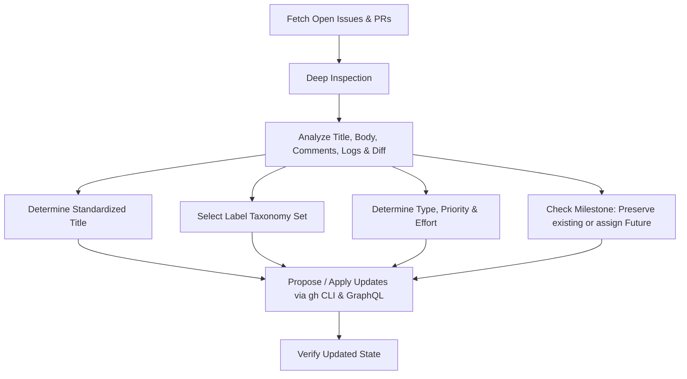

# GitHub Issue & Pull Request Triage Skill

## 1. Overview & Objectives

This skill defines the standardized protocol for triaging, categorizing, standardizing, and organizing issues and pull requests in the [Freerouting repository](https://github.com/freerouting/freerouting).

When executing this skill, every issue and PR is processed across four synchronized dimensions:
1. **Title Standardization:** Translating vague, conversational, or raw error titles into crisp, domain-prefixed, actionable summaries.
2. **Multi-Dimensional Labeling:** Applying labels from the official 6-category taxonomy (Type, Component/Domain, Tech Stack, EDA Integration, Platform, and Status).
3. **Native Issue Type & Fields:** Assigning native GitHub Issue Types (`Bug`, `Feature`, `Task`) and repository custom fields (`Priority`: `Urgent`/`High`/`Medium`/`Low`, `Effort`: `High`/`Medium`/`Low`).
4. **Milestone Assignment:** Preserving specific target release milestones (e.g., `2.4`, `2.5`) while routing untargeted backlog items to `Future`.

---

## 2. Step-by-Step Triage Workflow



### Step 1: Deep Inspection Protocol

Do not judge an issue by its title alone. Thoroughly inspect all available artifacts:
- **Title & Description:** Identify user intent, observed behavior, reproduction steps, and expectations.
- **Environment Block:** Note the Operating System (Windows, macOS, Linux), Java/JRE version, and EDA suite (KiCad, Autodesk Fusion, Eagle, etc.).
- **Stack Traces & Logs:** Extract specific failing classes and methods (e.g., `PullTightAlgo.smoothen_end_corners_at_trace_1`, `EnvironmentVariablesSource.matchingFields`, `RulesReader.read`).
- **Discussion Comments:** Maintainer and community comments frequently isolate the actual root cause (for example, recognizing that violation counts come from static intra-footprint pad geometries rather than active trace routing in #858, or identifying focus-loss blur issues in #859).
- **PR Code Diffs:** Run `gh pr diff <number>` to inspect modified packages (`gui/`, `autoroute/`, `board/`, `io/specctra/`, `api/`, `.github/workflows/`) to accurately assign component labels.

---

### Step 2: Standardized Title Conventions

Format all issue and PR titles using consistent prefixes, active imperative verbs, and specific domain terminology:

#### Prefix Guidelines
- **`GUI:`** Desktop Swing UI, board visualizer, interactive editing mode, dialogs, menus, status bar, and accessibility.
- **`CLI:`** Command-line arguments, headless batch execution flags, runner scripts, and console output.
- **`API:`** Embedded Jetty server, Jersey REST endpoints, job/session management, and OpenAPI specifications.
- **`MCP:`** Model Context Protocol server bridge, AI assistant tools, and MCP stdio/SSE communications.
- **`DRC:`** Design rules checking, clearance matrices, keepouts, and geometric clearance validation.
- **`Autoroute:`** Core pathfinding algorithms, maze routing, modified A*, Lee expansion, ripup/reroute, and plane routing.
- **`Optimizer:`** Post-route trace optimization, pull-tight algorithms, via reduction, and trace length smoothing.
- **`Specctra:`** DSN parser, SES exporter, `.rules` file grammar, and geometry I/O parsing.
- **`i18n:`** UI translations, resource bundles, translation pipeline (`scripts/i18n`), and glossaries.
- **`CI:`** GitHub Actions workflows, pre-commit hooks, packaging, and build quality gates.
- **`KiCad Plugin:`** KiCad integration plugin, IPC bridges, and addon packaging.
- **`Autodesk Fusion:`** Autodesk Fusion 360 / EAGLE ULP export and SCR import scripts.
- **`Documentation:`** User guides, contributor docs, benchmark documentation, and architectural specifications.

#### Quality Rules for Titles
1. **Use Imperative Voice:** Start with "Fix...", "Support...", "Allow...", "Unify...", "Clean up...", "Add...", or "Optimize...".
2. **Strip Transient / Status Noise:** Remove phrases like `"(fix included)"`, `"measured, with fixes available to cherry-pick"`, `"is it necessary?"`, `"got stucked"`, or `"stays forever in loop"`.
3. **Correct Typos:** Fix common misspellings (e.g., *Freeerouter* → *Freerouting*, *neccesary* → *necessary*).
4. **Cite Root Cause / Component:** Prefer citing the exact algorithmic mechanism or UI control instead of vague placeholders like `"A stacktrace error"`.
5. **Always Obtain Confirmation Before Batch Renaming:** When performing triage audits, present the current vs. proposed title table and await confirmation from the maintainer before updating.

#### Real-World Title Standardization Examples
| Before (Raw User Title) | After (Standardized Title) |
| :--- | :--- |
| `How neccesary is the autorouter timeout? It breaks my workflow.` | `Allow configuring or disabling the autorouter pass timeout in GUI and CLI` |
| `User Settings Screen text is too big to see all the text` | `Make User Settings dialog scrollable and resizable for OS text scaling` |
| `A stacktrace error` | `Fix NullPointerException in PullTightAlgo during interactive route optimization` |
| `No way to unfix elements?` | `GUI: Add context menu action and shortcut to unfix fixed board items` |
| `File is not opening after i selected the dsn freerouter got stucked` | `Fix UI freeze and deadlock when opening complex or malformed DSN files` |
| `Freeerouter 2.1.0 leaves multiple "stubs" behind.` | `Optimizer: Fix unrouted and redundant track stubs left after routing passes` |
| `Can't route multiple boards in one design` | `Fix crash on multi-board panel designs with pins outside PCB boundary` |

---

### Step 3: Multi-Dimensional Labeling Rules

Apply labels across all applicable categories (see [references/label-taxonomy.md](references/label-taxonomy.md) for hex colors and full criteria):

1. **Type (Primary Nature):** Exactly one of `bug`, `enhancement`, `documentation`, or `question`.
2. **Core Domain / Component:**
   - Always apply **`routing-engine`** to any issue or PR touching spatial data structures, pathfinding, maze routing, DRC clearance rules, fanout, trace optimization, unrouted items, or routing quality/speed.
   - Apply interface labels: `GUI`, `CLI`, `API`, `MCP` as applicable.
3. **Tech Stack & Infrastructure:** `Java`, `Python`, `CI`, `Docker`, `dependencies`.
4. **EDA Integrations:** `KiCad`, `Autodesk Fusion` (when related to specific EDA toolchain workflows or scripts).
5. **Platforms / OS:** `Windows`, `Linux`, `macOS` (when issue/PR involves platform-specific packaging, paths, or rendering).
6. **Triage / Community:** `good first issue`, `help wanted`, `missing-info`, `duplicate`, `wontfix`.

---

### Step 4: Native Issue Types & Repository Fields

Freerouting uses GitHub's native issue types and repository-level custom fields:

#### 1. Native Issue Type
- **`Bug`** (`IT_kwDOAHpJfc4ADZap`): Software defects, crashes, regressions, clearance violations, or incorrect calculations.
- **`Feature`** (`IT_kwDOAHpJfc4ADZar`): New capabilities, algorithmic enhancements, UI features, or integration expansions.
- **`Task`** (`IT_kwDOAHpJfc4ADZam`): Refactoring, documentation updates, translations, dependency management, or housekeeping.

#### 2. Native Priority (`IFSS_kgDOABL39A`)
- **`Urgent`** (`IFSSO_kgDOACEcrA`): Release-blocking regressions, severe routing crashes, or broken builds.
- **`High`** (`IFSSO_kgDOACEcrQ`): Critical algorithmic bugs (e.g. false clearance violations, optimizer regressions, data loss, API/settings dropping).
- **`Medium`** (`IFSSO_kgDOACEcrg`): Standard bugs, major feature requests, UI enhancements, or platform installer additions.
- **`Low`** (`IFSSO_kgDOACEcrw`): Minor cosmetic tweaks, long-term experimental features, or non-urgent documentation questions.

#### 3. Native Effort (`IFSS_kgDOABL39w`)
- **`High`** (`IFSSO_kgDOACEcsA`): Major algorithmic overhauls (copper pours, length tuning, padstack data structure rewrites) or complex cross-subsystem changes.
- **`Medium`** (`IFSSO_kgDOACEcsQ`): Subsystem improvements requiring moderate logic changes, platform adaptations, or multi-class wiring with unit tests.
- **`Low`** (`IFSSO_kgDOACEcsg`): Localized fixes, single-dialog layout adjustments, configuration additions, or minor UI cleanups.

---

### Step 5: Milestone Rules

- **Preserve Specific Milestones:** If an issue or PR is already assigned to an upcoming release milestone (e.g., `2.4`, `2.5`), **never overwrite it**.
- **Default Backlog Milestone:** If an issue or PR has no milestone (`null`), assign it to **`Future`** (Milestone #9).

---

## 3. Automation Implementation Pattern

Use Python scripts executing `gh` CLI commands and GraphQL mutations with automatic exponential-backoff retries (see [references/graphql-mutations.md](references/graphql-mutations.md)).

```python
import json
import subprocess
import time

TYPE_MAP = {
    "Bug": "IT_kwDOAHpJfc4ADZap",
    "Feature": "IT_kwDOAHpJfc4ADZar",
    "Task": "IT_kwDOAHpJfc4ADZam",
}

PRIO_OPTS = {
    "Urgent": "IFSSO_kgDOACEcrA",
    "High": "IFSSO_kgDOACEcrQ",
    "Medium": "IFSSO_kgDOACEcrg",
    "Low": "IFSSO_kgDOACEcrw",
}

EFFORT_OPTS = {
    "High": "IFSSO_kgDOACEcsA",
    "Medium": "IFSSO_kgDOACEcsQ",
    "Low": "IFSSO_kgDOACEcsg",
}

def triage_issue(issue_number, node_id, issue_type, priority, effort, labels, milestone="Future"):
    # 1. Update labels & milestone
    label_args = []
    for l in labels:
        label_args.extend(["--add-label", l])

    cmd_edit = ["gh", "issue", "edit", str(issue_number), "--milestone", milestone] + label_args
    subprocess.run(cmd_edit, check=True)

    # 2. Set native issue type
    type_id = TYPE_MAP[issue_type]
    m_type = f'''mutation {{
      updateIssue(input: {{ id: "{node_id}", issueTypeId: "{type_id}" }}) {{
        issue {{ id }}
      }}
    }}'''
    subprocess.run(["gh", "api", "graphql", "-f", f"query={m_type}"], check=True)

    # 3. Set native Priority & Effort fields
    p_opt = PRIO_OPTS[priority]
    e_opt = EFFORT_OPTS[effort]
    m_fields = f'''mutation {{
      setIssueFieldValue(input: {{
        issueId: "{node_id}",
        issueFields: [
          {{ fieldId: "IFSS_kgDOABL39A", singleSelectOptionId: "{p_opt}" }},
          {{ fieldId: "IFSS_kgDOABL39w", singleSelectOptionId: "{e_opt}" }}
        ]
      }}) {{ clientMutationId }}
    }}'''
    subprocess.run(["gh", "api", "graphql", "-f", f"query={m_fields}"], check=True)
```

---

## 4. Quality Gate & Checklist

Before completing a triage run:
- [ ] Every open issue has a Type (`Bug`, `Feature`, `Task`), `Priority`, and `Effort` assigned.
- [ ] Every open issue and PR has appropriate labels from `docs/labels.md` (including `routing-engine` if touching the core routing space).
- [ ] Release milestones (`2.4`, `2.5`, etc.) were preserved; untargeted items have milestone `Future`.
- [ ] Title recommendations follow standard prefix rules and were confirmed before application.
- [ ] Project documentation in `docs/labels.md` is updated if any new label was introduced.
