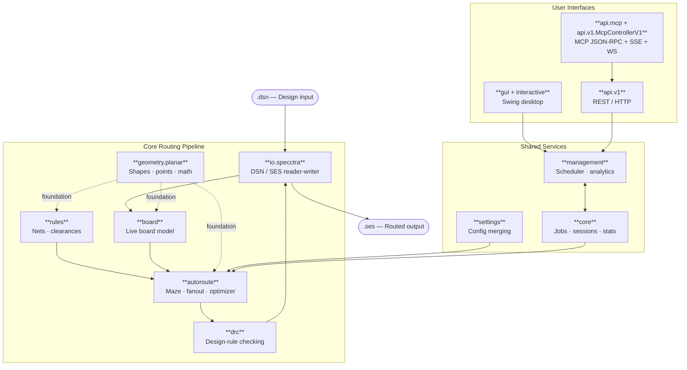

# Freerouting Architecture Map

This document provides a concise map of the current codebase for contributors and maintainers. It highlights the principal packages, the repository layout, and the fastest path to the code that owns a given behavior.

For long-term structural recommendations, see [docs/CODE_STRUCTURE_RECOMMENDATIONS.md](docs/CODE_STRUCTURE_RECOMMENDATIONS.md).

## System Overview

The runtime flow is:

`DSN input -> parser -> board and rule model -> autorouter -> design-rule checking -> SES output`

The GUI, API, and job scheduler all build on this core pipeline. When investigating a feature or defect, begin with the package that owns the data model or behavior, then follow the call chain outward.

## Repository Layout

| Path | Purpose |
| --- | --- |
| `src/main/java/app/freerouting/` | Production Java sources for routing, UI, API, loading, settings, and support code. |
| `src/test/java/app/freerouting/` | JUnit tests, including real-board fixture tests and package-level unit tests. |
| `src/main/resources/` | Localized strings and runtime resources loaded at startup. |
| `fixtures/` | DSN boards and related inputs used by regression tests and debugging. |
| `docs/` | User documentation, developer notes, issue analyses, and design references. |
| `integrations/` | Packaging and integration assets for external PCB tool workflows. |
| `scripts/` | Automation, benchmarking, and comparison scripts. |
| `src_v19/` | The v1.9 reference tree, used for behavior comparison and parity checks. |

## Navigation Guide

Use the table below to jump to the package most likely to own the behavior you are investigating.

| If you are working on... | Start with... |
| --- | --- |
| DSN / SES file loading or writing | `app.freerouting.io.specctra` |
| Board items, board state, or board-level helpers | `app.freerouting.board` |
| Routing decisions, fanout, maze search, or optimization | `app.freerouting.autoroute` |
| Nets, vias, clearance classes, or board rules | `app.freerouting.rules` |
| Clearance violations or design-rule checks | `app.freerouting.drc` |
| GUI windows, panels, menus, or drawing | `app.freerouting.gui` and `app.freerouting.interactive` |
| API endpoints or background job execution | `app.freerouting.api.v1` and `app.freerouting.management` |
| MCP server protocol bridge | `app.freerouting.api.mcp` and `app.freerouting.api.v1.McpControllerV1` |
| Runtime settings and settings sources | `app.freerouting.settings` |
| Geometry, shapes, points, and planar math | `app.freerouting.geometry.planar` |

## Module Boundaries (ArchUnit)

Architectural boundaries are codified in `src/test/java/app/freerouting/architecture/ModuleBoundariesArchTest.java`.

- **Strict boundaries (must pass):**
  - Core routing/model packages (`autoroute`, `board`, `rules`, `drc`, `geometry`) must not depend on GUI/editor or API packages.
  - API/management packages must not depend on `gui` or `boardgraphics`.
  - Headless paths (`api`, `management`, `core`) must not depend on `GuiBoardManager` or `InteractiveState`.
- **Frozen boundaries (current debt, no further drift):**
  - `interactive` state-machine classes should not be used outside `gui` + `interactive`.
  - `io.specctra.parser` internals should not be depended on outside `io.specctra` public I/O entry points.

Frozen boundaries use ArchUnit's `FreezingArchRule` with baselines stored in `src/test/resources/archunit_store/`.

## Package Glossary

### `app.freerouting`

Application bootstrap and top-level wiring. Start here when you need the entry point for the program, [Freerouting.java](src/main/java/app/freerouting/Freerouting.java).

### `app.freerouting.io.specctra`

Import and export for board files. The public DSN and SES entry points are in this package, and parser internals live in `io.specctra.parser`.

### `app.freerouting.board`

The live board model: components, pins, vias, traces, layers, and the board-level operations that mutate them.

### `app.freerouting.autoroute`

The routing engine and its orchestration. This package contains the logic for connecting items, selecting vias, fanout, maze search, and route optimization.

### `app.freerouting.rules`

The rule model that defines nets, clearance classes, via rules, and layer constraints.

### `app.freerouting.drc`

Design-rule checking and violation reporting. Use this package when you need to understand why a routed board is still invalid.

### `app.freerouting.geometry.planar`

Planar geometry primitives and helper classes used throughout routing and board operations.

### `app.freerouting.gui`

The Swing user interface: frames, dialogs, menus, panels, and rendering support.

### `app.freerouting.interactive`

The editor interaction layer and GUI session state. This package bridges user actions to board mutations.

### `app.freerouting.api`

HTTP API controllers, filters, and server-facing request handling. The concrete REST endpoints live in `api.v1`, MCP server infrastructure lives in `api.mcp`, supporting DTOs are in `api.dto`, authentication in `api.security`, and developer-only mocks in `api.dev`.

### `app.freerouting.management`

Session management, job scheduling, analytics, Gson adapters, and service-layer coordination. The analytics code lives in `management.analytics`, and the JSON helpers live in `management.gson`.

### `app.freerouting.core`

Shared application data such as routing jobs, sessions, scoring, and statistics. The board statistics helpers live in `core.scoring`.

### `app.freerouting.settings`

Runtime configuration objects and settings sources that define application and routing behavior.

### `app.freerouting.datastructures`

Reusable support structures that are shared across feature areas.

### `app.freerouting.logger`

Logging helpers and the `FRLogger` entry point.

### `app.freerouting.debug`

Diagnostics and debugging utilities.

### `app.freerouting.boardgraphics`

Low-level board rendering helpers used by the GUI.

### Notable Nested Packages

Several implementation areas live one level below the top-level package grouping above:

- `app.freerouting.geometry.planar` contains the actual planar primitives and helper classes; start with [Point.java](src/main/java/app/freerouting/geometry/planar/Point.java) and [Shape.java](src/main/java/app/freerouting/geometry/planar/Shape.java).
- `app.freerouting.io.specctra` contains DSN and SES import/export; parser internals live in `parser/`. Start with [DsnReader.java](src/main/java/app/freerouting/io/specctra/DsnReader.java), [DsnWriter.java](src/main/java/app/freerouting/io/specctra/DsnWriter.java), [SesReader.java](src/main/java/app/freerouting/io/specctra/SesReader.java), and [SesWriter.java](src/main/java/app/freerouting/io/specctra/SesWriter.java).
- `app.freerouting.management.analytics` and `app.freerouting.management.gson` contain analytics clients and Gson adapters; start with [FRAnalytics.java](src/main/java/app/freerouting/management/analytics/FRAnalytics.java) and [GsonProvider.java](src/main/java/app/freerouting/management/gson/GsonProvider.java).
- `app.freerouting.core.scoring` contains board statistics and scoring helpers; start with [BoardStatistics.java](src/main/java/app/freerouting/core/scoring/BoardStatistics.java).
- `app.freerouting.api.v1`, `app.freerouting.api.dto`, `app.freerouting.api.security`, and `app.freerouting.api.dev` contain the public controllers, payloads, authentication, and mocked endpoints; start with [JobControllerV1.java](src/main/java/app/freerouting/api/v1/JobControllerV1.java), [BoardFilePayload.java](src/main/java/app/freerouting/api/dto/BoardFilePayload.java), and [ApiKeyValidationService.java](src/main/java/app/freerouting/api/security/ApiKeyValidationService.java).
- `app.freerouting.autoroute.events` contains routing event callbacks; start with [BoardUpdatedEvent.java](src/main/java/app/freerouting/autoroute/events/BoardUpdatedEvent.java).

## How The Code Fits Together

### Routing Path

The primary routing packages are `board`, `autoroute`, `rules`, `drc`, and `geometry.planar`.

- `board` stores the current design.
- `rules` defines what is permitted.
- `autoroute` chooses the next routing action.
- `drc` validates the result.
- `geometry.planar` provides the shapes and measurements used by all of the above.

When diagnosing routing behavior, start in `autoroute`, then trace the data into the board and rule objects it reads.

### Routing Algorithm

Freerouting routing is easiest to think about in two steps: first connect everything, then improve the result.

#### High-Level Overview

Freerouting has two related routing stages:

| Stage | Purpose | Board impact |
| --- | --- | --- |
| Autorouter | Attempts to make every required connection | Adds missing traces and vias so unfinished nets become complete |
| Optimizer | Improve route quality | Reroutes parts of existing connections to reduce length, vias, and awkward shapes |

In settings, autorouter and optimizer options are part of the same routing configuration, so both can be reviewed before you run a job. During execution, Freerouting runs autorouter passes first and then continues to optimizer passes (if optimizer is enabled and the run is not interrupted).

#### Autorouter

The autorouter is the "make it work" stage. It solves missing connections one at a time by finding a legal path through free space, writing that path onto the board, and then cleaning it up.

- Find unfinished connections.

    The batch router scans the board for items that are not yet fully connected and works through them in passes. If a pass does not make useful progress, it stops instead of looping forever.

- Search for a legal path.

    For each unfinished connection, the router checks the net rules and searches for a path that respects clearance, layer limits, and via cost. In plain terms, it looks for a route that is both possible and allowed as specified by the user in their EDA software.

- Turn the path into board geometry.

    When the search succeeds, the path is converted into real traces and vias on the board. This step decides where the route changes layer and how it connects to existing items.

- Clean up the new route.

    The new geometry is inserted into the board, temporary artifacts are removed, and the route is tightened so it fits better into nearby routing.

The autorouter may also temporarily rip up nearby conflicting traces or vias if needed to find a legal route. Its job is to turn an incomplete design into one that is electrically connected.

#### Optimizer

The optimizer is the "make it better" stage. It runs after routing is already complete and tries to improve the quality of existing routes without changing what connects to what.

- Choose an existing route.

    The optimizer picks a trace or route segment that looks improvable.

- Remove and reroute locally.

    It temporarily rips up the selected area and reroutes it using optimizer-specific rules and scoring. This can use different priorities, preferred directions, or multiple candidate attempts.

- Measure the result.

    The new route is compared with the old one using metrics such as trace length and via count. In multi-threaded mode, several candidates may be tried and the best one wins.

- Keep the improvement or undo it.

    If the new version is better, it stays on the board. If not, the optimizer restores the previous state so the design does not get worse.

The optimizer changes the board more conservatively than the autorouter. Its job is to shorten routes, reduce vias, and polish the final layout.

### GUI and Interaction Path

The interactive editor is split between `gui` and `interactive`.

- `gui` contains the visible application components.
- `interactive` contains the state machine and board-handling logic behind those components.

When diagnosing user interaction, rendering, or editor state, begin here.

### API and Headless Path

Server-side operation is handled by `api.v1` and `management`.

- `api` exposes HTTP endpoints and request filters.
- `management` coordinates jobs, sessions, and background services.

When diagnosing headless execution or API behavior, begin here.

### File I/O Path

File parsing and export live in `io.specctra`.

- `io.specctra` is the public import/export layer.
- `io.specctra.parser` contains the lower-level grammar and parsing logic.

When diagnosing a load or export issue, begin here.

## Test Layout

Tests follow the production layout where practical.

- `src/test/java/app/freerouting/fixtures/` contains real-board regression tests that load DSN fixtures from `fixtures/`.
- `src/test/java/app/freerouting/board/` contains focused tests for board helpers and board-item behavior.
- Package-specific test directories such as `src/test/java/app/freerouting/interactive/` contain unit tests for that package.

For routing regressions, fixture tests are usually the most informative starting point because they exercise file loading, routing, and scoring together.

## Legacy Reference Tree

`src_v19/` is the historical v1.9 codebase. Use it to compare routing decisions, understand older implementation choices, and verify parity during refactoring.

- Treat it as reference material rather than the primary implementation target.
- Modify it only when you need additional trace logging for comparison work.

## Suggested Reading Order

1. [README.md](README.md) for the product overview.
2. [docs/developer.md](docs/developer.md) for build, test, and release guidance.
3. [docs/settings.md](docs/settings.md) for the settings merge model.
4. [docs/CODE_STRUCTURE_RECOMMENDATIONS.md](docs/CODE_STRUCTURE_RECOMMENDATIONS.md) for longer-term structure guidance.
5. This document again, using the package glossary above to jump directly to the relevant area.

## Practical Rules Of Thumb

- Routing behavior usually starts in `board`, `autoroute`, `rules`, and `drc`.
- User interaction usually starts in `gui` and `interactive`.
- Server and job execution usually starts in `api` and `management`.
- File parsing and export usually starts in `io`.
- When in doubt, follow the data model first, then the orchestration layer, then the UI.