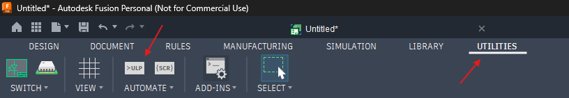
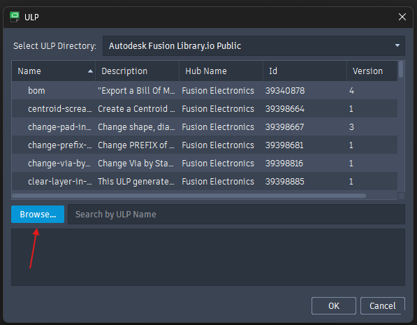
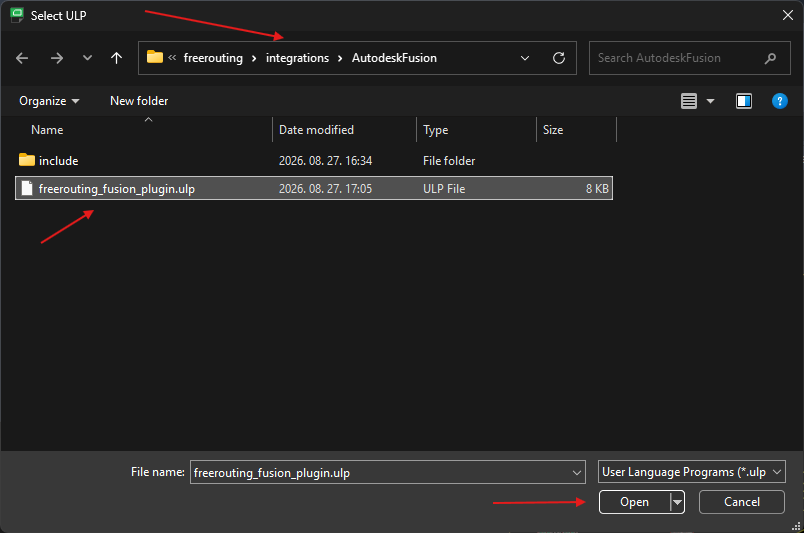
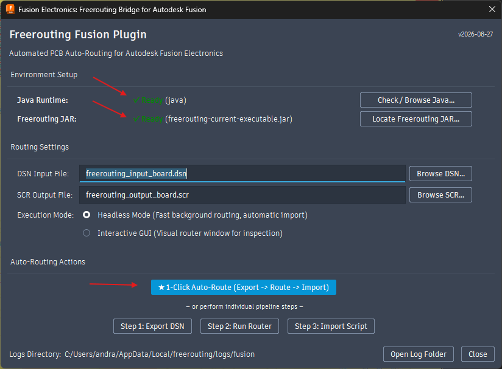

<h1 align="center">Freerouting</h1>
<h5 align="center">Freerouting is an advanced autorouter for all PCB programs that support the standard Specctra or Electra DSN interface.</h5>

 
 

# EDA Integrations

## [KiCad](https://www.kicad.org/)

1. Open KiCad 6.0 or newer

2. Start Tools / Plugin and Content Manager (Ctrl+M)

3. Search for the Freerouting plugin

4. Click on the Install button

5. Open you PCB design in PCB Editor

6. (Optional) Remove routed tracks and via from the design

7. Start Freerouting from the Tools / External Plugins menu

8. Wait until the Freerouting app exits and the plugin loads your routed design

## [Autodesk Fusion](https://www.autodesk.com/products/fusion-360/overview)

Autodesk Fusion Electronics integrates with Freerouting via the dedicated Freerouting Fusion Plugin ULP ([`freerouting_fusion_plugin.ulp`](../integrations/AutodeskFusion/freerouting_fusion_plugin.ulp)).

### Features
* **1-Click Auto-Routing:** Exports the Specctra DSN, launches the Freerouting engine in the background (or GUI), and automatically imports the generated tracks and vias back into Fusion.
* **Step-by-Step Execution:** Optionally export DSN, launch the router, and import the script as individual steps.
* **Headless or Interactive GUI:** Choose between ultra-fast headless background routing or the visual Freerouting GUI to inspect traces before applying.
* **Stackup & Keepout Translation:** Accurately maps 2-layer, 4-layer, and multi-layer stackups (including `Route2`, `Route15`, `Bottom`) and keepout wire geometries.

---

### Step-by-Step Guide

#### 1. Open your PCB Layout & Launch ULP
1. In Autodesk Fusion, open your PCB layout document.
2. In the top navigation bar, switch to the **UTILITIES** tab.
3. Under the **AUTOMATE** panel, click the **>ULP** button (or type `run` in the command line).

  

#### 2. Browse for the Freerouting Plugin
1. In the ULP dialog window, click the **Browse...** button in the lower-left corner.

  

2. Navigate to the [`integrations/AutodeskFusion`](../integrations/AutodeskFusion) directory in your Freerouting repository.
3. Select `freerouting_fusion_plugin.ulp` and click **Open**.

  

#### 3. Configure & Run Auto-Routing
1. In the **Environment Setup** section, verify that both **Java Runtime** and **Freerouting JAR** show a green `✓ Ready` status. *(If not found automatically, click the buttons on the right to locate `java.exe` or `freerouting-executable.jar`)*.
2. Choose your desired **Execution Mode**:
   * **Headless Mode:** Fast background routing with automatic script execution and import.
   * **Interactive GUI:** Opens the visual Freerouting window for inspection.
3. Click **★ 1-Click Auto-Route (Export -> Route -> Import)** to route the board automatically.

  

4. Upon completion, Autodesk Fusion automatically executes the generated script, rips up previous unrouted airwires, places the new tracks and vias across all active layers, and recalculates the ratsnest.

## [Target 3001!](https://ibfriedrich.com/)

1) Freerouting is accessible directly from the GUI menu in Actions / Automatisms and assistants / Autorouter / Freerouting autorouter...

2) There you can select the signals (=nets) to be routed

3) Next you can influence the algorithm

4) They will get the Freerouting installer from https://github.com/freerouting/freerouting/releases/

5) Normally the user does not have to change the settings and can click directly on the [Start] button. So then it is a one-click solution. After the creation of the session file SES, Target automatically asks, if the results shall be used

6) The tracks and vias are imported immediately into the TARGET project file

## [pcb-rnd](http://www.repo.hu/projects/pcb-rnd)

### Using the standalone freerouting application

1) Download the latest `freerouting-<version>.jar` file from the [Releases](https://github.com/freerouting/freerouting/releases) page

2) Start pcb-rnd and load your layout.

3) Export the layout as Specctra DSN (File / Export... / Specctra DSN).

4) Start the router by running the downloaded JAR file, push the "Open Your Own Design" button and select the exported .dsn file in the file chooser.

5) Do the routing.

5) When you're finished, export the results into a Specctra session file (File / Export Specctra Session File). The router will generate a .ses file for you.

6) Go back to pcb-rnd and import the results (File / Import autorouted dsn/ses file...). Track widths and clearances during autorouting are based on the currently selected route style during DSN export.

### Using freerouting from within pcb-rnd

1) Download the latest `freerouting-<version>-linux-x64.zip` from the [Releases](https://github.com/freerouting/freerouting/releases) page

2) Unzip it and rename the top directory to `freerouting.net` (the default location is `/opt/freerouting.net`)

3) Start pcb-rnd and ensure that this directory is specified in (File / Preferences / Config Tree / Plugins / ar_extern / freerouting_net...); the location of the executable can be customised.

4) Load your layout

5) Open the external autorouter window with (Connect / Automatic Routing / External autorouter...)

6) Select the freerouting.net tab, and push the "Route" button.

7) Go back to the layout and inspect the autorouted networks. Track widths and clearances during autorouting are based on the currently selected route style when the autorouter is started.
