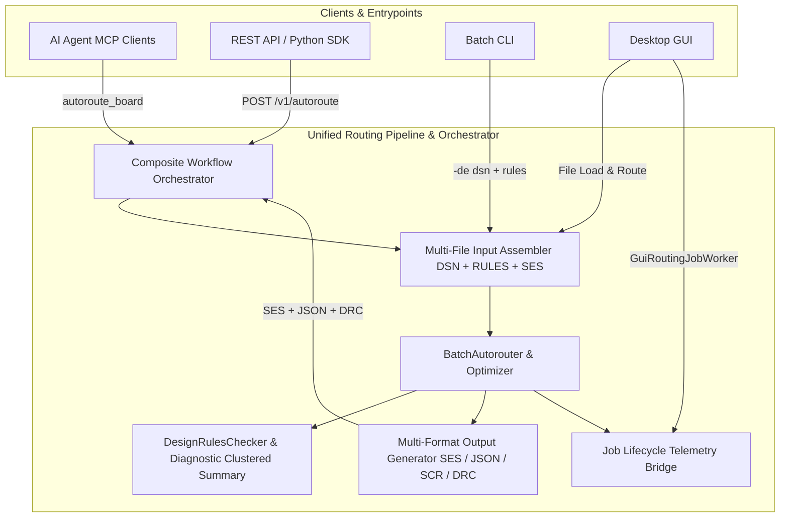

# Implementation Plan — Agent & API Enhancements

## Executive Summary
This feature branch (`feature/agent-and-api-enhancements`) unifies the routing experience across **AI Agents (MCP)**, **Automation (REST API & CLI)**, and **Interactive Users (GUI)**. 

By upgrading our pipeline core:
1. **Universal Multi-File Input Support:** Bring CLI's multi-file capability (`-de file.dsn + file.rules`) natively to the REST API and MCP, allowing rules files and session files to be passed directly alongside design files.
2. **Multi-Format Output Generation:** Generate Specctra SES, KiCad JSON, and Fusion 360 SCR concurrently or by requested format specification across all interfaces.
3. **1-Turn Composite Execution (`autoroute_board` / `POST /v1/autoroute`):** Reduce agent and API orchestration overhead from 6-7 round-trips to 1 single call.
4. **Token-Optimized Layout & DRC Feedback:** Provide compact, actionable root-cause diagnostics and layout repair hints tailored for LLMs and lightweight API consumers.
5. **GUI Pipeline Job Lifecycle Telemetry:** Connect GUI routing worker execution to the standard `job_lifecycle` analytics table, tracking `STARTED`, `SUCCEEDED`, `CANCELLED`, duration, score, unrouted nets, clearance violations, and memory peak.
6. **Comprehensive Documentation:** Full OpenAPI 3.0 annotations and dedicated developer documentation for both REST API and MCP.

---

## Telemetry & Lifecycle Consistency Across Pipelines

All pipelines share telemetry tracking to ensure uniform observability across interactive, batch, API, and agent executions:

| Pipeline | Session Lifecycle (`session_lifecycle`) | Job Lifecycle (`job_lifecycle`) | Batch / Run Summary |
| :--- | :--- | :--- | :--- |
| **REST API (`POST /v1/autoroute`, scheduler)** | `SESSION_CREATED`, `SESSION_CLOSED` via `SessionManager` | `STARTED`, `SUCCEEDED`, `FAILED`, `TIMED_OUT`, `CANCELLED` | API endpoint analytics, score, memory |
| **MCP Server (`autoroute_board`, tools)** | Wrapped in API / Scheduler sessions | Uniform `job_lifecycle` tracking | JSON-RPC tool duration, token cost |
| **CLI (`-de ... -do ...`)** | `SESSION_CREATED` on initialization | `STARTED`, `SUCCEEDED`, `FAILED`, `TIMED_OUT`, `CANCELLED` | `batch_job_summary` with exit code, peak heap, score |
| **GUI (`GuiRoutingJobWorker`)** | `SESSION_CREATED` on app start | **To be hooked:** Emits `STARTED` at route start and `SUCCEEDED`/`CANCELLED`/`FAILED` at route end with duration, unrouted count, clearance violations, peak memory, and board score | UI action telemetry (`button_clicked`, etc.) |

---

## Architectural Design



---

## Tasks & Progress Tracking

### 1. GUI Pipeline: Job Lifecycle Telemetry Alignment
- [ ] Connect `GuiRoutingJobWorker` to emit standard `job_lifecycle` (`STARTED`) when autorouting begins.
- [ ] Connect `GuiRoutingJobWorker` to emit standard `job_lifecycle` (`SUCCEEDED`, `CANCELLED`, `FAILED`) when autorouting finishes or is aborted, recording:
  - Total nets, unrouted/incomplete connections, clearance violations count.
  - Normalized board score.
  - Elapsed routing time (seconds), total CPU time, peak heap usage (MB).
  - Detected host CAD tool and user ID.
- [ ] Verify GUI lifecycle events conform to the BigQuery analytics schema.

### 2. Core Engine: Multi-File Input & Multi-Output Generator
- [ ] Create `CompositeBoardInput` model supporting primary design (`dsn`/`json`) plus optional rules (`rules`) and session state (`ses`/`json`).
- [ ] Implement `MultiOutputGenerator` to produce Specctra SES, KiCad JSON, and Fusion SCR from a routed `RoutingBoard`.
- [ ] Enhance `DesignRulesChecker` with diagnostic summary generator (`DrcSummaryResponse`):
  - Natural-language violation explanations with component/pin context.
  - Congestion clustering and suggested parameter auto-correction hints.

### 3. REST API: Composite Endpoint & Token Optimization
- [ ] Create DTOs: `AutorouteRequest`, `AutorouteResponse`, `DrcSummaryResponse`.
- [ ] Implement `POST /v1/autoroute` in `AutorouteControllerV1`:
  - Accepts multi-file inputs (content or sandboxed paths).
  - Accepts router settings, requested output formats, and execution timeout.
  - Routes synchronously and returns all requested outputs and summary metrics in 1 HTTP turn.
- [ ] Implement `GET /v1/jobs/{jobId}/drc/summary` in `JobOutputResource`.
- [ ] Add `compact=true` query parameter support to `GET /v1/jobs/{jobId}` and `GET /v1/jobs/{jobId}/drc`.

### 4. MCP Server: 1-Turn Agent Tools & Compact Defaults
- [ ] Implement composite `autoroute_board` tool in `McpControllerV1`:
  - Direct parameter mapping to `POST /v1/autoroute`.
  - Supports string `fileContent` and sanitized `filePath`.
- [ ] Implement `get_job_drc_summary` MCP tool.
- [ ] Default all MCP status and DRC queries to `compact=true` (reducing token burn by > 70%).

### 5. CLI & GUI Integration Alignment
- [ ] Extend CLI `-do` to support multi-format exports (e.g. writing both `.ses` and `.drc.json`).
- [ ] Verify that multi-file input parsing in CLI correctly populates all merged settings.

### 6. Documentation & OpenAPI Specifications
- [ ] Update Swagger/OpenAPI annotations across all controllers (`@Operation`, `@ApiResponse`, `@Schema`).
- [ ] Update `docs/api/rest-api.md` with complete reference documentation for `POST /v1/autoroute` and `/drc/summary`.
- [ ] Update `docs/mcp/mcp-tools.md` documenting the new 1-turn workflow, security sandbox rules, and token-saving tips.
- [ ] Update `docs/architecture.md` diagram and package glossary.

---

## Verification Plan

### Automated Tests
1. **GUI Lifecycle Telemetry Tests:**
   - Unit test simulating `GuiRoutingJobWorker` execution lifecycle and validating that `FRAnalytics.recordJobLifecycle` is triggered with `STARTED` and `SUCCEEDED`/`CANCELLED`.
2. **Pipeline & Multi-File Tests:**
   - Test loading `.dsn` + `.rules` together via `CompositeBoardInput` and verify merged clearance matrix.
   - Test multi-format output generator producing valid `.ses` and KiCad `.json` simultaneously.
3. **REST API Tests:**
   - `AutorouteControllerTest`: Test `POST /v1/autoroute` with synchronous completion, timeout budget, and multi-format return.
   - `DrcSummaryResourceTest`: Test `GET /v1/jobs/{jobId}/drc/summary` for valid root cause reporting.
4. **MCP Tool Tests:**
   - Test `autoroute_board` tool invocation via JSON-RPC.
5. **Code Quality Gates:**
   ```powershell
   ./gradlew test
   ./gradlew spotlessCheck checkstyleMain checkstyleTest
   ```

### Manual Verification
1. **KiCad DSN + Rules Test:** Run `POST /v1/autoroute` with `Issue508-DAC2020_bm01.dsn` and a custom `.rules` file, verify that custom clearance classes are strictly honored in the output.
2. **MCP One-Turn Verification:** Connect MCP client (e.g. Claude Desktop / Cursor) and execute `autoroute_board` in a single prompt.
