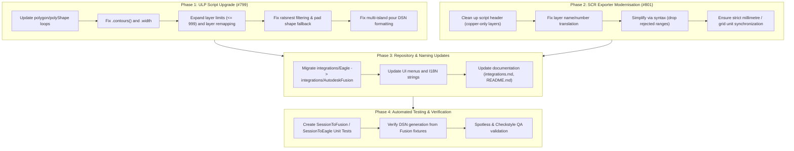

# Autodesk Fusion Support & Eagle Integration Upgrade Plan

## Executive Summary

Autodesk officially retired standalone EAGLE in 2026, fully transitioning its PCB design capabilities into **Autodesk Fusion Electronics**. This document outlines the roadmap and technical specifications to upgrade Freerouting's integration to fully support Autodesk Fusion Electronics while retiring standalone EAGLE support, resolving community GitHub issues **#799** (ULP export from Fusion) and **#801** (SCR session script re-import into Fusion).

---

## 1. Testing & Licensing Environment

### Free Testing for Autodesk Fusion
- **Autodesk Fusion for Personal Use (Free Tier):**
  - **Availability:** Free 3-year renewable subscription for qualifying non-commercial and hobbyist use.
  - **Electronics Capabilities:** Includes full schematic and 2-layer PCB layout.
  - **Scripting & Automation:** ULPs (`Execute ULP`) and command scripts (`Execute Script`) are fully supported under the **Automate** tab (`Utilities > Automate`).
  - **Constraints:** 2 signal layers, 2 schematic sheets, 80 cm² board area.
- **30-Day Commercial Trial:**
  - Provides full, unrestricted access to multi-layer routing (4+ layers) to test extended layer ID mappings (e.g. 303/304).

---

## 2. Issues Breakdown & Technical Analysis

### Issue #799: ULP Export from Autodesk Fusion (`eagle2freerouting.ulp` -> `freerouting_fusion_plugin.ulp`)

When running `eagle2freerouting.ulp` on current Autodesk Fusion Electronics (build `v.2704.1.53` and later), export fails due to deprecated APIs, changed data models, and extended layer numbering:

1. **Deprecated `.polygons()` API:**
   - `B.polygons(PO)` $\rightarrow$ `B.polyShapes(PO)`
   - `P.polygons(PO)` $\rightarrow$ `P.polyShapes(PO)`
   - `N.polygons(P)` $\rightarrow$ `N.polyPours(P)`
2. **Deprecated `.wires()` on Polygon objects:**
   - Fusion's `PolyShape` and `PolyPour` classes replace `.wires()` with `.contours(W)`.
3. **Invalid `PO.width` on `PolyShape`:**
   - `PolyShape` objects no longer have a `.width` property; replace with literal `0` (matching keepout conventions).
4. **Hardcoded $\le 16$ Layer Ceiling:**
   - Wire and pour export loops skip layers $> 16$, which silently drops copper on boards where Fusion assigns internal layer IDs such as `303` (Inner2) and `304` (Bottom). Change ceiling to $\le 999$.
5. **`LN2name()` Layer Lookup Mismatch:**
   - `LN2name()` builds lookup tables from `layerSetup` strings (which may use legacy 63/64 indices) but does not resolve extended layer IDs (303/304), defaulting to `"signal"`. Remap internal layer IDs dynamically to valid Specctra signal layer names.
6. **Unrouted Ratsnest Exported as Copper:**
   - Layer 19 is Eagle/Fusion's "Unrouted" ratsnest layer. The wire export loop must filter it out: `&& (W.layer != 19)`.
7. **Missing `default:` in Pad-Shape Switch:**
   - New pad shapes introduced in Fusion fail to match and produce broken padstack names. Add `default:` fallback to standard round pads.
8. **Multi-Island Pour Scope Termination:**
   - `write_wire_shape()` creates multiple disconnected island shapes, but closing parenthesis wasn't properly paired per island, creating syntax errors in the generated DSN.

---

### Issue #801: Freerouting Session Script Exporter (`SessionToEagle.java` -> `SessionToFusion.java`)

When exporting routing results as an Eagle/Fusion script (`.scr`), re-importing into Fusion fails due to four parser and layer errors:

1. **Non-Copper Utility Layer Activation:**
   - Script header activates non-copper layers (`LAYER 23; LAYER 24;` etc.). Fusion rejects non-existent utility layers like `Layer 24:OriginsBottom`.
   - **Fix:** Restrict `LAYER` activation commands to active copper/signal layers and only standard PCB layers (17 Pads, 18 Vias, 19 Unrouted, 20 Dimension).
2. **Layer Alias and ID Resolution:**
   - Aliases (`c2`, `cb`, `1#Top`, `F.Cu`) or non-numeric names fail to resolve to Fusion's real internal layer numbers on boards with non-standard stackups.
   - **Fix:** Use numeric layer IDs matched to the Specctra layer structure header.
3. **Explicit Via Layer Ranges Rejected:**
   - Commands like `VIA ... round 1-304 (X Y);` are rejected by Fusion's script command parser with `"Invalid via layers"`.
   - **Fix:** Omit the explicit layer range for standard through-vias (e.g. `VIA 'net' diameter shape (X Y);`), allowing Fusion to apply default through-via layer range automatically, or format blind/buried vias according to Fusion's syntax.
4. **Unit, Width & Drill Scaling:**
   - Dimensions for `CHANGE DRILL` and `WIRE width` must explicitly match the declared `GRID` unit (preferably setting `GRID MM;` and emitting all dimensions in millimetres with fixed decimal precision).

---

## 3. Implementation Phases

---

## 4. Detailed Task List

### Phase 1: ULP Script Upgrade (`integrations/AutodeskFusion/freerouting_fusion_plugin.ulp`)
- [x] Rename/copy `integrations/Eagle/eagle2freerouting.ulp` to `integrations/AutodeskFusion/freerouting_fusion_plugin.ulp` (retain legacy `integrations/Eagle/` redirect notice).
- [x] Replace deprecated `polygons` loops with `polyShapes` and `polyPours`.
- [x] Replace `wires` calls on polygon objects with `contours`.
- [x] Replace `PO.width` on `PolyShape` with `0`.
- [x] Update layer scanning bounds from `<= 16` to `<= 999`.
- [x] Update `LN2name()` to support Fusion extended layer IDs (303, 304, etc.).
- [x] Add `&& (W.layer != 19)` to skip unrouted ratsnest lines in wire export.
- [x] Add `default:` fallback to round pad in pad-shape switch statements.
- [x] Fix parenthesis matching for multi-island polygon pours.

### Phase 2: SCR Exporter Fixes (`app.freerouting.io.specctra.parser.SessionToFusion`)
- [x] Refactor and replace `SessionToEagle.java` with `SessionToFusion.java`.
- [x] Remove hardcoded non-copper layer activations (`LAYER 23`, `LAYER 24`).
- [x] Standardize `GRID` command output and ensure all wire widths, drill sizes, and coordinates are properly converted to millimetres (`GRID MM`).
- [x] Modify `processViaScope` to omit explicit layer range (e.g. `1-304` or `1-16`) for standard through-vias to avoid Fusion script syntax errors.
- [x] Ensure layer names emitted in `CHANGE LAYER` match valid numeric layer IDs.

### Phase 3: UI, I18N, and Documentation Updates
- [x] Update GUI menu items and export options to `"Autodesk Fusion Script (*.scr)"`.
- [x] Update resource bundles / translation keys (`message_fusion_saved`, etc.).
- [x] Update `docs/integrations.md` with step-by-step instructions for Autodesk Fusion Electronics.
- [x] Update `README.md` references to list **Autodesk Fusion** instead of standalone EAGLE.
- [x] Update `AGENTS.md` to document the Autodesk Fusion integration path.

### Phase 4: Verification and Quality Gate
- [x] Add unit tests in `src/test/java/app/freerouting/io/specctra/parser/SessionToFusionTest.java` verifying generated `.scr` content (header, layer commands, via syntax, unit formatting).
- [x] Run `./gradlew spotlessCheck checkstyleMain checkstyleTest checkstyleRewriteRecipes`.
- [x] Run full test suite with `./gradlew test`.

---

## 5. Verification Plan

### Automated Tests
1. **`SessionToEagleTest` / `SessionToFusionTest`:**
   - Test generating `.scr` from a multi-layer board session file.
   - Assert header only contains valid copper layers.
   - Assert via command does not contain invalid range strings like `1-304`.
   - Assert dimensions are formatted in valid mm units without trailing NaN/null/0 values.
2. **Gradle Verification:**
   - `./gradlew check`
   - `./gradlew spotlessCheck checkstyleMain checkstyleTest`

### Manual Verification
1. Open Autodesk Fusion Electronics (Personal or Trial).
2. Run `freerouting_fusion_plugin.ulp` via **Automate > Run ULP** on a test board.
3. Import the generated `.dsn` into Freerouting and run auto-routing.
4. Export the resulting session script (`.scr`).
5. In Fusion Electronics, run **Automate > Run Script** and select the `.scr` file to verify clean re-import with zero syntax errors.
