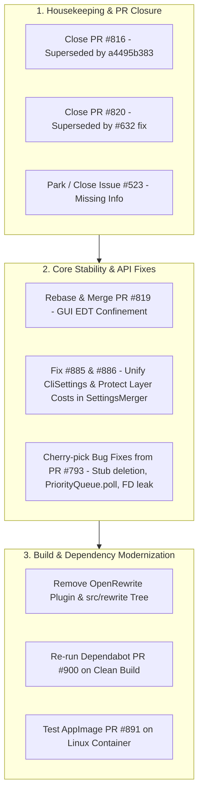

# High-Priority Issues and Pull Requests: Triage, Investigations & Decisions

**Date:** September 17, 2026  
**Repository:** `freerouting/freerouting`  
**Target Release:** Freerouting v2.5.0 / v2.5.1  
**Status:** Brainstorming, Architectural Analysis, and Decision Tracking (Pre-Implementation)

---

## 1. Executive Summary & Decision Matrix

| Item | Type / Domain | Current Status | Investigation Summary & Finding | Decision / Recommendation |
| :--- | :--- | :--- | :--- | :--- |
| **[#816](https://github.com/freerouting/freerouting/pull/816)** | PR (GUI) | `CLOSED` | **Confirmed Merged via commit `a4495b383`.** `WindowBase.createScrollableContainer` and `clampWindowHeight` were implemented across all dialogs with test coverage in `WindowScrollAndClampTest`. | **Closed as superseded.** |
| **[#820](https://github.com/freerouting/freerouting/pull/820)** | PR (Engine/IO) | `CLOSED` | **Confirmed Superseded by #632 fix.** Master uses non-blocking structured `WARNING` logs via `validateBoardDesignErrors()`. Fixture exists at `fixtures/Issue632-MiniAutoPilot/`. | **Closed as superseded.** Test fixture retained. |
| **[#885](https://github.com/freerouting/freerouting/issues/885)** | Issue (API/MCP) | `OPEN` (High Prio) | **Confirmed Bug in Settings Pipeline.** `CliSettings` omits `-inc`, and `applyBoardSpecificOptimizations()` stomps explicit per-layer trace costs with defaults. | **Fix in v2.5.x.** Unify CLI flags and protect explicit layer settings. |
| **[#886](https://github.com/freerouting/freerouting/issues/886)** | Issue (API/MCP) | `OPEN` (High Prio) | **Confirmed Feature Gap.** No way to set per-job ignored net classes or layer costs without server restart; no pre-routing settings verification endpoint. | **Implement in v2.5.x.** Expose effective settings and net-class exclusion to MCP. |
| **[#873](https://github.com/freerouting/freerouting/issues/873)** | Issue (GUI/Plugin) | `OPEN` (High Prio) | **KiCad Plugin Hang.** Modal dialog waits indefinitely on child process/API. Cancellation crashes KiCad. Correlates with off-EDT startup exceptions (PR #819). | **Responded asking for logs.** Test PR #819 thread confinement fix. |
| **[#523](https://github.com/freerouting/freerouting/issues/523)** | Issue (Engine) | `CLOSED` | **Discarded / Unreproduced.** Extensive investigation found no reproduction on clean boards; post-route optimizer normalizes stubs. | **Closed as missing-info.** |
| **[#793](https://github.com/freerouting/freerouting/pull/793)** | PR (Engine/CLI) | `Draft / CONFLICTING` | **Valuable Bug Fixes + Experimental Heuristics.** Contains 6 critical fixes (stub pass trace deletion, `IntPoint.hashCode`, `PriorityQueue.poll`, stream leak) alongside unverified heuristics. | **Cherry-pick high-value bug fixes.** Discard or defer experimental heuristics. |
| **[#743](https://github.com/freerouting/freerouting/pull/743)** | PR (GUI/Engine) | `Draft / CONFLICTING` | ETA estimation based on search progress. | **Defer.** Low priority for current release. |
| **[#891](https://github.com/freerouting/freerouting/pull/891)** | PR (CI/Packaging) | `MERGEABLE` | Community AppImage build integration via `quick-sharun`. Evaluated macOS compatibility. | **Plan for testing.** Linux AppImage only (macOS uses DMG/jpackage). |
| **[#888](https://github.com/freerouting/freerouting/pull/888)** | PR (GUI) | `MERGEABLE` | Canvas jump removal and inspect toolbar restructuring. | **Defer.** Low priority for current release. |
| **[#870](https://github.com/freerouting/freerouting/pull/870)** | PR (GUI) | `MERGEABLE` | Inlines manual rule selection window into routing settings panel. | **Defer.** Low priority for current release. |
| **[#900](https://github.com/freerouting/freerouting/pull/900)** | PR (Deps) | `BUILD FAILURE` | Failure caused by `org.openrewrite:plugin:7.41.0` missing `rewrite-bom:8.91.0`. All OpenRewrite migration recipes are already completed. | **Completely remove OpenRewrite.** Remove plugin, sourceSet, and dependencies. |

---

## 2. Detailed Investigations & Architectural Analysis

### 2.1. Issue & PR #816: User Settings Dialog Text Scaling
- **Question:** *Is the fix already merged into master?*
- **Investigation:**
  - Git history confirms commit `a4495b383d542bd1d273f3edf05468651286b2ea` by Andras Fuchs:
    > *"Make windows scrollable and clamp height for OS text scaling (fixes #804)"*
  - This commit introduced `WindowBase.createScrollableContainer` and `clampWindowHeight` (capping packed height to 85% of usable work area), adjusted `WindowUserSettings`, `WindowAbout`, `WindowDisplayMisc`, `WindowRoutingSummary`, etc., and added unit tests in `WindowScrollAndClampTest.java`.
- **Conclusion:** PR #816 was independently solved and is now obsolete. The merge conflicts in PR #816 are due to these exact changes already existing on `master`.
- **Action Taken:** **Closed PR #816 as superseded** with a comment referencing commit `a4495b383`.

---

### 2.2. Issue & PR #820: Pins Outside PCB Boundary (Issue #632)
- **Question:** *Is this superseded by another fix that is already merged, and do we have a good test file?*
- **Investigation:**
  - Issue [#632](https://github.com/freerouting/freerouting/issues/632) was officially closed as handled in v2.5.0:
    > *"In modern Freerouting, `validateBoardDesignErrors()` in `HeadlessBoardManager` inspects placed pin coordinates against the board outline boundary at board loading time... emits clear, structured WARNING logs... This prevents unhandled NullPointerExceptions or silent calculation failures while still allowing designs with intentional edge-connector overhangs to load and route without being hard-rejected."*
  - PR #820 proposed a rigid `BoardReadResult.InvalidGeometry` rejection that aborted the read completely. The maintainer chose instead to issue structured design warnings so multi-board panels or edge-overhang connectors are not blocked outright.
  - **Test Fixture:** The exact fixture is available in the repository at:
    - [`fixtures/Issue632-MiniAutoPilot/Mini Auto Pilot.dsn`](file:///c:/Work/freerouting/fixtures/Issue632-MiniAutoPilot/Mini Auto Pilot.dsn)
    - Along with `.kicad_pcb`, `.kicad_sch`, `.kicad_pro`, and `.kicad_prl`.
- **Conclusion:** PR #820's hard-rejection approach was superseded by the design-warning validation in master.
- **Action Taken:** **Closed PR #820 as superseded** with an explanatory comment. Retained the `Issue632-MiniAutoPilot` fixture for regression testing.

---

### 2.3. Issues #885 and #886: HTTP/MCP Settings Loss and Control Scope
- **Question:** *Are other fields/properties affected? Do we need a more general approach to handle them?*
- **Root Cause Breakdown:**
  1. **CLI Flag Mapping Gap in `CliSettings`:**
     - In `GlobalSettings.java` (line 894), `-inc` parses into `routerSettings.autorouter.ignoreNetClasses`.
     - However, in `CliSettings.java`, `mapFlagToProperty()` maps only `-mp`, `-mt`, and `-oit`. It returns `null` for `-inc`!
     - Because `SettingsMerger` reads `CliSettings` (priority 60) and `DefaultSettings` sets `ignoreNetClasses = new String[0]` (priority 0), the CLI exclusion is dropped during merge.
  2. **Layer Costs Reset in `applyBoardSpecificOptimizations()`:**
     - In `RouterSettings.java`, `preferredDirectionTraceCost` and `undesiredDirectionTraceCost` are primitive `double[]` arrays.
     - `applyBoardSpecificOptimizations()` checks:
       ```java
       if (scoring.preferredDirectionTraceCost == null || scoring.preferredDirectionTraceCost.length != layerCount) {
         scoring.preferredDirectionTraceCost = new double[layerCount];
         boardSpecificTraceCostsApplied = false;
       }
       ```
     - If the layer count was not initialized or differed when the `.rules` file was parsed, `boardSpecificTraceCostsApplied` is set to `false`.
     - It then iterates all layers and unconditionally overwrites:
       ```java
       scoring.preferredDirectionTraceCost[i] = scoring.defaultPreferredDirectionTraceCost; // 1.0
       ```
       This wipes custom costs loaded by `RulesReader` (e.g. POWER layer costs of `0.25 / 0.50`).
  3. **Other Affected Properties:**
     - **Array fields:** `planeNets` (`String[]`), `layers` (`LayerSettings[]`: `routable`, `preferredDirectionHorizontal`, `bendCost`).
     - **Missing CLI mappings:** Any `-flag` handled only in `GlobalSettings` but omitted from `CliSettings` (e.g., `-inc`, `-da`, custom layer toggles).
- **Recommended General Approach:**
  - **1. Unified CLI Parsing:** Delegate flag mapping in `CliSettings` to the same parser or canonical map used by `GlobalSettings` / `LegacyRouterSettingsBridge`.
  - **2. Per-Layer Cost Modeling:** Instead of primitive unmanaged `double[]` arrays that lose provenance, store per-layer costs either inside `LayerSettings` (e.g., `layer.preferredTraceCost`, `layer.undesiredTraceCost` using nullable `Double`) or maintain an explicit override mask (`BitSet explicitTraceCosts`).
  - **3. Non-Destructive Default Initialization:** Update `applyBoardSpecificOptimizations()` so it only computes geometric aspect-ratio defaults for layers that have *not* been explicitly configured by a `.rules` file, CLI flag, or API request.
  - **4. Expose to MCP (#886):** Add `ignore_net_classes` and `layer_rules` to the REST API request models and MCP tool definitions (`autoroute_board`, `update_job_settings`), plus a `get_effective_settings` inspection tool to allow clients to verify configuration before routing begins.

---

### 2.4. Issue #873: 2.4.1 Stays Forever in Loop During Startup
- **Question:** *How many users are affected? What can the reason be? Is it reproducible? Did they attach logs?*
- **Investigation:**
  - **User Reports:** 3 distinct users commented on #873 across different platforms:
    1. Kubuntu 26.04 LTS (KDE Plasma 6, OpenJDK 25.0.4)
    2. Fedora Linux 44 (KDE Plasma, OpenJDK 25.0.4.1)
    3. Windows 11 (KiCad 10.0.0.1, Java 25.0.3 JRE)
  - **Log Attachments:** **None.** No users attached log files to the issue.
  - **Plugin Mechanism:**
    - In `integrations/KiCad/kicad-freerouting/plugins/plugin.py`:
      - For DSN mode, `_run_dsn_stages()` spawns `ProcessThread(self.module_command, on_complete)` and immediately calls `dialog.ShowModal()`.
      - If the child process (`java -jar freerouting.jar ...`) deadlocks or hangs at startup, `on_complete` is never invoked, leaving the dialog in the "Auto-router is running" state indefinitely.
      - When the user presses "Cancel", `invoker.terminate()` attempts to kill the process while the wxWidgets modal loop is active, frequently crashing KiCad's Python process on Linux/Windows.
    - For API mode, `client.wait_for_job_completion()` polls in a background thread while the modal dialog runs. If the embedded API server fails to start or job status never transitions, it hangs similarly.
  - **Probable Root Cause:**
    - Startup thread confinement: Prior to **PR #819**, `GuiManager.initializeGUI` called from off the Event Dispatch Thread caused `IllegalStateException: ScreenMessages must only be mutated on the EDT` when loading a board, preventing the GUI window from rendering and hanging the process.
- **Action Taken:**
  - **Commented on #873** explaining the plugin modal loop mechanism and requesting diagnostic logs from users:
    - Freerouting log: `%TEMP%\freerouting\freerouting.log` (Windows) or `/tmp/freerouting/freerouting.log` (Linux).
    - KiCad plugin terminal / stderr trace.
  - Recommended testing against the EDT thread confinement fix in PR #819.

---

### 2.5. Issue #523: Unrouted and Redundant Track Stubs
- **Question:** *Can we discard this for now?*
- **Analysis:**
  - Tagged with `missing-info`.
  - Maintainer BanjoR performed an extensive investigation on `master` and was unable to reproduce residual stubs on clean boards under normal legal routing rules.
  - Furthermore, PR #793 identified that an older experimental stub-removal routine (`minimize_stubs()`) had actually been deleting valid traces rather than real stubs.
- **Action Taken:** **Closed Issue #523 as `missing-info` / not planned.** Informed the user that the issue could not be reproduced on recent builds and invited them to reopen with a modern reproduction `.dsn` if encountered again on v2.4.1+ / v2.5.0.

---

### 2.6. Pull Request #793: Draft Heuristic Experiments & Headless Fixes
- **Question:** *Which proposed fixes are still relevant vs. experimental?*
- **Detailed Commit Audit:**
  Author `@gbacskai` submitted 27 commits. Analysis reveals a clear separation between critical, high-value bug fixes and unverified experimental heuristics:
  
  #### Category A: High-Value Bug Fixes (Recommended to Cherry-Pick)
  1. **`minimize_stubs()` Trace Deletion Bug (`a21d7759`):**
     - Endpoint count logic was flawed: it tested `contacts == 1` to identify stubs, but `countContacts()` already excluded the tested trace. Normal pad-to-via traces report 1 contact at each end, causing valid routed traces to be deleted! Fixed to check for 0 contacts and made opt-in via `--router.minimize_stubs`.
  2. **`IntPoint` Hash Code Invariant (`0bc6276d`):**
     - `IntPoint` implemented `equals()` without implementing `hashCode()`, making it dangerous to use as a key in hash maps or sets.
  3. **`PriorityQueue` Iteration Bug in `MazeSearchAlgo` (`0bc6276d`):**
     - Used `queue.iterator().next()` assuming it returned the queue minimum. Java's `PriorityQueue` iterator has *unspecified* order; only `poll()` or `peek()` yields the minimum!
  4. **File Descriptor Leak in Job Storage (`d6de64c9`):**
     - `Files.list()` streams in `saveJob` were not closed in try-with-resources, leading to `/tmp` inode and descriptor exhaustion on headless server runs.
  5. **Impossible Logic in `calculateFastHeuristic` (`0bc6276d`):**
     - Contained conditions like `p_layer == 0 && p_layer != 0`, preventing layer-change heuristics from ever executing on outer layers.
  6. **DSN Resolution Scaling in Escape Distance Thresholds (`0f121a2e`):**
     - Hardcoded unit assumptions (1 unit = 1 µm) broke boards using `(resolution mil 2540)`. Now properly derived from `communication.get_resolution()`.

  #### Category B: Experimental Heuristics (Discard or Defer)
  - Multi-threaded autorouter pass experiments (`autoroute_pass_multi_thread`).
  - Speculative layer assignment and power trunk routing changes.
- **Decision:** Create a clean, focused PR cherry-picking Category A bug fixes with targeted unit tests. Leave experimental heuristics out of the production path.

---

### 2.7. Pull Request #743: Routing ETA Calculator
- **Assessment:**
  - Introduces `RoutingEtaCalculator` to estimate remaining time based on search progress.
  - Still in draft and has merge conflicts against `master`.
- **Decision:** **Defer.** Confirmed low priority; not planned for v2.5.0.

---

### 2.8. Pull Request #891: Linux AppImage Build Support & macOS Packaging Strategy
- **Assessment:**
  - Adds single-file executable AppImage generation for Linux using the `quick-sharun` toolchain.
  - Highly valuable for Linux users who encounter distro packaging differences, missing JRE 25 runtimes, or Wayland/glibc discrepancies.
- **Is AppImage Supported on macOS?**
  - **No.** AppImage is an executable format strictly tied to Linux (it consists of an ELF binary header, a squashfs compressed filesystem, and a runtime relying on Linux FUSE mounting). macOS cannot mount or execute AppImage binaries.
  - On macOS, the standard distribution formats are `.dmg` disk images or `.pkg` installers containing signed `.app` application bundles.
- **Supporting macOS x86_64 (Intel) via GitHub Actions:**
  - **Current State:** `.github/workflows/create-release.yml` currently runs `build-macos-arm64` on `macos-latest` (Apple Silicon runners), executing `scripts/build/create-distribution-macos-arm64.sh` via JDK `jlink` + `jpackage` to generate `freerouting-<version>-macos-arm64.dmg`.
  - **Path to x86_64 (Intel) macOS Support:**
    - GitHub Actions announced the retirement of `macos-13` and introduced the **`macos-15-intel`** runner image for x86_64 architectures (supported through August 2027).
    - We can add a parallel release job `build-macos-x64` in `create-release.yml`:
      ```yaml
      build-macos-x64:
        needs: build-and-test
        runs-on: [ macos-15-intel ]
        timeout-minutes: 30
        permissions:
          contents: write
        steps:
          - uses: actions/checkout@v5
          - uses: actions/setup-java@v5
            with:
              distribution: 'temurin'
              java-version: '25'
              architecture: 'x64'
              cache: 'gradle'
          - run: chmod +x gradlew scripts/build/*.sh
          - run: ./gradlew dist
          - run: scripts/build/create-distribution-macos-x64.sh ${{ steps.tagName.outputs.tag }}
          - uses: AButler/upload-release-assets@v3.0
            with:
              files: './scripts/build/freerouting-${{ steps.tagName.outputs.tag }}-macos-x64.dmg'
              release-tag: v${{ steps.tagName.outputs.tag }}
              repo-token: ${{ secrets.GITHUB_TOKEN }}
      ```
    - The accompanying `scripts/build/create-distribution-macos-x64.sh` uses the same `jlink` + `jpackage` recipe as the ARM64 script, producing a native Intel DMG.
- **Decision:**
  - **For PR #891 (Linux):** Accept in principle and test the build script in a clean Ubuntu/Fedora container.
  - **For macOS x86_64:** Support Intel Mac users through native DMG packaging by adding a `macos-15-intel` runner job in `create-release.yml` rather than AppImage. Tracked in newly created issue **[#905](https://github.com/freerouting/freerouting/issues/905)** (*"CI: Package native Intel (x86_64) macOS DMG installer via macos-15-intel runner"*), referencing original user request in [#803](https://github.com/freerouting/freerouting/issues/803). Intel Mac users can also run the universal executable JAR (`freerouting-executable.jar`) on any Java 25 runtime.

---

### 2.9. Pull Requests #888 & #870: GUI Inspect Mode & Manual Rules Panel
- **Assessment:**
  - **PR #888:** Smooths inspect mode transitions (removes canvas jump), cleans up inspect toolbar.
  - **PR #870:** Replaces floating popup window for manual rules with an inline panel in routing parameters.
- **Decision:** **Defer for Current Release.** Stable and clean, but GUI polish is lower priority than the core engine and API stability fixes.

---

### 2.10. Pull Request #900: Dependabot Build Failure & OpenRewrite Removal
- **Question:** *Can we remove the Rewrite package completely?*
- **Investigation of Build Failure:**
  - Dependabot attempted to bump `org.openrewrite.rewrite` Gradle plugin from `7.38.0` to `7.41.0`.
  - CI failed with:
    ```
    > Could not resolve org.openrewrite:plugin:7.41.0.
       > Could not find org.openrewrite:rewrite-bom:8.91.0.
         Searched in: https://plugins.gradle.org/m2/org/openrewrite/rewrite-bom/8.91.0/rewrite-bom-8.91.0.pom
    ```
    The Gradle plugin portal lacks the corresponding BOM metadata required by that plugin release.
- **OpenRewrite Usage Audit in Codebase:**
  - OpenRewrite was introduced for automated migration phases:
    - Phase 1: Static Analysis
    - Phase 2: `snake_case` → `camelCase` naming conventions
    - Phase 3: JUnit 5 Jupiter migration
    - Phase 4: Gradle 9 upgrade
    - Phase 5: Java 25 upgrade
  - **All migration phases are complete.** In `build.gradle`, all `activeRecipe(...)` lines are commented out.
  - The repository still incurs overhead from:
    - `id 'org.openrewrite.rewrite'` in `build.gradle`
    - `sourceSets.rewriteRecipes` and `src/rewrite/java/` (custom rename visitors)
    - 7 separate OpenRewrite library dependencies in `dependencies { ... }`
    - Checkstyle tasks (`checkstyleRewriteRecipes`) running on every build
- **Conclusion:** OpenRewrite has served its purpose and is no longer needed.
- **Decision:** **Remove OpenRewrite completely:**
  1. Remove `org.openrewrite.rewrite` plugin from `build.gradle`.
  2. Delete `sourceSets.rewriteRecipes` and `src/rewrite/java/`.
  3. Remove all `rewrite` and `rewriteRecipesImplementation` dependencies from `build.gradle`.
  4. Remove the `rewrite { ... }` configuration block and related Phase 2 PowerShell runner tasks.
  5. Close or rebase PR #900 without OpenRewrite bumps.
  - *Benefits:* Solves PR #900 build failure, speeds up Gradle configuration and compilation, removes unused dependencies, and simplifies repository maintenance.

---

## 3. Recommended Action Roadmap


