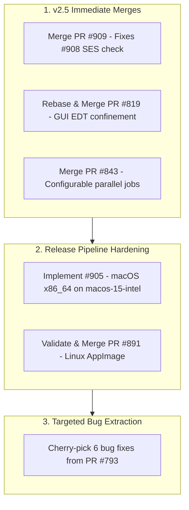

# Open Backlog: Triage, Investigations & Decisions

**Date:** September 17, 2026  
**Repository:** `freerouting/freerouting`  
**Target Milestone:** Freerouting v2.5.0 / v2.5.1  
**Scope:** Active, open issues and pull requests (closed items removed)

---

## 1. Executive Summary & Decision Matrix

### 1.1. Open Pull Requests (11 Active)

| PR | Domain | Status | Title / Description | Action / Recommendation |
| :--- | :--- | :--- | :--- | :--- |
| **[PR #909](https://github.com/freerouting/freerouting/pull/909)** | KiCad / Python | `MERGEABLE` | **Fixes Issue #908.** Check Specctra SES file existence before importing in KiCad plugin. Eliminates error dialogs on clean close without routing. | **Review & Merge for v2.5.** Zero-risk, high user satisfaction. |
| **[PR #843](https://github.com/freerouting/freerouting/pull/843)** | API / Server | `MERGEABLE` | Make scheduler maximum parallel jobs configurable via `--api_server.max_parallel_jobs` and environment variable. | **Review & Merge for v2.5.** Essential for server scaling. |
| **[PR #819](https://github.com/freerouting/freerouting/pull/819)** | GUI / Java | `CONFLICTING` | Fix GUI startup thread confinement (dispatch GUI startup synchronously onto Swing EDT). Prevents `ScreenMessages` race condition. | **Rebase against master & Merge.** |
| **[PR #891](https://github.com/freerouting/freerouting/pull/891)** | CI / Packaging | `MERGEABLE` | Add Linux AppImage build support via `quick-sharun` for portability across distributions. | **Validate in Linux containers & Merge.** |
| **[PR #810](https://github.com/freerouting/freerouting/pull/810)** | CI | `MERGEABLE` | Update pre-commit workflow cache configuration. | **Low-risk merge.** Improves CI caching. |
| **[PR #793](https://github.com/freerouting/freerouting/pull/793)** | Engine / CLI | `Draft / CONFLICTING` | Headless fixes, Specctra type protect handling, and routing heuristics. Contains 6 verified bug fixes alongside experimental heuristics. | **Cherry-pick 6 bug fixes** into a clean PR; discard experimental heuristics. |
| **[PR #888](https://github.com/freerouting/freerouting/pull/888)** | GUI | `MERGEABLE` | Improve inspect mode GUI (canvas jump removal, toolbar layout, context menu width clamping). | **Defer to v2.6.** UI refinement. |
| **[PR #870](https://github.com/freerouting/freerouting/pull/870)** | GUI | `MERGEABLE` | Remove separate window for manual rule selection in exchange for inline panel in router parameters. | **Defer to v2.6.** UI cleanup. |
| **[PR #809](https://github.com/freerouting/freerouting/pull/809)** | GUI | `CONFLICTING` | Reimplemented trace-width editing for net classes in GUI table editor (addresses #796). | **Rebase & Review for v2.6.** |
| **[PR #890](https://github.com/freerouting/freerouting/pull/890)** | Web / Docs | `MERGEABLE` | Render EDA cards with brand logos and update legal disclaimers. | **Review for website repo/docs.** |
| **[PR #743](https://github.com/freerouting/freerouting/pull/743)** | GUI / Engine | `Draft / CONFLICTING` | Add `RoutingEtaCalculator` and improve ETA functionality in status bar. | **Defer.** Needs algorithmic rework across multi-pass stages. |

---

### 1.2. Open Issues (17 Active)

| Issue | Domain / Tags | Priority / Milestone | Title & Summary | Next Step |
| :--- | :--- | :--- | :--- | :--- |
| **[#909](https://github.com/freerouting/freerouting/pull/909) / [#908](https://github.com/freerouting/freerouting/issues/908)** | KiCad, GUI, Linux | Medium / Future | Closing Freerouting without starting routing tries to import non-existing `freerouting.ses` file in KiCad. | **Fixed by PR #909.** Close upon merge. |
| **[#905](https://github.com/freerouting/freerouting/issues/905)** | CI, macOS | Medium / 2.5 | Package native Intel (`x86_64`) macOS DMG installer via `macos-15-intel` runner (supported through August 2027). | **Implement in v2.5 release workflow.** |
| **[#903](https://github.com/freerouting/freerouting/issues/903)** | GUI, UX | Low / Future | Micro Surveying within Freerouting: passive in-app user feedback & micro-surveys without modals/popups. | Needs architectural design for backend polling/privacy before any code. |
| **[#879](https://github.com/freerouting/freerouting/issues/879)** | routing-engine | High / Future | Padstack data structure in Freerouting does not support custom pad semantics (arbitrary non-convex padstacks converted to convex hulls). | Architectural refactoring of padstack geometry representation. |
| **[#856](https://github.com/freerouting/freerouting/issues/856)** | Integration | Low / Future | Altium Designer Integration for Freerouting (direct export/import workflow). | Third-party EDA integration script/plugin. |
| **[#802](https://github.com/freerouting/freerouting/issues/802)** | GUI | Medium / Future | Comprehensive UX overhaul (unit labeling, status bar, dialog scaling, UI tests). | Scope into milestone iterations. |
| **[#787](https://github.com/freerouting/freerouting/issues/787)** | KiCad, API, Python | Medium / Future | KiCad Plugin: Migrate from SWIG JSON bridge to Protocol Buffers IPC. | Future modernization of KiCad IPC bridge. |
| **[#758](https://github.com/freerouting/freerouting/issues/758)** | GUI, Windows | Low / Future | Add context menu action and keyboard shortcut to unfix fixed board items. | GUI context menu enhancement. |
| **[#750](https://github.com/freerouting/freerouting/issues/750)** | GUI | Low / Future | Fix ratsnest calculation and clearance checking during interactive component dragging; improve snap to grid. | Investigate repaint frequency and drag cursor offset. |
| **[#747](https://github.com/freerouting/freerouting/issues/747)** | GUI | Medium / Future | Unify unit conversions and labeling (mils, mm, um) across all dialogs and status bar. | Standardize formatting via coordinate/unit utility. |
| **[#733](https://github.com/freerouting/freerouting/issues/733)** | i18n, Docs | Low / Future | Clean up redundant localization keys and isolate English source bundles. | Run i18n extraction & bundle cleanup script. |
| **[#726](https://github.com/freerouting/freerouting/issues/726)** | GUI | Low / Future | Display estimated remaining routing time (ETA) in status bar. | Linked to PR #743 (deferred). |
| **[#718](https://github.com/freerouting/freerouting/issues/718)** | routing-engine, DRC | High / Future | Support net-ties and overlapping pads between different nets without clearance violations. | Clearance matrix and connectivity graph enhancement. |
| **[#716](https://github.com/freerouting/freerouting/issues/716)** | routing-engine | Medium / Future | Autoroute: Add automatic trace length tuning (serpentine / accordion patterns) for high-speed differential pairs. | Algorithmic routing extension. |
| **[#695](https://github.com/freerouting/freerouting/issues/695)** | GUI | Low / Future | Add Recent Files menu and router settings preset management. | GUI convenience feature. |
| **[#677](https://github.com/freerouting/freerouting/issues/677)** | GUI, Good First Issue | Low / Future | Remove redundant Mode indicator label from BoardFrame footer. | Simple UI cleanup task. |
| **[#383](https://github.com/freerouting/freerouting/issues/383)** | routing-engine | Medium / Future | Autoroute: Support star-ground routing topology to a single reference point. | Algorithmic routing topology expansion. |

---

## 2. Deep-Dive Technical Investigations & Release Decisions

### 2.1. KiCad Plugin SES Import Handling ([Issue #908](https://github.com/freerouting/freerouting/issues/908) & [PR #909](https://github.com/freerouting/freerouting/pull/909))
- **Problem:** When a user opens Freerouting from KiCad via the plugin, cancels the autoroute confirmation dialog, and closes the Freerouting GUI without performing any routing, Freerouting exits cleanly without writing a `.ses` file. The KiCad plugin unconditionally attempted to run `pcbnew.ImportSpecctraSES(...)`, triggering error dialogs:
  - *"Failed to invoke pcbnew.ImportSpecctraSES"*
  - *"Specctra SES file does not exist"*
- **Fix in PR #909:** Author `@joern-h` added an existence check before triggering the KiCad IPC import in `plugin.py`:
  ```python
  if self.module_output.is_file():
      logger.info("Importing Specctra SES file into KiCad (DSN mode)...")
      if not router.import_ses():
          logger.error("Failed to import Specctra SES file.")
  else:
      logger.warning("Specctra SES file does not exist.")
  ```
- **Evaluation:** Clean, safe, and zero-risk. It eliminates annoying modal errors for users who simply open and close Freerouting.
- **Recommendation:** **Approve and merge PR #909.** Issue #908 will be closed upon merge.

---

### 2.2. Native Intel macOS Packaging ([Issue #905](https://github.com/freerouting/freerouting/issues/905))
- **Context:** Modern Apple Silicon Macs are supported by `build-macos-arm64` on `macos-latest`, but Intel Mac users (`x86_64`) were left without native pre-packaged `.dmg` installers after GitHub Actions retired `macos-13`.
- **Solution:** GitHub Actions announced the **`macos-15-intel`** runner image (supported through August 2027) for x86_64 workloads.
- **Implementation Plan:**
  1. Add `scripts/build/create-distribution-macos-x64.sh` invoking JDK `jlink` + `jpackage` with architecture flags for `x86_64`.
  2. Add `build-macos-x64` in `.github/workflows/create-release.yml` targeting `runs-on: [ macos-15-intel ]`.
  3. Publish `freerouting-<version>-macos-x64.dmg` alongside `macos-arm64.dmg` in GitHub Releases.
- **Recommendation:** Implement for the v2.5.0 release pipeline.

---

### 2.3. GUI Startup Thread Confinement ([PR #819](https://github.com/freerouting/freerouting/pull/819))
- **Problem:** Freerouting's main entry point historically called `GuiManager.initializeGUI` from the initial application thread rather than Swing's Event Dispatch Thread (EDT). When opening a board directly on launch, `ScreenMessages` mutations threw `IllegalStateException: ScreenMessages must only be mutated on the EDT`, freezing the startup process.
- **Fix:** Wraps GUI initialization synchronously in `SwingUtilities.invokeAndWait`, guaranteeing thread confinement and adding regression tests for both on-EDT and off-EDT entry points.
- **Status:** The PR branch currently has merge conflicts against `master`.
- **Recommendation:** Rebase against `master` and merge.

---

### 2.4. Scheduler Parallel Jobs Configuration ([PR #843](https://github.com/freerouting/freerouting/pull/843))
- **Problem:** `RoutingJobScheduler` hardcodes concurrent routing jobs to `5`. High-spec self-hosted API servers cannot scale out job throughput without custom source patches.
- **Fix:** Exposes `--api_server.max_parallel_jobs` (default `5`) participating in the normal `SettingsMerger` priority ladder (CLI, environment variables `FREEROUTING__API_SERVER__MAX_PARALLEL_JOBS`, JSON file).
- **Status:** `MERGEABLE` and cleanly isolated to `api_server` configuration.
- **Recommendation:** Review and merge for v2.5.0.

---

### 2.5. Headless Fixes & Heuristic Audit ([PR #793](https://github.com/freerouting/freerouting/pull/793))
- **Audit Findings:** PR #793 by `@gbacskai` contains 27 commits. A strict line must be drawn between bug fixes and unverified heuristics:
  - **Critical Bug Fixes (Ready to Cherry-Pick):**
    1. **Destructive Stub Removal (`a21d7759`):** `minimize_stubs()` erroneously tested `contacts == 1`, matching normal pad-to-via traces and deleting valid copper. Corrected to check for 0 contacts and made opt-in via `--router.minimize_stubs`.
    2. **`IntPoint` Hash Contract (`0bc6276d`):** `IntPoint` overrode `equals()` but not `hashCode()`, causing undefined behavior when used as map/set keys.
    3. **`PriorityQueue` Non-Deterministic Iteration (`0bc6276d`):** Replaced `queue.iterator().next()` (unspecified order) with `queue.poll()` in `MazeSearchAlgo`.
    4. **Stream File Descriptor Leak (`d6de64c9`):** Closed `Files.list()` streams in try-with-resources during job folder management.
    5. **Impossible Outer Layer Condition (`0bc6276d`):** Corrected `p_layer == 0 && p_layer != 0` in `calculateFastHeuristic`.
    6. **DSN Unit Resolution Scaling (`0f121a2e`):** Derived escape cluster distance thresholds from `communication.get_resolution()` rather than assuming fixed micron units.
  - **Experimental Heuristics (Do Not Merge):** Multi-threaded autorouter passes and speculative layer assignment heuristics regressed test fixtures and should remain deferred.
- **Recommendation:** Extract the 6 critical bug fixes into a dedicated PR with targeted tests.

---

### 2.6. Linux AppImage Support ([PR #891](https://github.com/freerouting/freerouting/pull/891))
- **Assessment:** Introduces `quick-sharun` AppImage generation. AppImages provide an all-in-one executable containing the bundled JRE and dependencies, eliminating Linux distribution library mismatch issues.
- **Note on macOS:** AppImage is Linux-only (ELF/squashfs/FUSE). macOS is served via native DMG packages (Issue #905).
- **Recommendation:** Validate packaging in Ubuntu and Fedora environments, then merge.

---

### 2.7. Dependency Updates & OpenRewrite Cleanup
- **Status:** OpenRewrite was completely removed from `master` in commits `54da21183`, `e348262aa`, and PR #912 (`chore/remove-openrewrite`).
- **PR #900 Resolution:** PR #900 (Dependabot 23-dependency bump) was automatically closed on September 17, 2026. Dependabot will regenerate a clean update PR reflecting the current build configuration without OpenRewrite artifacts.

---

## 3. Active Backlog Priority Matrix

### Tier 1: Release-Critical for v2.5.0
1. **[PR #909](https://github.com/freerouting/freerouting/pull/909):** Merge KiCad plugin SES check (fixes #908).
2. **[PR #819](https://github.com/freerouting/freerouting/pull/819):** Rebase and merge GUI startup thread confinement.
3. **[PR #843](https://github.com/freerouting/freerouting/pull/843):** Merge configurable API server job concurrency.
4. **[#905](https://github.com/freerouting/freerouting/issues/905):** Add native macOS x86_64 DMG job using `macos-15-intel`.
5. **[PR #793](https://github.com/freerouting/freerouting/pull/793) (Porting):** Cherry-pick the 6 verified bug fixes into a clean PR.

### Tier 2: Post-v2.5 Release & Modernization
- **[PR #891](https://github.com/freerouting/freerouting/pull/891):** Linux AppImage validation and release workflow integration.
- **[PR #888](https://github.com/freerouting/freerouting/pull/888) & [PR #870](https://github.com/freerouting/freerouting/pull/870):** Inspect mode and inline manual rules panel polish.
- **[PR #809](https://github.com/freerouting/freerouting/pull/809):** Net-class trace width GUI editing table rebase.
- **[#787](https://github.com/freerouting/freerouting/issues/787):** KiCad Plugin Protocol Buffers IPC migration.
- **[#879](https://github.com/freerouting/freerouting/issues/879) & [#718](https://github.com/freerouting/freerouting/issues/718):** Architectural engine enhancements (custom padstacks, net-ties).

---

## 4. Workflow Roadmap


