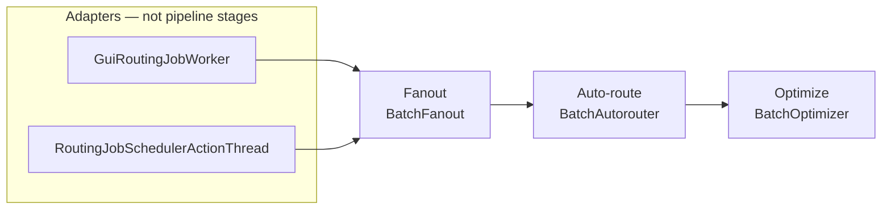

# Freerouting Code Structure Recommendations

**Document status:** Implementation plan for branch `refactor/restructure`  
**Date:** August 2026  
**Target:** Freerouting (Java 25 / Gradle 9)  
**Companions:** [`docs/architecture.md`](../architecture.md) (package map and accepted GUI/headless debt), [`docs/settings.md`](../settings.md), [`docs/gui/accessibility-contract.md`](../gui/accessibility-contract.md)

This is the work list for one branch and one final pull request. Routing, DRC, and scoring behavior stay frozen unless a phase explicitly changes a construction policy. Do not re-run the 2026 naming campaign. Do not split a class because it is large.

---

## How to use this plan

1. Implement phases **0–5** on `refactor/restructure` in order. Each phase has a gate; do not start the next until it is green.
2. The [Later work](#later-work-not-this-pr) section is not in this PR.
3. Do not put GUI types under `board` or `autoroute` (`ModuleBoundariesArchTest`).
4. Do not convert `RouterSettings` (or nested settings) to records. `SettingsMerger` requires nullable reference fields with no Java-default initializers.
5. Do not create phase-specific branches or interim PRs.

---

## What this PR actually changes

| In this PR | Not in this PR |
|---|---|
| Retire `BatchAutorouterV19` and the GUI algorithm combo | JPMS, `BoardLength`, geometry `*Math` splits |
| Shared 3-stage `RoutingPipeline` used by GUI and headless | `JobService` extraction (MCP already calls REST over HTTP) |
| Optimizer factory that **preserves** today’s GUI vs headless construction | Folding or deleting `BatchOptimizerMultiThreaded` (needs a separate DRC/parity audit) |
| Finish per-family angle-mode factories (no cross-package adapter bag) | Virtual threads, BVH rewrite, parallel sector routing |
| Subpackages `board.searchtree`, `board.optimize`, `autoroute.{pipeline,maze,expansion,drill,path}` | GUI presenter split of `GuiBoardManager` / `BoardFrame` |
| Seal `Point`, `TileShape`, `RegularTileShape`; `NamedAlgorithm` only as far as subclasses allow | Sealing `Item`; streaming Specctra parser |

---

## Baseline (August 2026)

- `board`: 52 Java files. `autoroute`: 48 files, with events already in `autoroute.events`.
- `GuiBoardManager` lives in `gui.workspace`. `HeadlessBoardManager` lives in `management`.
- `NamedAlgorithm` is the strategy base for `BatchAutorouter`, `BatchFanout`, and `BatchOptimizer`. `BatchOptimizerMultiThreaded` extends `BatchOptimizer`. `BatchAutorouterThread` is a **per-pass parallel worker**, not a job orchestrator.
- Angle-mode factories **already exist** for three of four families (`TraceTightener.getInstance`, `FoundConnectionLocator.getInstance`, `SearchTreeManager` autoroute-tree construction). The missing one is room-neighbour dispatch in `AutorouteEngine.calculateDoors`.
- One GUI/headless construction drift remains:
  GUI may instantiate `BatchOptimizerMultiThreaded` when `featureFlags.multiThreading` and `optimizer.maxThreads > 1`; headless always uses `new BatchOptimizer(job)` even though defaults set `maxThreads` to `CPU−1`.

The optimizer parity, determinism, logging, and benchmark work is intentionally deferred to the
separate [`optimizer_unification_plan.md`](optimizer_unification_plan.md). Do not turn MT on for
API/CLI jobs as part of this restructuring roadmap.

---

## Principles

**Prefer completing existing factories over new façades.** A single `AngleModeAdapters` type that returns search trees, tighteners, locators, and room neighbours would couple `board.searchtree`, `board.optimize`, and `autoroute.path` and fight the Phase 4 package split.

**Three routing stages, not four.** Fanout → auto-route → optimize. SES/job-artifact writes are `BoardUpdatedEvent` listeners in the adapters, not a pipeline stage. Timeout monitoring stays in the headless adapter; the pipeline only honors cooperative `StoppableThread` stop.

**Keep hot geometry types cohesive.** `IntOctagon`, `Simplex`, `IntBox`, `Polyline`, `TileShape` stay whole.

**CPU work stays on platform threads.** Virtual threads are for blocking I/O, not maze/optimizer pools.

**Package moves follow extracted types.** Move files after the pipeline and factories exist so imports move once.

**Do not invert `ShapeSearchTree.completeShape`.** That method already lives on the board search tree and talks to autoroute expansion rooms. Leave the `board` → `autoroute` dependency; Phase 4 must not try to “fix” it.

---

## Invariants (still binding)

Full glossary: [`docs/architecture.md`](../architecture.md). Settings ladder: [`docs/settings.md`](../settings.md).

### Names and families

| Keep | Do not |
|---|---|
| `BoardManager`, `HeadlessBoardManager`, `GuiBoardManager` (hosts the workspace) | Rename `GuiBoardManager` away, or put `Session` in GUI type names |
| `BatchAutorouter`, `BatchFanout`, `BatchOptimizer`, `NamedAlgorithm` | Rename `NamedAlgorithm` to `RoutingStage` (`core.RoutingStage` already exists) |
| `BasicBoard`, `Item`, `ShapeSearchTree`, `RouterSettings`, `DesignRulesChecker`, `AirLine`, `InteractiveState`, `core.library.Package` | Rename `BasicBoard` → `Board` as a naming exercise |
| `gui.workspace` | Rename that package `gui.editor` |
| Parser `NetClass` / `Unit` beside `rules.NetClass` / `board.Unit` | Merge parser types into domain types |

`BatchAutorouterV19` is retired in Phase 0.

**Session** = API/job container (`core.Session`, `/v1/sessions`); at most one is **primary**. **Workspace** = desktop editor bound to that session (`gui.workspace`).

### Wire and persistence

- Do not change HTTP paths, JSON `@SerializedName` keys, the `freerouting.json` `gui` block, `--router.*`, or `FREEROUTING__ROUTER__*` names.
- Keep the JSON key `algorithm`. Unknown values, including `freerouting-router-v19`, **warn and fall back** to `ALGORITHM_CURRENT` (headless already does this). Do not require old GUI combo entries to round-trip.
- Do not expand acronyms in identifiers: API, MCP, DSN, SES, DRC, EDT, SMD.
- `KiCadBoardJson` ≠ `KiCadDrcReport`. Keep every KiCad DRC JSON field name.
- Package moves **break `.frb` Java-serialization FQCNs**. That is accepted. Keep load/save code; no `resolveClass` shims.

### Settings and i18n

- GUI source priority **65**: sources 0–60 seed `WorkspaceSettings` at load; after a GUI edit, live settings win. API jobs do not register this source.
- `WorkspaceSettings` must remain a subclass of `GuiSettingsSource`.
- Keep field `GlobalSettings.guiSettings` and JSON `"gui"` (type `GuiApplicationSettings`).
- `new TextManager(this.getClass(), locale)` loads `class.getName()` bundles. Move `*.properties` with the class. `TextManager` stays in `util`; `Common_*.properties` stay at the `app.freerouting` resource root.

### ArchUnit

- Update FQCNs and `resideInAnyPackage` prefixes when packages move (`gui.workspace` workers, `analytics..` GUI isolation).
- `management.jobs`, `management.sessions`, `core.library` already match `management..` / `core..`.
- `SpecctraPackageArchTest` still forbids GUI/management imports from `io.specctra`.
- Do not add `analytics` to `PIPELINE_SUPPORT_PACKAGES`.
- Accepted debt stays as in `docs/architecture.md`: `ItemInfoPrinter` shape, incomplete-connections in `drc`, D26 `gui.workspace` → `gui.rendering`.

---

## Shared patterns (encode these)

### 1. Angle-mode: four factories, not one bag

| Family | 90° | 45° | Any-angle | Factory today |
|---|---|---|---|---|
| Autoroute search tree | `ShapeSearchTree90Degree` | `ShapeSearchTree45Degree` | `ShapeSearchTree` | `SearchTreeManager` (autoroute tree only; **default tree is always 45° bounding**) |
| Pull-tight | `TraceTightener90` | `TraceTightener45` | `TraceTightenerAnyAngle` | `TraceTightener.getInstance` |
| Path reconstruction | `FoundConnectionLocator45Degree` | `FoundConnectionLocator45Degree` | `FoundConnectionLocatorAnyAngle` | `FoundConnectionLocator.getInstance` |
| Room doors | `SortedOrthogonalRoomNeighbours` | `Sorted45DegreeRoomNeighbours` | `SortedRoomNeighbours` | **Inline `instanceof` in `AutorouteEngine.calculateDoors`** |

Phase 3 adds `SortedRoomNeighbours.complete(room, engine)` (or equivalent) next to the other `getInstance` methods and deletes the `instanceof ShapeSearchTree*` switch. Do not move tree/tightener/locator construction into a new type.

### 2. Routing pipeline



`RoutingPipeline` (working name; must not collide with `core.RoutingStage`) lives in `autoroute` (after Phase 4: `autoroute.pipeline`). It sequences the three stages, forwards existing `autoroute.events`, and stops when the thread is requested to stop.

Adapters own:

- GUI: EDT progress, overlay `draw(Graphics)`, incremental SES into the job (today’s `BoardUpdatedEvent` listener).
- Headless: timeout monitor, artifact write, `RoutingJobState`.

Rename `AutorouterAndRouteOptimizerThread` → `GuiRoutingJobWorker` and update `InteractiveActionThread.getAutorouterAndRouteOptimizerInstance`.

Do not touch `BatchAutorouterThread`.

### 3. Optimizer construction (preserve drift)

```java
// Shared factory — GUI path (feature flag + maxThreads)
static BatchOptimizer createForGui(RoutingJob job) { ... }

// Headless path stays single-threaded until the separate optimizer plan is complete
static BatchOptimizer createForHeadless(RoutingJob job) {
  return new BatchOptimizer(job);
}
```

The optimizer is enabled by default by `DefaultSettings`. If `optimizer.enabled` is false, the
pipeline skips the stage. GUI, CLI, and API jobs must resolve the same optimizer settings before
constructing the pipeline. Do not enable MT for API/CLI jobs in this restructuring roadmap; see the
[`optimizer_unification_plan.md`](optimizer_unification_plan.md).

### 4. Sealed types — closed trees only

```java
public sealed abstract class Point permits IntPoint, RationalPoint { ... }

public sealed abstract class TileShape permits RegularTileShape, Simplex { ... }

public sealed abstract class RegularTileShape permits IntBox, IntOctagon { ... }
```

`FloatPoint` is not a `Point`. `Circle` is a `ConvexShape`, not a `TileShape`. Do not seal `Item` in this PR.

`NamedAlgorithm`: permit `BatchAutorouter`, `BatchFanout`, `BatchOptimizer`. Because
`BatchOptimizerMultiThreaded` remains, `BatchOptimizer` must be **`non-sealed`**.

---

## Out of scope (harmful or already decided)

| Proposal | Why not |
|---|---|
| JPMS per domain package | Fat JAR + reflection; ArchUnit already enforces boundaries |
| `BoardLength` in hot paths | Boxing until Valhalla; convert only at I/O/settings edges |
| Records for `BoardStatistics`, `ViaRule`, `NetClass`, `ExpansionRoom` | Mutable / identity-bearing |
| `board.session` holding GUI/headless managers | ArchUnit violation |
| Split `IntOctagon` / `Simplex` / `Polyline` | Cohesion loss on inner-loop types |
| Split every file ≥600 LOC | Heat map, not a work list |
| `JobService` for MCP reuse | MCP tools already HTTP-call `/v1/*` via `mcp_server.target_api_base_url` |
| Cross-package `AngleModeAdapters` | Couples packages the split is trying to separate |
| Export as pipeline stage 4 | Event listener in adapters |
| Virtual threads for maze/optimizer | CPU-bound mutation of a shared board |
| `List.copyOf()` on `Polyline` corners in inner loops | Extra allocation |

---

## Target packages (after Phase 4)

`board`, `autoroute`, `geometry`, `rules`, `drc` remain GUI-free.

```text
board/
  Item, Pin, Via, Trace, areas, outline, BasicBoard, RoutingBoard,
  ForcedPadRouter, ForcedViaInserter, DrillItemMover, AngleRestriction, …
  searchtree/   ShapeSearchTree, ShapeSearchTree45Degree, ShapeSearchTree90Degree,
                SearchTreeManager, ShapeTraceEntries
  optimize/     TraceTightener*, TraceShover, ViaOptimizer
autoroute/
  events/       keep
  pipeline/     BatchAutorouter, BatchFanout, BatchOptimizer*, NamedAlgorithm,
                RoutingPipeline, BatchAutorouterThread
  maze/         MazeSearchEngine, AutorouteEngine, AutorouteControl, maze elements
  expansion/    *ExpansionRoom, *Door, Sorted*RoomNeighbours, ExpandableObject
  drill/        DrillPage, DrillPageArray, ExpansionDrill
  path/         FoundConnectionLocator*, FoundConnectionInserter, Connection
```

`HeadlessBoardManager` stays in `management`. `GuiBoardManager` stays in `gui.workspace`. Do not invent `app.freerouting.server`.

---

## Phases (this PR)

### Phase 0 — One autorouter

**Goal:** GUI matches headless: always `BatchAutorouter`.

**Tasks:**

- [x] Delete `BatchAutorouterV19` and all `instanceof` / constructor branches in `AutorouterAndRouteOptimizerThread`.
- [x] Remove the algorithm combo from `WindowAutorouteParameter` and i18n keys `algorithmCurrent` / `algorithmV19`.
- [x] Keep `RouterSettings.algorithm` and `ALGORITHM_V19` as a recognized **fallback token**: warn, then use `ALGORITHM_CURRENT` (same as headless today).
- [x] Keep `NamedAlgorithm`.
- [x] Update `RoutableLayersSafetyCheckTest`, `DialogInteractionHandlersTest`, rewrite TSV rows for the deleted class, and any fixture that constructed V19.

**Gate (passed):** `gradlew.bat test` (fast set). No v1.9 combo in the GUI. Loading a settings file with `"algorithm": "freerouting-router-v19"` still runs the current router.

### Phase 1 — Shared routing pipeline

**Goal:** One sequencer; adapters keep UI, timeout, and SES listeners.

**Tasks:**

- [x] Add `RoutingPipeline` that runs fanout → `BatchAutorouter` → optimizer (if enabled).
- [x] GUI optimizer via `createForGui`; headless via `createForHeadless` (always `BatchOptimizer`).
- [x] Rewrite `RoutingJobSchedulerActionThread` to call the pipeline (timeout monitor stays here).
- [x] Rename `AutorouterAndRouteOptimizerThread` → `GuiRoutingJobWorker`; update `InteractiveActionThread` factory and `draw` dispatch.
- [x] Do not touch `BatchAutorouterThread`.

**Gate (passed):** `Dac2020Bm01RoutingTest` and `RoutingPipelineComparisonTest`. Same fixture, GUI vs headless with **default-like optimizer threading** (headless ST): completion %, via count, and `DesignRulesChecker.getAllClearanceViolations()` did not regress.

### Phase 2 — Optimizer factory only

**Goal:** One construction site per adapter; **no** MT fold/delete.

**Tasks:**

- [x] Put `createForGui` / `createForHeadless` on `BatchOptimizer` (or a tiny package-private factory next to it).
- [x] Delete duplicated algorithm-id warning / listener-registration blocks in the GUI thread.
- [x] Document the headless-always-ST policy in `docs/settings.md` (`optimizer.maxThreads` applies to the GUI path and to `BatchAutorouterThread` pass parallelism, not to headless optimizer workers).

**Gate (passed):** Fast tests green. `BatchOptimizerFactoryTest` asserts `createForHeadless` returns
`BatchOptimizer` (not the MT subclass) even when `maxThreads > 1`.

### Phase 3 — Room-neighbour factory

**Goal:** `AutorouteEngine.calculateDoors` no longer switches on search-tree type.

**Tasks:**

- [x] Add a static factory on `SortedRoomNeighbours` that chooses orthogonal / 45° / any-angle
  `calculate`.
- [x] Leave `TraceTightener.getInstance`, `FoundConnectionLocator.getInstance`, and
  `SearchTreeManager` as they are.
- [x] Unit-test the mapping: `ShapeSearchTree90Degree` → orthogonal,
  `ShapeSearchTree45Degree` → 45°, else any-angle.

**Gate (passed):** `SortedRoomNeighboursFactoryTest` covers all three search-tree mappings;
`AutorouteEngine.calculateDoors` delegates through the factory. No maze heuristic edits.

### Phase 4 — Package splits

**Goal:** Subpackages in the sketch. Logic-free moves.

**Tasks:**

- [x] Move search-tree types to `board.searchtree`, tighteners/shove/via optimizer to `board.optimize`.
- [x] Split `autoroute` into `pipeline`, `maze`, `expansion`, `drill`, `path`; leave `events`.
- [x] Check matching `*.properties`; no class-local bundles exist for the relocated types.
- [x] Update ArchUnit strings and the `docs/architecture.md` glossary / mermaid. Accept `.frb` FQCN breakage.

**Gate (pending verification):** `ModuleBoundariesArchTest` and `SpecctraPackageArchTest` green;
`spotlessCheck` + Checkstyle; `python scripts/i18n/extract-context.py --check`. `git diff` is moves +
import/FQCN updates only.

### Phase 5 — Sealed geometry (and NamedAlgorithm if cheap)

**Goal:** Exhaustive switches on closed geometry trees.

**Tasks:**

- [ ] Seal `Point`, `TileShape`, `RegularTileShape` with the permits lists above.
- [ ] Replace `default: throw` on those types with exhaustive switches.
- [ ] Optionally seal `NamedAlgorithm` with `BatchOptimizer` **non-sealed**. Skip if it forces noisy modifiers for no call-site gain.
- [ ] Do not seal `Item`.

**Gate:** Compile + fast tests. No new incomplete switches.

---

## Later work (not this PR)

### Follow-up A — Optimizer unification

The deterministic multi-threaded optimizer migration, cross-mode parity work, logging compatibility,
and before/after benchmarks are specified separately in
[`optimizer_unification_plan.md`](optimizer_unification_plan.md).

### Follow-up B — API/I/O thinning

Thin `JobControllerV1` only if an **in-process** second caller appears. Optional tokenizer vs scope split in `SpecctraDsnStreamReader` without a streaming rewrite. Virtual threads only for analytics HTTP.

### Follow-up C — GUI presenters

Extract menu/toolbar builders and parameter-dialog presenters. Bind through `WorkspaceSettings` getters/setters. Do not regress D26 or `gui.workspace` ↛ `gui.interactive`. Leave `.frb` I/O on `GuiBoardManager` until a second caller needs it. Accessibility: [`docs/gui/accessibility-contract.md`](../gui/accessibility-contract.md).

### Follow-up D — Allocation research

Profile `ShapeSearchTree` / expansion-room churn on a >500-net board. Record **peak heap**, not cumulative allocation. Recycle leaves or stack-allocate hot predicates only with a profiler note. No default BVH or sector-parallel rewrite.

---

## Heat map (where to look, not what to split)

August 2026, files ≥600 LOC:

| Area | Files | This PR |
|---|---|---|
| GUI / workspace / rendering | 14 | Rename/thin the routing worker only |
| Autoroute | 10 | Pipeline + neighbour factory + package split |
| Board / trees / tighteners | 15 | Package split only |
| Geometry | 8 | Seal; do not split |
| I/O parsers | 7 | Out |
| API / settings / DRC / analytics | 8 | Settings documentation in Phase 2 only |

| File | This PR does |
|---|---|
| `GuiRoutingJobWorker` (942) | Uses `RoutingPipeline` with GUI-only progress and rendering |
| `BatchAutorouter` (2152) | Stay; plane-net policy stays here (Issue 093) |
| `MazeSearchEngine` (1936) | Stay; no heuristic edits |
| `JobControllerV1` (1421) | Stay |
| `GuiBoardManager` (3312) | Stay |
| `RouterSettings` (958) | Stay; no extra nested `AutorouteSettings` |
| `DesignRulesChecker` (821) | Stay; keep `getAllClearanceViolations()` as the public entry |

---

## Quality gates (every phase)

From the repo root on Windows:

```text
gradlew.bat spotlessCheck checkstyleMain checkstyleTest checkstyleRewriteRecipes
```

When Java or translations change:

```text
python scripts/i18n/extract-context.py --check
```

Routing-touching phases: `Dac2020Bm01RoutingTest`, full DRC via `DesignRulesChecker.getAllClearanceViolations()`, no `src_v19/` edits, no `spotlessApply` sweep. Inspect `git diff --stat` and `git diff --check`. Never auto-stage.

---

*Update this file when a phase gate changes a decision. Architecture glossary updates belong in the same Phase 4 commit as the package moves.*
