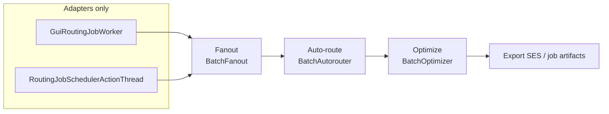

# Freerouting Code Structure Recommendations

**Document status:** Living plan  
**Date:** August 2026  
**Target:** Freerouting (Java 25 / Gradle 9)  
**Companion docs:** [`docs/architecture.md`](../architecture.md), [`docs/issues/soc-gui-separation-and-accessibility-plan.md`](../issues/soc-gui-separation-and-accessibility-plan.md), [`docs/settings.md`](../settings.md)

This is a sequenced engineering plan, not a backlog of every class over 600 lines. Work is ordered by risk and by shared abstractions that remove duplication. Routing behavior stays frozen unless a phase explicitly says otherwise.

The 2026 naming and packaging campaign is **done** (identifier cleanup, `gui.workspace`, KiCad DRC DTOs, `analytics` / `core.library` / `management.jobs|sessions`, `*Algo` → role names). Do not re-run it. The invariants below are what that campaign still requires of later structure work.

---

## How to use this plan

1. Execute phases in order. Later phases assume earlier consolidations exist.
2. Each phase has an exit gate. Do not start the next phase until the gate is green.
3. Do not split a class because it is large. Split when two independent reasons-to-change are tangled, or when a second caller needs the same collaborator.
4. Do not put GUI types under `board` or `autoroute`. ArchUnit already forbids that (`ModuleBoundariesArchTest`).
5. Do not convert `RouterSettings` (or nested settings) to records. `SettingsMerger` requires nullable reference fields with no Java-default initializers.

---

## Current facts (August 2026)

Verified against `src/main/java` (excluding `src_v19/`):

| Claim in the old catalog | Actual state |
|---|---|
| `board` has 63 classes | **52** Java files in `app.freerouting.board` |
| `autoroute` is a flat mix including events | **48** files in `autoroute`; events already live in `autoroute.events` |
| `GuiBoardManager` / `HeadlessBoardManager` belong in `board.session` | `GuiBoardManager` is in `gui.workspace`; `HeadlessBoardManager` is in `management` |
| `AngleRestriction` is in `geometry.planar` | It is `board.AngleRestriction` |
| `PullTightAlgo`, `OptViaAlgo`, `CalcShape`, `PolylinePullTight`, `MazeSearchAlgo` | Already renamed/replaced: `TraceTightener*`, `ViaOptimizer`, `MazeSearchEngine` |
| `ItemInfoPrintable` | Nested type: `ItemInfoPrinter.Printable` |
| Generic `Storable` | Three nested interfaces: `UndoableObjects.Storable`, `ShapeTree.Storable`, `PlanarDelaunayTriangulation.Storable` |
| `Component` is an `Item` | `Component` does **not** extend `Item`. Item leaves are `DrillItem` (`Pin`, `Via`), `Trace` (`PolylineTrace`), `ObstacleArea` (`ConductionArea`, `ViaObstacleArea`, `ComponentObstacleArea`), `BoardOutline`, `ComponentOutline` |
| `TileShape` permits `Circle`; `Point` permits `FloatPoint` | `Circle` implements `ConvexShape`, not `TileShape`. `FloatPoint` is **not** a `Point` (documented inaccuracy of doubles) |
| Split `RouterSettings` into optimizer/scoring records | `OptimizerSettings`, `FanoutSettings`, and `ScoringSettings` **already exist** |
| `core` is only `Freerouting` + scoring | `Freerouting.java` is the top-level entry point. `core` holds jobs, sessions, scoring, library |
| Headless and GUI both select v1.9 vs current | Headless `RoutingJobSchedulerActionThread` **always** uses `BatchAutorouter`. Only the GUI thread still instantiates `BatchAutorouterV19` |
| 62 files >600 LOC, ~71k lines | **62 files, 66,219 lines** (accurate enough as a heat map, not as a split list) |

`NamedAlgorithm` is already the strategy base for `BatchAutorouter`, `BatchFanout`, and `BatchOptimizer`. `BatchOptimizerMultiThreaded` extends `BatchOptimizer`. `BatchAutorouterThread` is a **per-pass parallel worker**, not a second pipeline orchestrator — do not merge it with the GUI/headless job threads.

---

## Principles

**Prefer façades and factories over file-splitting.** The codebase already encodes angle mode as parallel class families. Wiring them behind `AngleRestriction` is higher leverage than extracting `IntOctagonIntersectionMath`.

**Keep hot geometry types cohesive.** `IntOctagon`, `Simplex`, `IntBox`, `Polyline`, and `TileShape` are the inner loop. Static `*Math` helper dumps add hops without shrinking the conceptual surface.

**One pipeline, two adapters.** Fanout → auto-route → optimize → export is implemented twice (GUI `AutorouterAndRouteOptimizerThread` and headless `RoutingJobSchedulerActionThread`). Extract the stage sequence once; keep Swing painting and job-timeout monitoring in adapters.

**CPU work stays on platform threads.** Maze search, shove, and pull-tight are compute-bound and mutate a shared `RoutingBoard`. Virtual threads help blocking I/O (analytics HTTP, optional request handling), not autoroute passes.

**Package moves follow extracted types.** Moving 50 files before the new collaborators exist is a rename campaign, not a structure improvement.

---

## Invariants from the completed naming campaign

These are still binding. Full package glossary and settings ladder live in [`docs/architecture.md`](../architecture.md) and [`docs/settings.md`](../settings.md).

### Names and families to keep

| Keep | Do not |
|---|---|
| `BoardManager`, `HeadlessBoardManager`, `GuiBoardManager` (hosts the workspace; does not *become* the workspace) | Rename `GuiBoardManager` away, or put `Session` in GUI type names |
| `BatchAutorouter`, `BatchFanout`, `BatchOptimizer`, `NamedAlgorithm` | Rename `NamedAlgorithm` to `RoutingStage` (`core.RoutingStage` already exists) |
| `BasicBoard`, `Item`, `ShapeSearchTree`, `RouterSettings`, `DesignRulesChecker`, `AirLine`, `InteractiveState`, `core.library.Package` | Rename `BasicBoard` → `Board` or explode these types as a naming exercise |
| `gui.workspace` for the desktop editor | Name that package `gui.editor` (collides conceptually with `gui.interactive`) |
| Parser `NetClass` / `Unit` homonyms next to `rules.NetClass` / `board.Unit` | “Fix” the homonyms by merging parser and domain types |

`BatchAutorouterV19` was kept through the naming campaign. **This plan retires it in Phase 0** so GUI matches headless.

### Session vs workspace

| Term | Meaning |
|---|---|
| **Session** | API/job container (`core.Session`, `/v1/sessions`). At most one session is **primary** (`Session.isPrimary`) for the desktop. |
| **Workspace** | Desktop editor surface bound to that primary session (`gui.workspace`, `WorkspaceSettings`, `WorkspaceContract`). |

### Wire and persistence

- Do not change HTTP paths (`/v1/jobs/{jobId}/drc`, `/v1/mcp`), JSON `@SerializedName` keys, `freerouting.json` `gui` block, `--router.*`, or `FREEROUTING__ROUTER__*` env names.
- Do not expand acronyms in identifiers: API, MCP, DSN, SES, DRC, EDT, SMD.
- User-facing schema *titles* (OpenAPI): publish the new name in the current minor; drop the old name in the **next** minor. Python client follows in that window. Internal Java names have no compatibility window.
- `KiCadBoardJson` is board interchange. `KiCadDrcReport` (and related types in `io.kicad`) is the KiCad DRC report schema. Same prefix, different classes. Keep every DRC JSON field name.
- `.frb` Java-serialization FQCNs **will break** on package moves. That is accepted. Keep load/save *code*; do not add `resolveClass` shims.

### Settings and i18n

- GUI source priority is **65**. Sources 0–60 **seed** `WorkspaceSettings` at board load; after a GUI edit, live `WorkspaceSettings` wins. API jobs do not register this source. See `docs/settings.md`.
- `WorkspaceSettings` must remain a subclass of `GuiSettingsSource` so `SettingsMerger.addOrReplaceSources` replaces the placeholder by subtype, not a second priority-65 entry.
- Keep Java field `GlobalSettings.guiSettings` and JSON `"gui"`; the field type is `GuiApplicationSettings`.
- Class-based i18n: `new TextManager(this.getClass(), locale)` loads `class.getName()` bundles. Moving a class without its `*.properties` compiles and ships missing UI strings. `TextManager` stays in `util`; `Common_*.properties` stay at the `app.freerouting` resource root.

### ArchUnit when packages move

- Update FQCNs and `resideInAnyPackage` prefixes in `ModuleBoundariesArchTest` (especially `gui.workspace`, worker threads, `analytics..` GUI isolation).
- `management.jobs`, `management.sessions`, and `core.library` already match existing `management..` / `core..` prefixes.
- `SpecctraPackageArchTest` still forbids GUI/management imports from `io.specctra`.
- Do not add `analytics` to `PIPELINE_SUPPORT_PACKAGES`.

---

## Shared patterns to encode (do these instead of 62 decompositions)

### 1. Angle-mode strategy (highest structural leverage)

Three independent class families already specialize the same three modes (`NONE`, `FORTYFIVE_DEGREE`, `NINETY_DEGREE`):

| Concern | 90° | 45° | Any-angle |
|---|---|---|---|
| Spatial index | `ShapeSearchTree90Degree` | `ShapeSearchTree45Degree` | `ShapeSearchTree` |
| Room doors | `SortedOrthogonalRoomNeighbours` | `Sorted45DegreeRoomNeighbours` | `SortedRoomNeighbours` |
| Pull-tight | `TraceTightener90` | `TraceTightener45` | `TraceTightenerAnyAngle` |
| Path reconstruction | (orthogonal path uses 45° locator where applicable) | `FoundConnectionLocator45Degree` | `FoundConnectionLocatorAnyAngle` |

**Do:** Introduce a single factory (working name `AngleModeAdapters`) keyed by `board.AngleRestriction` that returns the existing subclasses. Call sites stop switching on angle in four packages.

**Do not:** Split each neighbour/tightener class into `*Calculator` / `*Sorter` files. That duplicates the hierarchy instead of collapsing the switches.

### 2. Routing pipeline (remove GUI/headless drift)



**Do:** Extract a headless `RoutingPipeline` (or `RoutingJobRunner`) that sequences the four stages, applies stop/timeout, and fires existing `autoroute.events`. GUI worker becomes: start pipeline + EDT progress + overlay paint. Headless worker becomes: start pipeline + timeout monitor + artifact write.

**Do not:** Invent `JobArtifactExporter` / `AutorouterExecutionLifecycle` as 100-line wrappers around existing methods.

### 3. Optimizer: one class, a thread-count parameter

`BatchOptimizerMultiThreaded` already subclasses `BatchOptimizer`. The remaining work is a **safety decision**, not a rename.

- Gate with full `DesignRulesChecker.getAllClearanceViolations()` (not `BoardStatistics.clearanceViolations.totalCount`).
- `maxThreads == 1` must be bit-identical to today’s single-threaded path.
- If races cannot be confined to isolated copies of the board, delete the multi-threaded subclass and `OptimizeRouteTask`. If they can, fold the pool into `BatchOptimizer` and drop the extra type.

### 4. Algorithm plug-in surface

Keep `NamedAlgorithm` / `NamedAlgorithmType`. Delete the v1.9 **implementation** and the GUI algorithm combo once headless and GUI both construct only `BatchAutorouter`. Future experimental routers still implement `NamedAlgorithm`; they do not need a shipped v1.9 fork.

### 5. Sealed types — only on actually closed trees

Correct first candidates:

```java
public sealed abstract class Point permits IntPoint, RationalPoint { ... }

public sealed abstract class TileShape
    permits RegularTileShape, Simplex { ... }

public sealed abstract class RegularTileShape
    permits IntBox, IntOctagon { ... }

public sealed abstract class NamedAlgorithm
    permits BatchAutorouter, BatchFanout, BatchOptimizer { ... }
```

`Item` can be sealed later with `permits DrillItem, Trace, ObstacleArea, BoardOutline, ComponentOutline`. Do **not** list `Pin`, `Via`, `Component`, or `Circle` in those `permits` clauses.

### 6. Settings stay merger-shaped

`RouterSettings` is already an aggregate of `FanoutSettings`, `OptimizerSettings`, `ScoringSettings`, plus remaining autoroute fields. Further nesting is optional and must preserve:

- nullable boxed fields, no field initializers
- `ReflectionUtil.copyFields()` / `applyNewValuesFrom`
- JSON `@SerializedName` compatibility

Records and “flat 80-field object → four records” are the wrong move.

### 7. API: services, not four controllers

`JobControllerV1` is large because it is a JAX-RS façade. Extract `JobService` / artifact and DRC helpers used by both REST and MCP. Keep `/v1/` URI versioning. MCP stays on `/v1/mcp` plus `initialize` capability negotiation — do not version MCP by cloning controllers.

### 8. Spatial index: measure, then recycle, then consider layout

`ShapeSearchTree` extends the `datastructures.ShapeTree` / `MinAreaTree` design. A BVH rewrite is a research project, not a phase. First: allocation profiles on a >500-net fixture; then leaf recycling across maze attempts; only then a contiguous bounding-box layout if the profiler still shows node-pointer overhead as the limiter.

---

## Explicitly out of scope (unnecessary or harmful as stated)

| Old proposal | Why it is dropped or deferred |
|---|---|
| JPMS `module-info.java` per domain package | Single fat JAR + Gson/Jersey/settings reflection. Boundaries are already ArchUnit. jlink already uses an explicit `--add-modules` list. |
| `BoardLength` value type in hot paths | Boxing/indirection on every clearance query until Valhalla. Keep `int` database units; convert only at I/O and settings edges (`copperToEdgeClearanceUm`). |
| Records for `BoardStatistics`, `ViaRule`, `NetClass`, `ExpansionRoom` | Mutable, identity-bearing, or incrementally filled. Use records for true DTOs (`Score` snapshots, API payloads) only. |
| Rename `BasicBoard` → `Board`, `RoutingBoard` → `TransactionalRoutingBoard` | High churn, no new seam. Those names are locked (see invariants). |
| Rename `Simplex` → `ConvexPolytope` | Established domain term in this tree; the math nit is not worth the diff. |
| Move `FRLogger` to `util.logging` | Cosmetic. Leave it. |
| `board.session` containing GUI/headless managers | Violates GUI/headless ArchUnit rules. Managers stay in `gui.workspace` and `management`. |
| Split `IntOctagon` / `Simplex` / `IntBox` / `Polyline` into `*Math` classes | Cohesion loss on the hottest types. |
| Split all 62 files >600 LOC | LOC is a heat map. Many files are one algorithm. |
| Parallel spatial sector routing | Shared search trees + clearance; expected races. Research only after the optimizer audit. |
| Streaming Specctra SAX rewrite | Unproven 50% heap claim. Parser tests exist; rewrite only if load profiles demand it. |
| Virtual threads for maze/optimizer pools | Wrong tool for CPU-bound mutation. |
| Parameter-object campaign (`RoutingTargetContext` everywhere) | Do it when a signature is already changing, not as a repo-wide rewrite. |
| `List.copyOf()` on `Polyline` corners in inner loops | Extra allocation. Encapsulate; do not copy on every query. |

---

## Target package sketch (after Phase 4, not before)

Stay compatible with ArchUnit: `board` / `autoroute` / `geometry` / `rules` / `drc` remain GUI-free.

```text
board/
  (model stays here: Item, Pin, Via, Trace, areas, BasicBoard, RoutingBoard)
  searchtree/   ShapeSearchTree, ShapeSearchTree45Degree, ShapeSearchTree90Degree,
                SearchTreeManager, ShapeTraceEntries
  optimize/     TraceTightener*, TraceShover, ViaOptimizer
autoroute/
  events/       already present — keep
  pipeline/     BatchAutorouter, BatchFanout, BatchOptimizer, NamedAlgorithm,
                RoutingPipeline (new)
  maze/         MazeSearchEngine, AutorouteEngine, AutorouteControl, maze elements
  expansion/    *ExpansionRoom, *Door, Sorted*RoomNeighbours, ExpandableObject
  drill/        DrillPage, DrillPageArray, ExpansionDrill
  path/         FoundConnectionLocator*, FoundConnectionInserter, Connection
```

`HeadlessBoardManager` stays in `management`. `GuiBoardManager` stays in `gui.workspace`. Do not create `app.freerouting.server` unless the API hosting types actually leave `api`/`management` for a real reason.

---

## Phased plan

Dates are not committed. Each phase is a PR series with a named gate.

### Phase 0 — Align algorithm surface (low risk)

**Goal:** One shipped autorouter; GUI matches headless.

**Tasks:**

- [ ] Confirm no supported workflow requires `RouterSettings.ALGORITHM_V19` (CLI, API, GUI, tests).
- [ ] Delete `BatchAutorouterV19` and GUI `instanceof` branches in `AutorouterAndRouteOptimizerThread`.
- [ ] Remove the algorithm combo from `WindowAutorouteParameter` (and related i18n keys).
- [ ] Keep `NamedAlgorithm`; default `RouterSettings.algorithm` to `ALGORITHM_CURRENT`.
- [ ] Update `RoutableLayersSafetyCheckTest` and any fixture that constructed V19.

**Gate:** `gradlew.bat test` (fast set) green; GUI no longer offers v1.9; headless behavior unchanged.

### Phase 1 — Shared routing pipeline (medium risk, no maze edits)

**Goal:** One stage sequencer for GUI and headless.

**Tasks:**

- [ ] Extract `RoutingPipeline` that runs fanout → `BatchAutorouter` → `BatchOptimizer` (thread-count as today) → export hook.
- [ ] Rewrite `RoutingJobSchedulerActionThread` to call it (timeout monitor stays here).
- [ ] Rename `AutorouterAndRouteOptimizerThread` → `GuiRoutingJobWorker` and thin it to pipeline + EDT + `draw(Graphics)` overlay.
- [ ] Do not touch `BatchAutorouterThread` (pass worker).

**Gate:** `Dac2020Bm01RoutingTest` plus one GUI-headless comparison on the same fixture (completion %, via count, full DRC count). No new clearance violations via `DesignRulesChecker.getAllClearanceViolations()`.

### Phase 2 — Optimizer unification (high value, gated)

**Goal:** One optimizer type with a safe `maxThreads`.

**Tasks:**

- [ ] Stress `Issue508-DAC2020_bm01` … `bm05`, `Issue159`, `Issue093` at `maxThreads` 1, 2, 4, 8.
- [ ] Compare full DRC, completion, and determinism (`maxThreads=1` vs current `BatchOptimizer`).
- [ ] **If safe:** fold `BatchOptimizerMultiThreaded` into `BatchOptimizer`; delete `OptimizeRouteTask` if inlined.
- [ ] **If unsafe:** delete the multi-threaded path and force `maxThreads=1`; document in settings.

**Gate:** Written audit in `logs/` (gitignored) plus a regression test that fails on DRC increase. Settings docs updated if `maxThreads` meaning changes.

### Phase 3 — Angle-mode factory (medium risk)

**Goal:** Collapse four switch-on-angle sites without rewriting geometry.

**Tasks:**

- [ ] Add `AngleModeAdapters` (name TBD) selecting search tree, room-neighbour class, tightener, and connection locator.
- [ ] Replace duplicated `switch (angleRestriction)` / `instanceof` construction.
- [ ] Add a unit test that each `AngleRestriction` maps to the same concrete types as today.

**Gate:** Golden fixtures at 45° and 90° (existing angle-restricted boards) match pre-change completion and DRC. No maze heuristic changes.

### Phase 4 — Package splits of already-identified clusters (medium churn)

**Goal:** Subpackages listed in the sketch, after the factory exists so imports move once.

**Tasks:**

- [ ] Move search-tree types to `board.searchtree`.
- [ ] Move tighteners / shove / via optimizer to `board.optimize`.
- [ ] Split `autoroute` into `pipeline`, `maze`, `expansion`, `drill`, `path`; leave `events`.
- [ ] Move matching `*.properties` with any relocated class (`TextManager(this.getClass())`).
- [ ] Update ArchUnit FQCNs/prefixes and `docs/architecture.md` glossary. Accept `.frb` FQCN breakage; no serialization shims.

**Gate:** `ModuleBoundariesArchTest` and `SpecctraPackageArchTest` green; `spotlessCheck` + Checkstyle; `python scripts/i18n/extract-context.py --check`. No logic diffs.

### Phase 5 — Sealed hierarchies and exhaustive switches (low–medium)

**Goal:** Compiler-enforced completeness on closed trees.

**Tasks:**

- [ ] Seal `Point`, `TileShape`, `RegularTileShape`, `NamedAlgorithm` with the permits lists above.
- [ ] Convert remaining type-switch `default: throw` on those types to exhaustive switches.
- [ ] Optionally seal `Item` once Phase 4 imports are stable.

**Gate:** Compile with no new `default` holes; tests green. Do not seal `FloatPoint` into `Point`.

### Phase 6 — API/MCP and I/O façades (low algorithmic risk)

**Goal:** Thinner HTTP/MCP types; parser stays grammar-faithful.

**Tasks:**

- [ ] Extract job lifecycle/artifact/DRC helpers from `JobControllerV1` for reuse by MCP tool execution.
- [ ] Keep `/v1/` and single `/v1/mcp`; document additive-change policy (already the right REST/MCP split).
- [ ] Optional: extract tokenizer vs scope dispatch from `SpecctraDsnStreamReader` **without** a streaming rewrite.
- [ ] Virtual threads only for analytics HTTP and similar blocking I/O, behind existing aggregators.

**Gate:** Existing API and parser tests; MCP `tools/list` still matches OpenAPI.

### Phase 7 — GUI presenters (medium, after SoC plan)

**Goal:** Shrink `GuiBoardManager` / `BoardFrame` by moving **UI construction**, not board mutation.

**Tasks:**

- [ ] Follow [`soc-gui-separation-and-accessibility-plan.md`](../issues/soc-gui-separation-and-accessibility-plan.md); do not regress D26 or workspace↔interactive rules.
- [ ] Extract menu/toolbar builders and parameter-dialog presenters (`WindowAutorouteParameter`, `WindowRouteParameter`) that bind to `WorkspaceSettings` getters/setters.
- [ ] Leave `.frb` load/save on `GuiBoardManager` until a dedicated serializer is required by a second caller.

**Gate:** `@Tag("gui")` / `testGui` as applicable; `WorkspaceSettings` remains the priority-65 live source.

### Phase 8 — Performance research (opt-in, evidence first)

**Goal:** Allocate less in maze expansion without changing path choice.

**Tasks:**

- [ ] Profile `ShapeSearchTree` / expansion-room churn on a >500-net board; record peak heap vs cumulative allocation (see AGENTS.md memory glossary).
- [ ] If leaf churn dominates: recycle `TreeLeaf` / incomplete rooms per attempt.
- [ ] If temporary `Line`/`Point` churn dominates: stack locals in the hottest collision predicates only.
- [ ] Revisit BVH / parallel sectors only with a written profiler note. No default rewrite.

**Gate:** Same fixture DRC and completion; peak heap not worse; first-mismatch compare vs v2.3.0 if maze code moved.

---

## Heat map (files ≥ 600 LOC)

Use this to pick **where to look**, not what to split. Counts from August 2026:

| Area | Files ≥600 | Notes |
|---|---|---|
| GUI / workspace / rendering | 14 | Phase 1 + 7. `Route` is interactive, not maze. |
| Autoroute | 10 | Phase 1–4. Leave `BatchAutorouterThread` as pass worker. |
| Board / items / trees / tighteners | 15 | Phase 3–4. Do not split `IntOctagon` peers here. |
| Geometry | 8 | Generally **do not split**. |
| I/O parsers | 7 | Phase 6 tokenizer/dispatch only. |
| API / settings / DRC / analytics / core | 8 | Phase 2/6; settings already nested. |

Highest-value large files that **do** deserve collaborators (not 8-way splits):

| File | LOC | Extract *what* |
|---|---|---|
| `GuiBoardManager` | 3312 | UI wiring after pipeline extract; not board model |
| `BatchAutorouter` | 2152 | Pass scheduler already conceptually separate from maze; keep plane-net policy here until Issue 093 is understood |
| `MazeSearchEngine` | 1936 | Only after AngleModeAdapters; avoid heuristic churn |
| `AutorouterAndRouteOptimizerThread` | 942 | Replace with pipeline adapter (Phase 1) |
| `JobControllerV1` | 1421 | `JobService`, not four resource classes |
| `DesignRulesChecker` | 821 | Detector methods or package-private helpers; keep one public entry `getAllClearanceViolations()` |
| `RouterSettings` | 958 | Do not explode; leftover autoroute fields may join a nested `AutorouteSettings` **only** if merger tests stay green |

---

## Cross-cutting quality gates (every phase)

On Windows, from the repo root:

```text
gradlew.bat spotlessCheck checkstyleMain checkstyleTest checkstyleRewriteRecipes
```

When Java or translations change:

```text
python scripts/i18n/extract-context.py --check
```

Routing-touching phases additionally:

- `Dac2020Bm01RoutingTest` (smoke)
- Full DRC via `DesignRulesChecker.getAllClearanceViolations()`
- No `src_v19/` edits except optional trace logging
- Do not run `spotlessApply` as a cleanup sweep

---

## Mapping from the old catalog

| Old item | Disposition |
|---|---|
| Decompose `board` into model/spatial/optimize/session | **Revise:** searchtree + optimize only; no `board.session` |
| Six `autoroute` subpackages | **Keep** as Phase 4, after pipeline + angle factory |
| Split 62 monoliths | **Drop** as a program; use heat map + phases |
| Rename/decompose GUI routing thread | **Keep**, but share `RoutingPipeline` with headless |
| Remove `BatchAutorouterV19` | **Keep** as Phase 0 (also fixes GUI/headless inconsistency) |
| Unify optimizers | **Keep** as Phase 2 with a real DRC audit |
| API/MCP versioning | **Keep** the conclusion; little code |
| Sealed `Item` / `TileShape` / `Point` | **Keep** with corrected permits (Phase 5) |
| `BoardLength` records | **Drop** from near-term |
| Virtual threads everywhere | **Narrow** to blocking I/O |
| BVH `ShapeSearchTree` | **Defer** to Phase 8 research |
| Zero-allocation maze | **Defer** to Phase 8, local hot spots only |
| Parallel spatial routing | **Out** until optimizer concurrency is settled |
| Streaming DSN parser | **Out** unless profiles justify |
| JPMS | **Out** |

---

*This document is the structural roadmap referenced from `docs/architecture.md`. Update it when a phase completes or a gate changes the decision (especially Phase 2 optimizer keep/delete).*
