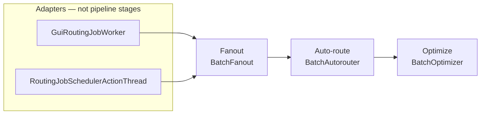

# Freerouting Code Structure Recommendations

**Document status:** Implementation plan for branch `refactor/restructure`  
**Date:** August 2026  
**Target:** Freerouting (Java 25 / Gradle 9)  
**Companions:** [`docs/architecture.md`](../architecture.md) (package map and accepted GUI/headless debt), [`docs/settings.md`](../settings.md), [`docs/gui/accessibility-contract.md`](../gui/accessibility-contract.md)

This is the work list for one branch and one final pull request. Routing, DRC, and scoring behavior stay frozen unless a phase explicitly changes a construction policy. Do not re-run the 2026 naming campaign. Do not split a class because it is large.

---

## How to use this plan

1. Implement phases **0–7** on `refactor/restructure` in order. Each phase has a gate; do not start the next until it is green.
2. The [Later work](#later-work-not-this-pr) section is not in this PR.
3. Do not put GUI types under `board` or `autoroute` (`ModuleBoundariesArchTest`).
4. Do not convert `RouterSettings` (or nested settings) to records. `SettingsMerger` requires nullable reference fields with no Java-default initializers.
5. Do not create phase-specific branches or interim PRs.

---

## What this PR actually changes

| In this PR | Not in this PR |
|---|---|
| Retire `BatchAutorouterV19` and the GUI algorithm combo | JPMS, `BoardLength`, geometry `*Math` splits |
| Shared 3-stage `RoutingPipeline` used by GUI and headless | `JobService` extraction (MCP already calls REST over HTTP) |
| Optimizer factory that **preserves** today’s GUI vs headless construction | Folding or deleting `BatchOptimizerMultiThreaded` (needs a separate DRC/parity audit) |
| Finish per-family angle-mode factories (no cross-package adapter bag) | Virtual threads, BVH rewrite, parallel sector routing |
| Subpackages `board.searchtree`, `board.optimize`, `autoroute.{pipeline,maze,expansion,drill,path}` | Full GUI presenter split of `GuiBoardManager` / `BoardFrame` |
| Seal `Point`, `TileShape`, `RegularTileShape`, and `NamedAlgorithm` | Sealing `Item`; streaming Specctra parser |

---

## Baseline (August 2026)

- `board`: 52 Java files. `autoroute`: 48 files, with events already in `autoroute.events`.
- `GuiBoardManager` lives in `gui.workspace`. `HeadlessBoardManager` lives in `management`.
- `NamedAlgorithm` is the strategy base for `BatchAutorouter` and `BatchOptimizer`. `BatchOptimizerMultiThreaded` extends `BatchOptimizer`; `BatchFanout` is a separate pipeline stage. `BatchAutorouterThread` is a **per-pass parallel worker**, not a job orchestrator.
- Angle-mode factories **already exist** for three of four families (`TraceTightener.getInstance`, `FoundConnectionLocator.getInstance`, `SearchTreeManager` autoroute-tree construction). The missing one is room-neighbour dispatch in `AutorouteEngine.calculateDoors`.
- One GUI/headless construction drift remains:
  GUI may instantiate `BatchOptimizerMultiThreaded` when `featureFlags.multiThreading` and `optimizer.maxThreads > 1`; headless always uses `new BatchOptimizer(job)` even though defaults set `maxThreads` to `CPU−1`.

The optimizer parity, determinism, logging, and benchmark work is intentionally deferred to the
separate [`optimizer_unification_plan.md`](optimizer_unification_plan.md). Do not turn MT on for
API/CLI jobs as part of this restructuring roadmap.

---

## Principles

**Prefer completing existing factories over new façades.** A single `AngleModeAdapters` type that returns search trees, tighteners, locators, and room neighbours would couple `board.searchtree`, `board.optimize`, and `autoroute.path` and fight the Phase 4 package split.

**Three routing stages, not four.** Fanout → auto-route → optimize. SES/job-artifact writes are `BoardUpdatedEvent` listeners in the adapters, not a pipeline stage. Timeout monitoring stays in the headless adapter; the pipeline only honors cooperative `StoppableThread` stop.

**Keep hot geometry types cohesive.** `IntOctagon`, `Simplex`, `IntBox`, `Polyline`, `TileShape` stay whole.

**CPU work stays on platform threads.** Virtual threads are for blocking I/O, not maze/optimizer pools.

**Package moves follow extracted types.** Move files after the pipeline and factories exist so imports move once.

**Do not invert `ShapeSearchTree.completeShape`.** That method already lives on the board search tree and talks to autoroute expansion rooms. Leave the `board` → `autoroute` dependency; Phase 4 must not try to “fix” it.

---

## Invariants (still binding)

Full glossary: [`docs/architecture.md`](../architecture.md). Settings ladder: [`docs/settings.md`](../settings.md).

### Names and families

| Keep | Do not |
|---|---|
| `BoardManager`, `HeadlessBoardManager`, `GuiBoardManager` (hosts the workspace) | Rename `GuiBoardManager` away, or put `Session` in GUI type names |
| `BatchAutorouter`, `BatchFanout`, `BatchOptimizer`, `NamedAlgorithm` | Rename `NamedAlgorithm` to `RoutingStage` (`core.RoutingStage` already exists) |
| `BasicBoard`, `Item`, `ShapeSearchTree`, `RouterSettings`, `DesignRulesChecker`, `AirLine`, `InteractiveState`, `core.library.Package` | Rename `BasicBoard` → `Board` as a naming exercise |
| `gui.workspace` | Rename that package `gui.editor` |
| Parser `NetClass` / `Unit` beside `rules.NetClass` / `board.Unit` | Merge parser types into domain types |

`BatchAutorouterV19` is retired in Phase 0.

**Session** = API/job container (`core.Session`, `/v1/sessions`); at most one is **primary**. **Workspace** = desktop editor bound to that session (`gui.workspace`).

### Wire and persistence

- Do not change HTTP paths, JSON `@SerializedName` keys, the `freerouting.json` `gui` block, `--router.*`, or `FREEROUTING__ROUTER__*` names.
- Keep the JSON key `algorithm`. Unknown values, including `freerouting-router-v19`, **warn and fall back** to `ALGORITHM_CURRENT` (headless already does this). Do not require old GUI combo entries to round-trip.
- Do not expand acronyms in identifiers: API, MCP, DSN, SES, DRC, EDT, SMD.
- `KiCadBoardJson` ≠ `KiCadDrcReport`. Keep every KiCad DRC JSON field name.
- Package moves **break `.frb` Java-serialization FQCNs**. That is accepted. Keep load/save code; no `resolveClass` shims.

### Settings and i18n

- GUI source priority **65**: sources 0–60 seed `WorkspaceSettings` at load; after a GUI edit, live settings win. API jobs do not register this source.
- `WorkspaceSettings` must remain a subclass of `GuiSettingsSource`.
- Keep field `GlobalSettings.guiSettings` and JSON `"gui"` (type `GuiApplicationSettings`).
- `new TextManager(this.getClass(), locale)` loads `class.getName()` bundles. Move `*.properties` with the class. `TextManager` stays in `util`; `Common_*.properties` stay at the `app.freerouting` resource root.

### ArchUnit

- Update FQCNs and `resideInAnyPackage` prefixes when packages move (`gui.workspace` workers, `analytics..` GUI isolation).
- `management.jobs`, `management.sessions`, `core.library` already match `management..` / `core..`.
- `SpecctraPackageArchTest` still forbids GUI/management imports from `io.specctra`.
- Do not add `analytics` to `PIPELINE_SUPPORT_PACKAGES`.
- Accepted debt stays as in `docs/architecture.md`: `ItemInfoPrinter` shape, incomplete-connections in `drc`, D26 `gui.workspace` → `gui.rendering`.

---

## Shared patterns (encode these)

### 1. Angle-mode: four factories, not one bag

| Family | 90° | 45° | Any-angle | Factory today |
|---|---|---|---|---|
| Autoroute search tree | `ShapeSearchTree90Degree` | `ShapeSearchTree45Degree` | `ShapeSearchTree` | `SearchTreeManager` (autoroute tree only; **default tree is always 45° bounding**) |
| Pull-tight | `TraceTightener90` | `TraceTightener45` | `TraceTightenerAnyAngle` | `TraceTightener.getInstance` |
| Path reconstruction | `FoundConnectionLocator45Degree` | `FoundConnectionLocator45Degree` | `FoundConnectionLocatorAnyAngle` | `FoundConnectionLocator.getInstance` |
| Room doors | `SortedOrthogonalRoomNeighbours` | `Sorted45DegreeRoomNeighbours` | `SortedRoomNeighbours` | **Inline `instanceof` in `AutorouteEngine.calculateDoors`** |

Phase 3 adds `SortedRoomNeighbours.complete(room, engine)` (or equivalent) next to the other `getInstance` methods and deletes the `instanceof ShapeSearchTree*` switch. Do not move tree/tightener/locator construction into a new type.

### 2. Routing pipeline



`RoutingPipeline` (working name; must not collide with `core.RoutingStage`) lives in `autoroute` (after Phase 4: `autoroute.pipeline`). It sequences the three stages, forwards existing `autoroute.events`, and stops when the thread is requested to stop.

Adapters own:

- GUI: EDT progress, overlay `draw(Graphics)`, incremental SES into the job (today’s `BoardUpdatedEvent` listener).
- Headless: timeout monitor, artifact write, `RoutingJobState`.

Rename `AutorouterAndRouteOptimizerThread` → `GuiRoutingJobWorker` and update `InteractiveActionThread.getAutorouterAndRouteOptimizerInstance`.

Do not touch `BatchAutorouterThread`.

### 3. Optimizer construction (preserve drift)

```java
// Shared factory — GUI path (feature flag + maxThreads)
static BatchOptimizer createForGui(RoutingJob job) { ... }

// Headless path stays single-threaded until the separate optimizer plan is complete
static BatchOptimizer createForHeadless(RoutingJob job) {
  return new BatchOptimizer(job);
}
```

The optimizer is enabled by default by `DefaultSettings`. If `optimizer.enabled` is false, the
pipeline skips the stage. GUI, CLI, and API jobs must resolve the same optimizer settings before
constructing the pipeline. Do not enable MT for API/CLI jobs in this restructuring roadmap; see the
[`optimizer_unification_plan.md`](optimizer_unification_plan.md).

### 4. Sealed types — closed trees only

```java
public sealed abstract class Point permits IntPoint, RationalPoint { ... }

public sealed abstract class TileShape permits RegularTileShape, Simplex { ... }

public sealed abstract class RegularTileShape permits IntBox, IntOctagon { ... }
```

`FloatPoint` is not a `Point`. `Circle` is a `ConvexShape`, not a `TileShape`. Do not seal `Item` in this PR.

`NamedAlgorithm`: permit `BatchAutorouter`, `BatchFanout`, `BatchOptimizer`. Because
`BatchOptimizerMultiThreaded` remains, `BatchOptimizer` must be **`non-sealed`**.

---

## Out of scope (harmful or already decided)

| Proposal | Why not |
|---|---|
| JPMS per domain package | Fat JAR + reflection; ArchUnit already enforces boundaries |
| `BoardLength` in hot paths | Boxing until Valhalla; convert only at I/O/settings edges |
| Records for `BoardStatistics`, `ViaRule`, `NetClass`, `ExpansionRoom` | Mutable / identity-bearing |
| `board.session` holding GUI/headless managers | ArchUnit violation |
| Split `IntOctagon` / `Simplex` / `Polyline` | Cohesion loss on inner-loop types |
| Split every file ≥600 LOC | Heat map, not a work list |
| `JobService` for MCP reuse | MCP tools already HTTP-call `/v1/*` via `mcp_server.target_api_base_url` |
| Cross-package `AngleModeAdapters` | Couples packages the split is trying to separate |
| Export as pipeline stage 4 | Event listener in adapters |
| Virtual threads for maze/optimizer | CPU-bound mutation of a shared board |
| `List.copyOf()` on `Polyline` corners in inner loops | Extra allocation |

---

## Target packages (after Phase 4)

`board`, `autoroute`, `geometry`, `rules`, `drc` remain GUI-free.

```text
board/
  Item, Pin, Via, Trace, areas, outline, BasicBoard, RoutingBoard,
  ForcedPadRouter, ForcedViaInserter, DrillItemMover, AngleRestriction, …
  searchtree/   ShapeSearchTree, ShapeSearchTree45Degree, ShapeSearchTree90Degree,
                SearchTreeManager, ShapeTraceEntries
  optimize/     TraceTightener*, TraceShover, ViaOptimizer
autoroute/
  events/       keep
  pipeline/     BatchAutorouter, BatchFanout, BatchOptimizer*, NamedAlgorithm,
                RoutingPipeline, BatchAutorouterThread
  maze/         MazeSearchEngine, AutorouteEngine, AutorouteControl, maze elements
  expansion/    *ExpansionRoom, *Door, Sorted*RoomNeighbours, ExpandableObject
  drill/        DrillPage, DrillPageArray, ExpansionDrill
  path/         FoundConnectionLocator*, FoundConnectionInserter, Connection
```

`HeadlessBoardManager` stays in `management`. `GuiBoardManager` stays in `gui.workspace`. Do not invent `app.freerouting.server`.

---

## Phases (this PR)

### Phase 0 — One autorouter

**Goal:** GUI matches headless: always `BatchAutorouter`.

**Tasks:**

- [x] Delete `BatchAutorouterV19` and all `instanceof` / constructor branches in `AutorouterAndRouteOptimizerThread`.
- [x] Remove the algorithm combo from `WindowAutorouteParameter` and i18n keys `algorithmCurrent` / `algorithmV19`.
- [x] Keep `RouterSettings.algorithm` and `ALGORITHM_V19` as a recognized **fallback token**: warn, then use `ALGORITHM_CURRENT` (same as headless today).
- [x] Keep `NamedAlgorithm`.
- [x] Update `RoutableLayersSafetyCheckTest`, `DialogInteractionHandlersTest`, rewrite TSV rows for the deleted class, and any fixture that constructed V19.

**Gate (passed):** `gradlew.bat test` (fast set). No v1.9 combo in the GUI. Loading a settings file with `"algorithm": "freerouting-router-v19"` still runs the current router.

### Phase 1 — Shared routing pipeline

**Goal:** One sequencer; adapters keep UI, timeout, and SES listeners.

**Tasks:**

- [x] Add `RoutingPipeline` that runs fanout → `BatchAutorouter` → optimizer (if enabled).
- [x] GUI optimizer via `createForGui`; headless via `createForHeadless` (always `BatchOptimizer`).
- [x] Rewrite `RoutingJobSchedulerActionThread` to call the pipeline (timeout monitor stays here).
- [x] Rename `AutorouterAndRouteOptimizerThread` → `GuiRoutingJobWorker`; update `InteractiveActionThread` factory and `draw` dispatch.
- [x] Do not touch `BatchAutorouterThread`.

**Gate (passed):** `Dac2020Bm01RoutingTest` and `RoutingPipelineComparisonTest`. Same fixture, GUI vs headless with **default-like optimizer threading** (headless ST): completion %, via count, and `DesignRulesChecker.getAllClearanceViolations()` did not regress.

### Phase 2 — Optimizer factory only

**Goal:** One construction site per adapter; **no** MT fold/delete.

**Tasks:**

- [x] Put `createForGui` / `createForHeadless` on `BatchOptimizer` (or a tiny package-private factory next to it).
- [x] Delete duplicated algorithm-id warning / listener-registration blocks in the GUI thread.
- [x] Document the headless-always-ST policy in `docs/settings.md` (`optimizer.maxThreads` applies to the GUI path and to `BatchAutorouterThread` pass parallelism, not to headless optimizer workers).

**Gate (passed):** Fast tests green. `BatchOptimizerFactoryTest` asserts `createForHeadless` returns
`BatchOptimizer` (not the MT subclass) even when `maxThreads > 1`.

### Phase 3 — Room-neighbour factory

**Goal:** `AutorouteEngine.calculateDoors` no longer switches on search-tree type.

**Tasks:**

- [x] Add a static factory on `SortedRoomNeighbours` that chooses orthogonal / 45° / any-angle
  `calculate`.
- [x] Leave `TraceTightener.getInstance`, `FoundConnectionLocator.getInstance`, and
  `SearchTreeManager` as they are.
- [x] Unit-test the mapping: `ShapeSearchTree90Degree` → orthogonal,
  `ShapeSearchTree45Degree` → 45°, else any-angle.

**Gate (passed):** `SortedRoomNeighboursFactoryTest` covers all three search-tree mappings;
`AutorouteEngine.calculateDoors` delegates through the factory. No maze heuristic edits.

### Phase 4 — Package splits

**Goal:** Subpackages in the sketch. Logic-free moves.

**Tasks:**

- [x] Move search-tree types to `board.searchtree`, tighteners/shove/via optimizer to `board.optimize`.
- [x] Split `autoroute` into `pipeline`, `maze`, `expansion`, `drill`, `path`; leave `events`.
- [x] Check matching `*.properties`; no class-local bundles exist for the relocated types.
- [x] Update ArchUnit strings and the `docs/architecture.md` glossary / mermaid. Accept `.frb` FQCN breakage.

**Gate (passed):** `ModuleBoundariesArchTest` and `SpecctraPackageArchTest` green;
`spotlessCheck` + Checkstyle; `python scripts/i18n/extract-context.py --check`. `git diff` was
moves plus import/FQCN updates only.

### Phase 5 — Sealed geometry (and NamedAlgorithm if cheap)

**Goal:** Exhaustive switches on closed geometry trees.

**Tasks:**

- [x] Seal `Point`, `TileShape`, `RegularTileShape` with the permits lists above.
- [x] Audit switches on those types. No geometry-type switches required conversion; the remaining
  `default` branches are intentional index/range guards.
- [x] Seal `NamedAlgorithm` with `BatchOptimizer` **non-sealed**.
- [x] Do not seal `Item`.

**Gate (passed):** `compileJava`, `compileTestJava`, and focused sealing tests passed. No new
incomplete switches.

### Phase 6 — Responsibility-oriented file splits

**Goal:** Reduce the highest-risk multi-responsibility classes without splitting cohesive hot
geometry types or changing public behavior.

**Current increment (in progress):** `GuiBoardSessionState` now owns the GUI batch-routing options
 behind the unchanged `GuiBoardManager` façade, `BoardWindowLayout` owns permanent subwindow
 lifecycle and placement behind the unchanged `BoardFrame` façade, and `GuiBoardPersistence` owns
 serialization/export delegation. Interaction, load, and format-specific export coordination remain
 for subsequent increments in group 1.

**Task list:**

- [x] Extract `GuiBoardSessionState` and preserve the `GuiBoardManager` batch-option façade,
  including the multi-threading fallback and its logging behavior.
- [ ] Add characterization coverage for the remaining `GuiBoardManager` interaction and
  persistence façade methods before moving implementations.
- [x] Extract `BoardWindowLayout` for permanent-subwindow allocation, positioning, refresh,
  repaint, disposal, and viewport-independent window lifecycle.
- [x] Extract `GuiBoardPersistence` for binary serialization and direct board/session exports while
  preserving serialized field order and the existing `GuiBoardManager` façade.
- [ ] Extract `GuiBoardInteractionController` only after its event/state dependencies are mapped;
  keep concrete interactive states in `gui.interactive`.
- [ ] Extract `BoardLoadCoordinator` and `BoardExportActions` only after stale-load, failure,
  tutorial-restoration, and export characterization tests exist.
- [ ] Run package-boundary tests, fast routing tests, full DRC, Spotless, Checkstyle, and i18n
  checks after each collaborator extraction.
- [x] Defer `BatchAutorouter.java` to Phase 7 and defer `SpecctraDsnStreamReader.java` to a
  separate parser-boundary investigation.

The line counts below are from the August 17, 2026 scan of 645 tracked Java files (144,101 total
lines). Size is a prioritization signal; each extraction must follow a stable responsibility seam
and preserve the existing public façade where callers depend on it.

**Schedule and proposed names:**

1. **GUI boundary first**
   - `GuiBoardManager.java` (3,312 lines) → `GuiBoardSessionState`,
     `GuiBoardInteractionController`, and `GuiBoardPersistence`.
   - `BoardFrame.java` (1,856 lines) → `BoardLoadCoordinator`, `BoardWindowLayout`, and
     `BoardExportActions`.
   - Keep `GuiBoardManager` and `BoardFrame` as compatibility façades while collaborators are
     introduced behind package-private contracts.
2. **Routing orchestration second**
   - `BatchAutorouter.java` (2,158 lines) → Phase 7 pipeline investigation; the first increment
     extracts connection execution, airline calculations, runtime metrics, and stagnation reports.
   - `MazeSearchEngine.java` (1,948 lines) → `MazeExpansionEngine`, `MazeRipupResolver`, and
     `MazeFanoutDiagnostics`.
   - Preserve maze ordering, ripup costs, plane-net behavior, and diagnostic payloads before and
     after each extraction.
3. **Board services third**
   - `BasicBoard.java` (1,787 lines) → `BoardItemRepository`, `BoardConnectivityQueries`, and
     `BoardSnapshotManager`.
   - `RoutingBoard.java` (1,648 lines) → `RoutingBoardOperations`, `RoutingBoardSearchFacade`,
     and `RoutingBoardUndoFacade`.
   - Keep serialization, search-tree ownership, undo/redo, and observer behavior stable.
4. **API and parser seams fourth**
   - `JobControllerV1.java` (1,421 lines) → `JobInputResource`, `JobOutputResource`, and
     `JobProgressResource`, preserving all REST paths and analytics calls.
   - **Deferred for now:** `SpecctraDsnStreamReader.java` (1,862 lines). Do not split the
     generated scanner until a separate parser-boundary investigation justifies it.
5. **Geometry and trace seams last**
   - `PolylineTrace.java` (1,431 lines) → `PolylineTraceGeometry`,
     `PolylineTraceNormalization`, and `PolylineTraceSearchTreeAdapter`.
   - Defer `IntOctagon.java` (1,722 lines) and `Simplex.java` (1,147 lines) until focused
     geometry tests and allocation profiles justify a split; do not split them by line count alone.

**Per-extraction gate:** characterization tests first; package-boundary tests; fast routing tests
for routing changes; full DRC via `DesignRulesChecker.getAllClearanceViolations()`; no completion,
clearance, serialization, or performance regression. Complete one numbered group before starting
the next. The generated Specctra parser and hot geometry candidates are explicitly lower priority
than GUI, routing orchestration, and board-service seams.

### Phase 7 — Autoroute pipeline package investigation

**Goal:** Investigate `app.freerouting.autoroute.pipeline` and restructure its classes, splitting
them where responsibility seams are stable and renaming them so class and package names express the
logical connections between pipeline stages, workers, algorithm metadata, and execution adapters.

**Scope:**

- Inventory every class in `autoroute.pipeline` and map its callers, lifecycle, event flow, thread
  ownership, and relationship to `RoutingPipeline`.
- Separate stage orchestration (`fanout → autoroute → optimize`), algorithm implementations,
  per-pass workers, task state/metadata, and GUI/headless execution adapters where the dependency
  graph supports it.
- `BatchAutorouter.java` is explicitly in scope for this phase: it may be changed, moved, split,
  and renamed when the dependency map identifies a clearer ownership boundary.
- Evaluate focused splits for `BatchAutorouter`, `BatchOptimizer`, `BatchOptimizerMultiThreaded`,
  `BatchFanout`, `BatchAutorouterThread`, `OptimizeRouteTask`, and `RoutingPipeline`; do not split
  merely to reduce line count.
- Propose names that describe behavior and ownership, such as stage/coordinator, optimizer,
  worker, task, or pipeline-contract names. Confirm each rename against public callers,
  serialization/FQCN compatibility, algorithm IDs, and analytics/logging payloads before applying it.
- Prefer package names that make the direction of dependencies visible, for example distinct
  stage/orchestration and execution-adapter packages only when the resulting boundaries are
  simpler than the current single package.
- The provisional `AutoroutePassRunner` / `AutorouteBatchLoop` names are candidates only; replace
  them if the Phase 7 dependency analysis produces more accurate names.

**Current increment (in progress):**

The first implementation increment keeps `BatchAutorouter` as the public `NamedAlgorithm` façade
and extracts the pure airline/distance calculations, runtime resource sampling, unrouted
connection reporting, and connection execution behind package-private pipeline collaborators.
The connection collaborator owns the board-mutating route, necked retry, and strict-DRC recovery
path; pass orchestration remains in the façade until its event and history dependencies are mapped.

**Task list:**

- [x] Inventory all classes in `autoroute.pipeline`, including callers, event listeners, thread
  ownership, algorithm metadata, and `RoutingPipeline` stage order.
- [x] Confirm the first naming proposal: `AutorouteAirlineCalculator`,
  `AutorouteRuntimeMetrics`, and `AutorouteUnroutedReport`; retain `BatchAutorouter` as the
  compatibility façade.
- [x] Extract pure airline/distance calculations without changing the current `FloatLine` or
  `FloatPoint` results.
- [x] Extract CPU, allocated-memory, and heap sampling while preserving the custom-JRE fallback
  behavior.
- [x] Extract the unrouted-connection report formatter without changing log text or ordering.
- [x] Extract connection execution and strict-DRC retry behavior into `AutorouteConnectionRouter`;
  retain the existing strict-DRC routing fixture as characterization coverage for rejection
  handling and board replacement.
- [ ] Extract single-thread and multi-thread pass execution into `AutoroutePassRunner` while
  preserving item order, progress events, counters, and ripup costs.
- [ ] Extract the fanout/autoroute/stagnation lifecycle into `AutorouteBatchLoop` while preserving
  stop propagation, board-history restoration, and final-best-board selection.
- [ ] Re-evaluate `BatchOptimizer`, `BatchOptimizerMultiThreaded`, `BatchFanout`,
  `BatchAutorouterThread`, `OptimizeRouteTask`, and `RoutingPipeline` after the router façade is
  reduced; do not rename public algorithm IDs or serialized compatibility surfaces.
- [ ] Run pipeline characterization tests, package-boundary tests, fast routing tests, full DRC,
  Spotless, Checkstyle, i18n, and diff gates before marking Phase 7 complete.

**Gate:** A dependency map and naming proposal are reviewed against the pipeline tests and
architecture rules before code moves. Any implemented split must preserve stage order, optimizer
construction policy, stop propagation, event delivery, algorithm IDs, and routing/DRC behavior.

---

## Later work (not this PR)

### Follow-up A — Optimizer unification

The deterministic multi-threaded optimizer migration, cross-mode parity work, logging compatibility,
and before/after benchmarks are specified separately in
[`optimizer_unification_plan.md`](optimizer_unification_plan.md).

### Follow-up B — API/I/O thinning

Thin `JobControllerV1` only if an **in-process** second caller appears. Optional tokenizer vs scope split in `SpecctraDsnStreamReader` without a streaming rewrite. Virtual threads only for analytics HTTP.

### Follow-up C — GUI presenters

Extract menu/toolbar builders and parameter-dialog presenters. Bind through `WorkspaceSettings` getters/setters. Do not regress D26 or `gui.workspace` ↛ `gui.interactive`. Leave `.frb` I/O on `GuiBoardManager` until a second caller needs it. Accessibility: [`docs/gui/accessibility-contract.md`](../gui/accessibility-contract.md).

### Follow-up D — Allocation research

Profile `ShapeSearchTree` / expansion-room churn on a >500-net board. Record **peak heap**, not cumulative allocation. Recycle leaves or stack-allocate hot predicates only with a profiler note. No default BVH or sector-parallel rewrite.

---

## Heat map (current scan and follow-up schedule)

August 17, 2026 scan of `src/main/java` and `src/test/java`: 673 Java files, 145,821 lines.
The visual heat map and split schedule accompany this shortlist; this section records the
actionable candidates that belong in the repository plan. The current column includes the Phase 6
extractions and the first Phase 7 `BatchAutorouter` increment, while intentionally deferred files
remain unchanged.

| Area | Files | This PR |
|---|---|---|
| GUI / workspace / rendering | 14 | Incremental façade split; full presenter split remains |
| Autoroute | 10 | Pipeline + neighbour factory + package split; Phase 7 `BatchAutorouter` increment in progress |
| Board / trees / tighteners | 15 | Package split only |
| Geometry | 8 | Phase 5 sealed; do not split |
| I/O parsers | 7 | `SpecctraDsnStreamReader` deferred |
| API / settings / DRC / analytics | 8 | Settings documentation in Phase 2 only |

| File | Baseline lines | Current lines | Next recommended split/restructuring |
|---|---:|---:|---|
| `GuiBoardManager` | 3312 | 3091 | Add `GuiBoardPresentationController`, `GuiBoardItemActions`, and `GuiBoardRoutingSettings`; retain façade |
| `BatchAutorouter` | 2158 | 1608 | Complete Phase 7 with `AutoroutePassRunner` and `AutorouteBatchLoop` |
| `MazeSearchEngine` | 1948 | 1258 | Keep current expansion/ripup/diagnostic seams; verify with routing parity |
| `SpecctraDsnStreamReader` | 1862 | 1862 | Defer generated parser work; design tokenizer/scope boundary first |
| `BoardFrame` | 1856 | 1493 | Add menu/toolbar actions and parameter-dialog presenter seams |
| `GuiDefaultsScanner` | 1799 | 1799 | Treat as generated code; regenerate rather than manually split |
| `BasicBoard` | 1787 | 1470 | Defer further mutation/state splits until board-service contracts settle |
| `IntOctagon` | 1722 | 1722 | Defer until focused geometry tests and allocation profiling |
| `RoutingBoard` | 1648 | 1428 | Consider mutation coordinator only after façade characterization |
| `Network` | 1464 | 1464 | Design parser/domain boundary with `Structure` and Specctra reader together |
| `PolylineTrace` | 1431 | 1304 | Defer hot-path changes; profile before extracting more mutation seams |
| `JobControllerV1` | 1421 | 619 | Keep thin resource façade; characterize any in-process second caller |
| `WindowAutorouteParameter` | 1406 | 1406 | Extract dialog state/presenter, keeping `WorkspaceSettings` as source of truth |
| `Freerouting` | 1358 | 1358 | Split startup bootstrap from server lifecycle and runtime diagnostics |
| `GuiDefaultsFile` | 1352 | 1352 | Defer until a second caller justifies separating format parsing |
| `Structure` | 1351 | 1351 | Pair with the parser/domain boundary investigation |
| `Item` | 1279 | 1279 | Keep cohesive; identity and serialization make this high risk |
| `ShapeSearchTree` | 1160 | 1160 | Profile allocation churn before changing search-tree ownership |
| `Simplex` | 1147 | 1147 | Defer pending geometry allocation profile |
| `RouterSettings` | 958 | 958 | Keep cohesive; preserve nullable merger fields and serialization keys |
| `DesignRulesChecker` | 821 | 821 | Keep public `getAllClearanceViolations()` entry point stable |

**Recommended execution order:**

1. Finish Phase 7 with `AutoroutePassRunner` for single/multi-thread pass execution, then
   `AutorouteBatchLoop` for fanout, stagnation, board-history restoration, and final-board selection.
2. Add the GUI presenter/action seams around `GuiBoardManager`, `BoardFrame`, and
   `WindowAutorouteParameter`, preserving EDT behavior and the existing workspace façade.
3. Design the Specctra parser/domain boundary before touching `SpecctraDsnStreamReader`, `Network`, or
   `Structure`; do not mechanically split generated scanner code.
4. Revisit `BasicBoard`, `RoutingBoard`, and `PolylineTrace` only after characterization coverage
   proves ownership boundaries and full DRC/routing parity.
5. Profile `ShapeSearchTree`, `IntOctagon`, and `Simplex` before any allocation-oriented changes.

---

## Quality gates (every phase)

From the repo root on Windows:

```text
gradlew.bat spotlessCheck checkstyleMain checkstyleTest checkstyleRewriteRecipes
```

When Java or translations change:

```text
python scripts/i18n/extract-context.py --check
```

Routing-touching phases: `Dac2020Bm01RoutingTest`, full DRC via `DesignRulesChecker.getAllClearanceViolations()`, no `src_v19/` edits, no `spotlessApply` sweep. Inspect `git diff --stat` and `git diff --check`. Never auto-stage.

---

*Update this file when a phase gate changes a decision. Architecture glossary updates belong in the same Phase 4 commit as the package moves.*
