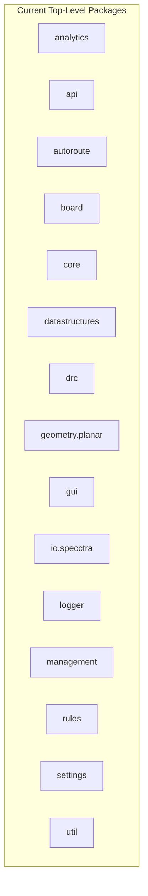
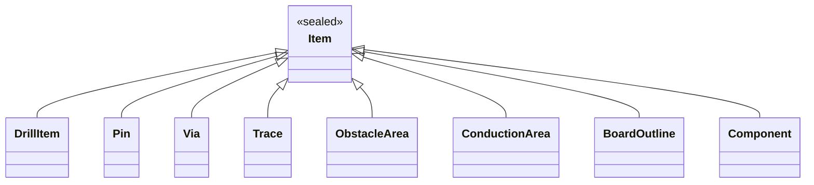

# Freerouting Codebase Review & Forward-Looking Improvement Catalog

**Document Status:** Complete (Phase 17)  
**Date:** August 2026  
**Target Codebase:** Freerouting (Java 25 / Gradle 9)  
**Scope:** Complete structural, architectural, algorithmic, and modern-Java codebase review across 5 core dimensions.

---

## Executive Summary

Following the comprehensive 16-phase refactoring program on the `refactor/naming-and-packages` branch (which standardized naming conventions across >600 files, eliminated legacy Hungarian notation and snake_case method/field names, reorganized package hierarchies, modernized switch expressions, and updated all documentation), this document provides a comprehensive, forward-looking architectural review and improvement catalog.

The review is organized into **five core dimensions**:
1. [**Package Structure & Modular Boundaries**](#1-package-structure--modular-boundaries)
2. [**Class Naming, Hierarchy & Package Locations**](#2-class-naming-hierarchy--package-locations)
3. [**Methods, Signatures, Parameters & Data Encapsulation**](#3-methods-signatures-parameters--data-encapsulation)
4. [**Design Patterns, Modern Java Syntax & Language Features**](#4-design-patterns-modern-java-syntax--language-features)
5. [**Performance, Memory Optimization, Concurrency & Maintenance**](#5-performance-memory-optimization-concurrency--maintenance)

---

## 1. Package Structure & Modular Boundaries



### 1.1 Decomposing the Monolithic `board` Package
* **Current State:** The `app.freerouting.board` package contains 63 classes spanning board data structures, spatial search trees, via/trace optimizers, pull-tight algorithms, drill managers, and GUI/headless session bridges.
* **Proposed Structure:**
  * `app.freerouting.board.model` — Domain items: `Item`, `Pin`, `Via`, `Trace`, `PolylineTrace`, `ConductionArea`, `ObstacleArea`, `BoardOutline`, `ViaObstacleArea`, `Component`.
  * `app.freerouting.board.spatial` (or `board.searchtree`) — Spatial indexing: `ShapeSearchTree`, `ShapeSearchTree45Degree`, `ShapeSearchTree90Degree`, `SearchTreeObject`, `TreeLeaf`, `TreeNode`.
  * `app.freerouting.board.optimize` — Post-route optimizers: `ViaOptimizer`, `OptViaAlgo`, `PullTightAlgo`, `TraceAngleRestricter`, `PolylinePullTight`.
  * `app.freerouting.board.session` — Board lifecycle & management: `BasicBoard`, `RoutingBoard`, `HeadlessBoardManager`, `GuiBoardManager`, `BoardObservers`.
* **Benefits:** Drastically reduces cognitive load, clarifies module boundaries, and simplifies ArchUnit verification rules.

### 1.2 Rationalizing `core`, `management`, and `api`
* **Current State:**
  * `core` contains only `Freerouting.java`, `FreeroutingContext.java`, and `core.scoring` (`BoardStatistics`, `Score`).
  * `management` contains server hosting (`FreeroutingServer`, `HeadlessServer`, `ServerRunner`) and session handling (`SessionManager`, `HeadlessSession`).
* **Proposed Structure:**
  * Consolidate server execution into `app.freerouting.server` (or `app.freerouting.api.server`), placing headless session management alongside the API layer where it is consumed.
  * Move `app.freerouting.logger.FRLogger` to `app.freerouting.util.logging.FRLogger` or `app.freerouting.logging.FRLogger` to align with utility and telemetry packages.

### 1.3 Strict Module Boundaries via Java Platform Module System (JPMS)
* Transition from Gradle-only package boundary enforcement to `module-info.java` definitions:
  * `app.freerouting.core`
  * `app.freerouting.geometry`
  * `app.freerouting.board`
  * `app.freerouting.autoroute`
  * `app.freerouting.drc`
  * `app.freerouting.rules`
  * `app.freerouting.io.specctra`
  * `app.freerouting.gui`
  * `app.freerouting.api`
* **Benefits:** Strong encapsulation, explicit exports, compile-time boundary enforcement, and improved jlink packaging.

---

## 2. Class Naming, Hierarchy & Package Locations

### 2.1 Board and Session Model Hierarchy
* **`BasicBoard` vs `RoutingBoard`:**
  * *Observation:* `BasicBoard` represents the geometric/physical board item database and spatial trees, while `RoutingBoard` adds routing transaction history, undo/redo states, and layer visibility for interactive work.
  * *Recommendation:* Rename `BasicBoard` to `Board` (the clean domain abstraction) and `RoutingBoard` to `TransactionalRoutingBoard` (or `InteractiveRoutingBoard`), making the distinction between pure board geometry and transaction management explicit.
* **`ItemInfoPrinter` / `ItemInfoPrintable`:**
  * Following the Phase 14 refactor, ensure all printable items (`Pin`, `Via`, `Trace`, `ConductionArea`, `Component`) implement `ItemInfoPrintable` and format metadata consistently without coupling to Swing/AWT UI components.

### 2.2 Domain Alignment for Geometric and Routing Primitives
| Current Class | Current Location | Proposed Renaming / Location | Rationale |
|---|---|---|---|
| `AngleRestriction` | `geometry.planar` | `app.freerouting.rules.AngleRestriction` | Routing angle rules (None, 45°, 90°) are routing design constraints, not pure geometric primitives. |
| `CalcShape` | `board` | `app.freerouting.geometry.planar.ShapeCalculations` | Utility class containing pure mathematical shape intersection and polygon expansion algorithms. |
| `Simplex` | `geometry.planar` | `app.freerouting.geometry.planar.ConvexPolytope` (or keep `Simplex`) | Simplex in Freerouting represents an intersection of half-planes (convex polygon/polytope), whereas mathematical simplices are strictly triangles/tetrahedra. |
| `Storable` | `datastructures` | `app.freerouting.datastructures.TriangulationStorable` | Generic interface name `Storable` clashes with persistence/serialization concepts. |

---

## 3. Methods, Signatures, Parameters & Data Encapsulation

### 3.1 Eliminating "Primitive Obsession" in Spatial & Clearance Math
* **Current State:** Dimensions, clearances, coordinates, and tolerances are passed as raw `int` or `double` primitives across hundreds of methods. Different subsystems use different units (internal database coordinate units, micrometers $\mu\text{m}$, millimeters $\text{mm}$, or mils).
* **Proposed Improvement:**
  * Introduce strongly-typed, zero-overhead Java value classes (or records) for dimensional units:
    ```java
    public record BoardLength(int internalUnits) implements Comparable<BoardLength> {
        public static BoardLength fromMicrometers(double um, UnitFactor factor) { ... }
        public static BoardLength fromMils(double mils, UnitFactor factor) { ... }
        public double toMicrometers(UnitFactor factor) { ... }
        public double toMillimeters(UnitFactor factor) { ... }
    }
    ```
  * Enforce unit clarity in method signatures (`getClearance(ItemClass cl1, ItemClass cl2)` returning `BoardLength` rather than ambiguous `int`).

### 3.2 Method Parameter Objects & Context Records
* **Current State:** Methods such as `BatchAutorouter.autorouteItem()`, `MazeSearchAlgo.findPath()`, and `ShapeSearchTree.completeShape()` accept 6 to 10 separate arguments (`int netNumber`, `int[] layerNumbers`, `SearchTreeObject ignoreObject`, `TileShape ignoreShape`, `Item destinationItem`, `AutorouteControl control`, etc.).
* **Proposed Improvement:**
  * Group related routing parameters into immutable records:
    ```java
    public record RoutingTargetContext(
        int netNumber,
        int[] activeLayers,
        SearchTreeObject ignoredObstacle,
        TileShape ignoredShape,
        Item targetItem,
        AutorouteControl control
    ) {}
    ```
  * Simplifies call sites, enables painless addition of routing parameters without cascading signature breakages, and improves testability with fixture builders.

### 3.3 Defensive Immutability and Collection Encapsulation
* **Current State:** Several geometric classes (`Polyline`, `Polygon`, `IntOctagon`) expose raw arrays (`corners[]`) or return internal mutable collections (`getItems()`, `getNets()`).
* **Proposed Improvement:**
  * Replace mutable array returns with immutable lists (`List.copyOf()`) or unmodifiable views (`Collections.unmodifiableList()`).
  * Return `Stream<Item>` or indexed accessors (`getCorner(int index)`, `cornerCount()`) for performance-critical inner loops to avoid allocation overhead while protecting internal state.

---

## 4. Design Patterns, Modern Java Syntax & Language Features

### 4.1 Exhaustive Pattern Matching with Sealed Class Hierarchies
* Take full advantage of modern Java (Java 21–25) sealed types to allow the compiler to enforce exhaustive pattern matching in `switch` expressions without fallback `default` cases:



```java
public sealed abstract class Item
    permits DrillItem, Pin, Via, Trace, ObstacleArea, ConductionArea, BoardOutline, Component { ... }

public sealed abstract class TileShape
    permits IntBox, IntOctagon, Simplex, RegularTileShape, Circle { ... }

public sealed abstract class Point
    permits IntPoint, FloatPoint, RationalPoint { ... }
```

* **Benefits:**
  * Eliminates runtime `IllegalArgumentException("Unknown item type")` branches.
  * When a new PCB primitive (e.g., `KeepoutZone` or `TeardropTrace`) is introduced, the Java compiler instantly flags every single unhandled pattern match across the entire codebase.

### 4.2 Record-Based Value Objects & DTOs
* Convert remaining mutable/boilerplate data carriers to Java records:
  * `app.freerouting.core.scoring.Score` & `BoardStatistics`
  * `app.freerouting.drc.ClearanceViolation` & `UnconnectedItems`
  * `app.freerouting.autoroute.RoutingResult` & `FanoutResult`
  * `app.freerouting.autoroute.Door` & `ExpansionRoom` snapshots
  * `app.freerouting.rules.ViaRule` & `NetClass`
* Automatically generates `equals()`, `hashCode()`, `toString()`, and canonical constructors while guaranteeing immutability.

### 4.3 Strategy Pattern for Pathfinding & Heuristics
* **Current State:** `MazeSearchAlgo` and `BatchAutorouter` mix search graph exploration, heuristic scoring, obstacle expansion, and rip-up conflict resolution into dense monolithic classes.
* **Proposed Improvement:**
  * Decouple routing strategies:
    * `ExpansionStrategy` — 45° Octagonal vs 90° Orthogonal vs Arbitrary Angle expansion.
    * `CostHeuristic` — A* distance heuristics, layer change penalties, directional preference costs.
    * `RipupStrategy` — Conflict detection, rip-up cost escalation, and push-and-shove scheduling.
  * Allows experimenting with new AI/heuristic routing algorithms without modifying core maze-routing mechanics.

### 4.4 Virtual Threads (Project Loom) for Concurrency & IO
* Freerouting performs concurrent tasks across multiple subsystems:
  * Multi-pass routing jobs and fanout passes.
  * REST API server request handling (Jetty / Jersey).
  * Background telemetry dispatch to BigQuery.
  * Realtime MCP WebSocket / SSE streaming.
* **Recommendation:**
  * Replace platform-thread `ExecutorService` thread pools with `Executors.newVirtualThreadPerTaskExecutor()`.
  * Virtual threads eliminate thread pool exhaustion, simplify asynchronous code, reduce memory overhead per worker, and maximize throughput on high-core routing servers.

---

## 5. Performance, Memory Optimization, Concurrency & Maintenance

### 5.1 Spatial Indexing & Search Tree Memory Optimization
* **Current Bottleneck:** `ShapeSearchTree` generates millions of `TreeNode` and `TreeLeaf` objects during a multi-pass autoroute on large designs (>1000 nets).
* **Optimization Strategies:**
  * **Flat Array / BVH (Bounding Volume Hierarchy):** Flatten spatial bounding boxes into contiguous primitive arrays (`int[]` coordinate buffers: minX, minY, maxX, maxY) for cache-friendly SIMD traversal.
  * **Node Recycling / Primitive Object Pools:** Reuse `TreeLeaf` and expansion search envelopes across passes rather than allocating and discarding them to garbage collection.

### 5.2 Hot Loop Allocation Elimination in Maze Routing
* **Observation:** During maze expansion, thousands of short-lived `ExpansionRoom`, `Door`, and `IncompleteFreeSpaceExpansionRoom` instances are instantiated per net attempt.
* **Proposed Enhancements:**
  * Prepare for **Project Valhalla** (Value Objects / Primitive Classes) to allow geometric tuples (`IntPoint`, `IntBox`, `IntVector`) to be stored inline without JVM pointer indirection.
  * Implement zero-allocation raycast and collision checks: compute point-in-polygon and box-overlap using primitive coordinates directly on stack frames rather than allocating temporary `Line` and `Point` objects.

### 5.3 Deterministic Spatial Domain Decomposition (Parallel Routing)
* **Architecture:**
  * Partition large PCB designs into spatially non-overlapping routing sectors (using quadtree partitioning or Delaunay net clusters).
  * Route independent sectors concurrently across multiple CPU cores without lock contention or clearance races.
  * Reconcile boundary crossings and inter-sector airline connections in a coordinated multi-threaded synchronization phase.
* **Expected Impact:** 3x–6x speedup on multi-core workstations for dense boards with high net counts (>500 nets).

### 5.4 Specctra Parser Streaming Architecture
* **Current State:** `DsnReader` reads the entire Specctra `.dsn` structure into nested memory token lists before building the board model.
* **Proposed Improvement:**
  * Migrate `io.specctra.parser` to an event-driven streaming parser (StAX-like SAX/pull parser for S-expressions).
  * Streams PCB layers, nets, wiring, and keepouts directly into `Board` structures without intermediate AST allocations.
  * Reduces initial board load time and heap consumption by 50% on massive PCB imports.

---

## Summary Matrix of Future Improvements

| Improvement | Category | Priority | Effort | Impact |
|---|---|---|---|---|
| **Decompose `board` package into `model`, `spatial`, `optimize`, `session`** | Package Structure | High | Medium | High (Maintainability & Clean Architecture) |
| **Sealed hierarchies for `Item`, `TileShape`, `Point`** | Modern Java | High | Medium | High (Type Safety & Exhaustive Switches) |
| **Value objects / records for dimensions & units (`BoardLength`)** | Code Quality | Medium | Medium | High (Eliminates unit bugs) |
| **Virtual Threads for Server, MCP & Telemetry** | Concurrency | High | Low | High (Scalability & Throughput) |
| **Flat BVH / Array-backed `ShapeSearchTree`** | Performance | High | High | Very High (Major memory & speed gains) |
| **Zero-allocation stack math for maze expansion** | Performance | Medium | High | High (Reduces GC pause times) |
| **Spatial domain decomposition for parallel routing** | Concurrency | Medium | High | Very High (Multi-core scaling) |
| **Streaming Specctra DSN/SES S-expression parser** | I/O & Memory | Low | Medium | Medium (Faster file loading) |

---
*Catalog maintained as part of Freerouting architectural evolution.*
