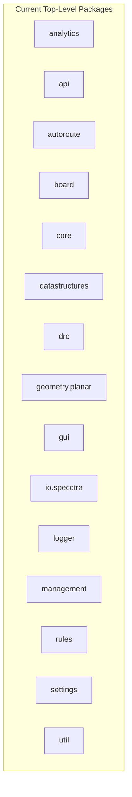
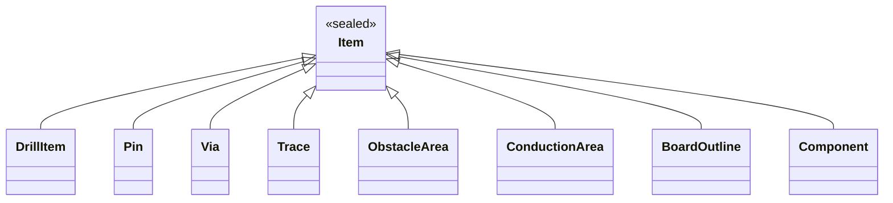
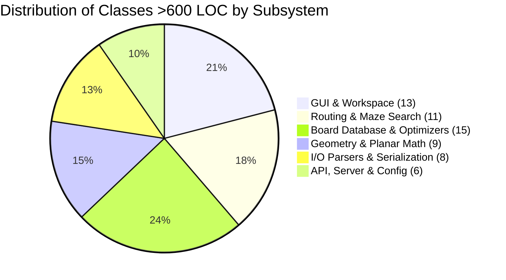
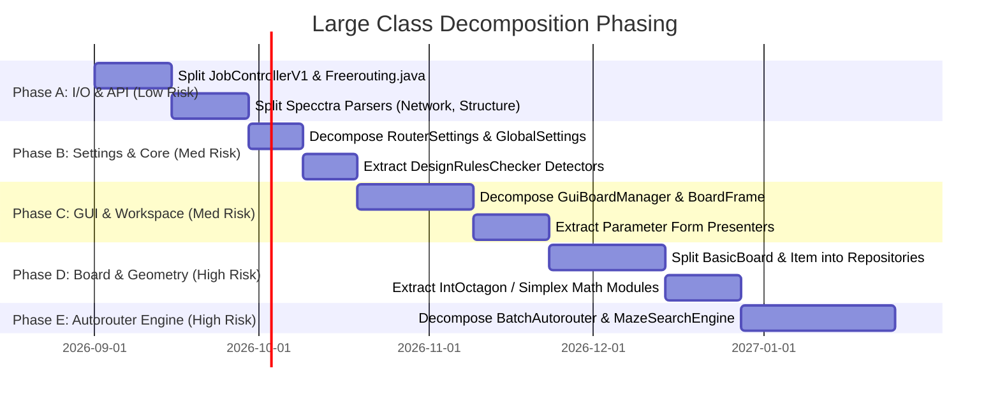

# Freerouting Codebase Review & Forward-Looking Improvement Catalog

**Document Status:** Complete (Phase 17)  
**Date:** August 2026  
**Target Codebase:** Freerouting (Java 25 / Gradle 9)  
**Scope:** Complete structural, architectural, algorithmic, and modern-Java codebase review across 7 core dimensions.

---

## Executive Summary

Following the comprehensive 16-phase refactoring program on the `refactor/naming-and-packages` branch (which standardized naming conventions across >600 files, eliminated legacy Hungarian notation and snake_case method/field names, reorganized package hierarchies, modernized switch expressions, and updated all documentation), this document provides a comprehensive, forward-looking architectural review and improvement catalog.

The review is organized into **seven core dimensions**:
1. [**Package Structure & Modular Boundaries**](#1-package-structure--modular-boundaries)
2. [**Class Naming, Hierarchy & Package Locations**](#2-class-naming-hierarchy--package-locations)
3. [**Methods, Signatures, Parameters & Data Encapsulation**](#3-methods-signatures-parameters--data-encapsulation)
4. [**Design Patterns, Modern Java Syntax & Language Features**](#4-design-patterns-modern-java-syntax--language-features)
5. [**Performance, Memory Optimization, Concurrency & Maintenance**](#5-performance-memory-optimization-concurrency--maintenance)
6. [**Large Class (>600 LOC) Decomposition Analysis & Blueprints**](#6-large-class-600-loc-decomposition-analysis--blueprints)
7. [**Architectural Decisions & Targeted Consolidations**](#7-architectural-decisions--targeted-consolidations)

---

## 1. Package Structure & Modular Boundaries



### 1.1 Decomposing the Monolithic `board` Package
* **Current State:** The `app.freerouting.board` package contains 63 classes spanning board data structures, spatial search trees, via/trace optimizers, pull-tight algorithms, drill managers, and GUI/headless session bridges.
* **Proposed Structure:**
  * `app.freerouting.board.model` — Domain items: `Item`, `Pin`, `Via`, `Trace`, `PolylineTrace`, `ConductionArea`, `ObstacleArea`, `BoardOutline`, `ViaObstacleArea`, `Component`.
  * `app.freerouting.board.spatial` (or `board.searchtree`) — Spatial indexing: `ShapeSearchTree`, `ShapeSearchTree45Degree`, `ShapeSearchTree90Degree`, `SearchTreeObject`, `TreeLeaf`, `TreeNode`.
  * `app.freerouting.board.optimize` — Post-route optimizers: `ViaOptimizer`, `OptViaAlgo`, `PullTightAlgo`, `TraceAngleRestricter`, `PolylinePullTight`.
  * `app.freerouting.board.session` — Board lifecycle & management: `BasicBoard`, `RoutingBoard`, `HeadlessBoardManager`, `GuiBoardManager`, `BoardObservers`.
* **Benefits:** Drastically reduces cognitive load, clarifies module boundaries, and simplifies ArchUnit verification rules.

### 1.2 Reorganizing the `autoroute` Subpackage Architecture
* **Current State:** The `app.freerouting.autoroute` package contains 48 classes in a single flat directory, mixing batch pipeline schedulers, A* maze search algorithms, expansion room geometric models, inter-layer drill pages, backtrace connection locators, and diagnostic profilers.
* **Proposed Structure:**
  * `app.freerouting.autoroute.pipeline` — High-level routing orchestrators & stages: `BatchAutorouter`, `BatchFanout`, `BatchOptimizer`, `NamedAlgorithm`, `NamedAlgorithmType`, `TaskState`.
  * `app.freerouting.autoroute.maze` — Core A* maze expansion engine: `MazeSearchEngine`, `MazeSearchElement`, `MazeListElement`, `DestinationDistance`, `MazeTraceShover`, `AutorouteControl`, `AutorouteEngine`.
  * `app.freerouting.autoroute.expansion` — Free-space expansion rooms & doors: `ExpansionRoom`, `CompleteExpansionRoom`, `CompleteFreeSpaceExpansionRoom`, `FreeSpaceExpansionRoom`, `IncompleteFreeSpaceExpansionRoom`, `ObstacleExpansionRoom`, `ExpansionDoor`, `TargetItemExpansionDoor`, `SortedRoomNeighbours`, `Sorted45DegreeRoomNeighbours`, `SortedOrthogonalRoomNeighbours`, `ExpandableObject`.
  * `app.freerouting.autoroute.drill` — Inter-layer drill pages & via placement: `DrillPage`, `DrillPageArray`, `ExpansionDrill`.
  * `app.freerouting.autoroute.path` — Backtrace path reconstruction & board insertion: `FoundConnectionLocator`, `FoundConnectionLocator45Degree`, `FoundConnectionLocatorAnyAngle`, `FoundConnectionInserter`, `Connection`.
  * `app.freerouting.autoroute.metrics` — Diagnostics, profilers & history: `PerformanceProfiler`, `RoutingFailureLog`, `BoardHistory`, `BoardHistoryEntry`, `AutorouteDiagnostic`, `AutorouteAttemptResult`, `AutorouteAttemptState`, `ItemAutorouteInfo`, `ItemRouteResult`.
  * `app.freerouting.autoroute.events` — Lifecycle & board update event bus: `BoardUpdatedEvent`, `BoardUpdatedEventListener`, `TaskStateChangedEvent`, `TaskStateChangedEventListener`.
* **Benefits:** Groups related algorithmic components logically, encapsulates internal maze search data structures, and facilitates unit testing of individual sub-pipelines in isolation.

### 1.3 Rationalizing `core`, `management`, and `api`
* **Current State:**
  * `core` contains only `Freerouting.java`, `FreeroutingContext.java`, and `core.scoring` (`BoardStatistics`, `Score`).
  * `management` contains server hosting (`FreeroutingServer`, `HeadlessServer`, `ServerRunner`) and session handling (`SessionManager`, `HeadlessSession`).
* **Proposed Structure:**
  * Consolidate server execution into `app.freerouting.server` (or `app.freerouting.api.server`), placing headless session management alongside the API layer where it is consumed.
  * Move `app.freerouting.logger.FRLogger` to `app.freerouting.util.logging.FRLogger` or `app.freerouting.logging.FRLogger` to align with utility and telemetry packages.

### 1.4 Strict Module Boundaries via Java Platform Module System (JPMS)
* Transition from Gradle-only package boundary enforcement to `module-info.java` definitions:
  * `app.freerouting.core`
  * `app.freerouting.geometry`
  * `app.freerouting.board`
  * `app.freerouting.autoroute`
  * `app.freerouting.drc`
  * `app.freerouting.rules`
  * `app.freerouting.io.specctra`
  * `app.freerouting.gui`
  * `app.freerouting.api`
* **Benefits:** Strong encapsulation, explicit exports, compile-time boundary enforcement, and improved jlink packaging.

---

## 2. Class Naming, Hierarchy & Package Locations

### 2.1 Board and Session Model Hierarchy
* **`BasicBoard` vs `RoutingBoard`:**
  * *Observation:* `BasicBoard` represents the geometric/physical board item database and spatial trees, while `RoutingBoard` adds routing transaction history, undo/redo states, and layer visibility for interactive work.
  * *Recommendation:* Rename `BasicBoard` to `Board` (the clean domain abstraction) and `RoutingBoard` to `TransactionalRoutingBoard` (or `InteractiveRoutingBoard`), making the distinction between pure board geometry and transaction management explicit.
* **`ItemInfoPrinter` / `ItemInfoPrintable`:**
  * Following the Phase 14 refactor, ensure all printable items (`Pin`, `Via`, `Trace`, `ConductionArea`, `Component`) implement `ItemInfoPrintable` and format metadata consistently without coupling to Swing/AWT UI components.

### 2.2 Domain Alignment for Geometric and Routing Primitives
| Current Class | Current Location | Proposed Renaming / Location | Rationale |
|---|---|---|---|
| `AngleRestriction` | `geometry.planar` | `app.freerouting.rules.AngleRestriction` | Routing angle rules (None, 45°, 90°) are routing design constraints, not pure geometric primitives. |
| `CalcShape` | `board` | `app.freerouting.geometry.planar.ShapeCalculations` | Utility class containing pure mathematical shape intersection and polygon expansion algorithms. |
| `Simplex` | `geometry.planar` | `app.freerouting.geometry.planar.ConvexPolytope` (or keep `Simplex`) | Simplex in Freerouting represents an intersection of half-planes (convex polygon/polytope), whereas mathematical simplices are strictly triangles/tetrahedra. |
| `Storable` | `datastructures` | `app.freerouting.datastructures.TriangulationStorable` | Generic interface name `Storable` clashes with persistence/serialization concepts. |

---

## 3. Methods, Signatures, Parameters & Data Encapsulation

### 3.1 Eliminating "Primitive Obsession" in Spatial & Clearance Math
* **Current State:** Dimensions, clearances, coordinates, and tolerances are passed as raw `int` or `double` primitives across hundreds of methods. Different subsystems use different units (internal database coordinate units, micrometers $\mu\text{m}$, millimeters $\text{mm}$, or mils).
* **Proposed Improvement:**
  * Introduce strongly-typed, zero-overhead Java value classes (or records) for dimensional units:
    ```java
    public record BoardLength(int internalUnits) implements Comparable<BoardLength> {
        public static BoardLength fromMicrometers(double um, UnitFactor factor) { ... }
        public static BoardLength fromMils(double mils, UnitFactor factor) { ... }
        public double toMicrometers(UnitFactor factor) { ... }
        public double toMillimeters(UnitFactor factor) { ... }
    }
    ```
  * Enforce unit clarity in method signatures (`getClearance(ItemClass cl1, ItemClass cl2)` returning `BoardLength` rather than ambiguous `int`).

### 3.2 Method Parameter Objects & Context Records
* **Current State:** Methods such as `BatchAutorouter.autorouteItem()`, `MazeSearchAlgo.findPath()`, and `ShapeSearchTree.completeShape()` accept 6 to 10 separate arguments (`int netNumber`, `int[] layerNumbers`, `SearchTreeObject ignoreObject`, `TileShape ignoreShape`, `Item destinationItem`, `AutorouteControl control`, etc.).
* **Proposed Improvement:**
  * Group related routing parameters into immutable records:
    ```java
    public record RoutingTargetContext(
        int netNumber,
        int[] activeLayers,
        SearchTreeObject ignoredObstacle,
        TileShape ignoredShape,
        Item targetItem,
        AutorouteControl control
    ) {}
    ```
  * Simplifies call sites, enables painless addition of routing parameters without cascading signature breakages, and improves testability with fixture builders.

### 3.3 Defensive Immutability and Collection Encapsulation
* **Current State:** Several geometric classes (`Polyline`, `Polygon`, `IntOctagon`) expose raw arrays (`corners[]`) or return internal mutable collections (`getItems()`, `getNets()`).
* **Proposed Improvement:**
  * Replace mutable array returns with immutable lists (`List.copyOf()`) or unmodifiable views (`Collections.unmodifiableList()`).
  * Return `Stream<Item>` or indexed accessors (`getCorner(int index)`, `cornerCount()`) for performance-critical inner loops to avoid allocation overhead while protecting internal state.

---

## 4. Design Patterns, Modern Java Syntax & Language Features

### 4.1 Exhaustive Pattern Matching with Sealed Class Hierarchies
* Take full advantage of modern Java (Java 21–25) sealed types to allow the compiler to enforce exhaustive pattern matching in `switch` expressions without fallback `default` cases:



```java
public sealed abstract class Item
    permits DrillItem, Pin, Via, Trace, ObstacleArea, ConductionArea, BoardOutline, Component { ... }

public sealed abstract class TileShape
    permits IntBox, IntOctagon, Simplex, RegularTileShape, Circle { ... }

public sealed abstract class Point
    permits IntPoint, FloatPoint, RationalPoint { ... }
```

* **Benefits:**
  * Eliminates runtime `IllegalArgumentException("Unknown item type")` branches.
  * When a new PCB primitive (e.g., `KeepoutZone` or `TeardropTrace`) is introduced, the Java compiler instantly flags every single unhandled pattern match across the entire codebase.

### 4.2 Record-Based Value Objects & DTOs
* Convert remaining mutable/boilerplate data carriers to Java records:
  * `app.freerouting.core.scoring.Score` & `BoardStatistics`
  * `app.freerouting.drc.ClearanceViolation` & `UnconnectedItems`
  * `app.freerouting.autoroute.RoutingResult` & `FanoutResult`
  * `app.freerouting.autoroute.Door` & `ExpansionRoom` snapshots
  * `app.freerouting.rules.ViaRule` & `NetClass`
* Automatically generates `equals()`, `hashCode()`, `toString()`, and canonical constructors while guaranteeing immutability.

### 4.3 Strategy Pattern for Pathfinding & Heuristics
* **Current State:** `MazeSearchAlgo` and `BatchAutorouter` mix search graph exploration, heuristic scoring, obstacle expansion, and rip-up conflict resolution into dense monolithic classes.
* **Proposed Improvement:**
  * Decouple routing strategies:
    * `ExpansionStrategy` — 45° Octagonal vs 90° Orthogonal vs Arbitrary Angle expansion.
    * `CostHeuristic` — A* distance heuristics, layer change penalties, directional preference costs.
    * `RipupStrategy` — Conflict detection, rip-up cost escalation, and push-and-shove scheduling.
  * Allows experimenting with new AI/heuristic routing algorithms without modifying core maze-routing mechanics.

### 4.4 Virtual Threads (Project Loom) for Concurrency & IO
* Freerouting performs concurrent tasks across multiple subsystems:
  * Multi-pass routing jobs and fanout passes.
  * REST API server request handling (Jetty / Jersey).
  * Background telemetry dispatch to BigQuery.
  * Realtime MCP WebSocket / SSE streaming.
* **Recommendation:**
  * Replace platform-thread `ExecutorService` thread pools with `Executors.newVirtualThreadPerTaskExecutor()`.
  * Virtual threads eliminate thread pool exhaustion, simplify asynchronous code, reduce memory overhead per worker, and maximize throughput on high-core routing servers.

---

## 5. Performance, Memory Optimization, Concurrency & Maintenance

### 5.1 Spatial Indexing & Search Tree Memory Optimization
* **Current Bottleneck:** `ShapeSearchTree` generates millions of `TreeNode` and `TreeLeaf` objects during a multi-pass autoroute on large designs (>1000 nets).
* **Optimization Strategies:**
  * **Flat Array / BVH (Bounding Volume Hierarchy):** Flatten spatial bounding boxes into contiguous primitive arrays (`int[]` coordinate buffers: minX, minY, maxX, maxY) for cache-friendly SIMD traversal.
  * **Node Recycling / Primitive Object Pools:** Reuse `TreeLeaf` and expansion search envelopes across passes rather than allocating and discarding them to garbage collection.

### 5.2 Hot Loop Allocation Elimination in Maze Routing
* **Observation:** During maze expansion, thousands of short-lived `ExpansionRoom`, `Door`, and `IncompleteFreeSpaceExpansionRoom` instances are instantiated per net attempt.
* **Proposed Enhancements:**
  * Prepare for **Project Valhalla** (Value Objects / Primitive Classes) to allow geometric tuples (`IntPoint`, `IntBox`, `IntVector`) to be stored inline without JVM pointer indirection.
  * Implement zero-allocation raycast and collision checks: compute point-in-polygon and box-overlap using primitive coordinates directly on stack frames rather than allocating temporary `Line` and `Point` objects.

### 5.3 Deterministic Spatial Domain Decomposition (Parallel Routing)
* **Architecture:**
  * Partition large PCB designs into spatially non-overlapping routing sectors (using quadtree partitioning or Delaunay net clusters).
  * Route independent sectors concurrently across multiple CPU cores without lock contention or clearance races.
  * Reconcile boundary crossings and inter-sector airline connections in a coordinated multi-threaded synchronization phase.
* **Expected Impact:** 3x–6x speedup on multi-core workstations for dense boards with high net counts (>500 nets).

### 5.4 Specctra Parser Streaming Architecture
* **Current State:** `DsnReader` reads the entire Specctra `.dsn` structure into nested memory token lists before building the board model.
* **Proposed Improvement:**
  * Migrate `io.specctra.parser` to an event-driven streaming parser (StAX-like SAX/pull parser for S-expressions).
  * Streams PCB layers, nets, wiring, and keepouts directly into `Board` structures without intermediate AST allocations.
  * Reduces initial board load time and heap consumption by 50% on massive PCB imports.

---

## 6. Large Class (>600 LOC) Decomposition Analysis & Blueprints

An automated scan of `src/main/java` identified **62 classes exceeding 600 lines of code** (totalling ~71,000 lines). These monolithic files represent primary candidates for single-responsibility decomposition.



### 6.1 GUI & Workspace Subsystem

| Class | LOC | Primary Responsibilities | Proposed Decomposition Blueprint |
|---|---|---|---|
| [`GuiBoardManager.java`](src/main/java/app/freerouting/gui/workspace/GuiBoardManager.java) | **3,312** | Master GUI coordinator: Swing panels, toolbar bindings, board snapshots, `.frb` binary I/O, display settings, interactive tool state transitions. | • `GuiMenuCoordinator` (menu actions & keyboard shortcuts)<br>• `GuiSessionSerializer` (`.frb` load/save & snapshot stack)<br>• `BoardFileDialogService` (file open/save/export dialogs)<br>• `InteractiveToolStateBinder` (tool selection & mouse events)<br>• `GuiSnapshotManager` (undo/redo checkpoint snapshots) |
| [`BoardFrame.java`](src/main/java/app/freerouting/gui/BoardFrame.java) | **1,856** | Main application window: layout management, menu bar construction, status bar updates, window event listeners. | • `BoardMenuBarBuilder` (declarative menu bar tree)<br>• `BoardStatusBarCoordinator` (status messages, coordinates & progress)<br>• `WindowFocusManager` (dialog focus & tab handling)<br>• `FrameActionDispatcher` (action event dispatching) |
| [`GuiDefaultsScanner.java`](src/main/java/app/freerouting/gui/GuiDefaultsScanner.java) | **1,799** | Reflection-based scanner for reading/writing default UI field values and properties. | • `GuiDefaultsTypeAdapterRegistry` (typed property serializers)<br>• `GuiDefaultsFieldScanner` (declarative annotation-based scanner)<br>• `GuiDefaultsValidator` (boundary & fallback validator) |
| [`WindowAutorouteParameter.java`](src/main/java/app/freerouting/gui/WindowAutorouteParameter.java) | **1,475** | Complex parameter dialog: cost sliders, layer selection, rip-up settings, model synchronization. | • `AutorouteParameterFormPresenter` (view-model & validation)<br>• `CostSliderPanelBuilder` (custom slider/spinner controls)<br>• `LayerSelectionTableComponent` (layer enable/direction grid) |
| [`GuiDefaultsFile.java`](src/main/java/app/freerouting/gui/GuiDefaultsFile.java) | **1,351** | Persistence layer for GUI defaults file formatting and parsing. | • `GuiDefaultsJsonAdapter` (JSON-backed defaults storage)<br>• `GuiDefaultsMigrationService` (version migration rules) |
| [`WindowRouteParameter.java`](src/main/java/app/freerouting/gui/WindowRouteParameter.java) | **1,164** | Interactive route settings dialog: trace width, necking, snap angle, via rules. | • `RouteParameterFormPresenter` (view-model & state management)<br>• `RouteRuleInputComponents` (form field components) |
| [`GraphicsContext.java`](src/main/java/app/freerouting/gui/rendering/GraphicsContext.java) | **1,082** | Visual styles, layer color schemes, visibility toggles, alpha blending, zoom transforms. | • `ColorPaletteService` (color themes & layer palettes)<br>• `LayerVisibilityState` (visibility & selection masks)<br>• `AffineTransformPipeline` (screen-to-board coordinate math) |
| [`BoardPanel.java`](src/main/java/app/freerouting/gui/BoardPanel.java) | **1,059** | Main drawing surface: mouse drag/zoom gestures, paint hooks, repaint throttling. | • `BoardGestureHandler` (pan, pinch, zoom, crosshair events)<br>• `BoardCanvasRepaintScheduler` (throttled double-buffered canvas) |
| [`AutorouterAndRouteOptimizerThread.java`](src/main/java/app/freerouting/gui/workspace/AutorouterAndRouteOptimizerThread.java) | **942** | Background worker thread orchestrating the GUI routing pipeline: Fanout (Stage 1), Autoroute (Stage 2), Optimizer (Stage 3), and SES export (Stage 4). | • Rename to `GuiRoutingPipelineWorker`<br>• `RoutingProgressPresenter` (EDT progress updates & ETA)<br>• `RoutingOverlayPainter` (airline & optimizer cursor rendering)<br>• `JobArtifactExporter` (SES & board snapshot output) |
| [`WindowNetClasses.java`](src/main/java/app/freerouting/gui/WindowNetClasses.java) | **934** | Net class rule editor: clearance matrix grid, via rule selectors, net assignment tables. | • `NetClassEditorPresenter` (view-model & transactional edits)<br>• `ClearanceMatrixGridComponent` (editable 2D matrix table) |
| [`BoardToolbar.java`](src/main/java/app/freerouting/gui/BoardToolbar.java) | **851** | Application toolbar construction, icon management, mode toggles, unit dropdowns. | • `ToolbarButtonGroupFactory` (mode button groups)<br>• `UnitSelectionDropdownComponent` (unit switching widget) |
| [`WorkspaceSettings.java`](src/main/java/app/freerouting/gui/workspace/WorkspaceSettings.java) | **722** | GUI live settings singleton: display properties, routing parameters, window bounds. | • `DisplaySettings` (record: colors, grid, zoom)<br>• `InteractiveEditorSettings` (record: snap angle, shove mode)<br>• `WorkspaceSettingsFacade` (property change event bus) |
| [`BoardRenderer.java`](src/main/java/app/freerouting/gui/rendering/BoardRenderer.java) | **703** | Core 2D board rendering pipeline: rendering pins, traces, vias, conduction areas, DRC errors. | • `TraceRenderer` (trace segments, arcs & necking)<br>• `PadViaRenderer` (drill holes, pads & copper rings)<br>• `AreaRenderer` (keepouts, outlines & copper pours) |

---

### 6.2 Routing Engine & Maze Pathfinding Subsystem

| Class | LOC | Primary Responsibilities | Proposed Decomposition Blueprint |
|---|---|---|---|
| [`BatchAutorouter.java`](src/main/java/app/freerouting/autoroute/BatchAutorouter.java) | **2,152** | Central autorouting coordinator: pass loops, rip-up cost escalation, airline ordering, plane routing, completion checks. | • `AutoroutePassScheduler` (pass iteration & stop conditions)<br>• `ItemRoutingOrderStrategy` (airline sorting & net prioritization)<br>• `RipupCostEscalator` (adaptive conflict cost multiplier)<br>• `PlaneRoutingHandler` (power/ground pour stub routing) |
| [`MazeSearchEngine.java`](src/main/java/app/freerouting/autoroute/MazeSearchEngine.java) | **1,936** | Core A* maze expansion: room generation, door graph search, priority queue management, target connection backtracking. | • `MazePriorityQueueManager` (A* open-set priority queue)<br>• `ExpansionNodeEvaluator` (heuristic cost & clearance penalty)<br>• `DoorGraphExplorer` (inter-room door transitions)<br>• `BacktracePathReconstructor` (room-to-polyline path extraction) |
| [`Sorted45DegreeRoomNeighbours.java`](src/main/java/app/freerouting/autoroute/Sorted45DegreeRoomNeighbours.java) | **935** | 45-degree room adjacency: boundary door calculations, room splitting, corner overlap checks. | • `OctagonDoorGeometryCalculator` (door interval math)<br>• `OctagonNeighborSorter` (angular counter-clockwise sorting) |
| [`Route.java`](src/main/java/app/freerouting/gui/interactive/Route.java) | **844** | Interactive routing controller: click-to-route, dynamic trace shoving, auto-necking, obstacle snapping. | • `InteractiveRouteTracker` (cursor snapping & rubber-band line)<br>• `DynamicShoveHandler` (realtime trace pushing) |
| [`FoundConnectionInserter.java`](src/main/java/app/freerouting/autoroute/FoundConnectionInserter.java) | **806** | Inserts routed paths into board: spring-over obstacle avoidance, corner smoothing, DRC violation prevention. | • `SpringOverObstacleHandler` (obstacle bypass trace generation)<br>• `ConnectionGeometryInserter` (board item database insertion)<br>• `TraceCornerSmoother` (45° angle corner optimization) |
| [`BatchFanout.java`](src/main/java/app/freerouting/autoroute/BatchFanout.java) | **775** | SMD pin fanout router: pin escape directions, via placement rules, fanout pass management. | • `SmdPinTargetSelector` (unrouted SMD pin prioritization)<br>• `FanoutEscapeStrategy` (compass direction escape vectors)<br>• `FanoutViaPlacer` (via clearance check & placement) |
| [`SortedRoomNeighbours.java`](src/main/java/app/freerouting/autoroute/SortedRoomNeighbours.java) | **764** | Base class for room neighbor calculations and door generation. | • `RoomDoorGenerator` (door boundary segment extraction)<br>• `NeighborSortingUtils` (cyclic boundary traversal) |
| [`SortedOrthogonalRoomNeighbours.java`](src/main/java/app/freerouting/autoroute/SortedOrthogonalRoomNeighbours.java) | **726** | 90-degree orthogonal room adjacency and door generation. | • `BoxDoorGeometryCalculator` (orthogonal door intervals)<br>• `BoxNeighborSorter` (orthogonal edge sorting) |
| [`AutorouteEngine.java`](src/main/java/app/freerouting/autoroute/AutorouteEngine.java) | **670** | Routing engine state manager: active expansion rooms, layer structures, maze search algorithms. | • `AutorouteStateContext` (engine memory & active room buffers)<br>• `ExpansionRoomLifecycle` (incomplete-to-complete room promotions) |
| [`BatchOptimizer.java`](src/main/java/app/freerouting/autoroute/BatchOptimizer.java) | **627** | Post-routing optimization coordinator: pull-tight passes, via reduction, trace shortening. | • `OptimizerPassScheduler` (pull-tight & via-reduction passes)<br>• `OptimizationImprovementTracker` (score improvement threshold checks) |
| [`BatchAutorouterThread.java`](src/main/java/app/freerouting/autoroute/BatchAutorouterThread.java) | **616** | Background thread wrapper for batch autorouting. | • `AutorouterExecutionLifecycle` (thread interrupt & shutdown handler) |

---

### 6.3 Board Database, Items & Optimizers Subsystem

| Class | LOC | Primary Responsibilities | Proposed Decomposition Blueprint |
|---|---|---|---|
| [`BasicBoard.java`](src/main/java/app/freerouting/board/BasicBoard.java) | **1,784** | Physical board database: netlist storage, layer stackup, item insertion/deletion, clearance rule lookup, trace normalization. | • `BoardItemRepository` (indexed storage for pins, traces, vias)<br>• `NetListManager` (nets, net classes & net items)<br>• `LayerStackManager` (layer structure & copper layer rules)<br>• `TraceNormalizer` (combines collinear segments & removes stubs) |
| [`RoutingBoard.java`](src/main/java/app/freerouting/board/RoutingBoard.java) | **1,644** | Transactional board wrapper: undo/redo transaction history, board snapshots, interactive item selection, layer visibility. | • `BoardTransactionHistory` (command undo/redo stack)<br>• `BoardSelectionManager` (selected item highlights & queries)<br>• `TransactionalItemMutator` (atomic item operations) |
| [`PolylineTrace.java`](src/main/java/app/freerouting/board/PolylineTrace.java) | **1,429** | Multi-segment trace: corner manipulation, tail removal, trace splitting, clearance shape generation. | • `TraceTailRemover` (identifies and trims unconnected ends)<br>• `TraceSegmentSplitter` (splits traces at intersection points)<br>• `TraceOffsetPolygonBuilder` (clearance shape generation) |
| [`Item.java`](src/main/java/app/freerouting/board/Item.java) | **1,277** | Abstract root for all board items: clearance calculations, search tree links, contact queries, bounding shapes. | • `ItemContactResolver` (pin/via/trace electrical contact tests)<br>• `ItemClearanceDelegate` (clearance class lookups & matrix queries)<br>• `ItemSpatialIndexHandle` (search tree leaf attachment) |
| [`ShapeSearchTree.java`](src/main/java/app/freerouting/board/ShapeSearchTree.java) | **1,151** | 2D quadtree/R-tree spatial search tree: spatial queries, free-space expansion room generation, obstacle detection. | • `SpatialTreePartitionEngine` (quadtree node splitting & balancing)<br>• `FreeSpaceRoomExpander` (computes maximal clear expansion rooms)<br>• `SpatialOverlapQueryEngine` (range queries & intersection filters) |
| [`HeadlessBoardManager.java`](src/main/java/app/freerouting/management/HeadlessBoardManager.java) | **1,007** | Headless/API board coordinator: board creation from DSN, headless autorouter startup, progress logging, job cancellation. | • `HeadlessSessionCoordinator` (board loading & job execution)<br>• `JobCancellationWatcher` (timeout & cooperative cancellation listener) |
| [`TraceTightenerAnyAngle.java`](src/main/java/app/freerouting/board/TraceTightenerAnyAngle.java) | **1,001** | Arbitrary-angle trace tightener: corner pulling, trace length reduction, clearance preservation. | • `AnyAnglePullTightAlgo` (pull-tight geometric displacement)<br>• `CornerReductionOptimizer` (removes redundant intermediate vertices) |
| [`TraceShover.java`](src/main/java/app/freerouting/board/TraceShover.java) | **856** | Push-and-shove algorithm: pushing obstacle traces aside to make room for new traces. | • `TraceShoveDirectionFinder` (finds minimum-displacement push vectors)<br>• `ShoveObstacleCascade` (propagates push forces to neighboring traces) |
| [`ShapeTraceEntries.java`](src/main/java/app/freerouting/board/ShapeTraceEntries.java) | **793** | Shape-to-trace entry lookup cache for spatial collision speedups. | • `TraceEntrySpatialCache` (cache eviction & invalidation strategy) |
| [`BoardComparator.java`](src/main/java/app/freerouting/board/BoardComparator.java) | **748** | Compares board states across routing passes for parity and regression detection. | • `BoardItemDiffEngine` (item-by-item geometric difference generator)<br>• `RoutingParityReporter` (generates formatted comparison diff reports) |
| [`ViaOptimizer.java`](src/main/java/app/freerouting/board/ViaOptimizer.java) | **725** | Post-routing via reduction and repositioning: via removal, alignment, stub-to-plane optimization. | • `RedundantViaRemover` (identifies and removes unnecessary layer hops)<br>• `ViaRelocationEngine` (repositions vias to reduce trace length) |
| [`Pin.java`](src/main/java/app/freerouting/board/Pin.java) | **701** | SMD and through-hole pin models: padstack resolution, drill holes, thermal reliefs, clearances. | • `PadstackResolver` (layer-by-layer shape determination)<br>• `PinClearanceCalculator` (pin-specific clearance offsets) |
| [`TraceTightener45.java`](src/main/java/app/freerouting/board/TraceTightener45.java) | **670** | 45-degree trace tightener and corner optimizer. | • `FortyfiveDegreePullTightAlgo` (45° segment length minimizer) |
| [`ShapeSearchTree45Degree.java`](src/main/java/app/freerouting/board/ShapeSearchTree45Degree.java) | **643** | 45-degree octagonal spatial search tree specialization. | • `OctagonExpansionRoomCompleter` (octagonal free-space completion) |
| [`BoardStatistics.java`](src/main/java/app/freerouting/core/scoring/BoardStatistics.java) | **621** | Collects routing quality statistics: trace lengths, via counts, unrouted items, DRC violations. | • `BoardMetricsCollector` (iterates board items and computes metrics)<br>• `RoutingScoreEvaluator` (weighted score formula computation) |

---

### 6.4 Computational Geometry & Planar Math Subsystem

| Class | LOC | Primary Responsibilities | Proposed Decomposition Blueprint |
|---|---|---|---|
| [`IntOctagon.java`](src/main/java/app/freerouting/geometry/planar/IntOctagon.java) | **1,706** | 8-sided orthogonal + 45° polygon primitive: intersection, offset, boundary lines, point containment. | • `IntOctagonIntersectionMath` (octagon-with-octagon/box/simplex intersection)<br>• `IntOctagonOffsetEngine` (clearance expansion & contraction)<br>• `IntOctagonDistanceMath` (distance from point/line to octagon) |
| [`Simplex.java`](src/main/java/app/freerouting/geometry/planar/Simplex.java) | **1,147** | Arbitrary convex polygon represented as intersection of half-planes: clipping, bounding box, vertex calculation. | • `HalfPlaneIntersectionSolver` (convex polygon clipping & dual conversion)<br>• `SimplexBoundingBoxCalculator` (computes tightest `IntBox` & `IntOctagon`)<br>• `SimplexVertexExtractor` (computes corner points from line intersections) |
| [`TileShape.java`](src/main/java/app/freerouting/geometry/planar/TileShape.java) | **1,021** | Abstract base class for convex tile shapes: collision dispatch, bounding envelopes, translation/rotation. | • `ShapeCollisionDispatcher` (double-dispatch visitor for shape intersections)<br>• `ShapeTransformationService` (rotation & horizontal/vertical mirroring) |
| [`PlanarDelaunayTriangulation.java`](src/main/java/app/freerouting/datastructures/PlanarDelaunayTriangulation.java) | **978** | Incremental Delaunay triangulation: triangle mesh, point location, circumcircle tests, edge flips. | • `DelaunayTriangleMesh` (triangle adjacency topology & vertex links)<br>• `PointLocationDAG` (directed acyclic graph for logarithmic point lookup)<br>• `EdgeFlipOptimizer` (maintains Delaunay empty-circumcircle property) |
| [`Polyline.java`](src/main/java/app/freerouting/geometry/planar/Polyline.java) | **937** | Connected chain of line segments: intersection, offset, self-intersection testing, simplification. | • `PolylineIntersectionMath` (segment-segment & segment-polygon collisions)<br>• `PolylineOffsetGenerator` (thick trace boundary polygon generation) |
| [`PolygonShape.java`](src/main/java/app/freerouting/geometry/planar/PolygonShape.java) | **777** | General planar polygon: corner sorting, winding order, point-in-polygon tests. | • `PolygonBooleanOps` (polygon union, intersection, difference)<br>• `PolygonWindingValidator` (validates counter-clockwise vertex order) |
| [`IntBox.java`](src/main/java/app/freerouting/geometry/planar/IntBox.java) | **760** | Axis-aligned bounding box: fast AABB overlaps, union, intersection, enlargement. | • `IntBoxIntersectionMath` (AABB overlap & containment checks)<br>• `IntBoxOffsetMath` (symmetric & asymmetric box expansion) |
| [`LineSegment.java`](src/main/java/app/freerouting/geometry/planar/LineSegment.java) | **666** | Finite directed line segment: endpoint sorting, distance to point, segment intersection. | • `LineSegmentIntersectionMath` (exact integer collinearity & intersection tests) |

---

### 6.5 Specctra & KiCad I/O Parsers Subsystem

| Class | LOC | Primary Responsibilities | Proposed Decomposition Blueprint |
|---|---|---|---|
| [`SpecctraDsnStreamReader.java`](src/main/java/app/freerouting/io/specctra/parser/SpecctraDsnStreamReader.java) | **1,862** | Main Specctra `.dsn` token stream reader and dispatcher. | • `DsnSExpressionTokenizer` (token parsing & parenthesis matching)<br>• `DsnScopeDispatcher` (routes `(pcb ...)`, `(structure ...)`, `(network ...)` scopes)<br>• `DsnErrorReporter` (line-numbered syntax error logging) |
| [`Network.java`](src/main/java/app/freerouting/io/specctra/parser/Network.java) | **1,464** | Parses `(network ...)` section: nets, pins, net classes, via rules, plane layers. | • `NetParser` (parses individual net declarations & pin connections)<br>• `NetClassParser` (parses clearance classes & trace width rules)<br>• `NetGroupParser` (parses differential pairs & bus net groups) |
| [`Structure.java`](src/main/java/app/freerouting/io/specctra/parser/Structure.java) | **1,351** | Parses `(structure ...)` section: layer stackup, board boundary, keepouts, via definitions. | • `LayerStructureParser` (parses layer definitions & layer types)<br>• `BoundaryParser` (parses board outline & cutouts)<br>• `KeepoutParser` (parses place/route keepout regions) |
| [`KiCadJsonReader.java`](src/main/java/app/freerouting/io/kicad/KiCadJsonReader.java) | **1,005** | Parses modern KiCad JSON board interchange format. | • `KiCadJsonLayerParser` (stackup & design rules deserializer)<br>• `KiCadJsonFootprintParser` (footprints, pads & components deserializer)<br>• `KiCadJsonTrackParser` (existing routing & vias deserializer) |
| [`Wiring.java`](src/main/java/app/freerouting/io/specctra/parser/Wiring.java) | **713** | Parses `(wiring ...)` section: pre-routed wires, vias, test points. | • `WireTraceParser` (wire paths & layer assignments)<br>• `WiringViaParser` (placed vias & padstack links) |
| [`Shape.java`](src/main/java/app/freerouting/io/specctra/parser/Shape.java) | **646** | Parses Specctra shape descriptors: `(rect ...)`, `(polygon ...)`, `(circle ...)`, `(path ...)`. | • `SpecctraShapeFactory` (maps S-expressions to `geometry.planar` shapes) |
| [`SessionToEagle.java`](src/main/java/app/freerouting/io/specctra/parser/SessionToEagle.java) | **628** | Translates Specctra `.ses` routing results into Autodesk EAGLE `.scr` script commands. | • `EagleScriptCommandFormatter` (formats `CHANGE`, `ROUTE`, `VIA` commands) |

---

### 6.6 API, Server, Configuration & Telemetry Subsystem

| Class | LOC | Primary Responsibilities | Proposed Decomposition Blueprint |
|---|---|---|---|
| [`JobControllerV1.java`](src/main/java/app/freerouting/api/v1/JobControllerV1.java) | **1,421** | REST API endpoints for job management: create, start, cancel, get details, download artifacts, get DRC report, stream logs. | • `JobLifecycleController` (create, start, cancel, get status)<br>• `JobArtifactController` (upload DSN, download SES/JSON)<br>• `JobDrcReportController` (KiCad DRC report endpoints)<br>• `JobLogStreamController` (SSE & log chunk streaming) |
| [`Freerouting.java`](src/main/java/app/freerouting/Freerouting.java) | **1,358** | Application main entry point: CLI parsing, batch headless execution, GUI launcher, server daemon mode. | • `FreeroutingCliParser` (Picocli / command-line argument validation)<br>• `HeadlessBatchPipeline` (executes single-file or directory batch jobs)<br>• `FreeroutingGuiLauncher` (initializes Look-and-Feel & GUI frame)<br>• `ServerDaemonLauncher` (boots embedded Jetty REST/MCP server) |
| [`RouterSettings.java`](src/main/java/app/freerouting/settings/RouterSettings.java) | **958** | Flat router configuration object holding ~80 configuration parameters across autorouter, optimizer, scoring, and server. | • `AutorouteSettings` (record: passes, ripup costs, plane rules)<br>• `OptimizerSettings` (record: pull-tight, via reduction, angle restrictions)<br>• `ScoringWeightsSettings` (record: trace length, via count, drc weights)<br>• `RouterSettings` (aggregate container of typed sub-records) |
| [`GlobalSettings.java`](src/main/java/app/freerouting/settings/GlobalSettings.java) | **828** | Global application user settings: recent files, look-and-feel, telemetry opt-in, window positions. | • `UserSettingsStorage` (loads/saves `freerouting.json`)<br>• `RecentFilesManager` (maintains recent board files list)<br>• `AppPreferences` (theme, language, unit preferences) |
| [`DesignRulesChecker.java`](src/main/java/app/freerouting/drc/DesignRulesChecker.java) | **821** | DRC engine: conductor-to-conductor clearance checks, copper-to-edge checks, dangling track/via detection. | • `ClearanceViolationDetector` (pairwise spatial clearance checks)<br>• `DanglingItemDetector` (tail traces & single-layer vias)<br>• `CopperToEdgeChecker` (board outline clearance verification) |
| [`FRAnalytics.java`](src/main/java/app/freerouting/analytics/FRAnalytics.java) | **691** | Telemetry facade: event dispatch, BigQuery event mapping, user session tracking, background HTTP client. | • `AnalyticsEventDispatcher` (enqueues events to background worker)<br>• `BigQueryPayloadMapper` (serializes events to BigQuery schema)<br>• `AnalyticsConsentManager` (manages opt-in/opt-out preferences) |
| [`OpenApiMcpToolRegistry.java`](src/main/java/app/freerouting/api/mcp/OpenApiMcpToolRegistry.java) | **659** | MCP server tool registry: dynamically builds MCP tool schemas from OpenAPI endpoints. | • `OpenApiToolSchemaBuilder` (converts OpenAPI parameters to JSON Schema)<br>• `McpToolExecutionRouter` (dispatches MCP tool calls to internal REST handlers) |
| [`McpControllerV1.java`](src/main/java/app/freerouting/api/mcp/McpControllerV1.java) | **608** | JSON-RPC 2.0 endpoint for MCP protocol (`initialize`, `tools/list`, `tools/call`). | • `McpJsonRpcProtocolHandler` (validates JSON-RPC requests & formats errors)<br>• `McpDiscoveryHandler` (handles `/.well-known/agent.json`) |

---

### 6.7 Implementation Phasing & Priority Matrix

To execute these decompositions safely without causing routing regressions or breaking existing tests:



1. **Phase A (Low Algorithmic Risk — I/O, API, CLI):**
   - Split `JobControllerV1`, `Freerouting.java`, `SpecctraDsnStreamReader`, `Network.java`, `Structure.java`.
   - *Risk:* Zero routing parity risk; verified by existing REST and parser unit tests.
2. **Phase B (Medium Risk — Settings & DRC):**
   - Decompose `RouterSettings` and `GlobalSettings` into structured sub-records.
   - Separate `DesignRulesChecker` into specialized detectors (`ClearanceViolationDetector`, `DanglingItemDetector`).
   - *Risk:* Verified by `SettingsMergerTest` and `DesignRulesCheckerTest`.
3. **Phase C (Medium Risk — GUI & Workspace):**
   - Decompose `GuiBoardManager`, `BoardFrame`, and large parameter dialogs (`WindowAutorouteParameter`, `WindowRouteParameter`).
   - *Risk:* Verified by `WorkspaceSettingsTest` and GUI headless assertions.
4. **Phase D (High Algorithmic Risk — Board Database & Geometry):**
   - Extract `BoardItemRepository`, `TraceNormalizer`, and geometric math utility modules (`IntOctagonIntersectionMath`, `SimplexBoundingBoxCalculator`).
   - *Risk:* Require golden fixture regression testing (`Dac2020Bm01RoutingTest`, `RoutingFixtureTest`).
5. **Phase E (High Algorithmic Risk — Routing Engine & Maze Search):**
   - Decompose `BatchAutorouter` into `AutoroutePassScheduler`, `ItemRoutingOrderStrategy`, and `RipupCostEscalator`.
   - Decompose `MazeSearchEngine` into `MazePriorityQueueManager` and `DoorGraphExplorer`.
   - *Risk:* Must verify zero trace regressions and stable memory profiles across all golden benchmarks.

---

## 7. Architectural Decisions & Targeted Consolidations

### 7.1 Retirement of `BatchAutorouterV19` and GUI Algorithm Selector Streamlining
* **Problem & Context:**
  * `BatchAutorouterV19.java` is a historical compatibility copy of the v1.9 routing loop. Following extensive parity work across v2.2–v2.3, the modern `BatchAutorouter` is now the gold standard (faster, cleaner, and superior in completion rate).
  * The GUI currently exposes an algorithm selection combo box / dropdown (`v1.9` vs `Current`), creating user confusion since only one modern implementation is actively maintained.
* **Proposed Action Plan:**
  * **Delete `BatchAutorouterV19.java`:** Remove this file and all branching logic in `AutorouterAndRouteOptimizerThread.java` (`instanceof BatchAutorouterV19`).
  * **Retain Algorithm Extensibility:** Keep the polymorphic `NamedAlgorithm` / `Autorouter` interface contract so future experimental routing paradigms (e.g., topological routers, SAT-based routers, ML-guided heuristics) can still be plugged in seamlessly.
  * **Streamline GUI Controls:** Remove algorithm selection dropdowns from GUI toolbars, menus, and parameter dialogs. Freerouting will default directly to the unified `BatchAutorouter`.

### 7.2 Multi-Threaded vs Single-Threaded Optimizer Audit & Unification
* **Problem & Context:**
  * `BatchOptimizer.java` runs a single-threaded pull-tight and via reduction pass.
  * `BatchOptimizerMultiThreaded.java` attempts parallel item optimization using thread pools. However, historical investigations noted that `BatchOptimizerMultiThreaded` suffered from concurrency flaws: concurrent trace modifications and search tree updates created race conditions that occasionally produced clearance violations and non-deterministic board states.
  * Currently, `AutorouterAndRouteOptimizerThread.java` switches between the two implementations based on thread count settings.
* **Proposed Action Plan:**
  1. **Comprehensive Concurrency & DRC Safety Audit:**
     - Run targeted multi-threaded optimizer stress tests across golden test boards (`Issue508-DAC2020_bm01.dsn` through `bm05.dsn`, `Issue159`, `Issue093`) with thread counts 2, 4, 8, and 16.
     - Verify with full `DesignRulesChecker.getAllClearanceViolations()` whether race conditions introduce clearance violations.
  2. **Architectural Unification Decision:**
     - **Option A (If Concurrency is Repairable via Isolated Spatial Partitions):** Unify `BatchOptimizer` and `BatchOptimizerMultiThreaded` into a single class `BatchOptimizer`. Configure parallelism through a thread pool parameter where `threadCount = 1` enforces deterministic single-threaded execution.
     - **Option B (If Multi-Threading is Fundamentally Unsafe for Shared Spatial Trees):** Delete `BatchOptimizerMultiThreaded.java` and `OptimizeRouteTask.java`. Keep the robust, DRC-clean `BatchOptimizer.java` as the sole optimization engine.
  3. **Simplification:** Eliminate optimizer polymorphism and duplicate event listeners in `AutorouterAndRouteOptimizerThread`.

### 7.3 API and MCP Long-Term Versioning Strategy Evaluation
* **Problem & Context:**
  * The REST API currently uses `/v1/` URI prefixes with version-suffixed classes: `JobControllerV1`, `SessionControllerV1`, `SystemControllerV1`, `AnalyticsControllerV1`, and `McpControllerV1`.
  * We need to evaluate whether side-by-side major versioning (`/v1/` and `/v2/` coexisting in the same runtime) is the optimal long-term architecture, and whether the Model Context Protocol (MCP) server requires the same level of URI-based versioning.
* **Architecture Evaluation & Recommendations:**
  1. **REST API Versioning:**
     - **Keep URI Prefix (`/v1/`, `/v2/`):** URI path versioning is the industry standard for public developer REST APIs (e.g. Stripe, GitHub, Google Cloud) because it allows external client libraries and automations to pin a stable contract.
     - **Favor Additive Backward Compatibility First:** Evolve the schema by adding new nullable fields, optional query parameters, and non-breaking response attributes before incrementing to `/v2/`.
     - **Controller Hierarchy Cleanliness:** When `/v2/` is eventually required, avoid monolithic controller duplication by sharing common domain services (`JobService`, `SessionService`, `BoardPersistenceService`) and keeping versioned classes strictly as thin DTO translation layers in `api.v1` and `api.v2`.
  2. **MCP Server Versioning Strategy:**
     - **MCP Spec Versioning vs REST URI Versioning:** MCP is a JSON-RPC 2.0 protocol whose evolution is governed by the Model Context Protocol specification itself (e.g. protocol version `2024-11-05`). MCP clients negotiate protocol capabilities dynamically in the `initialize` handshake, not via URL path prefixes.
     - **Dynamic OpenAPI Tool Mapping:** Freerouting's `OpenApiMcpToolRegistry` dynamically generates MCP tool schemas directly from the OpenAPI specification (`/openapi/openapi.json`). As a result, when REST endpoints evolve, MCP tools automatically inherit the current schema definitions.
     - **Recommendation for MCP:** Keep the single canonical endpoint `/v1/mcp` (along with `/.well-known/agent.json` discovery), and handle protocol version differences through standard JSON-RPC capability negotiation in `McpController` rather than duplicating MCP controllers across `/v1/mcp`, `/v2/mcp`, etc.

### 7.4 Renaming and Decomposing `AutorouterAndRouteOptimizerThread`
* **Analysis & Problem:**
  * **Inaccurate & Incomplete Name:** The class name `AutorouterAndRouteOptimizerThread` is overly specific yet incomplete: it names only two stages (Autoroute and Optimizer), but actually orchestrates the **entire 4-stage interactive routing pipeline**:
    1. **Stage 1 — Fanout:** Escapes SMD pins (`BatchFanout.fanoutBoard(...)` via `BatchAutorouter`).
    2. **Stage 2 — Main Autorouting:** Routes incomplete airlines across multiple passes (`BatchAutorouter`).
    3. **Stage 3 — Post-Route Optimization:** Optimizes trace lengths and removes unnecessary vias (`BatchOptimizer`).
    4. **Stage 4 — SES Artifact Export & State Commit:** Serializes Specctra `.ses` output and restores board interactive state.
  * **Violates Single Responsibility Principle:** At 942 lines, it mixes background thread lifecycle management, multi-stage pipeline orchestration, EDT status message formatting, real-time graphics rendering (`draw(Graphics)`), CPU time / peak heap profiling, and file serialization.
* **Proposed Action Plan:**
  1. **Rename Class:** Rename `AutorouterAndRouteOptimizerThread` $\rightarrow$ `GuiRoutingPipelineWorker` (or `InteractiveRoutingJobWorker`), creating clean architectural symmetry with its headless counterpart (`RoutingJobSchedulerActionThread` / `HeadlessRoutingWorker`).
  2. **Decompose into Four Single-Responsibility Classes:**
     * **`GuiRoutingPipelineWorker` (~250 LOC):** Manages background thread lifecycle, stage sequencing (Fanout $\rightarrow$ Route $\rightarrow$ Optimize $\rightarrow$ Export), pause/resume states, and cooperative interruption.
     * **`RoutingProgressPresenter` (~200 LOC):** Listens to `BoardUpdatedEvent` and `TaskStateChangedEvent`, calculates elapsed time and ETA, and safely updates Swing status bar labels and progress bars on the EDT.
     * **`RoutingOverlayPainter` (~150 LOC):** Encapsulates the visual rendering of the active airline being routed and the current optimizer cursor position during canvas repaints.
     * **`JobArtifactExporter` (~100 LOC):** Handles writing the final `.ses` Specctra file and updating `RoutingJobState.COMPLETED`.

---

## Summary Matrix of Future Improvements

| Improvement | Category | Priority | Effort | Impact |
|---|---|---|---|---|
| **Decompose `board` package into `model`, `spatial`, `optimize`, `session`** | Package Structure | High | Medium | High (Maintainability & Clean Architecture) |
| **Reorganize `autoroute` package into 6 focused subpackages** | Package Structure | High | Medium | High (Encapsulates Maze & Expansion Math) |
| **Split 62 Monolithic (>600 LOC) Classes into Focused Modules** | Code Organization | High | High | Very High (Single Responsibility & Testability) |
| **Rename & Decompose `AutorouterAndRouteOptimizerThread` $\rightarrow$ `GuiRoutingPipelineWorker`** | Code Organization | High | Medium | High (Pipeline Symmetry & SoC) |
| **Remove `BatchAutorouterV19` and Streamline GUI Algorithm Dropdown** | Code Consolidation | High | Low | High (Removes Dead Code & UI Clutter) |
| **Audit & Unify Single/Multi-Threaded Optimizer (`BatchOptimizer`)** | Concurrency & Safety | High | Medium | Very High (Eliminates Concurrency DRC Bugs) |
| **Rationalize API & MCP Protocol Versioning Strategy** | API Architecture | Medium | Low | High (Future-Proof Integrations) |
| **Sealed hierarchies for `Item`, `TileShape`, `Point`** | Modern Java | High | Medium | High (Type Safety & Exhaustive Switches) |
| **Value objects / records for dimensions & units (`BoardLength`)** | Code Quality | Medium | Medium | High (Eliminates unit bugs) |
| **Virtual Threads for Server, MCP & Telemetry** | Concurrency | High | Low | High (Scalability & Throughput) |
| **Flat BVH / Array-backed `ShapeSearchTree`** | Performance | High | High | Very High (Major memory & speed gains) |
| **Zero-allocation stack math for maze expansion** | Performance | Medium | High | High (Reduces GC pause times) |
| **Spatial domain decomposition for parallel routing** | Concurrency | Medium | High | Very High (Multi-core scaling) |
| **Streaming Specctra DSN/SES S-expression parser** | I/O & Memory | Low | Medium | Medium (Faster file loading) |

---
*Catalog maintained as part of Freerouting architectural evolution.*
