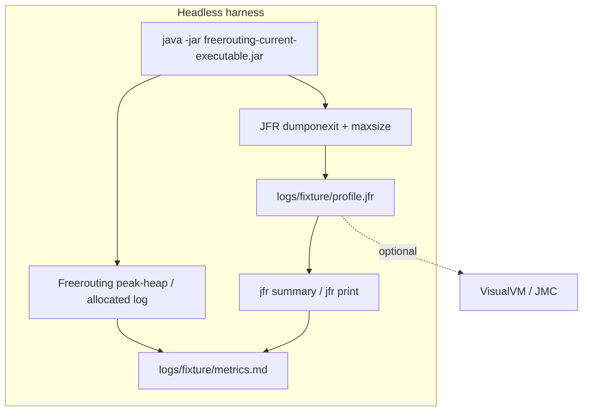
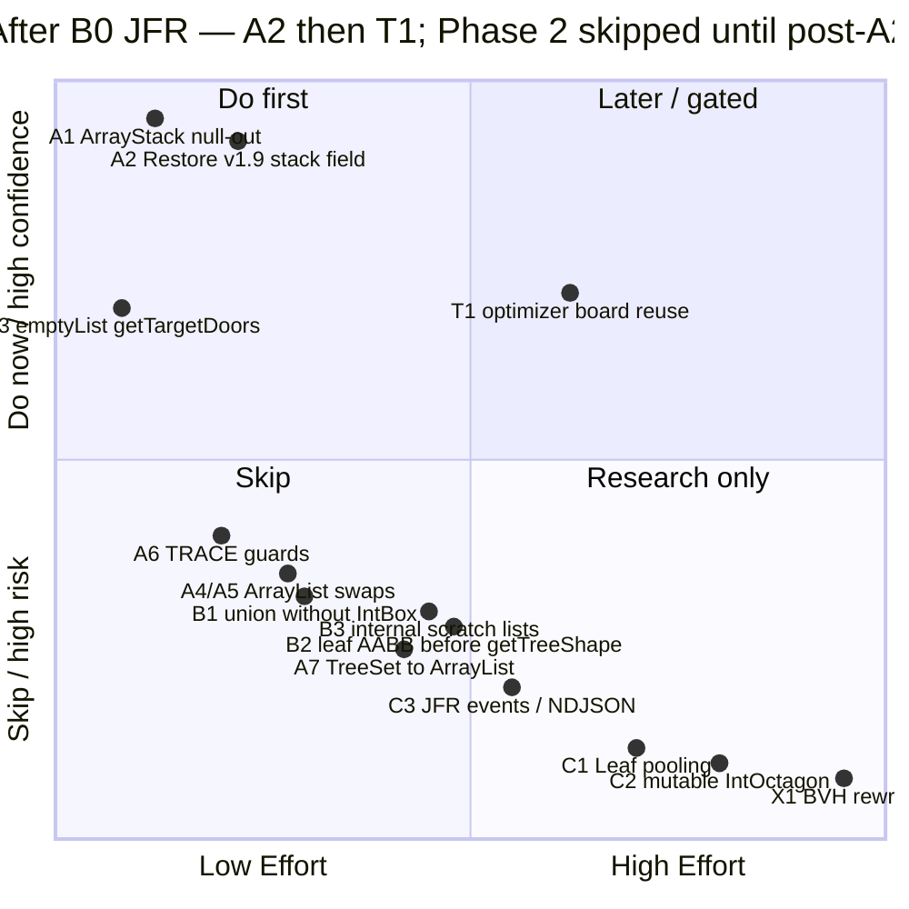
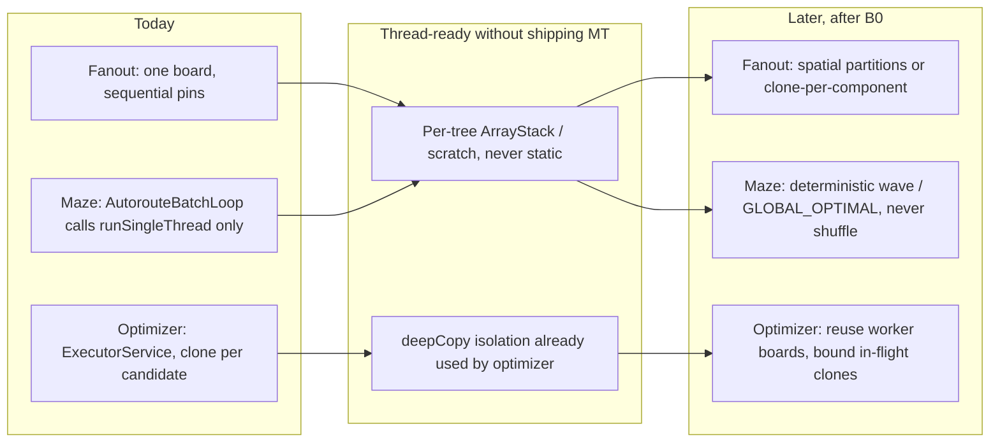
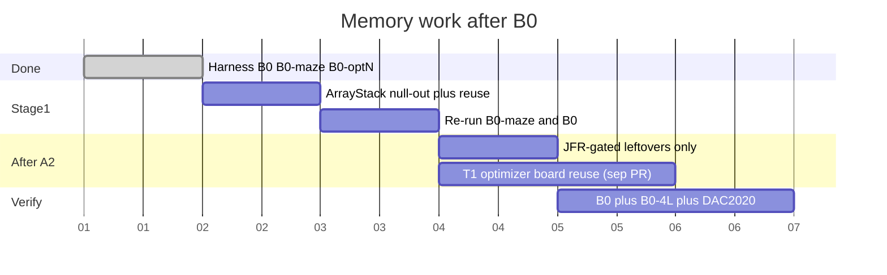

# Freerouting Memory Allocation, Peak Heap, and Thread-Readiness Plan

**Document status:** Working specification with measured A1–A7 checkpoints
**Date:** 12 September 2026
**Target branch:** `research/peak-heap-allocation-optimization`
**Primary tooling:** JDK Flight Recorder (JFR) + JDK 25 CLI (`jfr`)
**Harness:** [`scripts/tests/profile_allocation_B0.ps1`](../../scripts/tests/profile_allocation_B0.ps1)
**Benchmark source for fixture selection:** [`scripts/benchmark/results/benchmarks.json`](../../scripts/benchmark/results/benchmarks.json) (IDs frozen from 2.5.0-RC2; RC3 is in-repo for nightly context)

**Related components:**

- [`ArrayStack`](../../src/main/java/app/freerouting/datastructures/ArrayStack.java)
- [`MinAreaTree`](../../src/main/java/app/freerouting/datastructures/MinAreaTree.java)
- [`ShapeSearchTree`](../../src/main/java/app/freerouting/board/searchtree/ShapeSearchTree.java), [`ShapeSearchTree45Degree`](../../src/main/java/app/freerouting/board/searchtree/ShapeSearchTree45Degree.java), [`ShapeSearchTree90Degree`](../../src/main/java/app/freerouting/board/searchtree/ShapeSearchTree90Degree.java)
- [`IncompleteFreeSpaceExpansionRoom`](../../src/main/java/app/freerouting/autoroute/expansion/IncompleteFreeSpaceExpansionRoom.java)
- [`Sorted45DegreeRoomNeighbours`](../../src/main/java/app/freerouting/autoroute/expansion/Sorted45DegreeRoomNeighbours.java) (same `LinkedList` pattern in orthogonal / any-angle siblings)
- [`AutorouteEngine`](../../src/main/java/app/freerouting/autoroute/maze/AutorouteEngine.java), [`MazeSearchEngine`](../../src/main/java/app/freerouting/autoroute/maze/MazeSearchEngine.java)
- [`BatchFanout`](../../src/main/java/app/freerouting/autoroute/pipeline/BatchFanout.java)
- [`BatchOptimizer`](../../src/main/java/app/freerouting/autoroute/pipeline/BatchOptimizer.java)
- [`AutoroutePassRunner`](../../src/main/java/app/freerouting/autoroute/pipeline/AutoroutePassRunner.java)
- [`FRLogger`](../../src/main/java/app/freerouting/logger/FRLogger.java)
- [`RouterJobResourceUsage`](../../src/main/java/app/freerouting/core/RouterJobResourceUsage.java)
- [`FeatureFlagsSettings.multiThreading`](../../src/main/java/app/freerouting/settings/FeatureFlagsSettings.java)

---

## 0. How to use this document

Phase 0 is done: DiscoDongle B0, B0-maze, and B0-optN=4 are captured with JFR
([§4](#4-measured-baseline-12-september-2026), [§11.3](#113-b0-results-log-fill-on-master-then-after-each-change)).
Re-run the **same** harness after every optimization. Do not invent a new command line per
experiment.

Work completed in this implementation pass: **A1–A7**. A4–A7 were measured sequentially with the
same JFR harness; the artifacts are preserved under `logs/A4/` through `logs/A7/` (gitignored).
The next candidates are B1 and the separate T1 optimizer worker-board reuse investigation.

---

## 1. Executive summary

Two different memory problems showed up on the 12 September 2026 DiscoDongle capture, and they
need different fixes:

| KPI | B0 median (1+1 threads) | B0-optN=4 | What it means |
| :--- | ---: | ---: | :--- |
| **Peak heap** | **519 MB** | **963 MB** | Default CLI RSS is dominated by overlapping optimizer `deepCopy` clones (~444 MB extra at 4 workers) |
| **Maze allocation** | ~24 GB / pass-group | similar | B0-maze JFR: **~70% `Object[]`**. This is the A2 (`ArrayStack`) target. |
| **Optimizer allocation** | **~413 GB** even at T=1 | ~415 GB | `deepCopy` per candidate. Dwarfs maze. Full-B0 JFR (~97% `Object[]`) is mostly this, not the tree walk. |
| **Job “allocated so far”** | ~30 GB | ~31 GB | Routing-thread counter only. **Undercounts** optimizer worker TLAB bytes. Do not use it as the optimizer alloc KPI. |
| **Quality** | 0 unrouted / 0 DRC / score 1000 | same | B0 is a clean parity board |
| **Wall** | **78.9 s** (fan 1.9 / maze 4.9 / opt **68**) | **50.3 s** (opt **39**) | Optimizer is **86%** of B0 wall. Pinning it to 1 thread makes B0 slower than nightly; that is expected |

`--router.autorouter.max_threads=1` is accepted (log: `Pipeline thread limits: autorouter.max_threads=1, optimizer.max_threads=1`). Production maze still uses `runSingleThread`; the nested flag is what a future multi-thread pass would read.

The completed code is **A1–A7**: null-out, per-tree `ArrayStack` reuse, immutable empty target-door
collections, `ArrayList` room-neighbour/complete-shape collections, TRACE guards, and ordered
`ArrayList` overlap results. Judge future maze changes on B0-maze allocation GB and JFR, and judge
optimizer changes on stage allocation and peak heap separately.

Post-A7 JFR still shows geometry (`IntOctagon`, `IntPoint`) and logging/string work among the leading
maze samples; `LinkedList$Node` is no longer a leading sample. B1 is the next measured geometry
candidate. Pooling remains out of scope.

Canonical thread flags: `--router.autorouter.max_threads` and `--router.optimizer.max_threads`.
Do not use `--router.max_threads` in the harness.

### Non-negotiable constraints

- **JFR first.** No pool, scratch buffer, or geometry shortcut ships without a before/after
  allocation note (`jdk.ObjectAllocationSample`, `jdk.GarbageCollection`, `jdk.GCHeapSummary`).
- **Measure peak heap, not cumulative GB.** The log line `"the job allocated X GB of memory so far"`
  is a monotonic GC-throughput counter. The authoritative live figure is `"peak heap usage: Y MB"`
  (sampled from `MemoryMXBean` about once per second in
  [`RoutingJobSchedulerActionThread`](../../src/main/java/app/freerouting/management/jobs/RoutingJobSchedulerActionThread.java)).
- **No default BVH / sector-parallel tree rewrite.** Keep `ShapeSearchTree` / `MinAreaTree`.
- **Routing parity.** No new clearance violations via `DesignRulesChecker.getAllClearanceViolations()`,
  and no completion-rate regression versus the current master / v2.3.0 baseline on the agreed
  fixtures.
- **Determinism on all three stages.** Fanout, maze, and optimizer must produce the same
  board (same nets, vias, score, DRC) for a given seedless sequential policy, independent of
  thread count. No shuffled “quality lottery.” Parallelism is allowed only when it is a faster
  evaluation of a **fixed** candidate set with a **stable** reduction (optimizer-style
  `GLOBAL_OPTIMAL`), or a partition that is observably independent and committed in a fixed
  order. Faster and still good beats lucky and different.
- **Do not enable TRACE while collecting an allocation baseline.** TRACE will dominate the profile
  and make every other hotspot look small.
- **B0 is always 1+1 threads.** Pin `--router.autorouter.max_threads=1` **and**
  `--router.optimizer.max_threads=1`. The optimizer already runs a worker pool at default
  `CPU−1` and `deepCopy()`s the board per candidate; leaving that on makes ArrayStack wins
  invisible in peak heap. `-mt` is **not** a substitute (it only sets optimizer threads).
  `--router.max_threads` is the legacy flat/GUI knob; the harness uses the nested autorouter path.
- **Do not mix unrelated CI workflow fixes into this branch.** See [Decision 8](#decision-8-ci-hygiene-is-out-of-scope-for-this-branch).
- **Thread-readiness is a constraint, not a feature ship.** Fanout, maze, and optimizer code
  touched here must remain safe to run concurrently later (no static scratch, no shared trees,
  no returned-list reuse). Wiring production multi-thread autorouter/fanout is **out of scope**
  for merge until §12 decisions are resolved. See [Decision 7](#decision-7-b0-stays-single-thread-thread-readiness-is-a-parallel-track).
- **JFR gates Phase 2.** A1–A7 are measured; the post-A7 histogram and parity results control the
  next candidate.
- **SIMD / Vector API / WebGPU** are out of scope (see §13). Do not reopen them to “make A2 faster.”

---

## 2. Critical review of the previous draft

These are the mistakes the rest of this document corrects. Keep this section; it prevents the next
pass from reintroducing them.

| Previous claim | Reality | Consequence |
| :--- | :--- | :--- |
| `jdk.ObjectAllocationInNewTLAB` / `OutsideTLAB` are the primary JFR events | Disabled in both `default.jfc` and `profile.jfc` since JDK 16. The live event is **`jdk.ObjectAllocationSample`** (throttled; 150/s in `default`, higher in `profile`) | `jfr print --events jdk.ObjectAllocationInNewTLAB` on a `settings=profile` recording is empty |
| `-XX:+FlightRecorder` is required | On since JDK 11 | Harmless but cargo-cult |
| `duration=180s` is a good recording window | Maze passes on dense boards exceed 3 minutes; the recording **stops mid-job** | Truncated, incomparable profiles |
| `$pid = (Get-Process -Name java).Id` | `$pid` is a **reserved PowerShell automatic variable** (this process). Also matches every Java process on the machine | Wrong PID, failed `jcmd` |
| `-mt 1` makes the autorouter single-threaded | `-mt` sets **`optimizer.maxThreads` only**. Canonical autorouter cap is `--router.autorouter.max_threads`. Default optimizer `maxThreads` is `CPU−1` | Baseline would not be single-thread |
| `-mi 150` caps routed items | **There is no `-mi` short flag.** Use `--router.autorouter.max_items=150` | The cap is silently ignored |
| Peak heap = `Runtime.totalMemory() − freeMemory()` | That is committed/used Eden-inclusive heap, not the figure Freerouting logs. Prefer `MemoryMXBean` used-heap + JFR `GCHeapSummary` | Incomparable with production logs |
| `ArrayStack` currently leaks | `pop()` / `reset()` leave stale slots, **but instances are discarded today**, so there is no live leak. The leak appears **only after reuse is added** | Null-out is a **prerequisite** for reuse, not an independent peak-heap win |
| “Fix ArrayStack retention” is the highest-impact item | For **maze allocation**, restoring v1.9 field reuse (A2) is the lever. For **peak heap** and full-pipeline JFR, optimizer `deepCopy` dominates | Wrong sequencing if you chase B0 peak with maze collection swaps |
| Job `"allocated X GB"` is whole-JVM allocation | Routing-thread sampler. Optimizer stage logs **~413 GB** at T=1 while the job counter stays ~30 GB | A2 judged against the wrong number; T1 looks like a non-event |
| AABB fast-path in `completeShape` rejects 70–80% of obstacles | [`IntOctagon.overlaps()`](../../src/main/java/app/freerouting/geometry/planar/IntOctagon.java) **already** early-outs on X then Y AABB before diagonal tests. Unsourced 70–80% | M2 as originally written is mostly already implemented |
| Primitive math in `calcOutsideRestrainedShape` is a medium-effort win | That method **already** works on eight `int` locals and allocates one `IntOctagon` at the end | Do not spend a phase “introducing” it |
| Ping-pong scratch lists for `completeShape` result | `completeShape` **returns** `result`. Reusing that list on the next call mutates a collection the caller still holds | Correctness hazard; see [Decision 2](#decision-2-scratch-list-lifetime) |
| TRACE is a production allocation hotspot | Default console level is INFO, file level is DEBUG. TRACE I/O is off. **Eager `+` concatenation still allocates** before `FRLogger.trace(String)` | Guard concatenations; do not rebuild the logging stack as part of this work |
| Custom JFR events / NDJSON are Stage-1 work | Observability project. Can wait. Custom events are useful **after** the allocation baseline exists | Do not block reuse / collection fixes |
| Leaf pooling is a medium-priority follow-up | Pooling on G1/ZGC often **raises peak heap** while lowering allocation rate. Only revisit if JFR still shows `Leaf`/`InnerNode` as top sampled types **and** peak heap is the remaining problem | Gate behind [Decision 5](#decision-5-object-pooling-is-opt-in-after-stage-1) |
| GitHub Actions Node 20 / Build Scan warnings belong here | Orthogonal to maze-router memory | Separate PR; see Decision 8 |
| Success = “>40% allocation-rate drop” | Unsourced. A 5% peak-heap drop with no DRC regression can still be a win | Use measured deltas, not pre-committed percentages |

---

## 3. Verified code facts (no profiler required)

### 3.1 v1.9 and the implementation now reuse search-tree walk stacks

```19:32:src_v19/main/java/app/freerouting/datastructures/MinAreaTree.java
  protected ArrayStack<TreeNode> node_stack = new ArrayStack<>(10000);
  // ...
  public Set<Leaf> overlaps(RegularTileShape p_shape) {
    // ...
    this.node_stack.reset();
    this.node_stack.push(this.root);
```

The implementation now matches this ownership model with two instance-scoped stacks:

- `MinAreaTree.nodeStack` is reset and reused by `overlaps()`.
- `ShapeSearchTree.completeShapeStack` is reset and reused by `completeShape()` and its 45°/90°
  subclasses.

The stacks are separate because a future nested `overlaps()` call must not reset an active
`completeShape()` traversal. Both are ordinary tree fields; `SearchTreeManager` remains transient,
so optimizer `deepCopy()` rebuilds them rather than serializing their arrays.

`ArrayStack.pop()` and `reset()` now clear released live slots before A2 reuses the arrays. The
live-prefix reset avoids scanning the full 10,000-slot capacity on every query.

### 3.2 `MinAreaTree.overlaps()` also allocates a `TreeSet` per query

Even after the stack is reused, every overlap query builds a `TreeSet<Leaf>` (`TreeMap.Entry`
churn). `overlappingTreeEntries()` then iterates that set and allocates a `TreeEntry` per hit.
`completeShape` in the 45°/90° trees walks the tree itself and does **not** go through `overlaps()`,
so the `TreeSet` cost is concentrated on neighbour / clearance queries, not room completion.

### 3.3 Expansion-room collections are `LinkedList`-heavy

Hot constructors still do `new LinkedList<>()` for:

- `completeShape` result and per-obstacle `newResult` (all three angle trees)
- `overlappingLeaves` in any-angle `completeShape` (then `Collections.sort`)
- `Sorted45DegreeRoomNeighbours`, `SortedOrthogonalRoomNeighbours`, `SortedRoomNeighbours`
  overlapping-entry lists (then `((LinkedList) list).sort(...)`)

`LinkedList.sort()` dumps to an array anyway. An `ArrayList` with a modest `ensureCapacity` is the
same algorithm with cheaper nodes. Post-A2 B0-maze samples show `LinkedList$Node` at **2.0–2.3%**;
A4/A5 are now evidence-backed but still require parity checks.

### 3.4 `getTargetDoors()` allocates an empty `ArrayList` for every incomplete room

```32:35:src/main/java/app/freerouting/autoroute/expansion/IncompleteFreeSpaceExpansionRoom.java
  public Collection<TargetItemExpansionDoor> getTargetDoors() {
    return new ArrayList<>();
  }
```

Callers in `MazeSearchEngine` only iterate. `Collections.emptyList()` is correct (confirmed: no
caller mutates the returned collection). Cheap, tiny, do it when touching the file; do not expect a
measurable peak-heap change.

### 3.5 Eager TRACE concatenation is real; TRACE I/O is not the default bottleneck

`FRLogger.trace(String)` does **not** take a `Supplier`. Call-site `+` runs before the method.
Default appender levels are INFO (console) and DEBUG (file), so the built string is thrown away.
The 5-argument `FRLogger.trace(method, operation, …)` path **is** guarded by `granularTraceEnabled`
(off unless detailed logging is requested).

Action: wrap 1-arg concatenations in hot geometry with `if (FRLogger.isTraceEnabled())`. Do **not**
introduce NDJSON or custom JFR events as a prerequisite.

### 3.6 `IntOctagon` is already mostly the “primitive math” design

- `overlaps()` does AABB X, AABB Y, then diagonals. No extra AABB wrapper is needed in front of it.
- `calcOutsideRestrainedShape` / `calcInsideRestrainedShape` already use eight `int` locals.
- Remaining waste in `completeShape`: `newBoundingShape.union(currentShape.boundingBox())` allocates
  a fresh `IntBox` (`boundingBox()`) and then another octagon via `union(IntBox)` → `toIntOctagon()`.
  Prefer `union(currentShape)` (octagon–octagon) or a primitive AABB expand.

A **useful** fast-path that is **not** already present: skip `getTreeShape().boundingOctagon()` when
`currentLeaf.boundingShape` is AABB-disjoint from the current room bounds. That avoids materializing
the obstacle shape.

### 3.7 Thread isolation is already good enough for tree-scoped scratch buffers

`SearchTreeManager` on `BasicBoard` is **`transient`**. `RoutingBoard.deepCopy()` serializes the
board and rebuilds trees after deserialize (`readObject` constructs a new manager). Restoring a
per-tree `ArrayStack` field therefore does **not** copy a 10 000-slot `Object[]` into optimizer
clones or `.frb` files. Each reconstructed tree starts with a fresh stack. Do not implement
`Serializable` on `ArrayStack` just to push empty scratch through `deepCopy`.

[`AutoroutePassRunner.runMultiThread`](../../src/main/java/app/freerouting/autoroute/pipeline/AutoroutePassRunner.java)
`deepCopy()`s the board per worker. Each thread therefore owns its own search trees. A field on
`MinAreaTree` / `ShapeSearchTree` is thread-confined **as long as trees are never shared across
threads**. This matches v1.9 and makes `ThreadLocal` unnecessary for Stage 1.

Single-thread work (`--router.autorouter.max_threads=1`) never hits this path.

### 3.8 Peak-heap retention that is already handled

[`BoardHistory`](../../src/main/java/app/freerouting/autoroute/BoardHistory.java) is capped at 30
serialized snapshots (Issue 684). Do not re-litigate that as a new leak.

Multi-thread peak heap is dominated by **N live board copies**, not by `ArrayStack`. B0 therefore
pins both thread knobs to 1. Optimizer clones are already live in default CLI; maze clones are
not. Details and future designs: §12 and [Decision 7](#decision-7-b0-stays-single-thread-thread-readiness-is-a-parallel-track).

### 3.9 Expansion rooms themselves are retained in the autoroute tree

`AutorouteEngine` inserts completed rooms into `autorouteSearchTree` and removes them later. That
is **leaf churn in the tree**, which is why `Leaf`/`InnerNode` pooling is tempting — and also why
pooling those nodes can pin a large free-list in the old generation. B0-maze JFR does **not** list
`Leaf` / `InnerNode` in the top types; do not prototype C1 until a post-A2 recording does.

### 3.10 Threading facts (all three stages)

- **Fanout** mutates one board sequentially. There is no worker pool.
- **Maze** production path is `runSingleThread` only. `runMultiThread` exists, is unused, shuffles
  item order, and `join`s for **1 second**.
- **Optimizer** always uses `Executors.newFixedThreadPool(optimizer.maxThreads)` with a
  `deepCopy()` per candidate. Default `maxThreads` is `CPU−1`. This is independent of
  `featureFlags.multiThreading` (default false).
- `-mt` sets **optimizer** threads only.
- Canonical maze/pass-runner cap: `--router.autorouter.max_threads` (`AutorouterSettings.maxThreads`,
  `RouterSettings.getAutorouterMaxThreads()`). Legacy `--router.max_threads` still exists as a
  GUI/fallback field and is **not** what the B0 harness passes.
- Production batch loop still calls `runSingleThread` only; the nested autorouter thread cap is
  confirmed applied (log line `Pipeline thread limits: autorouter.max_threads=…`) and is what a
  future `runMultiThread` would use.

---

## 4. Measured baseline (12 September 2026)

Machine: JDK 25.0.1, 12 cores, `-Xms256m -Xmx4g`, TRACE off, GUI/API/MCP off. Harness:
`scripts/tests/profile_allocation_B0.ps1`. Fixture: DiscoDongle `unrouted.dsn`. JAR built from this
branch (nested `--router.autorouter.max_threads` included). Artifacts under `logs/B0*/` (gitignored).

JFR reports `Object[]` as `objectClass = java.lang.Object` (the component type). Treat the
**B0-maze** row as maze `ArrayStack` / walk churn. Treat the **full B0** row as maze plus
optimizer `deepCopy` graphs — the optimizer stage logs **~413 GB** allocated even at one worker.

### 4.1 Quality, heap, and stage allocation

| Profile | n | aut T / opt T | wall s | fan / maze / opt s | job peak MB | maze / opt peak | maze alloc GB | opt alloc GB | job alloc GB | unr / vio / score |
| :--- | ---: | :--- | ---: | :--- | ---: | ---: | ---: | ---: | ---: | :--- |
| **B0** (median of 3) | 3 | 1 / 1 | 78.9 | 1.94 / 4.92 / 68.0 | **518.8** | 325 / 449 | **~24** | **~413** | ~30 | 0 / 0 / 1000 |
| **B0-maze** | 1 | 1 / 1 | 5.8 | — / 2.59 / — | 138 | 138 / — | 6.3 | — | 3.9 | 17 / 0 / 588 |
| **B0-optN** | 1 | 1 / 4 | 50.3 | 2.10 / 5.36 / 39.4 | **963.3** | 364 / 937 | ~23 | ~415 | ~31 | 0 / 0 / 1000 |

B0 repeats were tight (wall 78.0–79.0 s). Run 1 peak 547 MB vs median 519 MB is slightly above the
±5% noise band; keep n=3 and use the median. No JIT-warmup discard (Q26 closed).

**Q7 / Decision 19:** B0-optN peak − B0 peak ≈ **444 MB**. Optimizer clones dominate default-CLI
RSS. T1 (worker-board reuse) is the peak-heap follow-up. It is also the full-pipeline allocation
follow-up: the optimizer logs ~413 GB allocated at T=1 because each candidate `deepCopy()`s; those
bytes die quickly, so peak stays ~450–520 MB until several clones overlap.

**Q8:** Optimizer at 1 thread is ~68 s on this 12-core box; at 4 threads ~39 s. Optimizer is **86%**
of B0 wall. Do not compare B0 wall to nightly PCBench (~71 s on a 6-core box with optimizer at
`CPU−1`).

The ~30 GB **job** counter is the routing-thread sampler and misses optimizer worker TLAB bytes.
Use the stage log lines (`Auto-routing stage … GB total allocated`, `Optimization stage … GB total
allocated`) as the allocation KPIs.

B0-maze with `max_passes=1` and fanout off is a **2.6 s** maze slice (17 nets left). Use it for a
maze-only type mix and for A2 deltas, not as a substitute for B0 quality.

### 4.2 Top `jdk.ObjectAllocationSample` types

**B0 run 2** (full pipeline, 21 321 samples):

| Rank | Type | Samples | Share |
| ---: | :--- | ------: | ----: |
| 1 | `java.lang.Object` (`Object[]`) | 20610 | **96.7%** |
| 2 | `byte` (`byte[]`) | 204 | 1.0% |
| 3 | `IntOctagon` | 76 | 0.4% |
| 4 | `TreeMap$Entry` | 56 | 0.3% |
| 5 | `IntPoint` | 51 | 0.2% |
| 6–15 | `int[]`, `String`, `FloatPoint`, `LinkedList$Node`, `Line`, `TreeMap`, … | ≤33 each | ≤0.2% |

**B0-maze** (1 093 samples, maze only): `Object` 70%, `byte[]` 10%, `IntOctagon` 2.7%, `String` 2%,
`IntPoint` 2%, `TreeMap$Entry` 0.7%, `LinkedList$Node` 0.6%. Same ranking, less optimizer
`byte[]`/`Object[]` from clones.

**Implication:** A1/A2 were the dominant allocation fix. After A2, the `Object[]` sample share
disappeared from B0-maze. A4–A7 were then measured with explicit parity-preserving ordering; A5
reduced collection churn most clearly, while A4, A6, and A7 remained within single-run noise.
`byte[]`, `IntOctagon`, `IntPoint`, `String`, and `TreeMap` entries remain the measured candidates
for the next work. C1 pooling remains out of scope:
`Leaf`/`InnerNode` are not in the top 15.

### 4.3 Sequential A1–A7 results

Each checkpoint used the same harness, JDK, JVM flags, fixture, nested thread flags, and JFR
settings. The artifacts were preserved under `logs/A1/` through `logs/A7/` (gitignored).
The job allocation column is the routing-thread counter; stage allocation is the comparable
allocation metric.

| Checkpoint | Profile | n | Wall s | Fan / maze / opt s | Peak heap MB | Maze alloc GB | Opt alloc GB | Job alloc GB | Quality |
| :--- | :--- | ---: | ---: | :--- | ---: | ---: | ---: | ---: | :--- |
| Baseline | B0 | 3 | 78.9 | 1.94 / 4.92 / 68.0 | 518.8 | ~24 | ~413 | 30.1 | 0 / 0 / 1000 |
| **A1** | B0 | 3 | 81.5 | 2.17 / 4.92 / 70.7 | 583.3 | ~23 | ~413 | 30.3 | 0 / 0 / 1000 |
| **A2** | B0 | 3 | **38.3** | 1.59 / 2.88 / **29.7** | **243.1** | 1.76 | 26.94 | 2.46 | 0 / 0 / 1000 |
| **A3** | B0 | 3 | 37.9 | 1.92 / 2.79 / 29.6 | 245.2 | 1.75 | 26.87 | 2.44 | 0 / 0 / 1000 |
| **A4** | B0 | 3 | 38.21 | 1.85 / 3.13 / 28.64 | 233.66 | 1.75 | 26.93 | 2.44 | 0 / 0 / 1000 |
| **A5** | B0 | 3 | **33.94** | 1.51 / 2.56 / 26.54 | **222.88** | 1.74 | 27.13 | 2.44 | 0 / 0 / 1000 |
| **A6** | B0 | 3 | 33.85 | 1.41 / 2.32 / 26.27 | 238.99 | 1.76 | 27.21 | 2.46 | 0 / 0 / 1000 |
| **A7** | B0 | 3 | 35.80 | 1.49 / 2.31 / 28.49 | 238.62 | 1.68 | 26.00 | 2.37 | 0 / 0 / 1000 |
| Baseline | B0-maze | 1 | 5.8 | — / 2.59 / — | 137.9 | 6.30 | — | 3.88 | 17 / 0 / 588 |
| **A1** | B0-maze | 1 | 6.3 | — / 2.69 / — | 204.0 | 6.30 | — | 3.61 | 17 / 0 / 588 |
| **A2** | B0-maze | 1 | **5.5** | — / 1.99 / — | **160.5** | **0.87** | — | 0.86 | 17 / 0 / 588 |
| **A3** | B0-maze | 1 | 5.3 | — / 2.06 / — | **84.3** | 0.86 | — | 0.79 | 17 / 0 / 588 |
| **A4** | B0-maze | 1 | 5.32 | — / 1.97 / — | 142.06 | 0.85 | — | 0.85 | 17 / 0 / 588 |
| **A5** | B0-maze | 1 | 5.34 | — / 1.87 / — | 35.78 | 0.87 | — | 0.32 | 17 / 0 / 588 |
| **A6** | B0-maze | 1 | 5.24 | — / 1.67 / — | 83.64 | 0.86 | — | 0.37 | 17 / 0 / 588 |
| **A7** | B0-maze | 1 | 5.32 | — / 1.86 / — | 21.86 | 0.85 | — | 0.30 | 17 / 0 / 588 |
| Baseline | B0-optN | 1 | 50.3 | 2.10 / 5.36 / 39.4 | 963.3 | ~23 | ~415 | 31.0 | 0 / 0 / 1000 |
| **A1** | B0-optN | 1 | 52.1 | 2.56 / 5.29 / 40.2 | 791.3 | ~23 | ~429 | 30.1 | 0 / 0 / 1000 |
| **A2** | B0-optN | 1 | **22.8** | 1.54 / 2.74 / **15.0** | **444.0** | 1.75 | 27.07 | 2.44 | 0 / 0 / 1000 |
| **A3** | B0-optN | 1 | 23.9 | 1.59 / 2.72 / 16.0 | 425.1 | 1.75 | 27.08 | 2.45 | 0 / 0 / 1000 |
| **A4** | B0-optN | 1 | 20.93 | 1.50 / 2.36 / 13.39 | 403.10 | 1.75 | 27.08 | 2.45 | 0 / 0 / 1000 |
| **A5** | B0-optN | 1 | 24.19 | 1.59 / 2.85 / 15.85 | 479.85 | 1.76 | 27.21 | 2.47 | 0 / 0 / 1000 |
| **A6** | B0-optN | 1 | 19.82 | 1.38 / 2.24 / 12.85 | 503.26 | 1.74 | 27.21 | 2.45 | 0 / 0 / 1000 |
| **A7** | B0-optN | 1 | 21.87 | 1.35 / 2.35 / 14.50 | 492.11 | 1.67 | 26.23 | 2.35 | 0 / 0 / 1000 |

**A1:** Nulling released slots is a correctness prerequisite for reuse, but it does not reduce
allocation by itself. The single A1 run set was noisy on peak heap and wall time; quality and
allocation remained at baseline.

**A2:** Restoring the reusable tree-walk stacks (with `overlaps()` isolated per caller thread)
removed the repeated 10,000-slot
`Object[]` allocations. Relative to baseline, B0 median wall fell **51%**, peak heap fell **53%**,
maze-stage allocation fell from ~24 GB to **1.76 GB**, and optimizer-stage allocation fell from
~413 GB to **26.94 GB**. The latter confirms that optimizer `deepCopy()` rebuilds these trees and
benefits from the same reuse. Quality was unchanged.

**A3:** Returning `Collections.emptyList()` is safe and allocation-free, but its incremental effect
after A2 is small and within run noise. The B0-maze slice reached 0.79 GB job allocation and
84 MB peak; B0 remained 0/0/1000. Keep A3 as a low-risk cleanup, not as the primary optimization.

**A4:** Replacing the three sorted-room neighbour overlap lists with `ArrayList` preserved the
explicit deterministic comparator and routing quality. The B0 and B0-maze changes were within
normal run noise; retain it as a low-risk representation cleanup rather than a material win.

**A5:** Replacing the internal `completeShape` working collections with fresh `ArrayList` instances
removed linked-list node churn from the measured maze histogram and produced the strongest Phase 2
result. B0 median wall improved to 33.94 s and peak to 222.88 MB; B0-maze job allocation was
0.32 GB. The B0 quality triple remained 0/0/1000. No returned collection is reused or cleared.

**A6:** Guarding eager TRACE-string concatenation preserved the trace payload when TRACE is enabled
and avoids formatting work when it is disabled. The B0 median was effectively unchanged from A5
(33.85 s versus 33.94 s); JFR remained noisy, so this is retained as a defensive low-risk guard,
not credited with a measurable allocation reduction.

**A7:** The two `overlaps()` callers were audited. `TreeSet` supplied `Leaf.compareTo` ordering, so
the replacement collects into a fresh list and applies `Collections.sort` before either caller
iterates it. The final thread-safe A7 checkpoint retained 0/0/1000 quality; B0 median peak was
238.62 MB and optimizer allocation was 26.00 GB. The B0-maze slice was 5.32 s and 0.85 GB;
retain A7 as an ordering-preserving cleanup, not as a claimed maze-stage win.

Post-A2 B0-maze JFR no longer sampled `Object[]` as the dominant type: `byte[]` was 27–29%,
`IntOctagon` 9.6–10.9%, `IntPoint` 7.7–8.8%, `String` 4.4–5.7%, `TreeMap$Entry` 4.0–4.1%,
and `LinkedList$Node` 2.0–2.3%. These are the measured gates for any next allocation change.

---

## 5. KPI definitions and how to measure them

Use three numbers on every run, written into `logs/<fixture>/metrics.md`:

1. **Peak heap (MB)** — Freerouting log `"peak heap usage: Y MB"`. Corroborate with the max
   `jdk.GCHeapSummary` heap used. Optional: OS working-set sampler from the Issue 420 script
   (process RSS, includes off-heap / code cache; useful as a sanity bound, not the primary KPI).
2. **Allocation during the maze stage (GB)** — log line `"Auto-routing stage … X GB total allocated"`,
   **not** the whole-job counter and **not** the optimizer stage (that one is ~413 GB of `deepCopy`).
3. **Quality** — incomplete nets, `DesignRulesChecker.getAllClearanceViolations().size()`, score.

The job line `"the job allocated X GB of memory so far"` samples the routing thread and
**undercounts** optimizer worker TLAB allocation. Optimizer-stage GB is the clone-firehose KPI
(T1). Maze-stage GB is the A2 KPI.

Sampling caveat: peak heap is updated about once per second. Short spikes between samples are
missed. JFR heap summaries after GC are the backstop. Do **not** set a large `-Xms`; it inflates
committed heap and confuses RSS. Prefer `-Xms256m -Xmx4g` (same as Issue 420) unless a board OOMs.

Do **not** change the GC (`G1` is JDK 25 default). Switching to ZGC is out of scope; it would
invalidate every comparison.

---

## 6. Measurement protocol (corrected)

### 6.1 Why JFR stays the primary profiler

Low overhead, no extra agent, CLI-friendly, recordings load in VisualVM/JMC when a GUI helps.
Use **`jdk.ObjectAllocationSample`**, not the disabled TLAB events. If a type is huge but rare,
raise throttle with a custom `.jfc` (`allocation-profiling=high` or `1000/s`) for a second
recording — never enable `ObjectAllocationInNewTLAB` on a full B0 run unless a 10-second
snippet is required to confirm a specific type.



### 6.2 Frozen B0 baseline (the measurement you repeat)

**B0 is the contract.** Capture it once on `master`, then re-run the **identical** command after
every optimization (A1/A2, collection swaps, TRACE guards, …). Compare medians, not single shots.
If the command line changes, you no longer have a baseline — you have a new experiment.

Why DiscoDongle (see §11): it still exercises all three stages, finishes fully routed with 0 DRC,
and at 1+1 threads has a ~519 MB peak — large enough to see a 5–10% delta. Nightly ~772 MB / ~71 s
used optimizer=`CPU−1` on a different (6-core) machine; those numbers are **not** the B0 KPI.
On this capture, maze is ~5 s of 79 s; the nightly 19 s maze share was the fixture-selection
filter, not the B0 wall budget.

#### B0 — full pipeline, single thread, all three stages

```powershell
# Build once per git SHA
.\gradlew.bat executableJar

$Out = "logs\B0-DiscoDongle"
New-Item -ItemType Directory -Force -Path $Out | Out-Null

# Frozen flags. Do not add max_items / max_passes. Do not use -mt / -mi / $pid.
# Pin BOTH thread knobs: optimizer already pools at CPU-1 by default.
java -Xms256m -Xmx4g `
     -XX:StartFlightRecording=dumponexit=true,filename=$Out\profile.jfr,settings=profile,maxsize=512m `
     -Xlog:gc*:file=$Out\gc.log:time,uptime:filecount=3,filesize=20M `
     -jar build/libs/freerouting-current-executable.jar `
     -de scripts\benchmark\fixtures\PCBench\disco-dongle_DiscoDongle\unrouted.dsn `
     --gui.enabled=false `
     --router.fanout.enabled=true `
     --router.optimizer.enabled=true `
     --router.autorouter.max_threads=1 `
     --router.optimizer.max_threads=1
```

**Repeat count:** 3 consecutive runs on the same machine. Record git SHA, `java -version`, and
the exact argv. Report **median** peak heap, median stage times, median allocation GB, and the
quality triple (unrouted, violations, score). A single run is for JFR type mix only.

**What to paste back into this document** (table in §11.3): wall s, fanout s, autorouter s,
optimizer s, peak heap MB, allocated GB (per stage if logged), unrouted, violations, score.

#### B0-maze — JFR iteration slice (maze only)

Use this when you need a short allocation profile of `completeShape` / `MinAreaTree`. It is **not**
a substitute for B0 at merge time.

```powershell
java -Xms256m -Xmx4g `
     -XX:StartFlightRecording=dumponexit=true,filename=logs\B0-maze\profile.jfr,settings=profile,maxsize=512m `
     -jar build/libs/freerouting-current-executable.jar `
     -de scripts\benchmark\fixtures\PCBench\disco-dongle_DiscoDongle\unrouted.dsn `
     --gui.enabled=false `
     --router.fanout.enabled=false `
     --router.optimizer.enabled=false `
     --router.autorouter.max_threads=1 `
     --router.optimizer.max_threads=1 `
     --router.autorouter.max_passes=1
```

Optional tighter slice for crash-loop JFR: add `--router.autorouter.max_items=150`. Always label
the artifact `B0-maze-mi150` so it is never compared to B0.

#### Named confirmation variants (not B0)

| Name | Fixture | When to run |
| :--- | :--- | :--- |
| **B0-heap** | `PowerGloveUHID_main_board` | After B0 looks good; higher peak heap (~1.3 GB on RC2) |
| **B0-4L** | `kitspace_minisumo_v3` | 4-layer maze stress (~78 s autorouter) |
| **B0-inrepo** | `fixtures/Issue190-processor.Z80.dsn` | PCBench checkout missing; maze-only fallback |
| **B0-smoke** | `fixtures/Issue508-DAC2020_bm01.dsn` | Every maze-touching PR (`Dac2020Bm01RoutingTest`) |

Same frozen JVM flags and 1+1 threads as B0. Do not change B0 because a confirmation board is slow.

Parse:

```powershell
jfr summary logs/B0-DiscoDongle/profile.jfr

jfr print --events jdk.ObjectAllocationSample --stack-depth 16 `
          logs/B0-DiscoDongle/profile.jfr |
  Out-File -FilePath logs/B0-DiscoDongle/alloc_samples.txt -Encoding utf8

jfr print --events jdk.GarbageCollection,jdk.GCHeapSummary,jdk.OldObjectSample `
          logs/B0-DiscoDongle/profile.jfr |
  Out-File -FilePath logs/B0-DiscoDongle/gc_events.txt -Encoding utf8
```

Live telemetry, if wanted, in a second terminal. Capture the Java PID from the `Start-Process
-PassThru` object (Issue 420 pattern), never from `Get-Process java`:

```powershell
jstat -gcutil $javaPid 1000
```

### 6.3 Dynamic `jcmd` (already-running job)

```powershell
jcmd $javaPid JFR.start name=route settings=profile filename=logs/B0-DiscoDongle/route.jfr maxsize=512m
jcmd $javaPid JFR.check
jcmd $javaPid JFR.dump name=route filename=logs/B0-DiscoDongle/route_dump.jfr
jcmd $javaPid JFR.stop name=route
# Heap dump only when investigating retained peak, not for allocation rate
jcmd $javaPid GC.heap_dump logs/B0-DiscoDongle/peak_heap.hprof
```

### 6.4 Harness (written)

[`scripts/tests/profile_allocation_B0.ps1`](../../scripts/tests/profile_allocation_B0.ps1) builds the
executable JAR, copies it to `scripts/benchmark/binaries/freerouting-current.jar`, and runs B0 /
B0-maze / B0-optN with JFR on every repeat.

```powershell
.\scripts\tests\profile_allocation_B0.ps1            # All three profiles
.\scripts\tests\profile_allocation_B0.ps1 -Profile B0 -SkipBuild
```

Always: `--router.autorouter.max_threads=1`, `--router.optimizer.max_threads=1` (or 4 for B0-optN),
`--gui.enabled=false --api_server.enabled=false --mcp_server.enabled=false`. Outputs under
`logs/<profile>/` (gitignored): `route.log`, `profile.jfr`, `result.json`, `jfr-top-types.md`,
`metrics.md`.

---

## 7. Optimization catalog

Impact below is from the 12 September 2026 capture. “Do when” is no longer a prior belief.

| ID | Change | KPI | Effort | Risk | Evidence | Do when |
| :--- | :--- | :--- | :--- | :--- | :--- | :--- |
| **A1** | Null slots in `ArrayStack.pop()` / `reset()` | Enables A2; not a peak win alone | Hours | Very low | A1 checkpoint: no allocation change | **Done**; retain unit tests |
| **A2** | Restore per-tree `ArrayStack` field (v1.9) in `MinAreaTree` and the three `completeShape` walks | Maze and optimizer allocation | Hours | Low if A1 is in | B0-maze `Object[]` 70%; B0: 24→1.76 GB maze, ~413→26.94 GB optimizer | **Done**; primary measured win |
| **A3** | `getTargetDoors()` → `Collections.emptyList()` | Allocation rate (tiny) | Minutes | Very low | A3 checkpoint; no quality change | **Done**; keep as low-risk cleanup |
| **A4** | `LinkedList` → `ArrayList` in the three `Sorted*RoomNeighbours` | Maze allocation | Hours | Low (keep sort comparator) | `LinkedList$Node` 2.0–2.3% post-A2 maze | **Done**; safe cleanup, no material delta |
| **A5** | `ArrayList` for fresh `completeShape` working/result collections | Maze allocation | Hours | Low | Same | **Done**; strongest Phase 2 result |
| **A6** | Guard hot `FRLogger.trace(String)` concatenations with `isTraceEnabled()` | Allocation when TRACE off | Hours | Very low | `String` 4.4–7.6% in sampled maze runs | **Done**; defensive guard, no measurable delta |
| **A7** | `MinAreaTree.overlaps()`: `TreeSet` → ordered `ArrayList` | Maze allocation | Half day | Medium — callers may rely on `Leaf` ordering | `TreeMap$Entry` 3.2–4.0% post-A2 maze | **Done**; explicit `Collections.sort` preserves order |
| **B1** | Avoid `boundingBox()` in the `newBoundingShape.union(...)` path; union octagons directly | Maze allocation | Hours | Low | `IntOctagon` 9.6–10.9% post-A2 maze | Candidate after A4/A5; parity gate |
| **B2** | AABB reject on `leaf.boundingShape` **before** `getTreeShape()` | Maze CPU | Half day | Medium — must not change visit/clip order | Source | Only with room-partition parity evidence |
| **B3** | Reusable scratch `ArrayList` for **internal** `newResult` only; allocate a fresh list at return | Maze allocation | Half–1 day | Medium — see Decision 2 | Lifetime analysis | After A4/B1; never reuse returned collection |
| **C1** | `Leaf`/`InnerNode` pooling | Allocation rate; may **hurt** peak | Days | High | Not in top 15 | **No** (Decision 5) |
| **C2** | Mutable / pooled `IntOctagon` | Allocation rate; correctness landmine (`EMPTY`, `precalculatedToSimplex`, sharing) | Days | Very high | Source | **No** |
| **C3** | Custom JFR events / NDJSON TRACE | Observability, not memory | Days | Low for JFR; high for log volume | — | Separate track |
| **T1** | Optimizer worker-local board reuse (one clone per thread, reset from snapshot) | Peak heap + optimizer alloc GB | Days | Medium (determinism) | Post-A2: 444→181 MB B0-optN delta; optimizer alloc ~27 GB | After A4/B1 research or separate PR (Decision 14 / 19) |
| **X1** | BVH / sector-parallel tree | Unclear | Weeks | Extreme (parity) | — | Out of scope |
| **X2** | GC / `-XX` tuning as the “fix” | Distorts comparisons | Hours | Medium | — | Out of scope |



---

## 8. Recommendations (practical order)

1. **A1–A7 are complete.** Re-run `profile_allocation_B0.ps1` after every subsequent allocation
   change; preserve each checkpoint under a distinct ignored directory.
2. **A2 is the primary win.** It cut B0 maze allocation ~93%, optimizer allocation ~94%, B0 wall
   51%, and B0 peak heap 53%, with unchanged quality.
3. **A3 is complete but incremental.** Keep it because it is safe and allocation-free, but do not
   attribute the large result to A3.
4. **Phase 2 result:** A5 is the only clear collection-allocation win. A4, A6, and A7 are retained
   because they preserve behavior and reduce avoidable overhead, but their single-slice deltas are
   within noise. B1 (`IntOctagon`) is the next measured candidate.
5. **Peak heap and optimizer allocation remain T1.** After A2, B0-optN peak is 425–444 MB versus
   B0 243–245 MB, and optimizer allocation is ~27 GB. Keep `GLOBAL_OPTIMAL` in item-id order.
6. **Do not pool `Leaf`/`InnerNode` or mutate `IntOctagon`.** The measured `IntOctagon` share is
   geometry churn, not evidence for mutable pooling.
7. **Keep maze/fanout MT unwired.** Quarantine `runMultiThread`. DiscoDongle maze is now about 7%
   of B0 wall.
8. **KPI H** (peak heap) with stage allocation GB secondary. Noise: ±5% or ±10 MB, median of 3.

---

## 9. Decision points

Resolve these in writing (update this section) before the corresponding code lands. IDs are
**stable** (Decision 11 was inserted next to nightly-optimizer analysis; 12–16 live in §12.5;
17–22 are robustness follow-ups). Do not renumber.

### Decision 1: Scratch-buffer ownership — **recommended: tree-scoped field (Option A)**

How should reusable `ArrayStack` / internal lists be scoped?

| Option | Idea | Pros | Cons |
| :--- | :--- | :--- | :--- |
| **A. Tree/engine field** | v1.9 `node_stack` on `MinAreaTree`; same for `completeShape` walks | Proven, no signature churn, low overhead | Not safe when one tree is queried concurrently |
| **B. `ThreadLocal`** | One reusable stack per tree and caller thread | Safe for shared-tree queries; preserves reuse | One retained stack per active caller thread |
| C. `RoutingScratchpad` parameter | Explicit, testable | Touches every hot signature; large diff for no current gain | Save for a future concurrency model that shares trees |

**Recommendation:** Use tree-scoped stacks for `completeShape`, and a tree-scoped `ThreadLocal`
stack for `MinAreaTree.overlaps()`. The latter is required by `MinAreaTreeConcurrencyTest`, which
queries one tree concurrently; it prevents stack corruption while retaining the 10,000-slot
reuse on the normal single-thread path. Keep the overlap and complete-shape stacks separate because
sharing would be unsafe under nested calls. Revisit option C only if a future design shares all
search-tree operations across threads.

### Decision 2: Scratch-list lifetime

`completeShape` returns `Collection<IncompleteFreeSpaceExpansionRoom>`. Callers retain that
collection.

- **Must not** ping-pong the returned list.
- **May** reuse an internal `newResult` buffer if, at return, surviving rooms are copied into a
  **new** `ArrayList` sized to `result.size()`.
- Safer first step: do not reuse room lists at all; only reuse `ArrayStack` and (optionally) the
  local `overlappingLeaves` list in any-angle `completeShape` (that list is not returned).

**Recommendation:** Stage 1 = stack reuse only. Stage 2 = internal lists, with an explicit copy-out
at return. Document the invariant next to the field.

### Decision 3: Primary KPI for “done”

Allocation-rate cuts can **increase** peak heap (retained scratch, pools). Peak-heap cuts can ignore
Eden churn that still burns CPU.

Pick one primary and one secondary:

| Choice | Primary | Secondary | Use when |
| :--- | :--- | :--- | :--- |
| **H (recommended)** | Peak heap (MB) must not increase; prefer a decrease | Allocation GB / pass down or flat; wall time not worse | User OOM / RSS complaints |
| T | Allocation GB / pass down | Peak heap not up more than noise | GC-bound CPU on dense boards |

**Recommendation:** **H**. This project is named for peak heap. Refuse pooling that raises peak heap
even if allocation rate drops.

**Noise (closed Q11):** ±5% peak heap or ±10 MB, whichever is larger, on the same machine and JVM
flags, median of 3. B0 walls were within 1 s; peak 514–547 MB.

### Decision 4: B0-maze vs full B0

A 150-item slice is the right **iteration** budget (minutes, not hours). It can miss late-pass
retention (tree growth, room accumulation).

**Recommendation:** Gate allocation *code* on B0-maze JFR (DiscoDongle, 1 maze pass). **Before
merge**, run full **B0** (3×). Do not require a 100-pass OOM soak for collection-type swaps; that
belongs to Issue 420-style scripts if peak heap still climbs across passes.

### Decision 5: Object pooling is opt-in after Stage 1

Pooling `Leaf`/`InnerNode` (or octagons) is **not** the default next step if A2 already removes the
giant `Object[]` churn.

Proceed to C1 only if **all** of:

1. Post-A2 JFR still lists `Leaf` / `InnerNode` / `IntOctagon` in the top sampled types.
2. Peak heap (KPI H) is still the problem, **or** young GC pauses are clearly CPU-bound.
3. A pool prototype on a throwaway branch shows peak heap **not** worse.

Otherwise stop.

### Decision 6: TRACE as a profiling asset vs TRACE as waste

Two goals conflict:

- **Memory:** never build strings in hot paths unless TRACE is on.
- **Parity/debug:** structured, diffable expansion traces.

**Recommendation:** For this branch, only add `isTraceEnabled()` guards. A later observability
change may add `FRLogger.trace(Supplier<String>)` and, separately, custom JFR events. NDJSON can
wait until a consumer exists (`scripts/tests/compare-versions.ps1` still regex-scrapes PatternLayout
logs). Do not replace those logs in this workstream.

### Decision 7: B0 stays single-thread; thread-readiness is a parallel track

Each extra maze or optimizer worker that `deepCopy()`s a `RoutingBoard` dominates peak heap and
makes ArrayStack work unmeasurable. The optimizer **already** pools at `CPU−1` unless
`--router.optimizer.max_threads=1` is set.

**Recommendation:**

- B0 and all allocation A/B items stay **1+1 threads**.
- Code changes in this branch must be **thread-ready** (instance-scoped scratch, no static
  mutable buffers, no sharing a search tree across workers). That is cheap now and expensive later.
- Do **not** wire `AutoroutePassRunner.runMultiThread` into the batch loop, and do not parallelize
  fanout, as part of an allocation PR.
- Explore viability in §12; implement only after B0 is stable and Decisions 11–14 are answered.

### Decision 11: Optimizer threads in nightly vs B0 — **measured**

Nightly PCBench peak-heap numbers include optimizer worker clones (`optimizer.maxThreads` defaults
to `CPU−1`). DiscoDongle RC2 job peak 772 MB vs autorouter-stage 277 MB is consistent with that.
This capture: B0 (T=1) 519 MB vs B0-optN=4 963 MB.

**Recommendation:** B0 pins optimizer threads to 1 so maze ArrayStack diffs are visible in maze-stage
GB. B0-optN=4 is how we measured clone cost. Do not iterate A2 against nightly 772 MB.

### Decision 8: CI hygiene is out of scope for this branch

Node 20 deprecation and `build-scan-terms-of-service-*` → `build-scan-terms-of-use-*` in
[`.github/workflows/gradle-build-on-pr.yml`](../../.github/workflows/gradle-build-on-pr.yml) are
real, small, and **unrelated**. Mixing them here pollutes review and delays profiling.

**Recommendation:** Separate PR on `master`. Do not block memory work on it. Notes for that PR are
in [Appendix B](#appendix-b-github-actions-warnings-separate-pr).

### Decision 9: Angle-restriction coverage

DiscoDongle (B0) and PowerGlove are 2-layer boards and will typically exercise
`ShapeSearchTree45Degree`. minisumo is 4-layer, still 45°-class. Any-angle
`ShapeSearchTree.completeShape` still has its own `ArrayStack(10000)` and `LinkedList`
overlapping-leaf sort. In-repo Issue190 is the same 45° family.

**Recommendation:** Implement A1/A2 in **all three** trees in the same change (copy-paste of a
10-line pattern). Do not wait for an any-angle fixture to “prove” the 45° win first; the bug is the
same allocation.

### Decision 10: Compensated-tree count vs retained scratch

`SearchTreeManager` keeps a default tree plus per-clearance-class autoroute trees. Each
`ShapeSearchTree` retains two `ArrayStack(10000)` capacities, about 80 KB total. Acceptable for
the measured tree count; do not add large room-list buffers without a cap.

**Open:** If someone later adds per-query scratch lists of rooms with large `ensureCapacity`, cap
them or they become a real peak-heap cost. Record the cap next to the field. See Decision 21.

### Decision 17: Scratch fields vs `deepCopy` / `.frb` — **no extra serialization**

`searchTreeManager` is transient. A2 must be an ordinary instance field (v1.9 style), never
`static`, never stuffed through Java serialization.

**If this is ignored:** `ArrayStack` is not `Serializable` today — a non-transient field on a
serialized tree would throw on every optimizer `deepCopy()` and break `.frb` round-trip. Or, if
someone added `implements Serializable` to copy the 10 000-slot array, each optimizer worker would
pay ~40 KB × tree-count extra on every clone for no benefit.

**Recommendation:** Keep trees out of the serialized graph (status quo). The stacks are ordinary
tree fields and are recreated with each transient `SearchTreeManager`; the optimizer/DAC2020 smoke
passed after A2.

### Decision 18: JFR overrides §7 after Phase 1 — **measured**

Phase 0 showed `Object[]` as #1 on both B0 (97%, mostly optimizer clones) and B0-maze (70%, maze
walks). A1+A2 removed that dominant sample. Post-A7 B0-maze samples are led by `byte`/`byte[]`
(about 27–32%), `IntOctagon` (about 9.6–13.6%), `IntPoint` (about 6.3–8.8%), `String`
(about 4.4–7.7%), and `TreeMap$Entry` (about 3.2–4.0%). `LinkedList$Node` fell to 1.3–2.2%.

**Recommendation:** Keep A4–A7 as measured, parity-preserving cleanups. Measure B1 against the
post-A7 geometry mix. Do not start C1 or mutable-octagon work: the type mix does not justify them.

### Decision 19: Promote optimizer board reuse (T1) when clones dominate peak heap — **yes, measured**

Before A2, B0-optN=4 peak 963 MB − B0 519 MB = **444 MB** and optimizer allocation was ~413 GB.
After A2/A3, B0-optN=4 peak is 425 MB versus B0 245 MB (about **180 MB**), while optimizer
allocation is ~27 GB. A2 reduced both clone graph construction and the retained high-water mark,
but per-candidate `deepCopy()` remains the largest full-pipeline allocation cost.

**Recommendation:** Treat T1 as the next full-pipeline memory PR after the B1 geometry experiment.
Keep `GLOBAL_OPTIMAL` and T-independent results; A4–A7 did not materially change optimizer
allocation, confirming that T1 remains the full-pipeline lever.

### Decision 20: Confirmation fixtures are merge gates for parity-sensitive items

B0 is the **iteration** contract. It is not permission to ignore a 4-layer quality drop.

| Change class | Research-branch merge | Merge toward `master` |
| :--- | :--- | :--- |
| A1 / A2 / A3 / A6 | B0 + `Dac2020Bm01RoutingTest` | Also **B0-4L** once |
| A4 / A5 / B1 | B0 + DAC2020 + post-change JFR | B0-4L |
| B2 / B3 / A7 | **Do not merge** if B0-4L or DAC2020 quality moves | Same |

**If this is ignored:** A 45° 2-layer board stays clean while minisumo room order shifts and 4-layer
completion drops.

### Decision 21: Cap growth of reused scratch — **10 000 start, hard cap, debug on grow**

`ArrayStack.reallocate()` does `4 * length`. One runaway walk turns a 40 KB field into 160 KB,
then 640 KB, **retained** on the tree.

**Recommendation:** Keep initial 10 000. If `reallocate()` fires, `FRLogger.debug` once per
growth. Hard-cap (suggested 40 000) so a bug cannot pin a huge `Object[]`. Same rule for any
later room-list `ensureCapacity`. Record the constant next to the field (closes Decision 10 / Q21
for stacks).

### Decision 22: RC3 corpus does not redefine B0

The overnight **2.5.0-RC3** PCBench results are now in
[`scripts/benchmark/results/benchmarks.json`](../../scripts/benchmark/results/benchmarks.json).
Fixture **IDs** (DiscoDongle, PowerGlove, minisumo, …) stay frozen. RC3 numbers may be cited as
nightly context; they are not a new B0 and not a reason to swap the primary board.

**If this is ignored:** Every corpus refresh quietly moves the baseline, and A2 diffs become
incomparable.

---

## 10. Remaining questions and recommendations

When a question is answered, **do not delete the row.** Add the date, SHA, and one-line answer in
the Closed table at the end of this section. Policy rows below are closed; do not re-open without
a written reversal in §9.

**Closed by policy**

- **Determinism** on fanout, maze, and optimizer. Thread count must not change the committed board
  (Q28 defines the comparison).
- **No quality lottery.** Shuffle / N-random-full-passes is rejected even if seeded.
- **B0** is DiscoDongle, 1+1 threads, all three stages, 3-run median (Decision 22: RC3 does not
  rename B0).
- **CI workflow upgrades** are a separate PR.
- **No BVH / mutable `IntOctagon` / TRACE-NDJSON / SIMD / Vector API / WebGPU** in this branch.

**Still open — group and close in this order**

- **Measure first:** closed (Q1, Q7, Q8, Q11, Q22, Q26, Q27, Q32).
- **Allocation (this branch, after A7):** Q3, Q6, Q9, Q23, Q31.
- **Policy already decided:** Q4 keep TreeSet · Q5 B2 only with parity fixtures · Q10 no CI heap
  assert · Q12 tree field · Q13 no ping-pong · Q14 no pooling · Q15 TRACE guards in touched files ·
  Q21/Q29 stack cap · Q24/Q30 confirmation fixtures at `master` merge.
- **Deterministic multi-threading (later):** Q16, Q17, Q18, Q19, Q20, Q28.

**This week’s order:** A1–A7 are complete → measure B1 against the post-A7 geometry mix → T1 as
a separate PR for default-CLI peak heap and optimizer allocation GB.

Map: Q3/Q12 → D1 · Q13 → D2 · Q11 → D3 · Q14 → D5 · Q15 → D6 · Q7/Q18 → D11/D19 · Q16 → D12 ·
Q17 → D13 · Q19 → D15 · Q20 → D16 · Q21/Q29 → D10/D21 · Q22 → D18 · Q24/Q30 → D20 · Q25 → D22 ·
Q32 → D15.

| # | Question | Why it matters (failure mode) | Recommendation |
| :--- | :--- | :--- | :--- |
| Q1 | On master B0 and B0-maze, what are the top 15 `jdk.ObjectAllocationSample` types and the peak heap MB? | Without this row, every later PR is a guess. We might “fix” `LinkedList` while `Object[]` or `byte[]` dominate. | **Closed.** §4 / §11.3. B0-maze 70% `Object[]`; full B0 97% is mostly optimizer clones. |
| Q2 | Does restoring the v1.9 `ArrayStack` field (A2) cut peak heap, or only allocation GB? | Users feel RSS/OOM (peak). GC CPU is allocation rate. A2 could have won maze GB while missing B0 peak if optimizer clones dominated. | **Closed.** A2 cut B0 maze allocation ~93%, optimizer allocation ~94%, B0 peak 519→243 MB, and B0 wall 79→38 s; quality stayed 0/0/1000. |
| Q3 | Is `completeShape` re-entrant with `overlaps()` on the same tree? | One shared stack: inner `overlaps()` `reset()` wipes the outer walk → missed obstacles or a crash → different rooms / DRC. | **Two stacks until a call-graph check says otherwise.** Source today: `completeShape` walks its own stack and does not call `overlaps()`; `restrainShape` / `getTreeShape` / observers might. 80 KB retained ≪ one corrupt pass. |
| Q4 | Which `overlaps()` callers require `TreeSet` / `Leaf` ordering? | `Leaf.compareTo` is item id + shape index. Dropping `TreeSet` can change filter order in `overlappingTreeEntries` and, downstream, who gets ripped or reported first. | **Closed.** The two callers were audited; A7 uses a fresh list followed by `Collections.sort`, preserving `Leaf.compareTo` order. |
| Q5 | Can we skip `getTreeShape()` when `leaf.boundingShape` is AABB-disjoint (B2)? | Faster and fewer shapes — or a different clip order, different rooms, silent quality drift on 4-layer boards. | **Prototype only after A2**, DAC2020 + B0 + B0-4L. Any room-partition or quality change → drop B2. |
| Q6 | How much of peak heap is the compensated autoroute tree vs young-gen noise? | If peak is retained rooms/tree, A2 will not move RSS. If peak is Eden sawtooth, allocation work is the right lever. | **One** B0-maze `OldObjectSample` / dump at pass end. No `System.gc()` in production. Feeds Q31. |
| Q7 | How much of DiscoDongle’s nightly peak is optimizer clones (`CPU−1`) vs maze working set (1 thread)? | Nightly 772 MB is the wrong denominator for ArrayStack diffs. | **Closed.** B0 519 MB vs B0-optN=4 963 MB (Δ 444 MB). Decision 19: T1 next for peak; still ship A2 for maze GB. |
| Q8 | After pinning optimizer to 1 thread, is DiscoDongle optimizer still ~20 s? | RC2 ~71 s wall used parallel optimizer. B0 will look “slower” even with no code change. | **Closed.** Optimizer at T=1 is **68 s** (86% of B0 wall); at T=4 **39 s**. Never compare B0 wall to nightly wall. |
| Q9 | Does `IntOctagon.normalize()` allocate a second octagon on the restrain path? | Extra `IntOctagon` per restrain if it always `new`s. Returning `this` when already tight is safe; returning a shared `EMPTY` mutation is not. | **Only if it appears in B0-maze samples.** Then identity-return when unchanged; never mutate `EMPTY`. |
| Q10 | Should CI assert a peak-heap ceiling? | A 16 GB Windows runner vs a 32 GB desktop will flake and block unrelated PRs. | **Log B0 heap, do not assert** until three machines agree within Decision 3 noise. |
| Q11 | KPI: peak heap (H) vs allocation rate (T)? | Pooling can cut allocation GB and **raise** old-gen. “Done” must pick which number wins. | **H primary, T secondary** (Decision 3). Noise ±5% or ±10 MB, whichever is larger, median of 3. |
| Q12 | Scratch ownership: tree field vs `ThreadLocal` vs context parameter? | `static` / process-wide scratch corrupts the first maze MT attempt. `ThreadLocal` leaks after thread death. | **Tree field (v1.9).** Decision 1 option A. `ThreadLocal` only if trees are shared (they are not). Decision 17: do not serialize the stack. |
| Q13 | Reuse `completeShape` result lists (ping-pong)? | Caller still holds the previous return. Clearing it for the next query deletes rooms already in the expansion engine → lost doors / loops / DRC. | **No ping-pong.** Internal `newResult` reuse only with copy-out at return, after A2 (Decision 2). |
| Q14 | Object-pool `Leaf`/`InnerNode`? | Pools keep objects in old-gen. Peak heap often **up**, allocation rate down — the opposite of KPI H. | **No** unless post-A2 JFR still shows them **and** peak heap is still the problem **and** a throwaway prototype does not raise peak (Decision 5). |
| Q15 | TRACE as profiler vs waste? | Unguarded `"a" + b + c` allocates even at INFO. Replacing PatternLayout with NDJSON breaks `compare-versions.ps1`. | **`isTraceEnabled()` in touched files only.** No NDJSON, no custom JFR events (Decision 6). |
| Q16 | Maze MT model? | Tournament+shuffle is N× work and a quality lottery. Wiring it “for speed” raises heap and changes the board. | **Deterministic wave (D), not A.** Sequential greedy stays B0. Not this branch (Decision 12). |
| Q17 | Fanout MT? | Parallel pins on one footprint race via locations. Unordered commits make T=N ≠ T=1. | **Not in this branch.** Later: AABB-disjoint components, commit by component id, sequential fallback (Decision 13). |
| Q18 | Optimizer already parallel — keep default `CPU−1`? | Production users want wall time. B0 cannot see ArrayStack if N clones dominate RSS. | **Keep production default; pin 1 in B0.** T1 later, `GLOBAL_OPTIMAL` in **item-id order** (Decision 14). |
| Q19 | `featureFlags.multiThreading` vs `optimizer.maxThreads` disagree. | Users turn the GUI flag off and still get N optimizer clones / RSS. Silent “fix” in this branch would invalidate B0 vs nightly. | **Document the split now** (`settings.md`, Q32). Unify later. Do not globally disable optimizer threads here (Decision 15). |
| Q20 | Delete `runMultiThread` or repair `join(1000)` + shuffle? | `join(1000)` is 1 s, then the caller reads a half-finished board. Shuffle is a lottery. Repairing it invites someone to wire it. | **Do not repair.** Delete or quarantine. Wave D is new code (Decision 16). |
| Q21 | Cap size of reused scratch lists? | Unbounded `ensureCapacity` / `reallocate()` turns reuse into a retained leak. | **Yes.** Decision 21: 10 000 start, debug on grow, hard cap (e.g. 40 000). |
| Q22 | If B0-maze JFR does not show `Object[]` / `ArrayStack`, skip A2? | First recording can miss a throttled sample; skipping A2 leaves the v1.9 regression. | **Closed.** B0-maze showed `Object[]` at 70%; A2 was implemented. Post-A2 JFR now gates Phase 2 on `byte[]`, octagons, strings, tree entries, and linked-list nodes. |
| Q23 | How many compensated `ShapeSearchTree` instances exist at B0-maze peak? | One stack per tree. 2 trees ≈ 80 KB; 40 trees ≈ 1.6 MB plus any room lists — still small, but Decision 10 must be a number. | Log `compensatedSearchTrees.size()` once (debug). If ≤ ~5, close Decision 10 as “accept.” If dozens, do not add per-tree room lists without a cap. |
| Q24 | B0 quality holds but B0-4L / DAC2020 does not? | 2-layer 45° B0 can hide a 4-layer partition change. | **Fail the change** for B2/B3/A7. A1–A3: investigate before `master` (Decision 20). |
| Q25 | Should RC3 overnight results pick a new B0 board? | Swapping DiscoDongle after every corpus makes A2 incomparable. | **No.** Freeze IDs (Decision 22). Cite RC3 only as nightly context. |
| Q26 | Discard B0 run 1 as JIT warmup? | Run 1 often slower; dropping it leaves n=2 and invites cherry-picking. | Keep all 3; **median**. If run 1 is ≫15% slower, add a 4th run rather than dropping to two. |
| Q27 | If Q7 shows clones dominate, skip Phase 2 maze collection work? | A4–B3 will not move default-CLI RSS. | **Closed: yes for default-CLI KPI H, but not for allocation T.** A2 changed the measured maze histogram; selectively evaluate A4/A5/A6/B1, then T1 separately. |
| Q28 | What does “same board” mean for determinism? | Score-only can hide a via move. Full polyline dumps are expensive. T>1 optimizer was never bit-identical to T=1 if reduction races. | **This branch (T=1):** unrouted count, `DesignRulesChecker` size, score; optional board hash vs master B0. **Later T=N:** same triple **and** hash; reduction in item-id order. Geometry diffs without score/DRC movement still fail the hash gate. |
| Q29 | Cap `ArrayStack.reallocate()` (4× growth)? | A stuck walk retains 160 KB then 640 KB `Object[]` on a long-lived tree. | **Yes** (Decision 21). Unit-test that growth null-out still works (A1). |
| Q30 | Are B0-heap and B0-4L required to merge? | Research iteration vs `master` safety. | A1–A3 to this research branch: B0 + DAC2020. Toward `master`: add B0-4L. B0-heap once if the story is peak RSS (Decision 20). |
| Q31 | Is pass-end expansion-room retention in scope? | If rooms stay in the autoroute tree after `finishAutoroute`, A2 will not fix a rising staircase across passes (Issue 420). | Only if Q6 `OldObjectSample` names `*ExpansionRoom` / tree nodes as retained. Otherwise leave to the soak script; do not expand this plan into a room-lifecycle rewrite. |
| Q32 | Document optimizer threading vs `featureFlags.multiThreading` in `settings.md` now? | Code comments rot; users read settings docs. A behavior change here would confound B0. | **Closed.** Nested `autorouter.max_threads` / `optimizer.max_threads` documented; GUI flag does not gate the optimizer pool. No flag-unification code (Decision 15). |

### Closed answers (fill as work proceeds)

| # | Date | SHA | Answer |
| :--- | :--- | :--- | :--- |
| Q1 | 2026-09-12 | 0c345755+ | B0 median peak **519 MB**. Maze-stage alloc **~24 GB**; optimizer-stage alloc **~413 GB**; job counter **~30 GB** (undercounts workers). Top JFR type `Object[]`: **96.7%** full B0 (mostly clones), **70%** B0-maze (A2 target). See §4. |
| Q2 | 2026-09-12 | 0c345755+ | A2 cut B0 maze allocation ~24→1.76 GB, optimizer allocation ~413→26.94 GB, B0 peak 519→243 MB, and wall 78.9→38.3 s. A3 preserved the result. Quality remained 0/0/1000. |
| Q7 | 2026-09-12 | 0c345755+ | B0-optN=4 peak **963 MB** vs B0 **519 MB** (Δ **444 MB**). Optimizer clones dominate default-CLI RSS. Decision 19: T1 next for peak heap; still ship A2 for maze allocation. |
| Q8 | 2026-09-12 | 0c345755+ | Optimizer at T=1 is **68 s** (86% of wall); at T=4 **39 s**. B0 wall **79 s**. Do not compare to nightly 71 s / 6-core / CPU−1. |
| Q11 | 2026-09-12 | 0c345755+ | **H primary.** Peak moves with optimizer threads. Maze GB is the A2 secondary. Noise: 3 B0 walls within 1 s; peak 514–547 MB. |
| Q22 | 2026-09-12 | 0c345755+ | B0-maze JFR **does** show `Object[]` as #1 (70%). Ship A1+A2. Skip Phase 2 until post-A2. |
| Q25 | 2026-09-12 | — | DiscoDongle stays B0 (Decision 22). |
| Q26 | 2026-09-12 | 0c345755+ | Run 1 wall is not an outlier (78.9 / 78.0 / 79.0 s). Keep n=3 median. |
| Q27 | 2026-09-12 | 0c345755+ | Clones still dominate default-CLI peak, but post-A2 JFR justifies measured allocation candidates. T1 remains separate. |
| Q32 | 2026-09-12 | 0c345755+ | `docs/settings.md`: nested thread flags; `feature_flags.multi_threading` does not gate optimizer workers. |

---

## 11. Fixture group (selected from PCBench 2.5.0-RC2)

Source: [`scripts/benchmark/results/benchmarks.json`](../../scripts/benchmark/results/benchmarks.json).
Fixture IDs were chosen from **2.5.0-RC2** (1157 boards, 1015 completed) and are **frozen**
(Decision 22). **2.5.0-RC3** overnight results are now in the same files; use them as extra nightly
context, not to replace DiscoDongle. Paths below are under `scripts/benchmark/fixtures/`. Wall /
heap / quality in the table are **nightly default-thread** numbers (optimizer likely at `CPU−1`);
B0 re-measures at 1+1 threads. Use the nightly table to choose boards, not as the B0 KPI.

### 11.1 Why these boards

Selection filters applied to completed RC2 runs:

- Wall clock in a human iteration band (~60–120 s preferred, ≤180 s for confirmation).
- All three stages do real work (fanout ≥ a few seconds, maze ≥ ~15 s, optimizer ≥ ~7 s) **or**
  one stage is deliberately the stress (4-layer maze).
- Peak heap high enough that a 5–10% change is visible (≥ ~500 MB).
- Prefer clean or near-clean quality so DRC/completion gates are meaningful.
- Prefer boards that also ran clean on 2.5.0-RC1 (less snapshot noise).
- Keep one in-repo DSN so the plan works without PCBench.

**Rejected** (and why): Tier D / `KiCad-Library_Teensy_test_layout` (30 min, 311 unrouted);
`FMCW_RADAR_Radar RF` (15 min, 168 violations); `1Bitsy_1bitsy` on RC2 (15 unrouted, optimizer
skipped); `vhf-radio_exp-1` (5+ min, optimizer 224 s — confirmation only, not B0).

### 11.2 Working set

| ID | Fixture | Role | L | Nets | Pins | SMD to escape | RC2 fan/aut/opt/wall (s) | RC2 peak heap | RC2 quality |
| :--- | :--- | :--- | ---: | ---: | ---: | ---: | :--- | ---: | :--- |
| **B0** | [`PCBench/disco-dongle_DiscoDongle/unrouted.dsn`](../../scripts/benchmark/fixtures/PCBench/disco-dongle_DiscoDongle/unrouted.dsn) | **Repeatable primary.** Balanced three-stage board. | 2 | 24 | 89 | 63 | 22 / 19 / 20 / **71** | 772 MB | 0 unr / 0 vio / 1000 |
| **B0-heap** | [`PCBench/PowerGloveUHID_main_board/unrouted.dsn`](../../scripts/benchmark/fixtures/PCBench/PowerGloveUHID_main_board/unrouted.dsn) | Higher heap, still ~76 s, clean. | 2 | 29 | 183 | 89 | 3 / 28 / 38 / 76 | 1319 MB | 0 / 0 / 1000 |
| **B0-4L** | [`PCBench/kitspace_minisumo_v3/unrouted.dsn`](../../scripts/benchmark/fixtures/PCBench/kitspace_minisumo_v3/unrouted.dsn) | 4-layer maze stress. | 4 | 56 | 210 | 107 | 6 / 78 / 7 / 97 | 936 MB | 3 unr / 0 vio / 973 |
| Alt | [`PCBench/HID_PID_controller/unrouted.dsn`](../../scripts/benchmark/fixtures/PCBench/HID_PID_controller/unrouted.dsn) | Heavier fanout (128 SMD) + optimizer; ~150 s. | 2 | 0* | 192 | 128 | 18 / 42 / 74 / 150 | 917 MB | 0 / 0 / 1000 |
| **B0-inrepo** | [`fixtures/Issue190-processor.Z80.dsn`](../../fixtures/Issue190-processor.Z80.dsn) | Always-available maze board (not in PCBench JSON). | 2 | ~529 | — | — | not in nightly | unmeasured | use for maze-only |
| **B0-smoke** | [`fixtures/Issue508-DAC2020_bm01.dsn`](../../fixtures/Issue508-DAC2020_bm01.dsn) | Fast parity unit test. | 2 | 195 | — | — | seconds | small | `Dac2020Bm01RoutingTest` |
| Soak | [`fixtures/Issue420-contribution-board.dsn`](../../fixtures/Issue420-contribution-board.dsn) | Multi-pass OOM history. | — | — | — | — | hours | — | existing `run_test_Issue420_oom.ps1` |

\* HID_PID `net_count=0` in the fixture metadata is a PCBench label quirk; the board has 192 pins
and routes to score 1000. Trust pin/SMD counts and quality, not that zero.

Optional maze-allocation specialist if a longer maze-only JFR is needed than DiscoDongle’s ~5 s
B0 maze slice: `tdstat_TDstatv2`. Not B0 — different quality floor. B0-maze at 1 pass is already
enough to see `Object[]` as the #1 maze type.

### 11.3 B0 results log

Median of 3 unless n=1. Same machine, `-Xms256m -Xmx4g`, TRACE off, nested thread flags, JFR on.
Raw tables: `logs/B0/metrics.md`, `logs/B0-maze/metrics.md`, `logs/B0-optN/metrics.md`.

| Date | git SHA | Profile | n | wall s | fan s | aut s | opt s | peak heap MB | alloc GB | unr | vio | score | Notes |
| :--- | :--- | ---: | ---: | ---: | ---: | ---: | ---: | ---: | ---: | ---: | ---: | ---: | :--- |
| 2026-09-12 | 0c345755 + nested `autorouter.max_threads` | **B0** | 3 | 78.9 | 1.94 | 4.92 | 68.0 | **518.8** | 30.1† | 0 | 0 | 1000 | 1+1; maze ~24 GB; opt **~413 GB**; JFR `Object[]` 97% |
| 2026-09-12 | same | B0-maze | 1 | 5.8 | — | 2.59 | — | 138 | 3.9 | 17 | 0 | 588 | fanout/opt off, 1 pass; JFR `Object[]` 70% |
| 2026-09-12 | same | B0-optN | 1 | 50.3 | 2.10 | 5.36 | 39.4 | **963.3** | 31.0† | 0 | 0 | 1000 | opt T=4; +444 MB vs B0 |

† Job-counter GB (routing thread). Optimizer-stage log GB is ~413 even at T=1 and is the clone KPI.

Sequential implementation checkpoints:

| Date | Checkpoint | Profile | n | wall s | fan s | aut s | opt s | peak heap MB | alloc GB | unr | vio | score | Notes |
| :--- | :--- | :--- | ---: | ---: | ---: | ---: | ---: | ---: | ---: | ---: | ---: | ---: | :--- |
| 2026-09-12 | A1 | B0 | 3 | 81.5 | 2.17 | 4.92 | 70.7 | 583.3 | 30.3† | 0 | 0 | 1000 | null-out only |
| 2026-09-12 | A1 | B0-maze | 1 | 6.3 | — | 2.69 | — | 204.0 | 3.61† | 17 | 0 | 588 | JFR `Object[]` 76% |
| 2026-09-12 | A1 | B0-optN | 1 | 52.1 | 2.56 | 5.29 | 40.2 | 791.3 | 30.1† | 0 | 0 | 1000 | optimizer T=4 |
| 2026-09-12 | **A2** | B0 | 3 | **38.3** | 1.59 | 2.88 | **29.7** | **243.1** | 2.46† | 0 | 0 | 1000 | maze 1.76 GB; optimizer 26.94 GB |
| 2026-09-12 | **A2** | B0-maze | 1 | **5.5** | — | 1.99 | — | **160.5** | 0.86† | 17 | 0 | 588 | JFR `Object[]` 1.9% |
| 2026-09-12 | **A2** | B0-optN | 1 | **22.8** | 1.54 | 2.74 | **15.0** | **444.0** | 2.44† | 0 | 0 | 1000 | optimizer T=4; optimizer 27.07 GB |
| 2026-09-12 | **A3** | B0 | 3 | 37.9 | 1.60 | 2.79 | 29.8 | 245.2 | 2.44† | 0 | 0 | 1000 | `Collections.emptyList()` |
| 2026-09-12 | **A3** | B0-maze | 1 | 5.3 | — | 2.06 | — | **84.3** | 0.79† | 17 | 0 | 588 | no material change beyond A2 |
| 2026-09-12 | **A3** | B0-optN | 1 | 23.9 | 1.59 | 2.72 | 16.0 | 425.1 | 2.45† | 0 | 0 | 1000 | optimizer T=4 |
| 2026-09-12 | **A4** | B0 | 3 | 38.21 | 1.85 | 3.13 | 28.64 | 233.66 | 2.44† | 0 | 0 | 1000 | `ArrayList` room-neighbour lists |
| 2026-09-12 | **A4** | B0-maze | 1 | 5.32 | — | 1.97 | — | 142.06 | 0.85† | 17 | 0 | 588 | no material change |
| 2026-09-12 | **A4** | B0-optN | 1 | 20.93 | 1.50 | 2.36 | 13.39 | 403.1 | 2.45† | 0 | 0 | 1000 | optimizer T=4 |
| 2026-09-12 | **A5** | B0 | 3 | **33.94** | 1.51 | 2.56 | 26.54 | **222.88** | 2.44† | 0 | 0 | 1000 | `ArrayList` complete-shape working lists |
| 2026-09-12 | **A5** | B0-maze | 1 | 5.34 | — | 1.87 | — | 35.78 | 0.32† | 17 | 0 | 588 | fewer `LinkedList$Node` samples |
| 2026-09-12 | **A5** | B0-optN | 1 | 24.19 | 1.59 | 2.85 | 15.85 | 479.85 | 2.47† | 0 | 0 | 1000 | optimizer T=4 |
| 2026-09-12 | **A6** | B0 | 3 | 33.85 | 1.41 | 2.32 | 26.27 | 238.99 | 2.46† | 0 | 0 | 1000 | TRACE guards |
| 2026-09-12 | **A6** | B0-maze | 1 | 5.24 | — | 1.67 | — | 83.64 | 0.37† | 17 | 0 | 588 | no measurable allocation delta |
| 2026-09-12 | **A6** | B0-optN | 1 | 19.82 | 1.38 | 2.24 | 12.85 | 503.26 | 2.45† | 0 | 0 | 1000 | optimizer T=4 |
| 2026-09-12 | **A7** | B0 | 3 | 35.80 | 1.49 | 2.31 | 28.49 | 238.62 | 2.37† | 0 | 0 | 1000 | ordered list overlaps; thread-safe stack |
| 2026-09-12 | **A7** | B0-maze | 1 | 5.32 | — | 1.86 | — | 21.86 | 0.30† | 17 | 0 | 588 | no maze-stage win |
| 2026-09-12 | **A7** | B0-optN | 1 | 21.87 | 1.35 | 2.35 | 14.50 | 492.11 | 2.35† | 0 | 0 | 1000 | optimizer T=4 |

† Job-counter GB (routing thread). For A2/A3, stage allocation was approximately 1.75–1.76 GB
for the full maze and 26.87–27.08 GB for the optimizer.

Compare quality to **this B0 row**, not to v1.9, unless the question is “did we re-break the v1.9
stack reuse?”.

Always: `--router.autorouter.max_threads=1 --router.optimizer.max_threads=1` (except B0-optN),
TRACE off, same `-Xmx`, JFR `settings=profile`.

---

## 12. Multi-threading viability (fanout, maze, optimizer)

Production multi-thread maze/fanout is **not shipped**. The goal in this branch is: (1) understand
what already exists, (2) keep new allocation code thread-ready, (3) know which parallel designs
would actually help wall time vs which would only multiply peak heap.



### 12.1 What is actually implemented

| Stage | Parallelism today | Isolation model | Wired to CLI/GUI? | Feature flag |
| :--- | :--- | :--- | :--- | :--- |
| **Fanout** | None. `BatchFanout` escapes SMD pins in `outer_first` (or configured) order on **one** `RoutingBoard`. | Shared mutable board | N/A | N/A |
| **Autorouter (maze)** | `AutoroutePassRunner.runMultiThread` clones the board **N** times, **shuffles** each item list, runs `BatchAutorouterThread`, then `BoardHistory.restoreBestBoard()`. | Clone-per-worker | **No.** `AutorouteBatchLoop` only calls `autoroutePass()` → `runSingleThread`. | GUI `featureFlags.multiThreading` defaults **false**; even when true, the batch loop never calls the multi-thread path |
| **Optimizer** | Unified `ExecutorService` for **all** `optimizer.maxThreads` including 1. Each `OptimizeCandidateTask` does `baselineBoard.deepCopy()`, tries one item, keeps the clone only if it improved. Chunked submit (`max(4*T, 8)`). | Clone-per-candidate | **Yes, always.** Default `optimizer.maxThreads = CPU−1` | Independent of `featureFlags.multiThreading` |

Two further maze-path defects if anyone wires `runMultiThread` as-is:

1. **`join(1000)`** — `TIME_LIMIT_TO_PREVENT_ENDLESS_LOOP = 1000` is a **1 second** `Thread.join`.
   The caller then reads the board whether or not the worker finished. That is a race, not a
   timeout policy.
2. **`Collections.shuffle(..., router.random)`** — N workers explore N random item orders. That is
   a **quality lottery**. It is **rejected**: it is not faster at routing one board, it is not
   deterministic, and luck is not a quality strategy. Delete or isolate this path; do not repair
   it into production.

Optimizer parallelism is real and is the main reason nightly peak heap often sits in the optimizer
column (DiscoDongle: autorouter 277 MB, optimizer 405 MB, job 772 MB on RC2).

### 12.2 Viability by stage

#### Fanout

**Independent work:** pins on well-separated components. **Dependent work:** two pins on the same
BGA / fine-pitch footprint; later pins must see earlier escape vias as obstacles.

| Design | Wall-time upside | Peak-heap cost | Correctness risk |
| :--- | :--- | :--- | :--- |
| Sequential (today) | Baseline | One board | Lowest; ordering is part of the algorithm |
| Clone-per-component, merge if AABB-disjoint | Medium on boards with many ICs | One clone per in-flight component | Merge must DRC the stitch; overlapping courtyards serialize |
| Clone-per-pin (optimizer-style) | High only if pin work ≫ copy cost | Catastrophic on 100+ SMD pins unless in-flight clones are bounded | Same as optimizer: pick best pin result, but pin order matters for congestion |
| Shared board + mutex around insert | Near zero (lock on the hot path) | Low | Easy to get wrong; not recommended |

**Practical path:** keep sequential for B0. Any later fanout MT must (1) keep per-component pin
order, (2) partition only AABB-disjoint components, (3) **commit partitions in a fixed order**
(e.g. increasing component id) so T=1 and T=N match when partitions are truly independent,
(4) fall back to sequential if a partition fails the disjointness test. DiscoDongle (63 SMD,
22 s fanout) is the B0 probe; HID_PID (128 SMD) and `arf154` are stress probes.

#### Autorouter (maze)

The unused `runMultiThread` design (N full-pass clones, shuffle, pick best) is a quality lottery.
**It is not a candidate.** It does not reduce the time to route one board, it multiplies peak heap
by ~N, and it is non-deterministic.

Designs that can be **faster and deterministic** (T=1 and T=N same result if the wave/partition
is independent of T):

| Design | Idea | Deterministic? | Efficiency | Verdict |
| :--- | :--- | :--- | :--- | :--- |
| **A. Tournament + shuffle** | N random full passes, keep best | No | Worse (N× work) | **Rejected** |
| **B. Net-batch, greedy merge** | Disjoint net subsets, commit if DRC-clean | Only if commit order is canonical and subsets do not interact | Good when nets do not contend (rare on dense boards) | Research only |
| **C. Spatial regions** | Split lightly coupled regions | Only with a fixed region order and a disjointness proof | Good on large/sparse layouts | Later, if a disjointness test exists |
| **D. Deterministic wave (recommended)** | From a snapshot, evaluate a **fixed** next-k items (k is a setting, not thread count) in parallel, reduce with a stable comparator (score, then item id), commit one, repeat | Yes, if the wave is fully evaluated before reduce | Faster wall time, same or better quality than sequential greedy, clone cost like optimizer | **Preferred maze MT** |

**Practical path:** do not ship A. Do not “seed the shuffle” — that is still a lottery, just a
repeatable one. If maze MT is built later, use **D**: same model as the optimizer’s
`GLOBAL_OPTIMAL`. Sequential greedy (today) remains the B0 / parity baseline; D is an opt-in
algorithm change that must beat B0 on wall time **and** not lose completion/DRC.

Amdahl: **measured B0** (1+1 threads, this machine) is fan 2% / maze **6%** / optimizer **86%**.
Perfect maze parallelization on DiscoDongle cannot beat ~74 s. Optimizer at 4 threads already
measured **50.3 s**. Nightly RC2 “maze 19 of 71 s” mixed a different machine with a parallel
optimizer; do not use it as the B0 wall budget.

On **minisumo** (nightly, maze 78 of 97 s) maze MT would actually show up. That board is B0-4L, not
B0.

#### Optimizer

This is the only stage that is **already parallel and already the peak-heap suspect**.

| Lever | Effect | Recommendation |
| :--- | :--- | :--- |
| Default `CPU−1` workers | N in-flight `deepCopy`s | B0 pins to 1. Production default may stay >1, but document the RSS cost |
| Clone per candidate, discard on no-improve | Good: failed clones die. Bad: copy cost dominates short items | Reuse **one worker-local board** reset from a shared snapshot (copy-on-write or `restoreFrom(byte[])`) |
| Chunk size `max(4*T, 8)` | Caps submit burst somewhat | Lower toward `T` when measuring peak heap |
| `GLOBAL_OPTIMAL` reduction | Deterministic winner per chunk if futures are collected in item-id order | Keep; do not go back to GREEDY races (see optimizer unification plan) |
| `bestBoard` retained for the session | Extra clone for the whole optimizer | Necessary for rollback; only one |

**Practical path (this branch, thread-readiness only):** do not change optimizer scheduling while
measuring ArrayStack. A follow-up that **reuses worker boards** is the highest-leverage
multi-thread memory win in the whole pipeline — larger than maze ArrayStack for default CLI peak
heap **and** for optimizer-stage allocation GB.

### 12.3 Shared-state risks (all three stages)

Anything we add for allocation reuse must obey these or MT later becomes a Heisenbug:

| Hazard | Where | Rule |
| :--- | :--- | :--- |
| Scratch `ArrayStack` / lists | `MinAreaTree`, `completeShape` | **Instance field on the tree**, never `static`, never one global. Trees are not shared across workers today (`deepCopy`). |
| Returned room collections | `completeShape` | Never reuse the list the caller keeps (Decision 2). |
| `FRLogger` / `granularTraceEnabled` | static | Fine for flags; do not add unsynchronized buffers. |
| `BoardHistory` | maze MT skeleton | Already bounded (Issue 684) and thread-safe list; still stores serialized boards × N. |
| `RoutingBoard.deepCopy()` | optimizer + maze skeleton | `synchronized`; expensive; **the** peak-heap multiplier. |
| Search-tree leaf insert/remove | `AutorouteEngine` on a live board | Not safe on a shared tree. Parallelism = clone or partition, not a lock around `completeShape`. |
| Determinism | maze shuffle, optimizer RANDOM (removed) | **Invariant:** T=1 and T=N produce the same committed board. Shuffle/GREEDY/races are forbidden. |

### 12.4 Performance: what would actually get faster

Measured **B0** (1+1 threads, 12-core box, 12 September 2026):

| Board | Fan / maze / opt share of wall | If maze ×4 perfect | Optimizer ×4 (measured) | Clone tax |
| :--- | :--- | :--- | :--- | :--- |
| DiscoDongle **B0** | 2% / **6%** / **86%** | ~75 s vs 79 s | **50.3 s** (opt 39 s) | +444 MB peak at T=4; ~413 GB alloc at T=1 |
| PowerGlove (RC2 nightly, CPU−1 opt) | 4% / 37% / 50% | use as B0-heap, not B0 | unmeasured at 1+1 | High (1.3 GB nightly peak) |
| minisumo 4L (RC2 nightly) | 6% / 81% / 8% | ~38 s vs 97 s if maze scaled | ~95 s | Maze clones would dominate heap |

Clone tax: a 4-thread maze tournament on minisumo is four live boards plus history — expect peak
heap in the multiple-of-current-autorouter-stage-heap range (RC2 aut heap 343 MB → ~1.3 GB+),
which is exactly the failure mode this project is trying to shrink.

**Rule:** no parallel design is viable if B0-optN or a 4-clone maze prototype raises peak heap
outside Decision 3 noise without a clear wall-time win on minisumo. DiscoDongle maze MT is not
worth wiring for wall time.

### 12.5 Decision points (thread-readiness)

**Decision 12 — Isolation model for a future maze MT:** tournament clones (A) vs net-batch (B)
vs spatial split (C) vs deterministic wave (D). **Recommendation: D.** A is rejected (lottery,
not efficiency). Seeded shuffle is also rejected. Sequential greedy stays the B0 baseline; D is
a later opt-in that must win on wall time and hold DRC/completion.

**Decision 13 — Fanout MT:** sequential until a disjoint-component prototype commits in **fixed
component-id order** and matches sequential quality on HID_PID / arf154. Default **no** for this
branch.

**Decision 14 — Optimizer worker-board reuse:** separate PR after A2. Highest expected peak-heap
win for default CLI, and the only lever on the ~413 GB optimizer allocation firehose. Must keep
`GLOBAL_OPTIMAL` and **T-independent** results (same winner whether 1 or N workers). Audit chunked
early-exit: consecutive-failure stops must not depend on future completion order.

**Decision 15 — `featureFlags.multiThreading` vs `optimizer.maxThreads`:** they disagree
(flag off, optimizer still parallel). **Documented** in `docs/settings.md` (Q32). Unify later.
Do not silently disable optimizer threads in this allocation branch except in B0.

**Decision 16 — Fate of `runMultiThread`:** delete the shuffle tournament, or leave it uncalled
behind a dead method until D exists. **Recommendation:** do not repair shuffle/`join(1000)` into
something shippable. Prefer deleting or renaming to `runUnusedLotteryPass` so nobody wires it.
A future D implementation is a new method, not a patch of A.

### 12.6 Thread-readiness checklist (applies to every allocation PR)

- [ ] No new `static` mutable scratch.
- [ ] `ArrayStack` / lists live on the tree or engine instance that `deepCopy` already duplicates.
- [ ] New scratch fields are not serialized (`SearchTreeManager` stays transient; Decision 17).
- [ ] Callers never alias a reused collection.
- [ ] No `ThreadLocal` unless Decision 1 reopens option B.
- [ ] Tests still pass at `--router.autorouter.max_threads=1 --router.optimizer.max_threads=1`.
- [ ] Do not call `autoroutePassMultiThread` from `AutorouteBatchLoop` in this branch.
- [ ] No shuffle / GREEDY / completion-order reduction in any new parallel code.

---

## 13. Task lists

Statuses: `[ ]` not started · `[~]` in progress · `[x]` done. Update this list in the same PR as
the work.

### Phase 0 — Harness and B0 (complete)

- [x] Add `scripts/tests/profile_allocation_B0.ps1`.
- [x] Capture **B0** on DiscoDongle: 3 repeats, 1+1 threads, all stages, median row in §11.3.
- [x] Capture **B0-maze** JFR (1 pass, fanout/optimizer off) and fill §4 top types.
- [x] **B0-optN=4**; clone delta ~444 MB → Decision 19 (Q7, Q27).
- [ ] Confirm whether `completeShape` can re-enter `overlaps()` on the same tree (Q3 / Decision 1).
- [x] KPI H vs T: **H** (Q11).
- [ ] Log compensated-tree count once on B0-maze (Q23).

**Exit:** §11.3 has baseline rows, JFR type mix is in §4, and the nested autorouter flag is
confirmed by the harness.

### Phase 1 — Restore proven reuse (A1 + A2 + A3)

- [x] `ArrayStack.pop()`: `nodeArr[level] = null` before decrement.
- [x] `ArrayStack.reset()`: null slots `0..level` then `level = -1` (or track high-water and null
      that range).
- [x] Unit tests for A1 (no retained references after pop/reset; growth via `reallocate()` still
      works).
- [x] Restore `protected ArrayStack<TreeNode> nodeStack` on `MinAreaTree`; `reset()` at the start of
      `overlaps()`. **Not** `static`; **not** serialized (Decision 17). Two stacks until Q3 is
      closed.
- [x] Same field (or a second field if re-entrant) on the three `ShapeSearchTree*` `completeShape`
      walks.
- [ ] Cap `reallocate()` / debug on growth (Decision 21).
- [x] Smoke: optimizer/DAC2020 still `deepCopy()`s after the new field exists.
- [x] `IncompleteFreeSpaceExpansionRoom.getTargetDoors()` → `Collections.emptyList()`.
- [x] Re-run **B0**, **B0-maze**, and **B0-optN** JFR at A1, A2, and A3 checkpoints; paste
      deltas into §4.3 and §11.3.
- [x] `ArrayStackTest` plus nested-settings tests; spotless/checkstyle on touched files.
- [x] Thread-readiness checklist §12.6 for the new instance-scoped stacks.

**Exit:** B0 quality unchanged; A2 allocation and peak-heap gains recorded; A3 is a safe
allocation-free cleanup. A1 alone is retained as the prerequisite for A2.

### Phase 2 — Collection and TRACE hygiene, JFR-gated (A4–A7, B1)

Post-A2/A3 JFR still lists the corresponding types, so these are evidence-backed candidates.
They are not automatically approved: preserve deterministic room ordering and run the parity gates.

- [x] `Sorted*RoomNeighbours`: `ArrayList` + `sort(comparator)` (all three classes); ordering
      comparator preserved.
- [x] `completeShape` working/result lists: fresh `ArrayList` instances; no returned list reuse.
- [x] `isTraceEnabled()` around the hot 1-arg concatenation sites in touched search-tree files.
- [x] `overlaps()` `TreeSet` → list with explicit `Collections.sort`; all callers were audited.
- [ ] Replace `union(currentShape.boundingBox())` with octagon union (B1); post-A2 `IntOctagon` is
      9.6–10.9%.
- [ ] Re-run **B0** (3×) and B0-maze JFR.

**Exit:** same B0 quality gates; document which items were skipped because JFR did not justify them.

### Phase 3 — Geometry and parity-sensitive follow-ups (optional)

Requires Decision 2 / 5 answers.

- [ ] Internal scratch `newResult` with copy-out at return (B3), **or** skip.
- [ ] Leaf AABB before `getTreeShape()` (B2) behind a careful before/after room-partition compare.
- [ ] Leaf pooling prototype on a **throwaway** branch (C1) only if Decision 5 is yes.

**Exit:** either merge with a JFR note, or explicitly drop with the reason recorded here.

### Phase 4 — Verification

- [x] **B0** checkpoint medians collected for A4–A7 (completion, DRC, peak heap, allocation GB,
      wall time).
- [ ] **B0-heap** once (PowerGlove) and **B0-4L** once (minisumo) — quality not worse, peak heap not
      worse outside noise.
- [x] `Dac2020Bm01RoutingTest` green.
- [x] `MinAreaTreeConcurrencyTest`, `SmdPinFanoutRoutingTest.issue508Bm06`, and
      `Display8DigitRoutingTest` green after the thread-isolation fix.
- [x] `gradlew.bat spotlessCheck checkstyleMain checkstyleTest checkstyleRewriteRecipes`.
- [ ] `python scripts/i18n/extract-context.py --check` only if Java user-visible strings changed
      (they should not).
- [ ] Update this document: §11.3, decisions resolved, leftover questions.

### Phase 5 — Thread-readiness only (no production MT wiring)

- [x] Fix comments / docs: optimizer threading is independent of `featureFlags.multiThreading`
      (Decision 15 / Q32).
- [ ] Quarantine or delete `AutoroutePassRunner.runMultiThread` (shuffle lottery). Do **not**
      repair it into a shippable path. A deterministic wave (D) is new code later.
- [ ] Optional follow-up PR (not this branch): optimizer worker-board reuse (Decision 14), measured
      with B0 vs B0-optN. Reduction must stay `GLOBAL_OPTIMAL` in item-id order.

### Explicit non-tasks (this branch)

- [ ] ~~BVH / parallel spatial rewrite~~
- [ ] ~~Mutable pooled `IntOctagon`~~
- [ ] ~~NDJSON TRACE rewrite~~
- [ ] ~~Custom JFR event classes~~ (unless a later observability PR)
- [ ] ~~GitHub Actions Node/Build Scan upgrades~~
- [ ] ~~G1 → ZGC~~
- [ ] ~~`src_v19/` changes~~ (except reading it)
- [ ] ~~Wire `autoroutePassMultiThread` into the batch loop~~
- [ ] ~~Parallel fanout~~
- [ ] ~~Change default `optimizer.maxThreads`~~ (except pinning it in B0)
- [ ] ~~Redefine B0 from RC3 overnight numbers~~ (Decision 22)
- [ ] ~~SIMD / Vector API / WebGPU / native grid router~~

### Technology investigation deliberately deferred

We briefly investigated modern CPU/GPU acceleration options, including Java's SIMD/Vector API
and platform-agnostic WebGPU compute. They may become relevant for a future data-oriented or
grid-based routing architecture, but that would be a larger algorithm and deployment change than
this allocation-focused plan should absorb. SIMD, Vector API, WebGPU, and related architectural
acceleration work are therefore **out of scope for this plan** and are not implementation
targets or acceptance criteria here.

---

## 14. Acceptance gates

A change is mergeable when **all** of the following hold on the same machine and **B0 flags**:

| Gate | Criterion |
| :--- | :--- |
| B0 rerun | Median of 3 DiscoDongle pipeline runs vs master B0 |
| DRC | `DesignRulesChecker.getAllClearanceViolations()` not higher than master on B0 and DAC2020 |
| Completion | Incomplete-net count not higher than master on B0 |
| Peak heap | B0 median not worse than master outside Decision 3 noise (KPI H) |
| Allocation | Reported; must not explode |
| Time | B0 wall time not clearly worse (flag >~15% for investigation) |
| Tests | `Dac2020Bm01RoutingTest` green; checkstyle/spotless on touched files |
| Determinism | Fanout/maze/optimizer board identical to master B0 at 1 thread; no lottery paths introduced |
| Thread-ready | §12.6 checklist |
| Evidence | B0 metrics row in §11.3 plus B0-maze JFR histogram in the PR |

There is **no** “must reduce allocation 40%” gate. That number was fiction.

---

## 15. Suggested implementation notes for A1/A2

Keep the first code change boring:

```java
public T pop() {
  if (level < 0) {
    return null;
  }
  T result = nodeArr[level];
  nodeArr[level] = null;
  --level;
  return result;
}

public void reset() {
  for (int i = 0; i <= level; ++i) {
    nodeArr[i] = null;
  }
  level = -1;
}
```

`reset()` must walk only the live prefix (`0..level`), not the whole 10 000 slots, or reuse becomes
a CPU regression. If `level == -1`, the loop is a no-op.

On `MinAreaTree`, match v1.9: field + `nodeStack.reset()` at the start of `overlaps()`. Do not
allocate 10 000 on the empty-tree fast path.

---

## Appendix A — TRACE / JFR observability (sidecar, not this branch)

If a later PR wants TRACE to be cheap when enabled:

1. `FRLogger.trace(Supplier<String>)` and/or Log4j2 parameterized `trace("… {}", a, b)`.
2. Keep PatternLayout logs for existing compare scripts.
3. Custom `jdk.jfr.Event` types (`MazeStep`, `CompleteShape`) only for fields that are already
   integers in the hot path — no `describeBounds()` strings inside `commit()`.
4. Enable those events from a dedicated `.jfc`, not from `profile.jfc`, so everyday recordings stay
   small.

This appendix exists so the idea is not lost. It is **not** a Phase 0–2 task.

---

## Appendix B — GitHub Actions warnings (separate PR)

Observed on PR workflows; **do not fold into the memory branch**.

1. **Node 20 runtime deprecation** on `actions/checkout@v4`, `actions/setup-python@v5`,
   `gradle/actions/setup-gradle@v4`. Bump in
   [`gradle-build-on-pr.yml`](../../.github/workflows/gradle-build-on-pr.yml) and audit
   `create-snapshot.yml`, `create-release.yml`, `gui-a11y.yml`, Docker workflows. `pre-commit.yml`
   already uses `actions/checkout@v7`.
2. **Build Scan inputs** still use `build-scan-terms-of-service-url` / `-agree`. Rename to
   `build-scan-terms-of-use-url` / `build-scan-terms-of-use-agree` per `gradle/actions/setup-gradle@v4`.

---

## Appendix C — Phase timeline (relative, not calendar)

Phase 0 is done. Remaining relative effort:



Post-A2: rewrite the Phase 2 checklist from the new B0-maze histogram. Do not execute A4–C1 out of
habit. Full-B0 `Object[]` share is not the A2 success metric.
