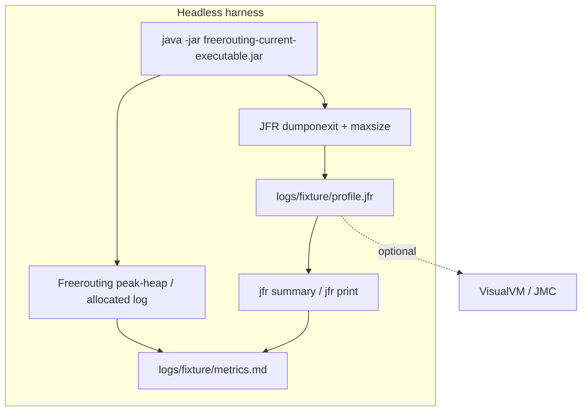
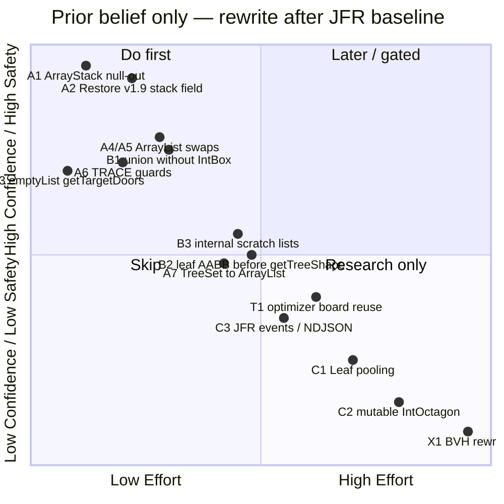
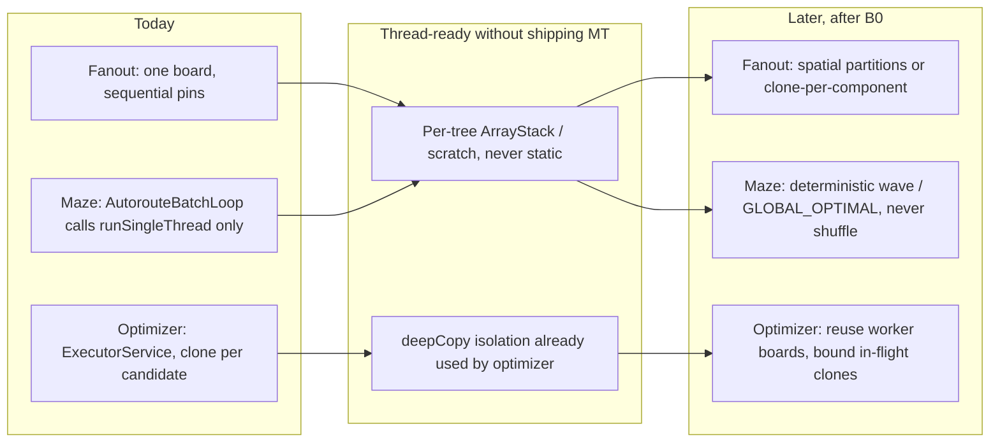
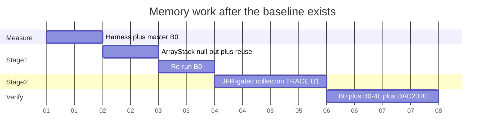

# Freerouting Memory Allocation, Peak Heap, and Thread-Readiness Plan

**Document status:** Working research specification (code-reviewed, not yet measured)
**Date:** 11 September 2026
**Target branch:** `research/peak-heap-allocation-optimization`
**Primary tooling:** JDK Flight Recorder (JFR) + JDK 25 CLI (`jfr`, `jcmd`, `jstat`)
**Secondary tooling:** VisualVM / JDK Mission Control (optional GUI over `.jfr` / `.hprof`)
**Harness pattern:** [`scripts/tests/run_test_Issue420_oom.ps1`](../../scripts/tests/run_test_Issue420_oom.ps1)
**Benchmark source for fixture selection:** [`scripts/benchmark/results/benchmarks.json`](../../scripts/benchmark/results/benchmarks.json) (2.5.0-RC2, 1157 PCBench boards)

**Related components:**

- [`ArrayStack`](../../src/main/java/app/freerouting/datastructures/ArrayStack.java)
- [`MinAreaTree`](../../src/main/java/app/freerouting/datastructures/MinAreaTree.java)
- [`ShapeSearchTree`](../../src/main/java/app/freerouting/board/searchtree/ShapeSearchTree.java), [`ShapeSearchTree45Degree`](../../src/main/java/app/freerouting/board/searchtree/ShapeSearchTree45Degree.java), [`ShapeSearchTree90Degree`](../../src/main/java/app/freerouting/board/searchtree/ShapeSearchTree90Degree.java)
- [`IncompleteFreeSpaceExpansionRoom`](../../src/main/java/app/freerouting/autoroute/expansion/IncompleteFreeSpaceExpansionRoom.java)
- [`Sorted45DegreeRoomNeighbours`](../../src/main/java/app/freerouting/autoroute/expansion/Sorted45DegreeRoomNeighbours.java) (same `LinkedList` pattern in orthogonal / any-angle siblings)
- [`AutorouteEngine`](../../src/main/java/app/freerouting/autoroute/maze/AutorouteEngine.java), [`MazeSearchEngine`](../../src/main/java/app/freerouting/autoroute/maze/MazeSearchEngine.java)
- [`BatchFanout`](../../src/main/java/app/freerouting/autoroute/pipeline/BatchFanout.java)
- [`BatchOptimizer`](../../src/main/java/app/freerouting/autoroute/pipeline/BatchOptimizer.java)
- [`AutoroutePassRunner`](../../src/main/java/app/freerouting/autoroute/pipeline/AutoroutePassRunner.java)
- [`FRLogger`](../../src/main/java/app/freerouting/logger/FRLogger.java)
- [`RouterJobResourceUsage`](../../src/main/java/app/freerouting/core/RouterJobResourceUsage.java)
- [`FeatureFlagsSettings.multiThreading`](../../src/main/java/app/freerouting/settings/FeatureFlagsSettings.java)

---

## 0. How to use this document

This is a **working specification**, not a measured diagnosis. The September 2026 draft mixed three
things that must stay separate:

1. **Verified code facts** (readable in `src/main` today).
2. **Plausible hypotheses** (likely hot, but unprofiled).
3. **Unsourced impact numbers** (the old “>40% Eden drop”, “70–80% AABB reject”, “millions of
   objects per second”). Those numbers are **not** acceptance criteria until a JFR baseline exists.

Work the plan in this order: **measure → smallest safe fix → re-measure → only then consider
pooling or geometry rewrites**. Do not start with leaf pooling, custom JFR events, NDJSON logging,
or GitHub Actions hygiene.

**After every optimization change, re-run the frozen B0 baseline in §6.2.** That is the only
comparison that counts. Do not invent a new command line per experiment. If a change needs a
different fixture or flag, add a named variant (B0-maze, B0-4L, …) and keep B0 itself immutable.

---

## 1. Executive summary

Freerouting’s maze router allocates heavily in search-tree walks and expansion-room construction.
Two different problems are easy to confuse, and they need different fixes:

| KPI | What it is | Why it matters | Typical cause |
| :--- | :--- | :--- | :--- |
| **Peak heap** | High-water `MemoryMXBean.getHeapMemoryUsage().getUsed()` | OOM risk, working-set, user-visible RAM | Retained rooms/trees, survivor promotion, `BoardHistory` snapshots, multi-thread `deepCopy` |
| **Allocation rate** | Bytes allocated per second / per pass (`ThreadMXBean.getThreadAllocatedBytes`) | GC CPU, pause frequency, throughput | Per-query `ArrayStack(10000)`, `LinkedList` nodes, `TreeSet` entries, `IntOctagon`/`IntBox`, eager TRACE strings |
| **GC pause** | Young/mixed/full pause time from JFR | Interactive latency | Consequence of the two above, not a third independent lever |

The highest-confidence finding from code review is not a new invention: **v1.9 already reused one
`ArrayStack` per `MinAreaTree`**, while current code allocates `new ArrayStack<>(10000)` on every
`overlaps()` / `completeShape()` call. Restoring that reuse (with slot-clearing) is the first
algorithmic change, and it is a regression fix rather than an experiment.

Everything else in this document is ranked **after** the frozen **B0** baseline in §6.2 (single-thread
pipeline on DiscoDongle, plus a maze-only JFR slice). Allocation work stays single-thread until B0
is stable; thread-readiness work in §12 must not break that isolation.

### Non-negotiable constraints

- **JFR first.** No pool, scratch buffer, or geometry shortcut ships without a before/after
  allocation note (`jdk.ObjectAllocationSample`, `jdk.GarbageCollection`, `jdk.GCHeapSummary`).
- **Measure peak heap, not cumulative GB.** The log line `"the job allocated X GB of memory so far"`
  is a monotonic GC-throughput counter. The authoritative live figure is `"peak heap usage: Y MB"`
  (sampled from `MemoryMXBean` about once per second in
  [`RoutingJobSchedulerActionThread`](../../src/main/java/app/freerouting/management/jobs/RoutingJobSchedulerActionThread.java)).
- **No default BVH / sector-parallel tree rewrite.** Keep `ShapeSearchTree` / `MinAreaTree`.
- **Routing parity.** No new clearance violations via `DesignRulesChecker.getAllClearanceViolations()`,
  and no completion-rate regression versus the current master / v2.3.0 baseline on the agreed
  fixtures.
- **Determinism on all three stages.** Fanout, maze, and optimizer must produce the same
  board (same nets, vias, score, DRC) for a given seedless sequential policy, independent of
  thread count. No shuffled “quality lottery.” Parallelism is allowed only when it is a faster
  evaluation of a **fixed** candidate set with a **stable** reduction (optimizer-style
  `GLOBAL_OPTIMAL`), or a partition that is observably independent and committed in a fixed
  order. Faster and still good beats lucky and different.
- **Do not enable TRACE while collecting an allocation baseline.** TRACE will dominate the profile
  and make every other hotspot look small.
- **B0 is always 1+1 threads.** Pin `--router.max_threads=1` **and**
  `--router.optimizer.max_threads=1`. The optimizer already runs a worker pool at default
  `CPU−1` and `deepCopy()`s the board per candidate; leaving that on makes ArrayStack wins
  invisible in peak heap. `-mt` is **not** a substitute (it only sets optimizer threads).
- **Do not mix unrelated CI workflow fixes into this branch.** See [Decision 8](#decision-8-ci-hygiene-is-out-of-scope-for-this-branch).
- **Thread-readiness is a constraint, not a feature ship.** Fanout, maze, and optimizer code
  touched here must remain safe to run concurrently later (no static scratch, no shared trees,
  no returned-list reuse). Wiring production multi-thread autorouter/fanout is **out of scope**
  for merge until §12 decisions are resolved. See [Decision 7](#decision-7-b0-stays-single-thread-thread-readiness-is-a-parallel-track).

---

## 2. Critical review of the previous draft

These are the mistakes the rest of this document corrects. Keep this section; it prevents the next
pass from reintroducing them.

| Previous claim | Reality | Consequence |
| :--- | :--- | :--- |
| `jdk.ObjectAllocationInNewTLAB` / `OutsideTLAB` are the primary JFR events | Disabled in both `default.jfc` and `profile.jfc` since JDK 16. The live event is **`jdk.ObjectAllocationSample`** (throttled; 150/s in `default`, higher in `profile`) | `jfr print --events jdk.ObjectAllocationInNewTLAB` on a `settings=profile` recording is empty |
| `-XX:+FlightRecorder` is required | On since JDK 11 | Harmless but cargo-cult |
| `duration=180s` is a good recording window | Maze passes on dense boards exceed 3 minutes; the recording **stops mid-job** | Truncated, incomparable profiles |
| `$pid = (Get-Process -Name java).Id` | `$pid` is a **reserved PowerShell automatic variable** (this process). Also matches every Java process on the machine | Wrong PID, failed `jcmd` |
| `-mt 1` makes the autorouter single-threaded | `-mt` sets **`optimizer.maxThreads` only**. Autorouter parallelism is `--router.max_threads=1`. Default `maxThreads` is `CPU−1` | Baseline would not be single-thread |
| `-mi 150` caps routed items | **There is no `-mi` short flag.** Use `--router.autorouter.max_items=150` | The cap is silently ignored |
| Peak heap = `Runtime.totalMemory() − freeMemory()` | That is committed/used Eden-inclusive heap, not the figure Freerouting logs. Prefer `MemoryMXBean` used-heap + JFR `GCHeapSummary` | Incomparable with production logs |
| `ArrayStack` currently leaks | `pop()` / `reset()` leave stale slots, **but instances are discarded today**, so there is no live leak. The leak appears **only after reuse is added** | Null-out is a **prerequisite** for reuse, not an independent peak-heap win |
| “Fix ArrayStack retention” is the highest-impact item | Highest impact is **restoring v1.9 field reuse**. Null-out without reuse changes almost nothing | Wrong sequencing |
| AABB fast-path in `completeShape` rejects 70–80% of obstacles | [`IntOctagon.overlaps()`](../../src/main/java/app/freerouting/geometry/planar/IntOctagon.java) **already** early-outs on X then Y AABB before diagonal tests. Unsourced 70–80% | M2 as originally written is mostly already implemented |
| Primitive math in `calcOutsideRestrainedShape` is a medium-effort win | That method **already** works on eight `int` locals and allocates one `IntOctagon` at the end | Do not spend a phase “introducing” it |
| Ping-pong scratch lists for `completeShape` result | `completeShape` **returns** `result`. Reusing that list on the next call mutates a collection the caller still holds | Correctness hazard; see [Decision 2](#decision-2-scratch-list-lifetime) |
| TRACE is a production allocation hotspot | Default console level is INFO, file level is DEBUG. TRACE I/O is off. **Eager `+` concatenation still allocates** before `FRLogger.trace(String)` | Guard concatenations; do not rebuild the logging stack as part of this work |
| Custom JFR events / NDJSON are Stage-1 work | Observability project. Can wait. Custom events are useful **after** the allocation baseline exists | Do not block reuse / collection fixes |
| Leaf pooling is a medium-priority follow-up | Pooling on G1/ZGC often **raises peak heap** while lowering allocation rate. Only revisit if JFR still shows `Leaf`/`InnerNode` as top sampled types **and** peak heap is the remaining problem | Gate behind [Decision 5](#decision-5-object-pooling-is-opt-in-after-stage-1) |
| GitHub Actions Node 20 / Build Scan warnings belong here | Orthogonal to maze-router memory | Separate PR; see Decision 8 |
| Success = “>40% allocation-rate drop” | Unsourced. A 5% peak-heap drop with no DRC regression can still be a win | Use measured deltas, not pre-committed percentages |

---

## 3. Verified code facts (no profiler required)

### 3.1 v1.9 reused the search-tree walk stack; current code does not

```19:32:src_v19/main/java/app/freerouting/datastructures/MinAreaTree.java
  protected ArrayStack<TreeNode> node_stack = new ArrayStack<>(10000);
  // ...
  public Set<Leaf> overlaps(RegularTileShape p_shape) {
    // ...
    this.node_stack.reset();
    this.node_stack.push(this.root);
```

Current code:

```25:31:src/main/java/app/freerouting/datastructures/MinAreaTree.java
  public Set<Leaf> overlaps(RegularTileShape shape) {
    Set<Leaf> foundOverlaps = new TreeSet<>();
    // ...
    ArrayStack<TreeNode> nodeStack = new ArrayStack<>(10000);
```

The same per-call `new ArrayStack<>(10000)` exists in:

- `ShapeSearchTree.completeShape`
- `ShapeSearchTree45Degree.completeShape`
- `ShapeSearchTree90Degree.completeShape`

Each construction allocates a 10 000-slot `Object[]` (~40 KB with compressed oops). These walks run
once per expansion-room completion and once per overlap query. That is the strongest allocation-rate
hypothesis in the tree.

`ArrayStack.pop()` and `reset()` still leave stale references. That is **harmless while the stack is
garbage-collected with the call**, and **mandatory to fix before the v1.9 field is restored**.

### 3.2 `MinAreaTree.overlaps()` also allocates a `TreeSet` per query

Even after the stack is reused, every overlap query builds a `TreeSet<Leaf>` (`TreeMap.Entry`
churn). `overlappingTreeEntries()` then iterates that set and allocates a `TreeEntry` per hit.
`completeShape` in the 45°/90° trees walks the tree itself and does **not** go through `overlaps()`,
so the `TreeSet` cost is concentrated on neighbour / clearance queries, not room completion.

### 3.3 Expansion-room collections are `LinkedList`-heavy

Hot constructors still do `new LinkedList<>()` for:

- `completeShape` result and per-obstacle `newResult` (all three angle trees)
- `overlappingLeaves` in any-angle `completeShape` (then `Collections.sort`)
- `Sorted45DegreeRoomNeighbours`, `SortedOrthogonalRoomNeighbours`, `SortedRoomNeighbours`
  overlapping-entry lists (then `((LinkedList) list).sort(...)`)

`LinkedList.sort()` dumps to an array anyway. An `ArrayList` with a modest `ensureCapacity` is the
same algorithm with cheaper nodes. This is a real, low-risk collection-type swap — **if** JFR shows
`LinkedList$Node` in the sample.

### 3.4 `getTargetDoors()` allocates an empty `ArrayList` for every incomplete room

```32:35:src/main/java/app/freerouting/autoroute/expansion/IncompleteFreeSpaceExpansionRoom.java
  public Collection<TargetItemExpansionDoor> getTargetDoors() {
    return new ArrayList<>();
  }
```

Callers in `MazeSearchEngine` only iterate. `Collections.emptyList()` is correct (confirmed: no
caller mutates the returned collection). Cheap, tiny, do it when touching the file; do not expect a
measurable peak-heap change.

### 3.5 Eager TRACE concatenation is real; TRACE I/O is not the default bottleneck

`FRLogger.trace(String)` does **not** take a `Supplier`. Call-site `+` runs before the method.
Default appender levels are INFO (console) and DEBUG (file), so the built string is thrown away.
The 5-argument `FRLogger.trace(method, operation, …)` path **is** guarded by `granularTraceEnabled`
(off unless detailed logging is requested).

Action: wrap 1-arg concatenations in hot geometry with `if (FRLogger.isTraceEnabled())`. Do **not**
introduce NDJSON or custom JFR events as a prerequisite.

### 3.6 `IntOctagon` is already mostly the “primitive math” design

- `overlaps()` does AABB X, AABB Y, then diagonals. No extra AABB wrapper is needed in front of it.
- `calcOutsideRestrainedShape` / `calcInsideRestrainedShape` already use eight `int` locals.
- Remaining waste in `completeShape`: `newBoundingShape.union(currentShape.boundingBox())` allocates
  a fresh `IntBox` (`boundingBox()`) and then another octagon via `union(IntBox)` → `toIntOctagon()`.
  Prefer `union(currentShape)` (octagon–octagon) or a primitive AABB expand.

A **useful** fast-path that is **not** already present: skip `getTreeShape().boundingOctagon()` when
`currentLeaf.boundingShape` is AABB-disjoint from the current room bounds. That avoids materializing
the obstacle shape.

### 3.7 Thread isolation is already good enough for tree-scoped scratch buffers

[`AutoroutePassRunner.runMultiThread`](../../src/main/java/app/freerouting/autoroute/pipeline/AutoroutePassRunner.java)
`deepCopy()`s the board per worker. Each thread therefore owns its own search trees. A field on
`MinAreaTree` / `ShapeSearchTree` is thread-confined **as long as trees are never shared across
threads**. This matches v1.9 and makes `ThreadLocal` unnecessary for Stage 1.

Single-thread work (`--router.max_threads=1`) never hits this path.

### 3.8 Peak-heap retention that is already handled

[`BoardHistory`](../../src/main/java/app/freerouting/autoroute/BoardHistory.java) is capped at 30
serialized snapshots (Issue 684). Do not re-litigate that as a new leak.

Multi-thread peak heap is dominated by **N live board copies**, not by `ArrayStack`. B0 therefore
pins both thread knobs to 1. Optimizer clones are already live in default CLI; maze clones are
not. Details and future designs: §12 and [Decision 7](#decision-7-b0-stays-single-thread-thread-readiness-is-a-parallel-track).

### 3.9 Expansion rooms themselves are retained in the autoroute tree

`AutorouteEngine` inserts completed rooms into `autorouteSearchTree` and removes them later. That
is **leaf churn in the tree**, which is why `Leaf`/`InnerNode` pooling is tempting — and also why
pooling those nodes can pin a large free-list in the old generation. Measure first.

### 3.10 Threading facts (all three stages)

- **Fanout** mutates one board sequentially. There is no worker pool.
- **Maze** production path is `runSingleThread` only. `runMultiThread` exists, is unused, shuffles
  item order, and `join`s for **1 second**.
- **Optimizer** always uses `Executors.newFixedThreadPool(optimizer.maxThreads)` with a
  `deepCopy()` per candidate. Default `maxThreads` is `CPU−1`. This is independent of
  `featureFlags.multiThreading` (default false).
- `-mt` sets **optimizer** threads only. `--router.max_threads` is the maze/GUI knob and is not
  what the batch loop currently honors for parallelism.

---

## 4. What we do not know yet (must measure)

Fill this table from the first JFR + log baseline. Until then, do not quote percentages.

| Question | How to answer | Blocks |
| :--- | :--- | :--- |
| Top sampled allocated types on B0-maze (DiscoDongle, 1 maze pass, 1+1 threads) | `jfr print --events jdk.ObjectAllocationSample` aggregated by type | Every Stage 1 claim |
| Peak heap (MB) and allocation GB for that same run | `"peak heap usage"` / `"total allocated"` log lines + `jdk.GCHeapSummary` | KPI definition |
| Young GC count / pause vs mixed/old | `jfr print --events jdk.GarbageCollection` | Whether Eden churn even matters |
| Max `ArrayStack` depth actually used | Counter in a debug build, or JFR + a one-line max-level field | Whether 10 000 is oversized |
| Whether `LinkedList$Node`, `TreeMap$Entry`, `Object[]`, `IntOctagon`, `String`/`StringBuilder` appear in the top 15 | Same sample event | Which quick wins to keep |
| Whether a 150-item maze slice has the same type mix as B0-maze | B0-maze vs B0-maze-mi150 | Whether cheap slices are representative |
| Fanout vs maze vs optimizer share of peak heap | Isolate with `--router.fanout.enabled=false` and `--router.optimizer.enabled=false` | Scope of “maze-only” work |
| Promotion: are rooms/octagons surviving into old gen, or dying in Eden? | `jdk.OldObjectSample` + survivor occupancy in `jstat` | Peak-heap vs allocation-rate split |

---

## 5. KPI definitions and how to measure them

Use three numbers on every run, written into `logs/<fixture>/metrics.md`:

1. **Peak heap (MB)** — Freerouting log `"peak heap usage: Y MB"`. Corroborate with the max
   `jdk.GCHeapSummary` heap used. Optional: OS working-set sampler from the Issue 420 script
   (process RSS, includes off-heap / code cache; useful as a sanity bound, not the primary KPI).
2. **Allocation during the maze stage (GB)** — same log line’s `"X GB total allocated"` for the
   autorouter stage, **not** the whole process if fanout/optimizer ran.
3. **Quality** — incomplete nets, `DesignRulesChecker.getAllClearanceViolations().size()`, score.

Sampling caveat: peak heap is updated about once per second. Short spikes between samples are
missed. JFR heap summaries after GC are the backstop. Do **not** set a large `-Xms`; it inflates
committed heap and confuses RSS. Prefer `-Xms256m -Xmx4g` (same as Issue 420) unless a board OOMs.

Do **not** change the GC (`G1` is JDK 25 default). Switching to ZGC is out of scope; it would
invalidate every comparison.

---

## 6. Measurement protocol (corrected)

### 6.1 Why JFR stays the primary profiler

Low overhead, no extra agent, CLI-friendly, recordings load in VisualVM/JMC when a GUI helps.
Use **`jdk.ObjectAllocationSample`**, not the disabled TLAB events. If a type is huge but rare,
raise throttle with a custom `.jfc` (`allocation-profiling=high` or `1000/s`) for a second
recording — never enable `ObjectAllocationInNewTLAB` on a full B0 run unless a 10-second
snippet is required to confirm a specific type.



### 6.2 Frozen B0 baseline (the measurement you repeat)

**B0 is the contract.** Capture it once on `master`, then re-run the **identical** command after
every optimization (A1/A2, collection swaps, TRACE guards, …). Compare medians, not single shots.
If the command line changes, you no longer have a baseline — you have a new experiment.

Why DiscoDongle (see §11): among 1015 completed 2.5.0-RC2 PCBench runs it is the board that
exercises **all three stages for ~20 s each**, finishes in ~70 s, is **fully routed with 0 DRC**,
and has a ~770 MB peak heap — large enough to see a 5–10% delta, small enough to iterate.

#### B0 — full pipeline, single thread, all three stages

```powershell
# Build once per git SHA
.\gradlew.bat executableJar

$Out = "logs\B0-DiscoDongle"
New-Item -ItemType Directory -Force -Path $Out | Out-Null

# Frozen flags. Do not add max_items / max_passes. Do not use -mt / -mi / $pid.
# Pin BOTH thread knobs: optimizer already pools at CPU-1 by default.
java -Xms256m -Xmx4g `
     -XX:StartFlightRecording=dumponexit=true,filename=$Out\profile.jfr,settings=profile,maxsize=512m `
     -Xlog:gc*:file=$Out\gc.log:time,uptime:filecount=3,filesize=20M `
     -jar build/libs/freerouting-current-executable.jar `
     -de scripts\benchmark\fixtures\PCBench\disco-dongle_DiscoDongle\unrouted.dsn `
     --gui.enabled=false `
     --router.fanout.enabled=true `
     --router.optimizer.enabled=true `
     --router.max_threads=1 `
     --router.optimizer.max_threads=1
```

**Repeat count:** 3 consecutive runs on the same machine. Record git SHA, `java -version`, and
the exact argv. Report **median** peak heap, median stage times, median allocation GB, and the
quality triple (unrouted, violations, score). A single run is for JFR type mix only.

**What to paste back into this document** (table in §11.3): wall s, fanout s, autorouter s,
optimizer s, peak heap MB, allocated GB (per stage if logged), unrouted, violations, score.

#### B0-maze — JFR iteration slice (maze only)

Use this when you need a short allocation profile of `completeShape` / `MinAreaTree`. It is **not**
a substitute for B0 at merge time.

```powershell
java -Xms256m -Xmx4g `
     -XX:StartFlightRecording=dumponexit=true,filename=logs\B0-maze\profile.jfr,settings=profile,maxsize=512m `
     -jar build/libs/freerouting-current-executable.jar `
     -de scripts\benchmark\fixtures\PCBench\disco-dongle_DiscoDongle\unrouted.dsn `
     --gui.enabled=false `
     --router.fanout.enabled=false `
     --router.optimizer.enabled=false `
     --router.max_threads=1 `
     --router.optimizer.max_threads=1 `
     --router.autorouter.max_passes=1
```

Optional tighter slice for crash-loop JFR: add `--router.autorouter.max_items=150`. Always label
the artifact `B0-maze-mi150` so it is never compared to B0.

#### Named confirmation variants (not B0)

| Name | Fixture | When to run |
| :--- | :--- | :--- |
| **B0-heap** | `PowerGloveUHID_main_board` | After B0 looks good; higher peak heap (~1.3 GB on RC2) |
| **B0-4L** | `kitspace_minisumo_v3` | 4-layer maze stress (~78 s autorouter) |
| **B0-inrepo** | `fixtures/Issue190-processor.Z80.dsn` | PCBench checkout missing; maze-only fallback |
| **B0-smoke** | `fixtures/Issue508-DAC2020_bm01.dsn` | Every maze-touching PR (`Dac2020Bm01RoutingTest`) |

Same frozen JVM flags and 1+1 threads as B0. Do not change B0 because a confirmation board is slow.

Parse:

```powershell
jfr summary logs/B0-DiscoDongle/profile.jfr

jfr print --events jdk.ObjectAllocationSample --stack-depth 16 `
          logs/B0-DiscoDongle/profile.jfr |
  Out-File -FilePath logs/B0-DiscoDongle/alloc_samples.txt -Encoding utf8

jfr print --events jdk.GarbageCollection,jdk.GCHeapSummary,jdk.OldObjectSample `
          logs/B0-DiscoDongle/profile.jfr |
  Out-File -FilePath logs/B0-DiscoDongle/gc_events.txt -Encoding utf8
```

Live telemetry, if wanted, in a second terminal. Capture the Java PID from the `Start-Process
-PassThru` object (Issue 420 pattern), never from `Get-Process java`:

```powershell
jstat -gcutil $javaPid 1000
```

### 6.3 Dynamic `jcmd` (already-running job)

```powershell
jcmd $javaPid JFR.start name=route settings=profile filename=logs/B0-DiscoDongle/route.jfr maxsize=512m
jcmd $javaPid JFR.check
jcmd $javaPid JFR.dump name=route filename=logs/B0-DiscoDongle/route_dump.jfr
jcmd $javaPid JFR.stop name=route
# Heap dump only when investigating retained peak, not for allocation rate
jcmd $javaPid GC.heap_dump logs/B0-DiscoDongle/peak_heap.hprof
```

### 6.4 Script to write

Create `scripts/tests/profile_allocation_B0.ps1` by copying the Issue 420 harness:

- Parameters: `Profile` (`B0` / `B0-maze` / `B0-heap` / `B0-4L` / `B0-inrepo`), `Repeats`
  (default 3), `SkipBuild`, `EnableJfr` (default on for first repeat only).
- Always pass `--router.max_threads=1` and `--router.optimizer.max_threads=1`.
- Redirect stdout to `logs/<profile>/route-<n>.log`; parse peak heap / allocated / score / stage
  times.
- Write `logs/<profile>/metrics.md` with command line, git SHA, JVM version, per-repeat rows, and
  medians.

Do not invent a second logging format.

---

## 7. Optimization catalog

Impact and effort below are **prior beliefs**, to be rewritten after the baseline. “Evidence” is
what we can see in source today.

| ID | Change | KPI | Effort | Risk | Evidence | Do when |
| :--- | :--- | :--- | :--- | :--- | :--- | :--- |
| **A1** | Null slots in `ArrayStack.pop()` / `reset()` | Enables A2; not a peak win alone | Hours | Very low | Source | First commit, with unit tests |
| **A2** | Restore per-tree `ArrayStack` field (v1.9) in `MinAreaTree` and the three `completeShape` walks | Allocation rate (likely large) | Hours | Low if A1 is in | v1.9 vs current | Immediately after A1 |
| **A3** | `getTargetDoors()` → `Collections.emptyList()` | Allocation rate (tiny) | Minutes | Very low | Source + caller audit | With A1/A2 or any adjacent edit |
| **A4** | `LinkedList` → `ArrayList` in the three `Sorted*RoomNeighbours` | Allocation rate | Hours | Low (keep sort comparator) | Source | If JFR shows `LinkedList$Node` |
| **A5** | Same swap for `completeShape` **local** lists that are not returned | Allocation rate | Hours | Low | Source | If JFR shows `LinkedList$Node` |
| **A6** | Guard hot `FRLogger.trace(String)` concatenations with `isTraceEnabled()` | Allocation rate when TRACE off | Hours | Very low | Source | If `String`/`StringBuilder` appear, or as hygiene in touched files |
| **A7** | `MinAreaTree.overlaps()`: `TreeSet` → `ArrayList` (+ sort only if a caller needs order) | Allocation rate | Half day | Medium — callers may rely on `Leaf` ordering | Source | Only after checking every caller |
| **B1** | Avoid `boundingBox()` in the `newBoundingShape.union(...)` path; union octagons directly | Allocation rate | Hours | Low | Source | If `IntBox`/`IntOctagon` dominate samples |
| **B2** | AABB reject on `leaf.boundingShape` **before** `getTreeShape()` | CPU + some alloc | Half day | Medium — must not change visit/clip order | Source | After baseline; needs a parity fixture |
| **B3** | Reusable scratch `ArrayList` for **internal** `newResult` only; allocate a fresh list at return | Allocation rate | Half–1 day | Medium — see Decision 2 | Lifetime analysis | After A2; never reuse the returned collection |
| **C1** | `Leaf`/`InnerNode` pooling | Allocation rate; may **hurt** peak | Days | High | Unmeasured | Only if Decision 5 is yes |
| **C2** | Mutable / pooled `IntOctagon` | Allocation rate; correctness landmine (`EMPTY`, `precalculatedToSimplex`, sharing) | Days | Very high | Source | Default **no** |
| **C3** | Custom JFR events / NDJSON TRACE | Observability, not memory | Days | Low for JFR; high for log volume | — | Separate track, after Stage 1 |
| **T1** | Optimizer worker-local board reuse (one clone per thread, reset from snapshot) | Peak heap on default CLI | Days | Medium (determinism) | Optimizer already clones per item | After B0; Decision 14 |
| **X1** | BVH / sector-parallel tree | Unclear | Weeks | Extreme (parity) | — | Out of scope |
| **X2** | GC / `-XX` tuning as the “fix” | Distorts comparisons | Hours | Medium | — | Out of scope |



---

## 8. Recommendations (practical order)

1. **Do not write maze-router code until master B0 exists.** The harness plus §11.3 row is the
   first deliverable. Without it, every later PR is anecdotal.
2. **Ship A1+A2 as one change set** (null-out + restore the v1.9 field). This is the only item that
   is both historically proven and locally obviously wasteful. Add `ArrayStack` unit tests for
   `pop`/`reset` not retaining references (e.g. fill, pop, assert slot is null via a package-visible
   test hook or a small `size()`/`peek` plus a `reset` that actually nulls).
3. **Re-profile.** Keep A4–A6 / B1 only for types that still appear in the top samples.
4. **Treat B2/B3/A7 as parity-sensitive.** Each can change room partition order. Require
   `Dac2020Bm01RoutingTest` plus a B0 quality compare against master before merging.
5. **Do not pool `Leaf`/`InnerNode` or mutate `IntOctagon` in this project phase.**
6. **Keep TRACE/JFR-event work on a sidecar track.** Useful for parity investigations; irrelevant to
   peak heap if TRACE stays off.
7. **Keep CI action upgrades in a different PR.**
8. **Keep every allocation change thread-ready** (§12.6). Do not enable maze or fanout
   multi-threading in this branch. Optimizer worker-board reuse is a separate follow-up (T1).

---

## 9. Decision points

Resolve these in writing (update this section) before the corresponding code lands.

### Decision 1: Scratch-buffer ownership — **recommended: tree-scoped field (Option A)**

How should reusable `ArrayStack` / internal lists be scoped?

| Option | Idea | Pros | Cons |
| :--- | :--- | :--- | :--- |
| **A. Tree/engine field** | v1.9 `node_stack` on `MinAreaTree`; same for `completeShape` walks | Proven, no signature churn, thread-safe today because trees are not shared | Must null-out; must not share trees later |
| B. `ThreadLocal` | Transparent, pool-safe | Unnecessary given `deepCopy`; leak risk on thread death | Extra mechanism |
| C. `RoutingScratchpad` parameter | Explicit, testable | Touches every hot signature; large diff for no current gain | Save for a future concurrency model that shares trees |

**Recommendation:** Option A for Stage 1. Revisit C only if a future design shares one search tree
across threads.

**Open:** Should `completeShape` share the same stack instance as `overlaps()`, or own a second
10 000-slot array? Two arrays are ~80 KB retained — negligible. One shared stack is illegal if
`completeShape` can recurse into `overlaps()`. **Check for re-entrancy before sharing.**

### Decision 2: Scratch-list lifetime

`completeShape` returns `Collection<IncompleteFreeSpaceExpansionRoom>`. Callers retain that
collection.

- **Must not** ping-pong the returned list.
- **May** reuse an internal `newResult` buffer if, at return, surviving rooms are copied into a
  **new** `ArrayList` sized to `result.size()`.
- Safer first step: do not reuse room lists at all; only reuse `ArrayStack` and (optionally) the
  local `overlappingLeaves` list in any-angle `completeShape` (that list is not returned).

**Recommendation:** Stage 1 = stack reuse only. Stage 2 = internal lists, with an explicit copy-out
at return. Document the invariant next to the field.

### Decision 3: Primary KPI for “done”

Allocation-rate cuts can **increase** peak heap (retained scratch, pools). Peak-heap cuts can ignore
Eden churn that still burns CPU.

Pick one primary and one secondary:

| Choice | Primary | Secondary | Use when |
| :--- | :--- | :--- | :--- |
| **H (recommended)** | Peak heap (MB) must not increase; prefer a decrease | Allocation GB / pass down or flat; wall time not worse | User OOM / RSS complaints |
| T | Allocation GB / pass down | Peak heap not up more than noise | GC-bound CPU on dense boards |

**Recommendation:** **H**. This project is named for peak heap. Refuse pooling that raises peak heap
even if allocation rate drops.

**Open:** What is “noise”? Suggest ±5% peak heap or ±10 MB, whichever is larger, on the same machine
and JVM flags, three runs.

### Decision 4: B0-maze vs full B0

A 150-item slice is the right **iteration** budget (minutes, not hours). It can miss late-pass
retention (tree growth, room accumulation).

**Recommendation:** Gate allocation *code* on B0-maze JFR (DiscoDongle, 1 maze pass). **Before
merge**, run full **B0** (3×). Do not require a 100-pass OOM soak for collection-type swaps; that
belongs to Issue 420-style scripts if peak heap still climbs across passes.

### Decision 5: Object pooling is opt-in after Stage 1

Pooling `Leaf`/`InnerNode` (or octagons) is **not** the default next step if A2 already removes the
giant `Object[]` churn.

Proceed to C1 only if **all** of:

1. Post-A2 JFR still lists `Leaf` / `InnerNode` / `IntOctagon` in the top sampled types.
2. Peak heap (KPI H) is still the problem, **or** young GC pauses are clearly CPU-bound.
3. A pool prototype on a throwaway branch shows peak heap **not** worse.

Otherwise stop.

### Decision 6: TRACE as a profiling asset vs TRACE as waste

Two goals conflict:

- **Memory:** never build strings in hot paths unless TRACE is on.
- **Parity/debug:** structured, diffable expansion traces.

**Recommendation:** For this branch, only add `isTraceEnabled()` guards. A later observability
change may add `FRLogger.trace(Supplier<String>)` and, separately, custom JFR events. NDJSON can
wait until a consumer exists (`scripts/tests/compare-versions.ps1` still regex-scrapes PatternLayout
logs). Do not replace those logs in this workstream.

### Decision 7: B0 stays single-thread; thread-readiness is a parallel track

Each extra maze or optimizer worker that `deepCopy()`s a `RoutingBoard` dominates peak heap and
makes ArrayStack work unmeasurable. The optimizer **already** pools at `CPU−1` unless
`--router.optimizer.max_threads=1` is set.

**Recommendation:**

- B0 and all allocation A/B items stay **1+1 threads**.
- Code changes in this branch must be **thread-ready** (instance-scoped scratch, no static
  mutable buffers, no sharing a search tree across workers). That is cheap now and expensive later.
- Do **not** wire `AutoroutePassRunner.runMultiThread` into the batch loop, and do not parallelize
  fanout, as part of an allocation PR.
- Explore viability in §12; implement only after B0 is stable and Decisions 11–14 are answered.

### Decision 11: Optimizer threads in nightly vs B0

Nightly PCBench peak-heap numbers include optimizer worker clones (`optimizer.maxThreads` defaults
to `CPU−1`). DiscoDongle RC2 job peak 772 MB vs autorouter-stage 277 MB is consistent with that.

**Recommendation:** B0 pins optimizer threads to 1 so allocation diffs are about the maze/fanout
engine, not about `N` board copies. A later **B0-optN** variant (N = 4) is how we measure clone
cost, not how we iterate ArrayStack.

### Decision 8: CI hygiene is out of scope for this branch

Node 20 deprecation and `build-scan-terms-of-service-*` → `build-scan-terms-of-use-*` in
[`.github/workflows/gradle-build-on-pr.yml`](../../.github/workflows/gradle-build-on-pr.yml) are
real, small, and **unrelated**. Mixing them here pollutes review and delays profiling.

**Recommendation:** Separate PR on `master`. Do not block memory work on it. Notes for that PR are
in [Appendix B](#appendix-b-github-actions-warnings-separate-pr).

### Decision 9: Angle-restriction coverage

DiscoDongle (B0) and PowerGlove are 2-layer boards and will typically exercise
`ShapeSearchTree45Degree`. minisumo is 4-layer, still 45°-class. Any-angle
`ShapeSearchTree.completeShape` still has its own `ArrayStack(10000)` and `LinkedList`
overlapping-leaf sort. In-repo Issue190 is the same 45° family.

**Recommendation:** Implement A1/A2 in **all three** trees in the same change (copy-paste of a
10-line pattern). Do not wait for an any-angle fixture to “prove” the 45° win first; the bug is the
same allocation.

### Decision 10: Compensated-tree count vs retained scratch

`SearchTreeManager` keeps a default tree plus per-clearance-class autoroute trees. One
`ArrayStack(10000)` per tree is a few tens of KB. Acceptable.

**Open:** If someone later adds per-query scratch lists of rooms with large `ensureCapacity`, cap
them or they become a real peak-heap cost. Record the cap next to the field.

---

## 10. Remaining questions and recommendations

Resolved by policy (do not re-open without a written reversal):

- **Determinism** on fanout, maze, and optimizer. Thread count must not change the committed board.
- **No quality lottery.** Shuffle / N-random-full-passes is rejected even if seeded.
- **B0** is DiscoDongle, 1+1 threads, all three stages, 3-run median.
- **CI workflow upgrades** are a separate PR.
- **No BVH / mutable `IntOctagon` / TRACE-NDJSON** in this branch.

Still open — answer during Phase 0–2 and write the answer back here. Grouped the same way the
work should proceed:

- **Measure first:** Q1, Q7, Q8, Q11
- **Allocation (this branch):** Q2, Q3, Q4, Q5, Q6, Q9, Q10, Q12, Q13, Q14, Q15, Q21
- **Deterministic multi-threading (later):** Q16, Q17, Q18, Q19, Q20

**This week’s order:** B0 measurement (Q1) → `ArrayStack` null-out + v1.9 reuse (Q2, Q12) → re-run
B0 → only then JFR-gated collection/TRACE work. Do not wire maze or fanout threads until a
deterministic wave/partition exists and beats B0 on wall time, DRC, and completion.

| # | Question | Recommendation |
| :--- | :--- | :--- |
| Q1 | On master B0 and B0-maze, what are the top 15 `jdk.ObjectAllocationSample` types and the peak heap MB? | **Measure first.** Do not start A1/A2 until this row exists in §11.3. |
| Q2 | Does restoring the v1.9 `ArrayStack` field (A2) cut peak heap, or only allocation GB? | **Ship A2 anyway** if allocation GB drops and peak heap is not worse. Peak heap may be optimizer clones, not Eden churn. |
| Q3 | Is `completeShape` re-entrant with `overlaps()` on the same tree? | **Assume two stacks** until a short call-graph check says otherwise. 80 KB retained is cheaper than a corrupt walk. |
| Q4 | Which `overlaps()` callers require `TreeSet` / `Leaf` ordering? | **Keep `TreeSet` until audited.** A7 is optional and parity-sensitive. |
| Q5 | Can we skip `getTreeShape()` when `leaf.boundingShape` is AABB-disjoint (B2)? | **Prototype only after A2**, on DAC2020 + B0. If any room partition changes, drop B2. |
| Q6 | How much of peak heap is the compensated autoroute tree vs young-gen noise? | **One diagnostic heap dump** at pass end on B0-maze (`OldObjectSample`). Do not `System.gc()` in production. |
| Q7 | How much of DiscoDongle’s ~772 MB nightly peak is optimizer clones (`CPU−1`) vs maze working set (1 thread)? | **Run B0 vs B0-optN=4 once.** If most of the peak is clones, T1 (worker-board reuse) outranks further maze micro-opts for default CLI. |
| Q8 | After pinning optimizer to 1 thread, is DiscoDongle optimizer still ~20 s? | **Expect it to get slower** (nightly 20 s was parallel). B0 wall time is the new truth; do not chase RC2’s 71 s under different thread counts. |
| Q9 | Does `IntOctagon.normalize()` allocate a second octagon on the restrain path? | **Only if it appears in B0-maze samples.** Then return `this` when already tight; never for `EMPTY`. |
| Q10 | Should CI assert a peak-heap ceiling? | **Log B0 heap, do not assert** until three machines agree within Decision 3 noise. |
| Q11 | KPI: peak heap (H) vs allocation rate (T)? | **H primary, T secondary.** Refuse pooling that raises peak heap. Noise: ±5% or ±10 MB, whichever is larger, median of 3. |
| Q12 | Scratch ownership: tree field vs `ThreadLocal` vs context parameter? | **Tree field (v1.9).** `ThreadLocal` only if trees are ever shared (they are not). |
| Q13 | Reuse `completeShape` result lists (ping-pong)? | **No.** Returned collections are caller-owned. Internal `newResult` reuse only with copy-out at return, and only after A2. |
| Q14 | Object-pool `Leaf`/`InnerNode`? | **No unless Q1 still shows them after A2 and peak heap is still the problem.** Pools often raise old-gen. |
| Q15 | TRACE as profiler vs waste? | **This branch: `isTraceEnabled()` guards only.** No NDJSON, no custom JFR events. |
| Q16 | Maze MT model? | **Deterministic wave (D), not tournament (A).** Wave size is a setting, independent of thread count, so T=1 and T=N match. Sequential greedy remains B0. |
| Q17 | Fanout MT? | **Not in this branch.** Later: disjoint components, commit in component-id order, sequential fallback. |
| Q18 | Optimizer already parallel — keep default `CPU−1`? | **Keep for production; pin to 1 in B0.** Follow-up T1: one cloned board per worker, reset from snapshot, `GLOBAL_OPTIMAL` reduction **in item-id order** so early-exit cannot race. |
| Q19 | `featureFlags.multiThreading` vs `optimizer.maxThreads` disagree. | **Document the split now.** Unify later. Do not disable optimizer threads globally in this branch. |
| Q20 | Delete `runMultiThread` or repair `join(1000)` + shuffle? | **Do not repair the lottery.** Delete or quarantine the method. A future D path is new code. |
| Q21 | Cap size of reused scratch lists? | **Yes if we add them:** cap at a documented constant; 10 000-slot `ArrayStack` per tree is already fine (~40 KB). |

---

## 11. Fixture group (selected from PCBench 2.5.0-RC2)

Source: [`scripts/benchmark/results/benchmarks.json`](../../scripts/benchmark/results/benchmarks.json),
version **2.5.0-RC2**, 1157 boards, 1015 completed. Paths below are under
`scripts/benchmark/fixtures/`. Wall / heap / quality are **nightly default-thread** numbers (optimizer
likely at `CPU−1`); B0 will re-measure them at 1+1 threads. Use the nightly table to choose boards,
not as the B0 KPI.

### 11.1 Why these boards

Selection filters applied to completed RC2 runs:

- Wall clock in a human iteration band (~60–120 s preferred, ≤180 s for confirmation).
- All three stages do real work (fanout ≥ a few seconds, maze ≥ ~15 s, optimizer ≥ ~7 s) **or**
  one stage is deliberately the stress (4-layer maze).
- Peak heap high enough that a 5–10% change is visible (≥ ~500 MB).
- Prefer clean or near-clean quality so DRC/completion gates are meaningful.
- Prefer boards that also ran clean on 2.5.0-RC1 (less snapshot noise).
- Keep one in-repo DSN so the plan works without PCBench.

**Rejected** (and why): Tier D / `KiCad-Library_Teensy_test_layout` (30 min, 311 unrouted);
`FMCW_RADAR_Radar RF` (15 min, 168 violations); `1Bitsy_1bitsy` on RC2 (15 unrouted, optimizer
skipped); `vhf-radio_exp-1` (5+ min, optimizer 224 s — confirmation only, not B0).

### 11.2 Working set

| ID | Fixture | Role | L | Nets | Pins | SMD to escape | RC2 fan/aut/opt/wall (s) | RC2 peak heap | RC2 quality |
| :--- | :--- | :--- | ---: | ---: | ---: | ---: | :--- | ---: | :--- |
| **B0** | [`PCBench/disco-dongle_DiscoDongle/unrouted.dsn`](../../scripts/benchmark/fixtures/PCBench/disco-dongle_DiscoDongle/unrouted.dsn) | **Repeatable primary.** Balanced three-stage board. | 2 | 24 | 89 | 63 | 22 / 19 / 20 / **71** | 772 MB | 0 unr / 0 vio / 1000 |
| **B0-heap** | [`PCBench/PowerGloveUHID_main_board/unrouted.dsn`](../../scripts/benchmark/fixtures/PCBench/PowerGloveUHID_main_board/unrouted.dsn) | Higher heap, still ~76 s, clean. | 2 | 29 | 183 | 89 | 3 / 28 / 38 / 76 | 1319 MB | 0 / 0 / 1000 |
| **B0-4L** | [`PCBench/kitspace_minisumo_v3/unrouted.dsn`](../../scripts/benchmark/fixtures/PCBench/kitspace_minisumo_v3/unrouted.dsn) | 4-layer maze stress. | 4 | 56 | 210 | 107 | 6 / 78 / 7 / 97 | 936 MB | 3 unr / 0 vio / 973 |
| Alt | [`PCBench/HID_PID_controller/unrouted.dsn`](../../scripts/benchmark/fixtures/PCBench/HID_PID_controller/unrouted.dsn) | Heavier fanout (128 SMD) + optimizer; ~150 s. | 2 | 0* | 192 | 128 | 18 / 42 / 74 / 150 | 917 MB | 0 / 0 / 1000 |
| **B0-inrepo** | [`fixtures/Issue190-processor.Z80.dsn`](../../fixtures/Issue190-processor.Z80.dsn) | Always-available maze board (not in PCBench JSON). | 2 | ~529 | — | — | not in nightly | unmeasured | use for maze-only |
| **B0-smoke** | [`fixtures/Issue508-DAC2020_bm01.dsn`](../../fixtures/Issue508-DAC2020_bm01.dsn) | Fast parity unit test. | 2 | 195 | — | — | seconds | small | `Dac2020Bm01RoutingTest` |
| Soak | [`fixtures/Issue420-contribution-board.dsn`](../../fixtures/Issue420-contribution-board.dsn) | Multi-pass OOM history. | — | — | — | — | hours | — | existing `run_test_Issue420_oom.ps1` |

\* HID_PID `net_count=0` in the fixture metadata is a PCBench label quirk; the board has 192 pins
and routes to score 1000. Trust pin/SMD counts and quality, not that zero.

Optional maze-allocation specialist if B0’s 19 s autorouter is too short to see `Object[]` churn:
`tdstat_TDstatv2` (57 s maze, 1 unrouted, 0 violations, 684 MB). Not B0 — different quality
floor.

### 11.3 B0 results log (fill on master, then after each change)

Copy a row after every B0 triple. Median of 3. Same machine, same `-Xms256m -Xmx4g`, TRACE off.

| Date | git SHA | Profile | n | wall s | fan s | aut s | opt s | peak heap MB | alloc GB | unr | vio | score | Notes |
| :--- | :--- | :--- | ---: | ---: | ---: | ---: | ---: | ---: | ---: | ---: | ---: | ---: | :--- |
| *pending* | master | B0 | 3 | | | | | | | | | | First capture |

Compare quality to **current master**, not to v1.9, unless the question is specifically “did we
re-break the v1.9 stack reuse?”.

Always: `--router.max_threads=1 --router.optimizer.max_threads=1`, TRACE off, same `-Xmx`.

---

## 12. Multi-threading viability (fanout, maze, optimizer)

Production multi-thread maze/fanout is **not shipped**. The goal in this branch is: (1) understand
what already exists, (2) keep new allocation code thread-ready, (3) know which parallel designs
would actually help wall time vs which would only multiply peak heap.



### 12.1 What is actually implemented

| Stage | Parallelism today | Isolation model | Wired to CLI/GUI? | Feature flag |
| :--- | :--- | :--- | :--- | :--- |
| **Fanout** | None. `BatchFanout` escapes SMD pins in `outer_first` (or configured) order on **one** `RoutingBoard`. | Shared mutable board | N/A | N/A |
| **Autorouter (maze)** | `AutoroutePassRunner.runMultiThread` clones the board **N** times, **shuffles** each item list, runs `BatchAutorouterThread`, then `BoardHistory.restoreBestBoard()`. | Clone-per-worker | **No.** `AutorouteBatchLoop` only calls `autoroutePass()` → `runSingleThread`. | GUI `featureFlags.multiThreading` defaults **false**; even when true, the batch loop never calls the multi-thread path |
| **Optimizer** | Unified `ExecutorService` for **all** `optimizer.maxThreads` including 1. Each `OptimizeCandidateTask` does `baselineBoard.deepCopy()`, tries one item, keeps the clone only if it improved. Chunked submit (`max(4*T, 8)`). | Clone-per-candidate | **Yes, always.** Default `optimizer.maxThreads = CPU−1` | Independent of `featureFlags.multiThreading` |

Two further maze-path defects if anyone wires `runMultiThread` as-is:

1. **`join(1000)`** — `TIME_LIMIT_TO_PREVENT_ENDLESS_LOOP = 1000` is a **1 second** `Thread.join`.
   The caller then reads the board whether or not the worker finished. That is a race, not a
   timeout policy.
2. **`Collections.shuffle(..., router.random)`** — N workers explore N random item orders. That is
   a **quality lottery**. It is **rejected**: it is not faster at routing one board, it is not
   deterministic, and luck is not a quality strategy. Delete or isolate this path; do not repair
   it into production.

Optimizer parallelism is real and is the main reason nightly peak heap often sits in the optimizer
column (DiscoDongle: autorouter 277 MB, optimizer 405 MB, job 772 MB on RC2).

### 12.2 Viability by stage

#### Fanout

**Independent work:** pins on well-separated components. **Dependent work:** two pins on the same
BGA / fine-pitch footprint; later pins must see earlier escape vias as obstacles.

| Design | Wall-time upside | Peak-heap cost | Correctness risk |
| :--- | :--- | :--- | :--- |
| Sequential (today) | Baseline | One board | Lowest; ordering is part of the algorithm |
| Clone-per-component, merge if AABB-disjoint | Medium on boards with many ICs | One clone per in-flight component | Merge must DRC the stitch; overlapping courtyards serialize |
| Clone-per-pin (optimizer-style) | High only if pin work ≫ copy cost | Catastrophic on 100+ SMD pins unless in-flight clones are bounded | Same as optimizer: pick best pin result, but pin order matters for congestion |
| Shared board + mutex around insert | Near zero (lock on the hot path) | Low | Easy to get wrong; not recommended |

**Practical path:** keep sequential for B0. Any later fanout MT must (1) keep per-component pin
order, (2) partition only AABB-disjoint components, (3) **commit partitions in a fixed order**
(e.g. increasing component id) so T=1 and T=N match when partitions are truly independent,
(4) fall back to sequential if a partition fails the disjointness test. DiscoDongle (63 SMD,
22 s fanout) is the B0 probe; HID_PID (128 SMD) and `arf154` are stress probes.

#### Autorouter (maze)

The unused `runMultiThread` design (N full-pass clones, shuffle, pick best) is a quality lottery.
**It is not a candidate.** It does not reduce the time to route one board, it multiplies peak heap
by ~N, and it is non-deterministic.

Designs that can be **faster and deterministic** (T=1 and T=N same result if the wave/partition
is independent of T):

| Design | Idea | Deterministic? | Efficiency | Verdict |
| :--- | :--- | :--- | :--- | :--- |
| **A. Tournament + shuffle** | N random full passes, keep best | No | Worse (N× work) | **Rejected** |
| **B. Net-batch, greedy merge** | Disjoint net subsets, commit if DRC-clean | Only if commit order is canonical and subsets do not interact | Good when nets do not contend (rare on dense boards) | Research only |
| **C. Spatial regions** | Split lightly coupled regions | Only with a fixed region order and a disjointness proof | Good on large/sparse layouts | Later, if a disjointness test exists |
| **D. Deterministic wave (recommended)** | From a snapshot, evaluate a **fixed** next-k items (k is a setting, not thread count) in parallel, reduce with a stable comparator (score, then item id), commit one, repeat | Yes, if the wave is fully evaluated before reduce | Faster wall time, same or better quality than sequential greedy, clone cost like optimizer | **Preferred maze MT** |

**Practical path:** do not ship A. Do not “seed the shuffle” — that is still a lottery, just a
repeatable one. If maze MT is built later, use **D**: same model as the optimizer’s
`GLOBAL_OPTIMAL`. Sequential greedy (today) remains the B0 / parity baseline; D is an opt-in
algorithm change that must beat B0 on wall time **and** not lose completion/DRC.

Amdahl: DiscoDongle maze is ~19 of 71 s (~27%). Perfect maze parallelization cannot beat ~52 s
unless fanout/optimizer also scale. PowerGlove maze is ~28 of 76 s. minisumo maze is ~78 of 97 s
— that 4-layer board is where maze MT would actually show up.

#### Optimizer

This is the only stage that is **already parallel and already the peak-heap suspect**.

| Lever | Effect | Recommendation |
| :--- | :--- | :--- |
| Default `CPU−1` workers | N in-flight `deepCopy`s | B0 pins to 1. Production default may stay >1, but document the RSS cost |
| Clone per candidate, discard on no-improve | Good: failed clones die. Bad: copy cost dominates short items | Reuse **one worker-local board** reset from a shared snapshot (copy-on-write or `restoreFrom(byte[])`) |
| Chunk size `max(4*T, 8)` | Caps submit burst somewhat | Lower toward `T` when measuring peak heap |
| `GLOBAL_OPTIMAL` reduction | Deterministic winner per chunk if futures are collected in item-id order | Keep; do not go back to GREEDY races (see optimizer unification plan) |
| `bestBoard` retained for the session | Extra clone for the whole optimizer | Necessary for rollback; only one |

**Practical path (this branch, thread-readiness only):** do not change optimizer scheduling while
measuring ArrayStack. A follow-up that **reuses worker boards** is the highest-leverage
multi-thread memory win in the whole pipeline — likely larger than maze ArrayStack for default
CLI runs.

### 12.3 Shared-state risks (all three stages)

Anything we add for allocation reuse must obey these or MT later becomes a Heisenbug:

| Hazard | Where | Rule |
| :--- | :--- | :--- |
| Scratch `ArrayStack` / lists | `MinAreaTree`, `completeShape` | **Instance field on the tree**, never `static`, never one global. Trees are not shared across workers today (`deepCopy`). |
| Returned room collections | `completeShape` | Never reuse the list the caller keeps (Decision 2). |
| `FRLogger` / `granularTraceEnabled` | static | Fine for flags; do not add unsynchronized buffers. |
| `BoardHistory` | maze MT skeleton | Already bounded (Issue 684) and thread-safe list; still stores serialized boards × N. |
| `RoutingBoard.deepCopy()` | optimizer + maze skeleton | `synchronized`; expensive; **the** peak-heap multiplier. |
| Search-tree leaf insert/remove | `AutorouteEngine` on a live board | Not safe on a shared tree. Parallelism = clone or partition, not a lock around `completeShape`. |
| Determinism | maze shuffle, optimizer RANDOM (removed) | **Invariant:** T=1 and T=N produce the same committed board. Shuffle/GREEDY/races are forbidden. |

### 12.4 Performance: what would actually get faster

From RC2 stage times, a 4-core machine (Amdahl, ignoring clone cost):

| Board | Fan / maze / opt share of wall | If maze ×4 perfect | If optimizer ×4 perfect | Clone tax |
| :--- | :--- | :--- | :--- | :--- |
| DiscoDongle B0 | 31% / 27% / 28% | ~57 s vs 71 s | ~56 s | Optimizer already paying it on nightly |
| PowerGlove | 4% / 37% / 50% | ~55 s vs 76 s | ~47 s | High (1.3 GB peak) |
| minisumo 4L | 6% / 81% / 8% | ~38 s vs 97 s | ~95 s | Maze clones would dominate heap |

Clone tax: a 4-thread maze tournament on minisumo is four live boards plus history — expect peak
heap in the multiple-of-current-autorouter-stage-heap range (RC2 aut heap 343 MB → ~1.3 GB+),
which is exactly the failure mode this project is trying to shrink.

**Rule:** no parallel design is viable if B0-optN or a 4-clone maze prototype raises peak heap
outside Decision 3 noise without a clear wall-time win on minisumo.

### 12.5 Decision points (thread-readiness)

**Decision 12 — Isolation model for a future maze MT:** tournament clones (A) vs net-batch (B)
vs spatial split (C) vs deterministic wave (D). **Recommendation: D.** A is rejected (lottery,
not efficiency). Seeded shuffle is also rejected. Sequential greedy stays the B0 baseline; D is
a later opt-in that must win on wall time and hold DRC/completion.

**Decision 13 — Fanout MT:** sequential until a disjoint-component prototype commits in **fixed
component-id order** and matches sequential quality on HID_PID / arf154. Default **no** for this
branch.

**Decision 14 — Optimizer worker-board reuse:** separate PR after B0. Highest expected peak-heap
win for default CLI. Must keep `GLOBAL_OPTIMAL` and **T-independent** results (same winner whether
1 or N workers). Audit chunked early-exit: consecutive-failure stops must not depend on future
completion order.

**Decision 15 — `featureFlags.multiThreading` vs `optimizer.maxThreads`:** today they disagree
(flag off, optimizer still parallel). Either document that optimizer threading is independent, or
make optimizer honor the flag. **Recommendation:** document now; unify later. Do not silently
disable optimizer threads in this allocation branch except in B0.

**Decision 16 — Fate of `runMultiThread`:** delete the shuffle tournament, or leave it uncalled
behind a dead method until D exists. **Recommendation:** do not repair shuffle/`join(1000)` into
something shippable. Prefer deleting or renaming to `runUnusedLotteryPass` so nobody wires it.
A future D implementation is a new method, not a patch of A.

### 12.6 Thread-readiness checklist (applies to every allocation PR)

- [ ] No new `static` mutable scratch.
- [ ] `ArrayStack` / lists live on the tree or engine instance that `deepCopy` already duplicates.
- [ ] Callers never alias a reused collection.
- [ ] No `ThreadLocal` unless Decision 1 reopens option B.
- [ ] Tests still pass at `--router.max_threads=1 --router.optimizer.max_threads=1`.
- [ ] Do not call `autoroutePassMultiThread` from `AutorouteBatchLoop` in this branch.
- [ ] No shuffle / GREEDY / completion-order reduction in any new parallel code.

---

## 13. Task lists

Statuses: `[ ]` not started · `[~]` in progress · `[x]` done. Update this list in the same PR as
the work.

### Phase 0 — Harness and B0 (do this first)

- [ ] Add `scripts/tests/profile_allocation_B0.ps1` (Issue 420 pattern, flags from §6.2).
- [ ] Capture **master B0** on DiscoDongle: 3 repeats, 1+1 threads, all stages, median row in §11.3.
- [ ] Capture **master B0-maze** JFR (1 pass, fanout/optimizer off) and fill §4 top types.
- [ ] Optional: one **B0-optN** run (optimizer threads = 4) to quantify clone cost vs B0.
- [ ] Confirm whether `completeShape` can re-enter `overlaps()` on the same tree (Decision 1).
- [ ] Decide KPI H vs T in §9 (default H unless the baseline shows pause-bound Eden and a small
      peak).

**Exit:** §11.3 has a master B0 row. JFR type mix is in §4. No maze code yet.

### Phase 1 — Restore proven reuse (A1 + A2 + A3)

- [ ] `ArrayStack.pop()`: `nodeArr[level] = null` before decrement.
- [ ] `ArrayStack.reset()`: null slots `0..level` then `level = -1` (or track high-water and null
      that range).
- [ ] Unit tests for A1 (no retained referees after pop/reset; growth via `reallocate()` still
      works).
- [ ] Restore `protected ArrayStack<TreeNode> nodeStack` on `MinAreaTree`; `reset()` at the start of
      `overlaps()`.
- [ ] Same field (or a second field if re-entrant) on the three `ShapeSearchTree*` `completeShape`
      walks.
- [ ] `IncompleteFreeSpaceExpansionRoom.getTargetDoors()` → `Collections.emptyList()`.
- [ ] Re-run **B0** (3×) and **B0-maze** JFR; paste deltas into §11.3.
- [ ] `Dac2020Bm01RoutingTest` + spotless/checkstyle on touched files.
- [ ] Thread-readiness checklist §12.6.

**Exit:** B0 quality unchanged; peak heap not worse; allocation GB not worse. If allocation GB did
not drop, **stop and re-read the JFR** before doing more code.

### Phase 2 — Collection and TRACE hygiene, JFR-gated (A4–A6, B1)

Do each item only if the post-Phase-1 sample still lists the corresponding type.

- [ ] `Sorted*RoomNeighbours`: `ArrayList` + `sort(comparator)` (all three classes).
- [ ] `completeShape` local lists: `ArrayList` with an initial capacity; do not reuse returned lists.
- [ ] `isTraceEnabled()` around 1-arg concatenations in `completeShape` / restrain (touched files
      only; no repo-wide TRACE rewrite).
- [ ] Replace `union(currentShape.boundingBox())` with octagon union (B1).
- [ ] Re-run **B0** (3×) and B0-maze JFR.

**Exit:** same B0 quality gates; document which items were skipped because JFR did not justify them.

### Phase 3 — Parity-sensitive follow-ups (optional)

Requires Decision 2 / 5 / A7 answers.

- [ ] Internal scratch `newResult` with copy-out at return (B3), **or** skip.
- [ ] Leaf AABB before `getTreeShape()` (B2) behind a careful before/after room-partition compare.
- [ ] `overlaps()` `TreeSet` → list (A7) only after a caller audit.
- [ ] Leaf pooling prototype on a **throwaway** branch (C1) only if Decision 5 is yes.

**Exit:** either merge with a JFR note, or explicitly drop with the reason recorded here.

### Phase 4 — Verification

- [ ] **B0** median vs master (completion, DRC, peak heap, allocation GB, wall time).
- [ ] **B0-heap** once (PowerGlove) and **B0-4L** once (minisumo) — quality not worse, peak heap not
      worse outside noise.
- [ ] `Dac2020Bm01RoutingTest` green.
- [ ] `gradlew.bat spotlessCheck checkstyleMain checkstyleTest checkstyleRewriteRecipes`.
- [ ] `python scripts/i18n/extract-context.py --check` only if Java user-visible strings changed
      (they should not).
- [ ] Update this document: §11.3, decisions resolved, leftover questions.

### Phase 5 — Thread-readiness only (no production MT wiring)

- [ ] Fix comments / docs: optimizer threading is independent of `featureFlags.multiThreading`
      (Decision 15).
- [ ] Quarantine or delete `AutoroutePassRunner.runMultiThread` (shuffle lottery). Do **not**
      repair it into a shippable path. A deterministic wave (D) is new code later.
- [ ] Optional follow-up PR (not this branch): optimizer worker-board reuse (Decision 14), measured
      with B0 vs B0-optN. Reduction must stay `GLOBAL_OPTIMAL` in item-id order.

### Explicit non-tasks (this branch)

- [ ] ~~BVH / parallel spatial rewrite~~
- [ ] ~~Mutable pooled `IntOctagon`~~
- [ ] ~~NDJSON TRACE rewrite~~
- [ ] ~~Custom JFR event classes~~ (unless a later observability PR)
- [ ] ~~GitHub Actions Node/Build Scan upgrades~~
- [ ] ~~G1 → ZGC~~
- [ ] ~~`src_v19/` changes~~ (except reading it)
- [ ] ~~Wire `autoroutePassMultiThread` into the batch loop~~
- [ ] ~~Parallel fanout~~
- [ ] ~~Change default `optimizer.maxThreads`~~ (except pinning it in B0)

---

## 14. Acceptance gates

A change is mergeable when **all** of the following hold on the same machine and **B0 flags**:

| Gate | Criterion |
| :--- | :--- |
| B0 rerun | Median of 3 DiscoDongle pipeline runs vs master B0 |
| DRC | `DesignRulesChecker.getAllClearanceViolations()` not higher than master on B0 and DAC2020 |
| Completion | Incomplete-net count not higher than master on B0 |
| Peak heap | B0 median not worse than master outside Decision 3 noise (KPI H) |
| Allocation | Reported; must not explode |
| Time | B0 wall time not clearly worse (flag >~15% for investigation) |
| Tests | `Dac2020Bm01RoutingTest` green; checkstyle/spotless on touched files |
| Determinism | Fanout/maze/optimizer board identical to master B0 at 1 thread; no lottery paths introduced |
| Thread-ready | §12.6 checklist |
| Evidence | B0 metrics row in §11.3 plus B0-maze JFR histogram in the PR |

There is **no** “must reduce allocation 40%” gate. That number was fiction.

---

## 15. Suggested implementation notes for A1/A2

Keep the first code change boring:

```java
public T pop() {
  if (level < 0) {
    return null;
  }
  T result = nodeArr[level];
  nodeArr[level] = null;
  --level;
  return result;
}

public void reset() {
  for (int i = 0; i <= level; ++i) {
    nodeArr[i] = null;
  }
  level = -1;
}
```

`reset()` must walk only the live prefix (`0..level`), not the whole 10 000 slots, or reuse becomes
a CPU regression. If `level == -1`, the loop is a no-op.

On `MinAreaTree`, match v1.9: field + `nodeStack.reset()` at the start of `overlaps()`. Do not
allocate 10 000 on the empty-tree fast path.

---

## Appendix A — TRACE / JFR observability (sidecar, not this branch)

If a later PR wants TRACE to be cheap when enabled:

1. `FRLogger.trace(Supplier<String>)` and/or Log4j2 parameterized `trace("… {}", a, b)`.
2. Keep PatternLayout logs for existing compare scripts.
3. Custom `jdk.jfr.Event` types (`MazeStep`, `CompleteShape`) only for fields that are already
   integers in the hot path — no `describeBounds()` strings inside `commit()`.
4. Enable those events from a dedicated `.jfc`, not from `profile.jfc`, so everyday recordings stay
   small.

This appendix exists so the idea is not lost. It is **not** a Phase 0–2 task.

---

## Appendix B — GitHub Actions warnings (separate PR)

Observed on PR workflows; **do not fold into the memory branch**.

1. **Node 20 runtime deprecation** on `actions/checkout@v4`, `actions/setup-python@v5`,
   `gradle/actions/setup-gradle@v4`. Bump in
   [`gradle-build-on-pr.yml`](../../.github/workflows/gradle-build-on-pr.yml) and audit
   `create-snapshot.yml`, `create-release.yml`, `gui-a11y.yml`, Docker workflows. `pre-commit.yml`
   already uses `actions/checkout@v7`.
2. **Build Scan inputs** still use `build-scan-terms-of-service-url` / `-agree`. Rename to
   `build-scan-terms-of-use-url` / `build-scan-terms-of-use-agree` per `gradle/actions/setup-gradle@v4`.

---

## Appendix C — Phase timeline (relative, not calendar)

Dates in the previous draft will be stale the moment the branch waits on a baseline. Use relative
effort:



If Phase 0 shows that `Object[]` from `ArrayStack` is **not** in the top samples, stop and rewrite
§7 from the recording instead of executing Stage 1 out of habit. That outcome is unlikely, but the
process exists to allow it.
