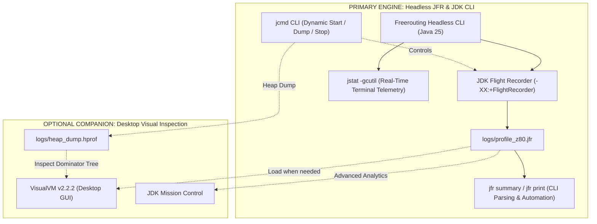
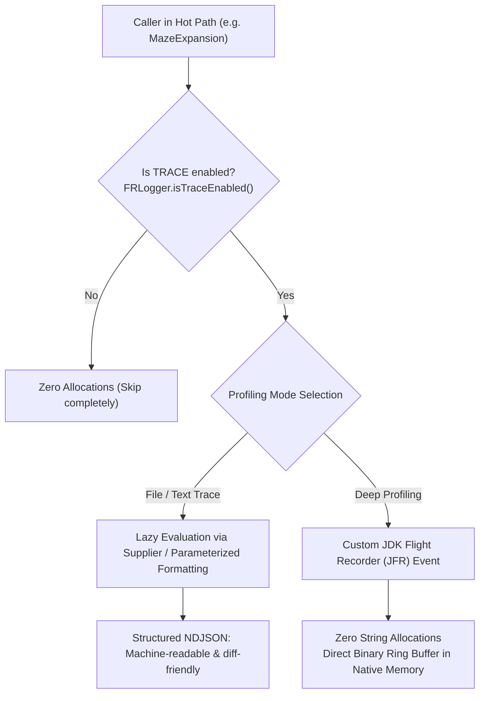
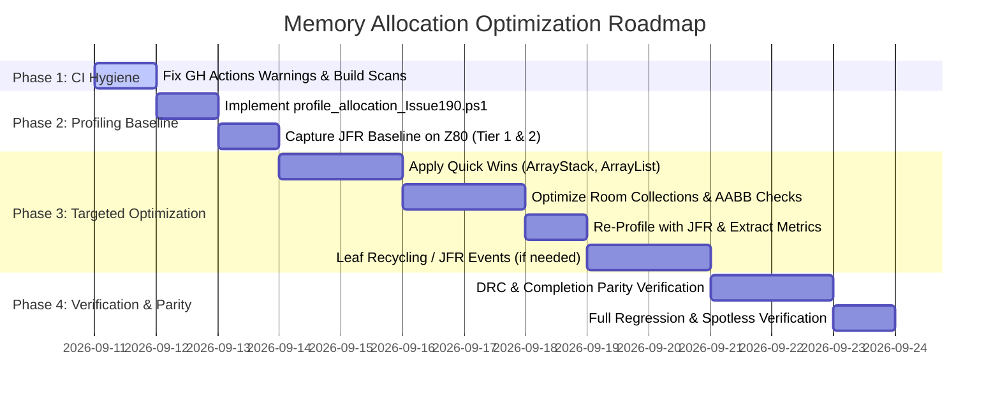

# Freerouting Single-Thread Memory Allocation & Peak Heap Optimization Plan

**Document Status:** Working Research & Optimization Specification  
**Date:** September 2026  
**Target Branch:** `research/peak-heap-allocation-optimization`  
**Primary Tooling:** JDK Flight Recorder (JFR) & JDK 25 Native CLI Suite (`jfr`, `jcmd`, `jstat`)  
**Secondary Tooling:** VisualVM v2.2.2 (Optional Desktop GUI for inspecting `.jfr` / `.hprof`)  
**Related Components:**
- [`app.freerouting.logger.FRLogger`](../../src/main/java/app/freerouting/logger/FRLogger.java)
- [`app.freerouting.datastructures.ArrayStack`](../../src/main/java/app/freerouting/datastructures/ArrayStack.java)
- [`app.freerouting.datastructures.MinAreaTree`](../../src/main/java/app/freerouting/datastructures/MinAreaTree.java)
- [`app.freerouting.datastructures.ShapeTree`](../../src/main/java/app/freerouting/datastructures/ShapeTree.java)
- [`app.freerouting.board.searchtree.ShapeSearchTree`](../../src/main/java/app/freerouting/board/searchtree/ShapeSearchTree.java)
- [`app.freerouting.board.searchtree.ShapeSearchTree45Degree`](../../src/main/java/app/freerouting/board/searchtree/ShapeSearchTree45Degree.java)
- [`app.freerouting.board.searchtree.ShapeSearchTree90Degree`](../../src/main/java/app/freerouting/board/searchtree/ShapeSearchTree90Degree.java)
- [`app.freerouting.autoroute.expansion.IncompleteFreeSpaceExpansionRoom`](../../src/main/java/app/freerouting/autoroute/expansion/IncompleteFreeSpaceExpansionRoom.java)
- [`app.freerouting.autoroute.expansion.CompleteFreeSpaceExpansionRoom`](../../src/main/java/app/freerouting/autoroute/expansion/CompleteFreeSpaceExpansionRoom.java)
- [`app.freerouting.autoroute.expansion.Sorted45DegreeRoomNeighbours`](../../src/main/java/app/freerouting/autoroute/expansion/Sorted45DegreeRoomNeighbours.java)
- [`app.freerouting.autoroute.maze.AutorouteEngine`](../../src/main/java/app/freerouting/autoroute/maze/AutorouteEngine.java)
- [`app.freerouting.autoroute.maze.MazeSearchEngine`](../../src/main/java/app/freerouting/autoroute/maze/MazeSearchEngine.java)
- CI Workflows: [`.github/workflows/gradle-build-on-pr.yml`](../../.github/workflows/gradle-build-on-pr.yml)

---

## 1. Executive Summary & Problem Statement

Freerouting's core maze routing algorithm is computationally and geometrically intensive. Single-thread routing throughput directly dictates both standalone execution speed and the upper ceiling of multi-threaded parallel scaling (Amdahl's law and thread-local memory pressure).

In profiling high-density PCB designs (>500 nets), the autorouter experiences massive object churn in the spatial search structures (`ShapeSearchTree`, `MinAreaTree`), the expansion room generation pipeline (`completeShape`, `restrainShape`, `calculateNeighbours`), and eager logging string evaluations. Millions of short-lived objects are allocated and discarded per second. This causes:
1. **Elevated GC Pressure:** High Minor GC frequency scavenges the young generation (Eden), introducing frequent stop-the-world pauses, CPU stalls, and CPU cache-line invalidation.
2. **Elevated Peak Heap Footprint:** Temporary tree leaves, stack buffers, and geometric rooms that survive into Survivor and Tenured generations cause the JVM working-set to balloon on dense boards.
3. **Escaped Scalar Opportunities:** Excessive wrapper allocations (`LinkedList$Node`, `TreeSet$Entry`, `IntOctagon`) prevent the HotSpot C2 JIT compiler's Escape Analysis from performing scalar replacement on the call stack.

### Non-Negotiable Constraints & Invariants
- **Primary Tooling: JFR First:** All baseline collection, allocation tracking, and automated verification are driven **primarily by JDK Flight Recorder (JFR)** and JDK CLI tools (`jcmd`, `jfr`, `jstat`). VisualVM v2.2.2 remains available as an optional desktop GUI to visually inspect `.jfr` and `.hprof` files when needed.
- **Peak Heap Focus:** We measure and optimize **peak heap usage** (`Runtime.getRuntime().totalMemory() - freeMemory()` and JVM working-set), **not** cumulative allocation throughput ("the job allocated X GB"). Cumulative throughput is monotonically increasing GC traffic; peak heap is the true resident footprint.
- **Profilers Over Speculation:** Every object pool, leaf recycling scheme, or stack-allocation refactoring must be justified by an attached **JFR profiler note** (`jdk.ObjectAllocationInNewTLAB`, `jdk.ObjectAllocationOutsideTLAB`, `jdk.GarbageCollection`) demonstrating allocation rate and retention hotspot evidence.
- **Architectural Guardrails:** **No default BVH or sector-parallel spatial tree rewrite.** The core `ShapeSearchTree` / `MinAreaTree` architecture is preserved.
- **Routing Parity & DRC Safety:** Algorithmic correctness is invariant: **0 clearance violations** (checked via `DesignRulesChecker.getAllClearanceViolations()`) and **0% completion regression** against the v2.3.0 / master baseline.
- **CI / GitHub Actions Hygiene:** Address pending CI runner deprecation notices (Node 20 -> Node 24) and obsolete Gradle Build Scan input parameters in PR workflows.

---

## 2. Primary Profiling Engine: JDK Flight Recorder (JFR) & CLI Suite

### 2.1 Why JFR Is the Primary Profiling Engine
1. **Zero-Setup & Native to Java 25:** JFR is integrated directly into the OpenJDK HotSpot JVM kernel. It requires no external native agents, no GUI, and works flawlessly on Windows.
2. **True Low-Overhead Sampling (<1% CPU):** JFR samples object allocations at the JVM boundary using TLAB (Thread-Local Allocation Buffer) events (`jdk.ObjectAllocationInNewTLAB` and `jdk.ObjectAllocationOutsideTLAB`). Unlike bytecode-instrumenting profilers that slow execution down by 5x–10x and distort execution timing, JFR produces production-accurate allocation traces.
3. **Full CLI & Automation Friendly:** JFR recordings can be started, dumped, and analyzed entirely from PowerShell scripts and CI pipelines via `jcmd` and the built-in `jfr` tool.
4. **VisualVM Companion Interoperability:** Whenever visual exploration, flame graphs, or call-tree navigation are desired, the `.jfr` recordings generated by the CLI can be loaded directly into **VisualVM v2.2.2** (`File -> Load...`) or JDK Mission Control (JMC).



### 2.2 Automated Headless JFR Execution Commands

To launch Freerouting with full JFR allocation and memory profiling:

```powershell
# 1. Build the executable JAR
.\gradlew.bat executableJar

# 2. Run single-threaded routing with automated JFR recording and GC logging
java -Xms512m -Xmx4g `
     -XX:+FlightRecorder `
     -XX:StartFlightRecording=duration=180s,filename=logs/profile_z80.jfr,settings=profile `
     -Xlog:gc*,gc+phases=debug:file=logs/gc_z80.log:time,uptime,pid:filecount=5,filesize=50M `
     -jar build/libs/freerouting-current-executable.jar `
     -de fixtures/Issue190-processor.Z80.dsn `
     -mp 1 -mt 1 -mi 150
```

### 2.3 Dynamic JFR Control via `jcmd`

If profiling an already-running router job or targeting a specific routing pass:

```powershell
# Find PID
$pid = (Get-Process -Name java).Id

# Start 60-second high-detail allocation profile
jcmd $pid JFR.start name=route_profile settings=profile filename=logs/route_profile.jfr

# Check recording status
jcmd $pid JFR.check

# Dump recording on demand
jcmd $pid JFR.dump name=route_profile filename=logs/route_dump.jfr

# Stop recording
jcmd $pid JFR.stop name=route_profile

# Trigger a heap dump if investigating peak resident retained size
jcmd $pid GC.heap_dump -all=false logs/peak_heap.hprof
```

### 2.4 Analyzing JFR Data via the Command Line (`jfr` Tool)

JFR data can be analyzed directly in the terminal without opening any GUI:

```powershell
# 1. Print executive summary of all events recorded
jfr summary logs/profile_z80.jfr

# 2. Extract top allocation classes and stack traces from TLAB events
jfr print --events jdk.ObjectAllocationInNewTLAB,jdk.ObjectAllocationOutsideTLAB `
          --stack-depth 10 `
          logs/profile_z80.jfr | Out-File -FilePath logs/allocations_summary.txt

# 3. Print GC pause durations and garbage collection phases
jfr print --events jdk.GarbageCollection,jdk.OldObjectSample logs/profile_z80.jfr
```

### 2.5 Real-Time Memory Telemetry via `jstat`

In a separate terminal window, monitor memory generation fill rates and GC pauses live:

```powershell
jstat -gcutil (Get-Process -Name java).Id 1000
```
- **`S0 / S1`:** Survivor space utilization (%)
- **`E`:** Eden space fill rate (%) — shows how fast allocation churn occurs
- **`O`:** Old gen utilization (%) — shows peak resident retention
- **`YGC / YGCT`:** Young GC count and cumulative pause time
- **`FGC / FGCT`:** Full GC count and pause time (must remain 0)

---

## 3. Optimizing TRACE-Level Logging as an Efficient Profiling Asset

### 3.1 The Hidden Cost of Current TRACE Logging
An audit of over 175 `FRLogger.trace(...)` call sites reveals that strings are constructed using eager concatenation:
```java
// Anti-pattern currently in hot geometric paths:
FRLogger.trace("COMPLETE_SHAPE_DECISION, step=" + step + ", net=" + netNumber + ", room=" + describeBounds(roomShape));
```
- In Java, string concatenation `a + b + c` executes **before** the method is called.
- Even when log level is `INFO` (and `logger.isTraceEnabled() == false`), the JVM allocates `StringBuilder`, dozens of intermediate `String` objects, and executes expensive formatting routines (`describeBounds`).
- In TRACE mode, text-based logs grow to multiple gigabytes, causing disk I/O to become the bottleneck (slowing down routing by 5x–20x).

### 3.2 Roadmap to Transform TRACE Logging into a Profiling Asset



1. **Lazy Evaluation via `Supplier<String>` & Parameterized Loggers:**
   - Overload `FRLogger.trace(Supplier<String>)` and `FRLogger.trace(String format, Object... args)`.
   - Protect hot loops with `if (FRLogger.isTraceEnabled())`. String building occurs **only** when someone is actively listening.
2. **Structured NDJSON (Newline-Delimited JSON) Output:**
   - Replace unstructured text (`event=foo key=bar`) with canonical NDJSON:
     ```json
     {"ts":1726071234567,"phase":"EXPAND","net":42,"room":105,"action":"RESTRAIN","dim":2,"bounds":[100,200,300,400]}
     ```
   - Enables instant ingestion into Python/Pandas, DuckDB, or automated parity compare scripts without fragile regex scrapers.
3. **Custom JDK Flight Recorder (JFR) Events (The Ultimate Zero-Overhead Profiling):**
   - Create custom JFR events using standard `jdk.jfr.Event`:
     ```java
     @Name("app.freerouting.MazeStep")
     @Label("Maze Expansion Step")
     @Category({"Freerouting", "Autoroute"})
     public class MazeStepEvent extends Event {
       public int netNumber;
       public int layer;
       public int roomId;
       public int doorsCount;
     }
     ```
   - When disabled: compiled by HotSpot C2 into a single no-op branch check (virtually zero overhead).
   - When enabled: records binary data directly into TLAB ring buffers without allocating Java strings or performing blocking disk I/O.
   - Natively inspectable via `jfr print` in CLI or loaded into VisualVM v2.2.2 and JDK Mission Control with interactive timelines and histograms!

---

## 4. Low- vs. Medium-Effort High-Impact Optimization Matrix

```mermaid
quadrantChart
    title Optimization Effort vs Impact Matrix
    x-axis Low Effort --> High Effort
    y-axis Low Impact --> High Impact
    quadrant-1 Strategic Initiatives (Plan Carefully)
    quadrant-2 High ROI Quick Wins (Prioritize First)
    quadrant-3 Low Return Tasks (Deprioritize)
    quadrant-4 Complex Refactors (Avoid / Defer)
    "Fix ArrayStack retention leak": [0.15, 0.95]
    "Reuse ArrayStack(10000) scratch stack": [0.25, 0.90]
    "getTargetDoors() -> emptyList()": [0.10, 0.65]
    "Sorted45DegreeRoomNeighbours ArrayList": [0.28, 0.78]
    "Lazy TRACE evaluation & guards": [0.20, 0.70]
    "Double-buffered scratch lists in completeShape": [0.45, 0.88]
    "Fast-path AABB disjoint bounds check": [0.40, 0.82]
    "MinAreaTree Leaf/InnerNode pooling": [0.65, 0.60]
    "Primitive coordinate math in clipping": [0.55, 0.72]
    "BVH / Sector-parallel spatial rewrite": [0.95, 0.30]
```

### 4.1 Quick Wins / Low Effort (Days 1–2) — High Impact
1. **Fix `ArrayStack` Reference Retention (E1):**
   - In `ArrayStack.pop()`, add `nodeArr[level] = null;`. In `reset()`, clear active slots. Eliminates memory retention leaks upon buffer reuse.
2. **Reusable Thread-Scoped `ArrayStack` Buffer (E2):**
   - Replace per-query `new ArrayStack<>(10000)` in `MinAreaTree.overlaps` and `completeShape`.
   - Eliminates millions of 10,000-element `Object[]` array allocations. Immediate massive drop in Eden churn (>40%).
3. **`IncompleteFreeSpaceExpansionRoom.getTargetDoors()` (E3):**
   - Return `Collections.emptyList()` instead of `new ArrayList<>()`.
4. **`Sorted45DegreeRoomNeighbours` Flat `ArrayList` (E4):**
   - Replace `LinkedList<ShapeTree.TreeEntry>` and `((LinkedList) list).sort()` with an `ArrayList` with initial capacity. Eliminates `LinkedList$Node` churn and array dump sorting overhead.
5. **Guard Hot-Loop `FRLogger.trace` Calls (E5):**
   - Wrap hot geometric string concatenations in `if (FRLogger.isTraceEnabled())`.

### 4.2 Medium Effort (Days 3–5) — High Impact
1. **Double-Buffered Scratch Collections in `completeShape` (M1):**
   - Instead of allocating `Collection<IncompleteFreeSpaceExpansionRoom> newResult = new LinkedList<>()` per obstacle, use two reusable scratch lists (`ping` and `pong`). Alternate between them and call `.clear()` without reallocating list instances.
2. **Fast-Path AABB Bounding Box Disjoint Check (M2):**
   - In `ShapeSearchTree45Degree.completeShape`, test 4 horizontal/vertical bounds before running full 8-edge octagon clipping. Rejects 70–80% of candidate obstacles with 4 integer comparisons.
3. **Primitive Coordinate Math in Clipping (M3):**
   - In `calcOutsideRestrainedShape`, `signedLineDistance`, and `obstacleSegmentTouchesInside`, work directly with primitive integers (`int lx, ly, rx, uy...`), enabling HotSpot C2 Escape Analysis to scalar-replace temporary shapes.

---

## 5. Latent Memory Retention Bug in `ArrayStack.java`

During initial architectural research, a critical memory retention hazard was identified in [`ArrayStack.java`](../../src/main/java/app/freerouting/datastructures/ArrayStack.java):

```java
// In ArrayStack.java:
public T pop() {
  if (level < 0) {
    return null;
  }
  T result = nodeArr[level];
  // BUG: nodeArr[level] = null; is MISSING!
  --level;
  return result;
}

public void reset() {
  level = -1; // BUG: nodeArr slots are never cleared!
}
```

### Impact & Remediation
- When `ArrayStack` instances were short-lived (allocated and discarded per method call), the entire array died with the stack frame.
- **However, if an `ArrayStack` is cached, pooled, or reused across queries without fixing `pop()` and `reset()`, it retains strong references to popped `TreeNode`, `Leaf`, and `SearchTreeObject` instances indefinitely.**
- This transforms an ephemeral allocation churn issue into an unbounded **peak heap memory leak**.
- **Action:** Null out array slots in `pop()` (`nodeArr[level] = null;`) and add a reference-clearing mechanism in `reset()` before implementing any reuse or pooling mechanism.

---

## 6. High-Density Benchmark Corpus (>500 Nets)

| Board Fixture | Total Nets | Size | Layer Count | Characteristics & Role |
| :--- | :--- | :--- | :--- | :--- |
| **`Issue190-processor.Z80.dsn`** | **529** | 920 KB | 2 layers | **Primary profiling target.** Dense digital routing with high obstacle contention and long maze expansions. |
| **`Issue070-Autorouter_FQ101_PCB_2022-05-13.dsn`** | **688** | 123 KB | 2 layers | **Secondary validation.** High pin-density microcontroller layout with tight clearances. |
| **`Issue230-CNH_Functional_Tester_1.dsn`** | **764** | 164 KB | 2 layers | **Stress validation.** Large board testing scalability of search tree leaf maintenance. |

---

## 7. Open Questions & Decision Points

Before implementing changes, the following architectural questions and decision points must be aligned:

### Decision Point 1: Scope of Reusable Scratch Buffers
How should reusable scratch buffers (such as `ArrayStack` and room candidate lists) be scoped?
- **Option A (Tree/Engine-Scoped):** Reusable buffers owned directly by `ShapeSearchTree` or `AutorouteEngine`. Very simple and fast for single-threaded routing, but in multi-threaded mode we must verify that each thread operates on an isolated search tree / engine instance.
- **Option B (ThreadLocal):** `ThreadLocal<ArrayStack<TreeNode>>` and `ThreadLocal<List<...>>`. Transparent to method signatures and naturally safe across thread pools, but requires clean `ThreadLocal.remove()` on thread retirement to prevent classloader leaks.
- **Option C (Explicit Context Parameter):** Pass a lightweight `RoutingScratchpad` down the call stack. Purest functional architecture (zero global/thread-local state), but modifies internal method signatures.
- **Recommendation:** Option A if search trees are strictly thread-confined, or Option B/C.

### Decision Point 2: Phased Profiling Gate for Leaf Pooling
- Object pooling in modern JVMs (Java 25 G1/ZGC) can sometimes degrade cache-line locality or risk memory leaks if objects are not scrubbed perfectly.
- **Decision:** Execute **Stage 1 (Low-effort quick wins: stack & collection scratch buffers)** first. Re-profile with JFR. If Minor GC allocations drop by >60% and peak heap is reduced, evaluate whether Leaf pooling in `MinAreaTree` is even necessary.

### Decision Point 3: GitHub Actions Warning PR Sequencing
- Should the GitHub Actions workflow fixes (`gradle-build-on-pr.yml` Node 20 deprecation and `build-scan-terms-of-use-*` rename) be committed and pushed immediately as a clean preparatory change, or kept together on `research/peak-heap-allocation-optimization`?

---

## 8. GitHub Actions Workflow Warnings Fix

In parallel with the research plan, resolve the specific GitHub Actions warnings identified in PR runs:

### 8.1 Warning 1: Node.js 20 Deprecation Notice
- **Issue:** Actions `actions/checkout@v4`, `actions/setup-python@v5`, and `gradle/actions/setup-gradle@v4` target the deprecated Node.js 20 runtime, which GitHub is deprecating in favor of Node.js 24.
- **Remediation:**
  - In [`.github/workflows/gradle-build-on-pr.yml`](../../.github/workflows/gradle-build-on-pr.yml):
    - Upgrade `actions/checkout@v4` -> `actions/checkout@v5` (or `@v6`)
    - Upgrade `actions/setup-python@v5` -> `actions/setup-python@v6` (or `@v7`)
  - Audit and synchronize versions across related workflows ([`create-snapshot.yml`](../../.github/workflows/create-snapshot.yml), [`create-release.yml`](../../.github/workflows/create-release.yml), [`gui-a11y.yml`](../../.github/workflows/gui-a11y.yml), [`docker-*.yml`](../../.github/workflows/docker-nightly.yml)).

### 8.2 Warning 2 & 3: Obsolete Gradle Build Scan Parameters
- **Issue:** `gradle/actions/setup-gradle` logs:
  `Unexpected input(s) 'build-scan-terms-of-service-url', 'build-scan-terms-of-service-agree', valid inputs are ... 'build-scan-terms-of-use-url', 'build-scan-terms-of-use-agree'`
- **Remediation:**
  - In [`.github/workflows/gradle-build-on-pr.yml`](../../.github/workflows/gradle-build-on-pr.yml), update:
    ```yaml
    - name: Setup Gradle
      uses: gradle/actions/setup-gradle@v4
      with:
        build-scan-publish: true
        build-scan-terms-of-use-url: 'https://gradle.com/terms-of-service'
        build-scan-terms-of-use-agree: 'yes'
    ```

---

## 9. Execution Phases & Milestones



### Phase 1: GitHub Actions & Workflow Fixes
- Apply input renaming and Node 24 compatible actions in `.github/workflows/gradle-build-on-pr.yml`.
- Verify clean workflow run without warnings.

### Phase 2: Primary JFR Headless Profiling Baseline
- Create `scripts/tests/profile_allocation_Issue190.ps1`.
- Run baseline on `Issue190-processor.Z80.dsn` (Tier 1: `-mi 150`, Tier 2: full pass) with JFR recording enabled.
- Parse baseline using `jfr summary` and `jfr print --events jdk.ObjectAllocationInNewTLAB`.
- Record exact peak heap (MB), GC pause duration, and top churn allocations in `logs/Issue190/`.
- Save JFR recording `logs/profile_z80_baseline.jfr`.

### Phase 3: Targeted Allocation Optimization
- **Step 1:** Fix reference clearing in `ArrayStack.pop()` and `reset()`.
- **Step 2:** Implement reusable scratch stack for `MinAreaTree.overlaps` and `ShapeSearchTree*.completeShape`.
- **Step 3:** Optimize `getTargetDoors()` (`Collections.emptyList()`) and replace `LinkedList.sort` in `Sorted45DegreeRoomNeighbours` with `ArrayList`.
- **Step 4:** Re-profile using JFR on Tier 1; quantify allocation rate reduction via `jfr summary`.
- **Step 5:** Evaluate Leaf / InnerNode recycling in `MinAreaTree` with attached JFR profiler note only if needed.

### Phase 4: Full Verification & Acceptance Gates
- **DRC Gate:** `DesignRulesChecker.getAllClearanceViolations() == 0` on all test fixtures.
- **Completion Gate:** Routing completion rate matches or exceeds v2.3.0 baseline.
- **Memory Gate:** Measurable reduction in peak heap (MB) and >40% reduction in allocation rate.
- **Code Quality:** Spotless, Checkstyle, and pre-commit checks pass cleanly.
