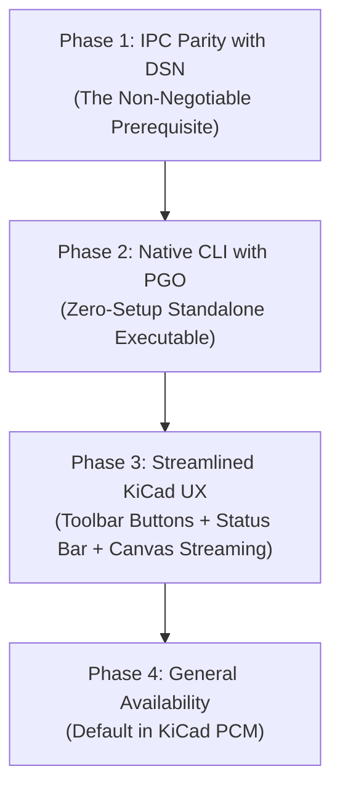

# Native CLI and Streamlined KiCad UX Roadmap

## Executive Summary

This roadmap outlines the long-term vision and phased plan for modernizing how Freerouting runs and interacts with EDA tools—with a primary focus on KiCad. 

The strategy unites two core initiatives:
1. **A Native Freerouting CLI:** Producing standalone, ahead-of-time (AOT) compiled native executables using GraalVM with Profile-Guided Optimization (PGO) to completely eliminate the Java runtime requirement for command-line and plugin users.
2. **A Streamlined KiCad User Experience:** Transforming the KiCad integration from an external "export-run-import" round-trip into a seamless, native-feeling tool directly inside the KiCad PCB Editor—featuring a three-button toolbar workflow, unobtrusive status bar updates, and smooth, real-time canvas updates.

---

## Motivation: The Friction We Are Eliminating

### 1. The Java Runtime Barrier
While the Java platform provides great algorithmic capabilities and cross-platform flexibility, requiring end-users to have Java 25 installed is one of the highest points of friction for adoption. Corporate IT policies often block installing arbitrary runtimes, corporate firewalls disrupt automatic background JRE downloads, and everyday users simply expect software to work out of the box without prerequisite installations.

### 2. The Export / Import Disconnection
The traditional autorouting workflow feels disjointed:
* KiCad exports a Specctra `.dsn` file to disk.
* An external Java application opens in a separate window.
* The user waits for it to finish and saves a `.ses` file back to disk.
* The user switches back to KiCad and imports the session.

This workflow takes users away from their PCB canvas, creates temporary file clutter, and breaks the design flow.

### 3. The "All-or-Nothing" Dilemma
When an autorouter runs, users often want to stop early if they see that a layout isn't meeting expectations, or quickly undo an entire run to tweak a clearance rule and try again. Currently, cleaning up partially routed traces or recovering the pre-routing state requires manual selection or messy multi-step undo operations.

---

## Vision: Seamless, In-Place Autorouting

My vision is that **Freerouting should feel like an organic, built-in capability of KiCad**—similar to KiCad's native Zone Fill (`B`) or Design Rules Checker—rather than a foreign external utility.

* **Zero Setup:** The user installs the plugin from KiCad's Plugin and Content Manager (PCM) and clicks "Route". No Java installation prompts, no runtime configuration, and no dependencies to manage.
* **Eyes on the Board:** The user never leaves the KiCad PCB Editor canvas. Traces stream smoothly onto their board in real-time as the router solves paths.
* **Effortless Control:** A clean three-button toolbar interface lets users start, stop, reset, and configure routing in a single click.

---

## Part 1: The Native CLI Plan

### Core Strategy: GraalVM AOT Compilation with PGO
To power this experience, I plan to compile Freerouting's core routing engine into platform-specific, standalone native executables (`.exe` on Windows, native binaries on Linux and macOS) using **GraalVM Native Image**.

* **Single Standalone Executable:** A single ~30 MB executable file containing the entire routing engine, with zero external runtime dependencies.
* **Instant Startup:** Native binaries start in 10 to 30 milliseconds (compared to 1.5 to 3 seconds for JVM bootstrap), making command-line execution and scripted CI jobs feel instant.
* **Profile-Guided Optimization (PGO):** To prevent the 10–20% performance degradation typically associated with ahead-of-time compilation on compute-heavy loops, the build pipeline will profile standard benchmark boards (`.iprof`) during build time. This allows the AOT compiler to optimize hot branching paths and achieve performance on par with or exceeding the HotSpot C2 JIT compiler.
* **Clean Separation of Concerns:**
  * **Headless / CLI / KiCad Plugin:** Powered by the **Native CLI** for maximum speed, zero setup, and minimal memory overhead.
  * **Desktop Standalone Application:** Retains the full **`jpackage` installer** (HotSpot JVM + Swing GUI) for users who specifically prefer the standalone visual desktop application.

---

## Part 2: The Streamlined KiCad UX Plan

Instead of modal popups, floating progress dialogs, or external windows, the user experience will be tightly integrated into KiCad's existing interface:

```
┌────────────────────────────────────────────────────────────────────────┐
│  KiCad PCB Editor Toolbar                                              │
│  [ Start / Stop ]   [ Reset ]   [ Settings ]                           │
└────────────────────────────────────────────────────────────────────────┘
```

### 1. Three Dedicated Toolbar Buttons

1. **`[ Start / Stop ]` Button:**
   * **When idle:** Starts the autorouter immediately using the project's saved settings.
   * **When running:** Interrupts the router cleanly, preserving the best routing state achieved so far and committing it to the board.
2. **`[ Reset ]` Button:**
   * **The "One-Click Clean Slate":** Immediately discards all tracks and vias created by Freerouting during the latest run, returning the board to its exact pre-routing state. User-locked tracks and pre-existing manual traces remain untouched.
3. **`[ Settings ]` Button:**
   * Opens a native, clean configuration dialog to adjust routing passes, layer directions, via costs, and clearance preferences. Settings are saved per-project in `freerouting.json`.

### 2. Footbar (Status Bar) Progress Feedback
No floating dialogs or popups will obscure the user's workspace. All routing progress is reported cleanly in KiCad's bottom status bar:
* **Idle:** `Freerouting: Ready`
* **Routing:** `Freerouting: Pass 2/10 | 142/148 nets (95.9%) | 84 vias | Elapsed 00:14`
* **Complete:** `Freerouting: Complete in 18s! 148/148 nets routed (100%), 84 vias.`
* **Interrupted:** `Freerouting: Stopped by user. Best state applied (96% routed).`

### 3. Throttled Real-Time Canvas Updates (5–10 Hz)
Watching wires appear dynamically on the board is both visually satisfying and informative. However, updating the canvas on every single wire segment creates excessive overhead and freezes the UI.

The solution is **throttled real-time streaming**:
* The native CLI streams newly routed nets and segments continuously.
* The plugin batches these updates and refreshes the KiCad canvas at a smooth **5 to 10 Hz rate** (every 100–200 ms).
* To the user, this appears as a fluid, animated drawing of traces across the board in real-time, while allowing the routing algorithm to run at 100% native speed.

---

## Phased Implementation Roadmap



### Phase 1: IPC Parity with DSN (The Non-Negotiable Prerequisite)
Before any UX or packaging changes are promoted, the new Protocol Buffers IPC pipeline must prove itself to be strictly on par with (or superior to) the classic Specctra DSN baseline.
* **Extraction & Ingestion Speed:** Reading the board and design rules via IPC must match or beat DSN export and parsing times.
* **Design Rule Fidelity:** Full capture of live KiCad constraints that DSN silently drops (such as copper-to-edge clearances and custom netclass rules).
* **Quality & DRC Cleanliness:** Benchmark boards (`bm01`, `bm02`, etc.) must achieve zero new clearance violations and identical or improved route completion rates.
* **Transaction Reliability:** Validating atomic undo/redo commits in KiCad.

### Phase 2: Native CLI with PGO
* **Stripped Headless Target:** Create a minimal, dependency-light CLI entry point excluding GUI, API, and web-server components.
* **AOT Build Pipeline:** Configure GraalVM Native Image builds in GitHub Actions for Windows x64, Linux x64/arm64, and macOS x64/arm64.
* **PGO Benchmarking:** Integrate automated profile generation on standard reference boards to guarantee peak routing performance.
* **Plugin JRE Elimination:** Update the KiCad plugin to automatically download and invoke the native CLI binary instead of managing a 180 MB JRE.

### Phase 3: Streamlined KiCad UX
* **Toolbar Registration:** Implement the three dedicated action buttons (`Start/Stop`, `Reset`, `Settings`) in the KiCad plugin manifest.
* **Status Bar Integration:** Wire real-time progress events from the CLI to KiCad's footbar.
* **Throttled Canvas Streaming:** Implement the 5–10 Hz batch update mechanism to animate newly routed tracks on KiCad's canvas during the run.
* **One-Click Reset:** Implement atomic commit rollback / ID-tracked track deletion for the `Reset` action.

### Phase 4: General Availability & Default Promotion
* **Documentation & Release:** Publish updated tutorials and user guides highlighting the zero-setup workflow.
* **KiCad PCM Update:** Promote the IPC + Native CLI plugin to the official KiCad Plugin and Content Manager as the standard default.
* **Retire Legacy Bridges:** Deprecate legacy SWIG and intermediate temporary file paths.

---

## Potential Gains

| Dimension | Legacy DSN Workflow | Future IPC + Native CLI Workflow |
|---|---|---|
| **Prerequisites** | Java 25 JRE manual install or ~180 MB download | **Zero setup:** Single ~30 MB native binary downloaded seamlessly |
| **Startup Latency** | 2 to 3 seconds (JVM bootstrap) | **10 to 30 ms** (instantaneous) |
| **User Interface** | Disjointed external Swing window | **Integrated KiCad UI:** Toolbar buttons, status bar, and direct canvas animation |
| **Workflow Friction** | Multi-step file export, window switching, import | **One-click routing** directly inside KiCad |
| **Aborting / Undoing** | Window close / manual trace cleanup | **One-click Stop (Keep Best)** and **One-click Reset (Discard All)** |
| **Design Rule Fidelity** | DSN drops rules (e.g. copper-to-edge clearance) | **Complete live fidelity** from KiCad's native rule engine |
