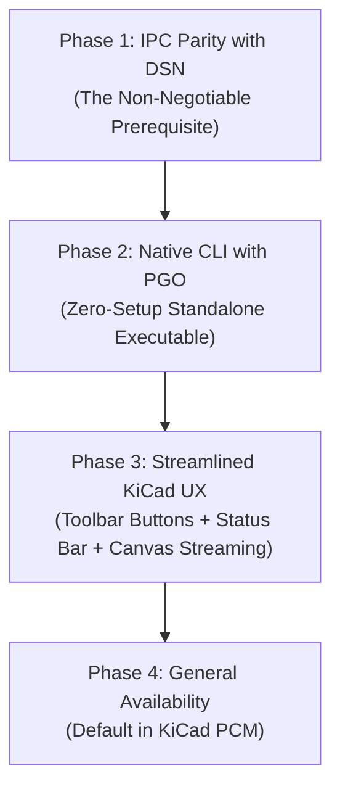
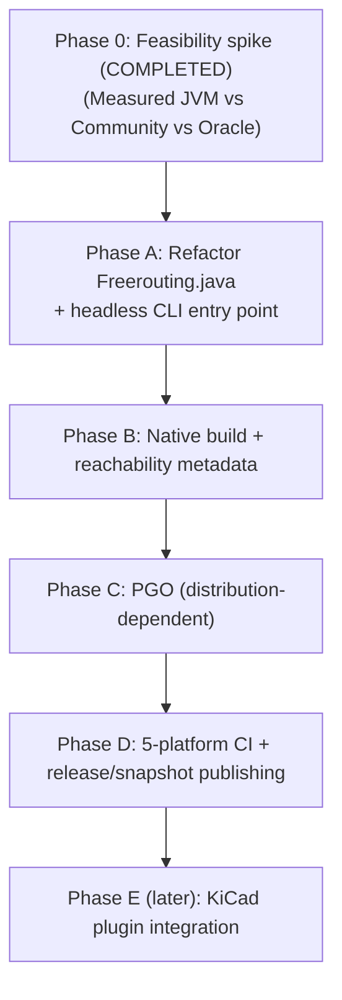

# Native CLI and Streamlined KiCad UX Roadmap

## Executive Summary

This roadmap outlines the long-term vision and phased plan for modernizing how Freerouting runs and interacts with EDA tools—with a primary focus on KiCad. 

The strategy unites two core initiatives:
1. **A Native Freerouting CLI:** Producing standalone, ahead-of-time (AOT) compiled native executables using GraalVM with Profile-Guided Optimization (PGO) to completely eliminate the Java runtime requirement for command-line and plugin users.
2. **A Streamlined KiCad User Experience:** Transforming the KiCad integration from an external "export-run-import" round-trip into a seamless, native-feeling tool directly inside the KiCad PCB Editor—featuring a three-button toolbar workflow, unobtrusive status bar updates, and smooth, real-time canvas updates.

---

## Motivation: The Friction We Are Eliminating

### 1. The Java Runtime Barrier
While the Java platform provides great algorithmic capabilities and cross-platform flexibility, requiring end-users to have Java 25 installed is one of the highest points of friction for adoption. Corporate IT policies often block installing arbitrary runtimes, corporate firewalls disrupt automatic background JRE downloads, and everyday users simply expect software to work out of the box without prerequisite installations.

### 2. The Export / Import Disconnection
The traditional autorouting workflow feels disjointed:
* KiCad exports a Specctra `.dsn` file to disk.
* An external Java application opens in a separate window.
* The user waits for it to finish and saves a `.ses` file back to disk.
* The user switches back to KiCad and imports the session.

This workflow takes users away from their PCB canvas, creates temporary file clutter, and breaks the design flow.

### 3. The "All-or-Nothing" Dilemma
When an autorouter runs, users often want to stop early if they see that a layout isn't meeting expectations, or quickly undo an entire run to tweak a clearance rule and try again. Currently, cleaning up partially routed traces or recovering the pre-routing state requires manual selection or messy multi-step undo operations.

---

## Vision: Seamless, In-Place Autorouting

My vision is that **Freerouting should feel like an organic, built-in capability of KiCad**—similar to KiCad's native Zone Fill (`B`) or Design Rules Checker—rather than a foreign external utility.

* **Zero Setup:** The user installs the plugin from KiCad's Plugin and Content Manager (PCM) and clicks "Route". No Java installation prompts, no runtime configuration, and no dependencies to manage.
* **Eyes on the Board:** The user never leaves the KiCad PCB Editor canvas. Traces stream smoothly onto their board in real-time as the router solves paths.
* **Effortless Control:** A clean three-button toolbar interface lets users start, stop, reset, and configure routing in a single click.

---

## Part 1: The Native CLI Plan

### Core Strategy: GraalVM AOT Compilation with PGO
To power this experience, I plan to compile Freerouting's core routing engine into platform-specific, standalone native executables (`.exe` on Windows, native binaries on Linux and macOS) using **GraalVM Native Image**.

* **Single Standalone Executable:** A single executable file (target ~30–50 MB; actual size to be measured, see the detailed plan) containing the entire routing engine, with zero external runtime dependencies.
* **Fast Startup:** The bare native binary starts in tens of milliseconds (compared to 1.5 to 3 seconds for JVM bootstrap). Note that today's `Freerouting.main()` performs a fixed 1 s analytics sleep and other startup work that must be removed from the CLI path first (see "Startup latency reality check").
* **Profile-Guided Optimization (PGO):** To prevent the 10–20% performance degradation typically associated with ahead-of-time compilation on compute-heavy loops, the build pipeline will profile standard benchmark boards (`.iprof`) during build time. This allows the AOT compiler to optimize hot branching paths and achieve performance on par with the HotSpot C2 JIT compiler. **PGO requires Oracle GraalVM**; it is not available in GraalVM Community Edition or Mandrel (see the distribution decision below).
* **Clean Separation of Concerns:**
  * **Headless / CLI / KiCad Plugin:** Powered by the **Native CLI** for maximum speed, zero setup, and minimal memory overhead.
  * **Desktop Standalone Application:** Retains the full **`jpackage` installer** (HotSpot JVM + Swing GUI) for users who specifically prefer the standalone visual desktop application.

---

## Part 2: The Streamlined KiCad UX Plan

Instead of modal popups, floating progress dialogs, or external windows, the user experience will be tightly integrated into KiCad's existing interface:

```
┌────────────────────────────────────────────────────────────────────────┐
│  KiCad PCB Editor Toolbar                                              │
│  [ Start / Stop ]   [ Reset ]   [ Settings ]                           │
└────────────────────────────────────────────────────────────────────────┘
```

### 1. Three Dedicated Toolbar Buttons

1. **`[ Start / Stop ]` Button:**
   * **When idle:** Starts the autorouter immediately using the project's saved settings.
   * **When running:** Interrupts the router cleanly, preserving the best routing state achieved so far and committing it to the board.
2. **`[ Reset ]` Button:**
   * **The "One-Click Clean Slate":** Immediately discards all tracks and vias created by Freerouting during the latest run, returning the board to its exact pre-routing state. User-locked tracks and pre-existing manual traces remain untouched.
3. **`[ Settings ]` Button:**
   * Opens a native, clean configuration dialog to adjust routing passes, layer directions, via costs, and clearance preferences. Settings are saved per-project in `freerouting.json`.

### 2. Footbar (Status Bar) Progress Feedback
No floating dialogs or popups will obscure the user's workspace. All routing progress is reported cleanly in KiCad's bottom status bar:
* **Idle:** `Freerouting: Ready`
* **Routing:** `Freerouting: Pass 2/10 | 142/148 nets (95.9%) | 84 vias | Elapsed 00:14`
* **Complete:** `Freerouting: Complete in 18s! 148/148 nets routed (100%), 84 vias.`
* **Interrupted:** `Freerouting: Stopped by user. Best state applied (96% routed).`

### 3. Throttled Real-Time Canvas Updates (5–10 Hz)
Watching wires appear dynamically on the board is both visually satisfying and informative. However, updating the canvas on every single wire segment creates excessive overhead and freezes the UI.

The solution is **throttled real-time streaming**:
* The native CLI streams newly routed nets and segments continuously.
* The plugin batches these updates and refreshes the KiCad canvas at a smooth **5 to 10 Hz rate** (every 100–200 ms).
* To the user, this appears as a fluid, animated drawing of traces across the board in real-time, while allowing the routing algorithm to run at 100% native speed.

---

## Phased Implementation Roadmap


```mermaid
flowchart TD
    P1["Phase 1: IPC Parity with DSN\n(The Non-Negotiable Prerequisite)"]
    P2["Phase 2: Native CLI with PGO\n(Zero-Setup Standalone Executable)"]
    P3["Phase 3: Streamlined KiCad UX\n(Toolbar Buttons + Status Bar + Canvas Streaming)"]
    P4["Phase 4: General Availability\n(Default in KiCad PCM)"]

    P1 --> P2
    P2 --> P3
    P3 --> P4
```

### Phase 1: IPC Parity with DSN (The Non-Negotiable Prerequisite)
Before any UX or packaging changes are promoted, the new Protocol Buffers IPC pipeline must prove itself to be strictly on par with (or superior to) the classic Specctra DSN baseline.
* **Extraction & Ingestion Speed:** Reading the board and design rules via IPC must match or beat DSN export and parsing times.
* **Design Rule Fidelity:** Full capture of live KiCad constraints that DSN silently drops (such as copper-to-edge clearances and custom netclass rules).
* **Quality & DRC Cleanliness:** Benchmark boards (`bm01`, `bm02`, etc.) must achieve zero new clearance violations and identical or improved route completion rates.
* **Transaction Reliability:** Validating atomic undo/redo commits in KiCad.

### Phase 2: Native CLI with PGO
> The detailed, reviewed work breakdown for this phase is in **"Detailed Plan for the Native CLI (Phases A–E)"** below. Plugin JRE elimination is deliberately **not** part of today's scope.
* **Stripped Headless Target:** Create a minimal, dependency-light CLI entry point excluding GUI, API, and web-server components.
* **AOT Build Pipeline:** Configure GraalVM Native Image builds in GitHub Actions for Windows x64, Linux x64/arm64, and macOS x64/arm64.
* **PGO Benchmarking:** Integrate automated profile generation on standard reference boards to guarantee peak routing performance (subject to the GraalVM distribution decision).
* **Plugin JRE Elimination (later, not in the current scope):** Update the KiCad plugin to automatically download and invoke the native CLI binary instead of managing a 180 MB JRE.

### Phase 3: Streamlined KiCad UX
* **Toolbar Registration:** Implement the three dedicated action buttons (`Start/Stop`, `Reset`, `Settings`) in the KiCad plugin manifest.
* **Status Bar Integration:** Wire real-time progress events from the CLI to KiCad's footbar.
* **Throttled Canvas Streaming:** Implement the 5–10 Hz batch update mechanism to animate newly routed tracks on KiCad's canvas during the run.
* **One-Click Reset:** Implement atomic commit rollback / ID-tracked track deletion for the `Reset` action.

### Phase 4: General Availability & Default Promotion
* **Documentation & Release:** Publish updated tutorials and user guides highlighting the zero-setup workflow.
* **KiCad PCM Update:** Promote the IPC + Native CLI plugin to the official KiCad Plugin and Content Manager as the standard default.
* **Retire Legacy Bridges:** Deprecate legacy SWIG and intermediate temporary file paths.

---

## Potential Gains

| Dimension | Legacy DSN Workflow | Future IPC + Native CLI Workflow |
|---|---|---|
| **Prerequisites** | Java 25 JRE manual install or ~180 MB download | **Zero setup:** Single ~30 MB native binary downloaded seamlessly |
| **Startup Latency** | 2 to 3 seconds (JVM bootstrap) | **Well under 1 s** to first routing step (the 10–30 ms figure applies to the bare binary only; see "Startup latency reality check") |
| **User Interface** | Disjointed external Swing window | **Integrated KiCad UI:** Toolbar buttons, status bar, and direct canvas animation |
| **Workflow Friction** | Multi-step file export, window switching, import | **One-click routing** directly inside KiCad |
| **Aborting / Undoing** | Window close / manual trace cleanup | **One-click Stop (Keep Best)** and **One-click Reset (Discard All)** |
| **Design Rule Fidelity** | DSN drops rules (e.g. copper-to-edge clearance) | **Complete live fidelity** from KiCad's native rule engine |

---

## Review Findings (Native CLI, scope: roadmap Phases 1–4 of the CLI work; KiCad plugin work excluded)

Findings from reviewing the roadmap against the current code base (`Freerouting.java`, `build.gradle`, `.github/workflows/create-release.yml`, `scripts/build/*`, the KiCad plugin).

### What is already in our favor

* **The routing pipeline is clean of UI/server dependencies.** `board`, `rules`, `autoroute`, `drc`, `geometry`, `core` and `io` have no `javax.swing` imports. `java.awt` is limited to `java.awt.geom` (`BoardStatistics`, `BoardStatisticsBoard`, `ZoneIslandViolation`), which is pure Java and must only be smoke-tested in native mode.
* **Jetty / Jersey / Google Cloud are referenced only by `app.freerouting.api..`, `analytics.BigQueryClient` and `Freerouting.java`.** `BigQueryClient` is used only by the API's `AnalyticsControllerV1`. `FRAnalytics` no longer instantiates it (the call is commented out).
* **CLI telemetry already uses plain JDK HTTP.** `FreeroutingAnalyticsClient` posts via `HttpURLConnection` to `https://api.freerouting.app/v1/`, and `VersionChecker` uses `java.net.http`. No BigQuery client has to be re-implemented for the CLI. The CLI needs only HTTPS to be enabled in the native image and the existing `NetworkProxyConfig` truststore logic verified.
* **The CLI code path already exists** (`initializeCli`, `initializeDrc`, `writeCliOutputIfAvailable`, `RoutingResultManifest`), so Phase 1 is an extraction/refactor, not a rewrite.

### Corrections to the original assumptions

1. **PGO is Oracle GraalVM only.** GraalVM Community Edition and Mandrel do not support `--pgo-instrument` / `--pgo`. They also do not offer the G1 garbage collector. Choosing Community means: no PGO, Serial GC only.
2. **GC choice matters for a multi-threaded, allocation-heavy router.** In native image, G1 is available only on some platforms (currently Linux; verify per platform for GraalVM 25) and Oracle GraalVM only. Windows and macOS binaries are expected to run on Serial GC. Serial GC is a stop-the-world copying collector, which can hurt multi-threaded routing throughput and peak memory. This must be measured, not assumed.
3. **The "10–30 ms startup" figure is unrealistic with the current `main()`.** The CLI path includes a fixed `Thread.sleep(1000)` after analytics identification, `RuntimeEnvironment.measureCpuScore()`, `FRAnalytics.identify()`, a version-check thread and a 500 ms polling loop waiting for the job. Startup must be measured as *process start → first routing step*, with the fixed sleep and polling removed from the CLI path. (These are not time-budget-dependent routing decisions, so removing them does not conflict with the time-budget-agnostic rule.)
4. **The ~30 MB size target is a guess.** With Gson, Log4j2, Swing-free AWT geom, JDK HTTP/TLS and i18n bundles, 40–60 MB is plausible. Treat 30 MB as an aspiration and gate on a measured budget instead.
5. **The IPC plugin talks to the local REST API (Jetty), not to a CLI.** A stripped CLI without the API cannot provide the "stream newly routed nets/segments + progress to the status bar" behavior that roadmap Phase 3 relies on. Today's scope does not touch the plugin, but the CLI must define the contract now, otherwise Phase 3 will force a rework: a **machine-readable progress/event stream** (e.g. NDJSON on stdout or to `--events=<file>`, with `--cancel` via stdin close / signal / a sentinel file) and a defined set of exit codes. Native-compiling Jetty/Jersey/HK2 is a separate, much riskier project and is out of scope.
6. **Determinism needs explicit proof on native builds.** Object identity hash codes and class-initialization order differ between HotSpot and native image. Any `HashMap`/`HashSet`/`IdentityHashMap` iteration over keys that use `Object.hashCode()` can change ordering and therefore routing results. The deterministic-routing rule (same input and settings → same result) requires a JVM-vs-native and native-vs-native comparison on the golden fixtures, and an audit of identity-hash-ordered collections.
7. **Do not build the native image from the fat `executableJar`.** `executableJar` merges all dependency jars with `DuplicatesStrategy.EXCLUDE` and deletes JNDI classes; merged `META-INF` service files and `Log4j2Plugins.dat` can be clobbered, and the shaded layout hides each library's own `META-INF/native-image` reachability metadata. Build from the Gradle `runtimeClasspath` (via the GraalVM Native Build Tools plugin).
8. **Instance main (`void main(String[] args)`) is used by `Freerouting`.** The new CLI class must use a classic `public static void main(String[])` so it is a guaranteed native-image entry point.
9. **Reflection surface is larger than just `ReflectionUtil`.** The things native image will not discover on its own:
   * `ReflectionUtil.copyFields()` over `RouterSettings`, `RouterOptimizerSettings`, `RouterScoringSettings` and the other settings classes (`SettingsMerger` pipeline).
   * Gson reflection over every serialized DTO (`GlobalSettings` / `freerouting.json`, `RoutingResultManifest`, `KiCadDrcReport`, benchmark score outputs, KiCad JSON board/session).
   * `TextManager`: `ResourceBundle.getBundle(...)` for many locales and `Class.forName(...).getSuperclass()`.
   * Log4j2: the custom `Log4j2ConfigurationFactory` (set through the `log4j2.configurationFactory` system property), plugin discovery and the programmatic `reconfigure()`.
   * `SafeObjectInputStream` (Java serialization, used for `.frb`); keep it out of the CLI path.
   * Hand-maintained `reflect-config.json` goes stale silently. Prefer a build-time registration step (a GraalVM `Feature` that registers the settings/DTO packages, discovered by classpath scanning) plus a CI smoke test that exercises every JSON/settings round-trip in the native binary.
10. **`ManagementFactory` / MXBeans.** Resource usage reporting (`peakMemoryUsed`, `cpuTimeUsed`) and `Runtime.maxMemory()` behave differently in native image (the default max heap is derived differently and JMX needs `--enable-monitoring`). The "peak heap usage" figure is the authoritative memory metric (see the AGENTS memory notes), so it has to be verified or re-implemented for native.
11. **CPU-instruction baseline.** Distribution binaries must not be built with `-march=native`. Use `-march=compatibility` (or an explicit baseline such as x86-64-v3 if the CPU-requirements decision allows it), otherwise binaries crash with illegal-instruction errors on older CPUs.
12. **Platform packaging details that will otherwise cost days in CI:**
    * **Linux:** build on the oldest glibc we want to support (e.g. `ubuntu-22.04`), or link statically (`--static --libc=musl` is x64 only, verify arm64 support). Linux arm64 uses the `ubuntu-24.04-arm` runner.
    * **Windows:** needs the MSVC build tools on the runner (present on `windows-latest`), console subsystem, version resource and an `.exe` name. SmartScreen may warn on unsigned binaries.
    * **macOS:** arm64 binaries must be (ad-hoc) signed to run; quarantine/Gatekeeper only affects browser downloads, not programmatic downloads. ARM64 uses `macos-15` and x64 uses `macos-15-intel` (`macos-13` and `macos-14` are retired).
13. **CI timing and cost.** A PGO build means three steps per platform (instrumented build, profile run, optimized build), each commonly 5–15 minutes and several GB of RAM. The current 30-minute job timeouts are too low; generate the profile once and share the `.iprof` artifact between platforms (verify cross-OS portability; fall back to a per-platform profile), instead of profiling five times.
14. **PGO profile hygiene.** The training corpus must be deterministic and bounded (fixed boards, fixed `max_passes`/`max_items`, fixed worker count), and the `.iprof` must be regenerated when routing code changes significantly. A stale profile only costs performance, never correctness, but it should be versioned with the release and recorded in the build manifest.

### Startup latency reality check

| Source of delay today (CLI path) | Action |
|---|---|
| `Thread.sleep(1000)` after `FRAnalytics.identify()` | Remove from CLI; send telemetry asynchronously |
| `RuntimeEnvironment.measureCpuScore()` | Measure lazily or in a background thread; only the result manifest needs it |
| `UIManager.setLookAndFeel` | Not used by the CLI (belongs to the GUI launcher) |
| Version checker thread | Keep, daemon, non-blocking (or disable in CLI mode) |
| 500 ms job-state polling loop | Replace with a wait/notify or `CompletableFuture` completion |
| `Runtime.addShutdownHook(... flush(1500))` | Keep, but bounded |

Metric to track: **time from process start to first `[routing]` log line** (JVM vs native), plus total wall time on `bm01`.

---

## Decisions (status)

| # | Decision | Status |
|---|---|---|
| D1 | Native CLI entry point structure | **Decided:** refactor `Freerouting.java` into several classes first, then derive the CLI from them |
| D2 | Targets in today's scope | **Decided:** all five (Windows x64, Linux x64/arm64, macOS x64/arm64), all blocking from day one |
| D3 | Publication | **Decided:** attach to GitHub releases **and** snapshots; no Docker image variant |
| D4 | CLI telemetry | **Decided:** keep the existing JDK-HTTP client to `api.freerouting.app`, made asynchronous so it never delays startup or exit; BigQuery stays API-only |
| D5 | GraalVM distribution | **Decided:** **Oracle GraalVM** selected based on Phase 0 measurements. Community was +40.5% slower on the autorouting loop (+24.5% total wall time, exceeding the 15% threshold); Oracle GraalVM was -3.2% faster than JVM overall with 65% lower peak memory. |

---

## Detailed Plan for the Native CLI (Phases A–E)


```mermaid
flowchart TD
    A0["Phase 0: Feasibility spike (COMPLETED)<br/>(Measured JVM vs Community vs Oracle)"] --> A["Phase A: Refactor Freerouting.java<br/>+ headless CLI entry point"]
    A --> B["Phase B: Native build + reachability metadata"]
    B --> C["Phase C: PGO (distribution-dependent)"]
    C --> D["Phase D: 5-platform CI + release/snapshot publishing"]
    D --> E["Phase E (later): KiCad plugin integration"]
```

### Phase 0: Feasibility Spike (Completed & Measured)

**Empirical Results on `Issue508-DAC2020_bm01.dsn` (Pass 1, 12 cores):**

| Metric | HotSpot JVM 25 | GraalVM Community 25.0.2 | Oracle GraalVM 25.0.4 |
| :--- | :--- | :--- | :--- |
| **Output Hash (SHA-256)** | `A999EBAF21E25EA3...` | `A999EBAF21E25EA3...` (100% Identical) | `A999EBAF21E25EA3...` (100% Identical) |
| **Score / Unrouted** | 623.93 / 55 unrouted | 623.93 / 55 unrouted | 623.93 / 55 unrouted |
| **DRC Violations** | 0 | 0 | 0 |
| **Fanout Stage Time** | 4.62 s | 3.64 s (-21.2%) | **2.92 s (-36.8%)** |
| **Autorouting Pass #1** | 16.48 s | 23.17 s (+40.5% slower) | **17.94 s (+8.8%)** |
| **Total Routing Elapsed** | 21.55 s | 26.95 s (+25.1%) | **20.97 s (-2.7% faster)** |
| **Job Total Elapsed Time** | 21.72 s | 27.04 s (+24.5%) | **21.03 s (-3.2% faster)** |
| **Peak Heap Usage** | 227.8 MB | 94.8 MB (-58.4%) | **78.3 MB (-65.6%)** |
| **Monolithic Binary Size** | 64.6 MB (.jar) | 154 MB (.exe + JDK DLLs) | 161 MB (.exe + JDK DLLs) |

**Key Takeaways from Phase 0:**
1. **100% Determinism Proven:** All three environments produced the exact same bit-for-bit `.ses` output (`A999EBAF...`).
2. **Oracle GraalVM Outperforms JVM Overall:** It finishes routing faster (20.97 s vs 21.55 s) and uses under 35% of the JVM's memory footprint (78 MB vs 228 MB).
3. **Community Edition Violates the 15% Budget:** Its autorouter loop is 40.5% slower and total time is 24.5% slower due to lack of advanced loop optimizations and ML-inferred PGO. Therefore, **Oracle GraalVM is selected** per decision rule D5.
4. **Decoupling (Phase A) Is Essential:** Compiling monolithic `Freerouting.java` pulls in Swing, AWT desktop DLLs (`awt.dll`, `fontmanager.dll`), Jetty, Jersey, and Google Cloud, causing a 154–161 MB binary. Decoupling `app.freerouting.cli.FreeroutingCli` will strip these dependencies down to the ~30–40 MB target.
5. **Reflection & Serialization Config:** `GlobalSettings` Gson deserialization requires constructor metadata, and `BoardHistory` requires serialization metadata for in-memory snapshots. Both must be managed in the dedicated CLI configuration.

### Phase A: Refactor `Freerouting.java`, create the headless CLI target

`Freerouting.java` is ~1,700 lines mixing bootstrap, logging config, settings, analytics, GUI, API, MCP and CLI. Split it by responsibility with **no behavior change**, then derive the CLI. Candidate split (final names to be settled during implementation):

| New class | Responsibility |
|---|---|
| `startup.UserDataPathResolver` | user-data path resolution (env/CLI/default), permission warnings |
| `startup.LoggingBootstrap` | env/CLI logging options → Log4j2 system properties, `reconfigure()` |
| `startup.GlobalSettingsBootstrap` | load/create `freerouting.json`, runtime environment capture, CLI argument application |
| `startup.AnalyticsBootstrap` | proxy config, analytics init/identify, pipeline/actor detection (non-blocking) |
| `cli.CliRunner` | `initializeCli`, output writing, exit-code computation, result manifest |
| `cli.DrcRunner` | `initializeDrc` |
| `cli.BenchmarkAndCompareCommands` | `--calculate-benchmark-scores`, board compare |
| `Freerouting` (existing) | composes the above + starts API/MCP/GUI; keeps `main` for the desktop/server distribution |
| `cli.FreeroutingCli` | classic `public static void main`: composes only startup + CLI classes; no Swing, Jetty, Jersey or Google classes reachable |

Tasks:
1. Extract classes mechanically; keep the `Freerouting` public static members (`globalSettings`, `bridgeToken`, `initializeAPI`, `VERSION_NUMBER_STRING`) working for existing callers and tests.
2. Move `UIManager.setLookAndFeel` and the screen/DPI probing into the GUI launcher only.
3. Replace the CLI path's fixed sleeps/polling (see "Startup latency reality check").
4. Define the CLI contract: documented exit codes, `--version`, `--help`, `--events=<jsonl|none>` progress/event stream and cancellation behavior (see finding 5). Document it in `docs/` and keep it stable for the later plugin work.
5. Add `ArchUnit` rules: `app.freerouting.cli..` and `app.freerouting.startup..` must not depend on `gui..`, `api..`, `management.sessions` REST concerns, `javax.swing`, `org.eclipse.jetty`, `org.glassfish`, `com.google.cloud`/`com.google.api`. Record any accepted debt in `docs/architecture.md` and update the architecture diagram/package glossary there.
6. Add a transitive reachability check (ArchUnit is direct-dependency only): the native build report (`--emit build-report`) is parsed in CI and fails if Jetty, Jersey, Swing or Google Cloud packages appear in the image.
7. Verification: `./gradlew spotlessCheck checkstyleMain checkstyleTest`, ArchUnit tests, `Dac2020Bm01RoutingTest`, and an unchanged `./gradlew test`.

### Phase B: Native build and reachability metadata

1. Add the GraalVM Native Build Tools plugin; main class `app.freerouting.cli.FreeroutingCli`; binary name `freerouting-cli`; build from `runtimeClasspath`; flags such as `--no-fallback`, `-H:+ReportExceptionStackTraces`, `--install-exit-handlers`, `-march=compatibility`, explicit `--gc` per distribution/platform decision, `--enable-url-protocols=https`, and `-H:IncludeResources` / locale selection for the i18n bundles needed by the CLI.
2. Reachability metadata:
   * A `Feature` class (build-time) that registers settings and DTO packages for reflection (finding 9) instead of relying on hand-edited JSON.
   * Resource bundles and Log4j2 config-factory registration; use Log4j2's own bundled reachability metadata where available.
   * Use the tracing agent over a broad scenario set (routing, DRC, JSON/KiCad-JSON IO, result manifest, `--help` in several locales) to find gaps; commit generated JSON only if the `Feature` cannot cover it.
3. Replace or verify MXBean-based resource accounting and `maxMemory` handling for native (finding 10); set explicit default heap behavior.
4. Add `scripts/tests/` native smoke test (PowerShell + shell): run the binary on `Issue508-DAC2020_bm01.dsn` with bounded `max_items`, assert exit code 0, output written, DRC clean (`DesignRulesChecker.getAllClearanceViolations()` via `-de`), manifest valid, and the output equals the JVM output (determinism check).
5. Metrics gates (recorded in the PR): startup latency, wall/CPU time versus the JVM build on the same boards and worker count, peak RSS/heap, binary size, unrouted connections and clearance violations (no regressions versus the JVM build and v2.3.0).

### Phase C: PGO (if D5 selects Oracle GraalVM; otherwise record "not available" and revisit)

1. Gradle tasks: `nativeInstrumentedCompile` → run a deterministic training corpus (`bm01`, `bm02`, plus one board that exercises multi-layer maze expansion, fixed `max_passes`/`max_items`/worker count) → `default.iprof` → `nativeCompile` with `--pgo`.
2. Profile is generated once in CI (Linux x64) and shared as an artifact; cross-platform portability is verified, falling back to per-platform profiles.
3. Compare JVM vs native vs native+PGO with the same measurement table as Phase 0; keep PGO only if the measured result justifies the extra CI time.
4. Record the profile's source revision in the build manifest; regenerate when routing code changes significantly.

### Phase D: Five-platform CI and publishing

1. New reusable workflow (e.g. `.github/workflows/build-native-cli.yml`, called from `create-release.yml` and `create-snapshot.yml`), matrix: `windows-latest` (x64), `ubuntu-22.04` (x64, glibc baseline), `ubuntu-24.04-arm` (arm64), `macos-15` (arm64), `macos-15-intel` (x64). All blocking.
2. `graalvm/setup-graalvm` with the distribution chosen in D5; raise `timeout-minutes` above the current 30 for PGO builds; cache the Gradle/GraalVM toolchain.
3. Per platform: build, run the native smoke test, produce `freerouting-cli-<version>-<os>-<arch>.zip` (Windows) or `.tar.gz` (Linux/macOS) plus a `SHA-256` checksum file; upload as a workflow artifact and attach to the GitHub release/snapshot.
4. Embed version, build date and revision in the binary (`--version`), and include them in the release notes asset list.
5. Document installation and the CLI contract in `docs/` (and `README.md` / `docs/developer.md` where relevant); update `docs/architecture.md` for the new `startup` and `cli` packages and the native build path.

### Phase E (out of scope today): KiCad plugin integration

Unchanged from the roadmap: download/select the platform binary in `java_utils.py` / `process_utils.py`, native → system PATH → JRE fallback, and consume the event stream defined in Phase A. Revisit once Phases A–D are in the field.

---

## Updated Quality Gates and Exit Criteria

* ArchUnit and the transitive native-image reachability check show no GUI/API/server/cloud classes in the CLI image.
* `./gradlew spotlessCheck checkstyleMain checkstyleTest`, `pre-commit run --all-files` and `python scripts/i18n/extract-context.py --check` (when applicable) are clean.
* Native vs JVM on the golden fixtures, same settings and worker count: no new clearance violations (full DRC), no loss of routing completion, **identical** routing output where determinism is expected (and repeatable across native runs).
* Measured, recorded performance table (wall time, CPU time, peak heap/RSS, binary size, startup latency) for JVM vs each native variant; a variant is kept only if the measurements justify it.
* All five platform builds are green in CI, produce checksummed artifacts, and pass the native smoke test.
