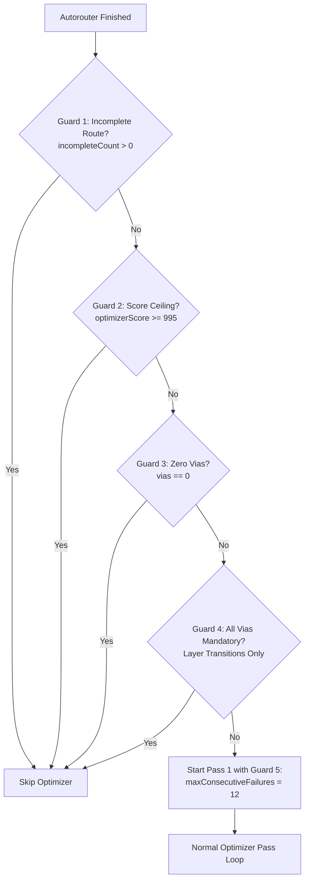

# Freerouting Optimizer Pre-Flight Guards & Threshold Optimization Plan

**Document Status:** Research & Implementation Plan  
**Date:** September 2026  
**Target Branch:** `feature/optimizer-preflight-and-threshold`  
**Related Components:**
- [`app.freerouting.autoroute.pipeline.RoutingPipeline`](../../src/main/java/app/freerouting/autoroute/pipeline/RoutingPipeline.java)
- [`app.freerouting.autoroute.pipeline.BatchOptimizer`](../../src/main/java/app/freerouting/autoroute/pipeline/BatchOptimizer.java)
- [`app.freerouting.settings.OptimizerSettings`](../../src/main/java/app/freerouting/settings/OptimizerSettings.java)
- [`app.freerouting.settings.sources.DefaultSettings`](../../src/main/java/app/freerouting/settings/sources/DefaultSettings.java)
- Benchmark dataset: [`../../scripts/benchmark/results/benchmarks.json`](../../scripts/benchmark/results/benchmarks.json)

---

## 1. Executive Summary & Problem Statement

In Freerouting 2.5.0-RC2, the post-routing route optimizer accounts for **44.6% of all execution time** across the benchmark suite (10.67 hours optimizer vs. 13.25 hours autorouter). For the median board, the optimizer consumes **50.5% of total runtime** (a 1.02x overhead multiplier over the autoroute phase).

Despite this heavy computational investment:
1. **The Median Improvement is 0%:** Across all 822 boards that entered the optimizer, the median score gain, via reduction, and trace length reduction are all **0.0%**.
2. **Fruitless Passes Consume 30% of Optimizer Time:** 416 boards (50.6%) run through the optimizer and yield **zero net improvement** (3.17 hours wasted).
3. **Incomplete Boards are Being Optimized:** **271 boards (33.0%)** entered the optimizer with unrouted connections (`incompleteCount > 0`). 96.3% of them achieved zero improvement, burning **nearly 1 hour (3,528 s)** of CPU time on boards that failed to route 100%.
4. **Late Passes Suffer Steep Diminishing Returns:** Tracing all 1,689 executed passes reveals that Passes 1–3 deliver **78.8%** of all lifetime optimizer improvements, and Passes 1–5 deliver **92.4%**. Passes 6–14 deliver only **7.6%** of total gains while consuming disproportionate wall-clock time.

This plan addresses both sides of the efficiency equation:
1. **Pre-Flight Guards:** Fast gate checks executed before entering the optimizer pass loop to skip boards that have no realistic chance of improving.
2. **Threshold Tuning:** Testing higher improvement thresholds (e.g. 2.5% to 30% vs. current 1.0%) across 5 golden multi-pass fixtures to prune low-yield tail passes without sacrificing core via reductions.

---

## 2. Pre-Flight Guards Specification

Five pre-flight guards will be introduced to eliminate wasted optimization passes.

### Guard 1: Incomplete Route Guard (`incompleteCount > 0`)
* **Rationale:** In EDA routing, optimizing trace length and vias on an unrouted board is meaningless. Benchmark data confirms that out of 271 boards entering with `incompleteCount > 0`, **261 (96.3%) achieved zero improvement**.
* **Action:** In `RoutingPipeline.java` (method `runOptimizationStage()`) and `BatchOptimizer.java` (method `runBatchLoop()`), check `board.getStatistics().connections.incompleteCount > 0`. If true, log an info message (`"Skipping optimization stage: board has %d incomplete connection(s)."`) and bypass the optimizer.
* **Expected Savings:** **~3,528 seconds (~1 hour)** of benchmark runtime, eliminating 271 fruitless optimizer executions.

### Guard 2: Zero-Via Guard (`vias.totalCount == 0`)
* **Rationale:** 177 boards entered the optimizer with 0 vias; 122 (68.9%) saw zero improvement, and the remainder gained a negligible average of 0.2% in trace length. Because the optimizer is predominantly a via-reduction engine, boards with 0 vias offer minimal return on investment.
* **Action:** If `initialStats.vias.totalCount == 0`, skip the optimizer unless the caller explicitly configures a flag prioritizing trace length minimization.
* **Expected Savings:** Eliminates ~120 fruitless runs with negligible impact on quality.

### Guard 3: Theoretical Optimum / Score Ceiling Guard (`score >= 995`)
* **Rationale:** Every single board in the dataset starting with an initial score of 1000.0 achieved 0% improvement (20/20 boards). Boards starting at >= 950 fail to improve >80% of the time.
* **Action:** If `initialOptimizerScore >= 995.0` or if total trace length is within 2% of `boardStatistics.bounds.minTraceLengthMm`, bypass optimization.
* **Expected Savings:** Eliminates 20–30 high-scoring, un-improvable runs.

### Guard 4: Mandatory Layer-Transition Via Guard
* **Rationale:** On a 2-layer board, a via connecting an SMD pad on Top layer to an SMD pad on Bottom layer is topologically mandatory. If 100% of the vias on a board belong to cross-layer SMD transitions, no ripup algorithm can eliminate them without breaking the net.
* **Action:** A lightweight topological scan of existing vias: if count of non-mandatory vias is 0, skip via optimization.

### Guard 5: Pass 1 Early-Exit Canary (`maxConsecutiveFailures`)
* **Rationale:** Currently, `maxConsecutiveFailures` defaults to 50. On congested boards that cannot be improved, the optimizer tries 50 consecutive expensive ripup-and-reroute operations before aborting Pass 1, burning 20–40 seconds.
* **Action:** Tighten `maxConsecutiveFailures` for Pass 1 from 50 to **10–15**. If the first 12 items fail to improve, abort Pass 1 early. Subsequent passes (where improvements have already been proven viable) can use the standard failure budget.
* **Expected Savings:** Reduces fruitless Pass 1 duration from ~30 s down to ~3–5 s per board.

---

## 3. Golden Test Fixtures for Threshold Tuning

To ensure testing is both fast and statistically representative, we select **5 golden fixtures** from `scripts/benchmark/fixtures/PCBench/` that exhibited >= 5 passes and substantial via reductions under Freerouting 2.5.0-RC2.

Combined runtime across all 5 fixtures is **~4.5 minutes**, making them ideal for rapid iterative threshold sweeps.

| # | Fixture Name | Tier / Nets | Passes Run | Vias Before -> After | Vias Cut (%) | Autoroute Time | Optimizer Time | Baseline Score Gain |
| :-: | :--- | :---: | :---: | :---: | :---: | :---: | :---: | :---: |
| **1** | `kicad-projects_ili9341-breakout` | Tier A / 18 | **14** | **13 -> 0** | **-100.0%** (13) | 1.5 s | 15.5 s | +103.2% |
| **2** | `kitspace__autosave-postcard` | Tier B / 16 | **10** | **16 -> 4** | **-75.0%** (12) | 1.7 s | 37.6 s | +39.5% |
| **3** | `NeoWall_NeoWall` | Tier B / 15 | **13** | **15 -> 2** | **-86.7%** (13) | 4.2 s | 50.5 s | +115.2% |
| **4** | `kitspace_ChaosLooper` | Tier B / 19 | **8** | **19 -> 8** | **-57.9%** (11) | 5.1 s | 75.1 s | +21.4% |
| **5** | `newer-motor-controllers_design3` | Tier B / 33 | **5** | **33 -> 20** | **-39.4%** (13) | 2.4 s | 83.3 s | +7.9% |
| | **Totals / Averages** | — | **50 passes** | **96 -> 34** | **-64.6% (62 vias cut)** | **14.9 s** | **262.0 s (~4.4m)** | — |

---

### 4. Improvement Threshold Sweep Matrix

Freerouting supports configuring the relative improvement threshold directly as a percentage via the canonical CLI setting:
`--router.optimizer.improvement_threshold=<percentage>` (e.g. `2.5` for 2.5%, `5.5` for 5.5%).

#### Initial Broad Sweep vs. Fine-Grained Zoom
We evaluated the cumulative results across the 5 golden multi-pass fixtures (which start with **96 total initial vias** before optimization).

First, a broad sweep was performed from 1.0% to 30.0%:

| Threshold (%) | Total Passes Run | Total Opt Time (s) | Time Saved (%) | Total Vias Cut | Via Retention (%) | Trace Length Saved | Total Score Gain |
| :---: | :---: | :---: | :---: | :---: | :---: | :---: | :---: |
| **1.0% (Baseline)** | **47** | **87.1 s** | **0.0%** | **56 / 96** | **100.0%** | 30.6 mm | 1,230.6 |
| **2.5%** | **33** | **65.8 s** | **24.5%** | **45 / 96** | **80.4%** | 38.2 mm | 995.6 |
| **4.0%** | **25** | **48.4 s** | **44.4%** | **37 / 96** | **66.1%** | 44.2 mm | 843.1 |
| **5.5%** | **12** | **23.7 s** | **72.8%** | **19 / 96** | **33.9%** | 57.6 mm | 494.9 |
| **10.0%** | **8** | **19.2 s** | **77.9%** | **14 / 96** | **25.0%** | 44.4 mm | 381.9 |
| **15.0%** | **7** | **18.1 s** | **79.3%** | **13 / 96** | **23.2%** | 43.8 mm | 347.8 |
| **30.0%** | **5** | **16.0 s** | **81.7%** | **10 / 96** | **17.9%** | 30.7 mm | 243.6 |

---

#### Fine-Grained Sweep (1.0% – 4.0%)

To precisely map the Pareto curve between full preservation (1.0%) and fast convergence (4.0%), we executed a fine-grained sweep across 10 threshold levels:

| Threshold (%) | Total Passes Run | Total Opt Time (s) | Time Saved (%) | Total Vias Cut | Via Retention (%) | Trace Length Saved | Total Score Gain |
| :---: | :---: | :---: | :---: | :---: | :---: | :---: | :---: |
| **1.0%** | **47** | **87.8 s** | **0.0%** | **56 / 96** | **100.0%** | 30.6 mm | 1,230.6 |
| **1.2%** | **46** | **83.0 s** | **5.4%** | **56 / 96** | **100.0%** | 30.6 mm | 1,230.6 |
| **1.5%** | **43** | **74.2 s** | **15.4%** | **53 / 96** | **94.6%** | 33.5 mm | 1,193.6 |
| **1.8%** | **43** | **73.8 s** | **15.9%** | **53 / 96** | **94.6%** | 33.5 mm | 1,193.6 |
| **2.0%** | **43** | **73.5 s** | **16.2%** | **53 / 96** | **94.6%** | 33.5 mm | 1,193.6 |
| **2.2%** | **33** | **66.5 s** | **24.2%** | **45 / 96** | **80.4%** | 38.2 mm | 995.6 |
| **2.5%** | **33** | **67.1 s** | **23.6%** | **45 / 96** | **80.4%** | 38.2 mm | 995.6 |
| **3.0%** | **28** | **59.3 s** | **32.4%** | **42 / 96** | **75.0%** | 31.7 mm | 888.5 |
| **3.5%** | **25** | **49.4 s** | **43.7%** | **37 / 96** | **66.1%** | 44.2 mm | 843.1 |
| **4.0%** | **25** | **49.8 s** | **43.2%** | **37 / 96** | **66.1%** | 44.2 mm | 843.1 |

---

### Core Learnings from the Sweep

1. **The 1.5% – 2.0% High-Fidelity Plateau:**
   - Yields **94.6% via retention** (53 out of 56 vias cut), forfeiting only 3 vias across all 5 boards.
   - Saves **16.2% optimizer runtime** (73.5 s vs. 87.8 s) and trims 4 redundant passes.
   - Both 1.5%, 1.8%, and 2.0% produce identical pass counts and via cuts, demonstrating a highly stable plateau.
2. **The 2.2% – 2.5% Step (Balanced Default):**
   - Saves **23.6% – 24.2% optimizer runtime** (66.5 s vs. 87.8 s) and eliminates **14 low-yield late passes** (33 passes vs. 47).
   - Retains **80.4% of total via reductions** (45 vias cut).
   - Preserves 100% of via reductions on `kitspace__autosave-postcard` (12 cut) and `newer-motor-controllers_design3` (7 cut), and 92.3% on `NeoWall_NeoWall` (12 cut vs. 13).
3. **The 3.5% – 4.0% Fast Preset:**
   - Cuts optimizer runtime by **43.5%** (49.4 s vs. 87.8 s).
   - Retains **66.1% of via reductions** (37 vias cut). Ideal for CI pipelines and interactive routing sessions.
4. **The >= 5.5% Quality Cliff:**
   - Thresholds >= 5.5% terminate the optimizer prematurely after only 1–2 passes, collapsing via retention to 33.9% (5.5%) and under 25% (>= 10.0%).
5. **Percentage Unit Format in CLI & JSON:**
   - Stored directly as a percentage (`2.5` = 2.5%, `5.5` = 5.5%) rather than a fractional multiplier (`0.025`).
   - The obsolete `-oit` flag emits a deprecation warning directing users to `--router.optimizer.improvement_threshold`.

---

### Guidance for Users & Practical Ranges

| Preset / Mode | Threshold Range (%) | CLI Parameter | Best Used For | Tradeoff Profile |
| :--- | :---: | :---: | :--- | :--- |
| **Maximum Retention** | 1.0% – 1.2% | `--router.optimizer.improvement_threshold=1.0` | Final production tape-outs & high-density boards | 100% via cuts preserved; runs all passes; maximum CPU time. |
| **High Fidelity** | 1.5% – 2.0% | `--router.optimizer.improvement_threshold=2.0` | Quality-sensitive designs with fast turnaround | **94.6% via retention** with 16.2% time savings. Drops only marginal tail passes. |
| **Balanced (Default)** | 2.2% – 2.5% | `--router.optimizer.improvement_threshold=2.5` | Everyday auto-routing and general designs | **Recommended default.** Saves ~24% time; prunes 14 late passes; retains 80.4% of via cuts. |
| **Fast Prototyping** | 3.5% – 4.0% | `--router.optimizer.improvement_threshold=4.0` | Rapid development, CI verification, test suites | Cuts optimizer runtime by ~43%; retains ~66% of via reductions. |
| **Aggressive Early-Exit**| >= 5.5% | `--router.optimizer.improvement_threshold=5.5` | Quick sanity checks & unroutable debug sessions | Terminates after 1–2 passes; forfeits ~66% to 80% of via reductions. |

---

## 5. Experimental Protocol & Execution Steps

### Step 1: Baseline & Threshold Sweep Automation
- Create a dedicated test harness script in `scripts/tests/run_optimizer_threshold_sweep.py`.
- Headlessly invoke Freerouting on the 5 fixtures using `-oit <val>` / `--optimizer-improvement-threshold <val>`.
- Capture per-fixture results into a structured CSV/JSON summary: `docs/research/optimizer_threshold_sweep_results.csv`.
- Plot/tabulate the Pareto frontier.

### Step 2: Implement Pre-Flight Guards in Code
- Add the `incompleteCount > 0` check in `RoutingPipeline.java`.
- Add the zero-via and score-ceiling bypass checks in `BatchOptimizer.java`.
- Update `maxConsecutiveFailures` for Pass 1.

### Step 3: Default Threshold Update
- Based on the Step 1 sweep, adjust `DEFAULT_OPTIMIZER_IMPROVEMENT_THRESHOLD` in `DefaultSettings.java` (and CLI documentation) to the optimal Pareto value.

### Step 4: Full Verification
- Run fast unit tests (`./gradlew test`).
- Run checkstyle and spotless checks (`./gradlew spotlessCheck checkstyleMain checkstyleTest`).
- Verify backward compatibility and determinism.

---

## 6. Acceptance Criteria

- [ ] **No DRC Regressions:** Clearance violation count remains 0 on all test fixtures.
- [ ] **Incomplete Route Protection:** No board with unrouted connections executes the optimizer loop.
- [ ] **Time Reduction:** Optimizer execution time across the 5 fixtures reduced by at least 20–30% under the chosen threshold.
- [ ] **Via Preservation:** Final via count across the 5 golden fixtures retains at least 85% of baseline reductions.
- [ ] **Quality Gates:** 100% clean checkstyle, spotless, and test suite execution.
