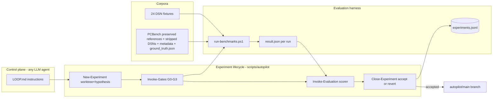

# Self-Improving Routing Optimization Loop

**Document status:** Implemented (Phases 0–5); proposed Phases 6–8
**Date:** August 2026
**Related benchmark data:** [`../../scripts/benchmark/results/benchmarks.md`](../../scripts/benchmark/results/benchmarks.md)
**Related PCBench corpus:** [PCBench/PCBench](https://github.com/PCBench/PCBench)

## Goal

A system any LLM coding agent can drive unattended: pick a hypothesis (code or settings), patch,
evaluate through escalating quality gates against a frozen baseline, accept/revert with statistical
rigor, auto-commit accepted changes to an `autopilot/main` branch, and report. Ground truth comes
from two corpora: the existing 24 DSN fixtures and the professionally routed PCBench KiCad corpus
that we preserve, unroute, and re-route for comparison. The local PCBench checkout currently
contains 1182 board directories with the expected `processed.kicad_pcb` and `metadata.json` files;
the corpus size is therefore discovered from the checkout rather than hard-coded to the older
README count of 164.

**Scope decisions (confirmed):**

- The loop may change both **algorithm code** and **router settings/scoring parameters**.
- Accepted experiments **auto-commit** to a dedicated local branch (`autopilot/main`); humans review
  a summary report and open a PR to `master` when satisfied.

## Interface decision (validated in Phase 0, decided now from architecture)

| Interface | Verdict | Reason |
| --- | --- | --- |
| **CLI** | **Primary evaluation interface** | Process-per-run isolation (OOM/crash containment, clean per-run peak-heap measurement), deterministic, universal for any agent (shell + files is the lowest common denominator), already battle-tested by `scripts/benchmark/run-benchmarks.ps1`. JVM startup (~2–4 s) is negligible vs. minute-long routing runs. |
| REST API | Secondary / future scaling | Structured job JSON (`RoutingJob.resource_usage`, nested `BoardStatistics`) is attractive, but requires server lifecycle management and auth config; adopt only if CLI throughput becomes the bottleneck. |
| MCP | Interactive plane only | JSON-RPC bridge over REST (`OpenApiMcpToolRegistry`) for agent-driven exploratory sessions; an extra hop with no benefit for batch evaluation. |
| GUI | Excluded | Requires a display; unreachable headless. |

The CLI's two real weaknesses — no machine-readable routing result (metrics are regex-scraped from
PatternLayout logs) and weak exit codes (`InitializeCLI` returns true even on TERMINATED) — are fixed
in Phase 1 with a first-class result manifest.

## Format decisions

- **Log format:** keep human PatternLayout logs as-is (parity tooling depends on them); add a
  **machine channel**: the app writes one versioned `result.json` per run. No regex scraping in the
  new loop; logs stay diagnostic-only.
- **PCB input format:** Specctra `.dsn` remains the canonical benchmark input (native reader, all
  fixtures, KiCad exports it). PCBench `.kicad_pcb` is converted to unrouted `.dsn` offline, once
  per board, cached.
- **PCB output format:** `.ses` (re-importable into KiCad for ground-truth DRC) + existing
  KiCad-compatible DRC JSON (`-drc`, [`DrcReport.java`](../../src/main/java/app/freerouting/drc/DrcReport.java)).
- **PCBench preservation:** never modify `raw.kicad_pcb`, `processed.kicad_pcb`, `metadata.json`,
  or `final.json`. Each selected board gets a sidecar artifact directory that preserves the
  original PCBench `PCBs/<board>/` identity while containing both the completed reference DSN
  and the stripped/unfilled benchmark-input DSN.
- **PCBench route artifacts:** the completed reference exported from `raw.kicad_pcb` is distinct
  from the unrouted input exported from the stripped `processed.kicad_pcb`. A Freerouting result
  is initially a `.ses`; a generated candidate routed `.dsn` is only considered valid after SES
  re-import into KiCad and a successful DSN export. Until that round trip is reliable, the SES and
  result manifest are the authoritative candidate artifacts.
- **Experiment records:** append-only `experiments.jsonl` ledger + one directory per experiment;
  benchmark store stays `benchmarks.json` (schema bump for multi-run + git SHA).
- **Ground truth (PCBench):** per-board `ground_truth.json` (reference wire length, via count, KiCad
  DRC result on the original) computed once at import time.
- **Tier metadata:** a versioned catalog assigns every benchmark board to one or more tiers and
  records the expected outcome class. Tier membership is data, not a filename convention, so a
  board can move from a difficult tier to an easier tier after router improvements without being
  copied or renamed.

## Architecture



## Objective function (lexicographic, per AGENTS.md priorities)

Hard gates first, then ordered improvements, all on medians of n≥3 runs with per-fixture noise
floors measured in Phase 2:

1. Clearance violations: zero new violations anywhere (hard reject); violations down = win.
2. Completion: unrouted count must not regress beyond noise band.
3. Score (`BoardStatistics.getNormalizedScore`, 0–1000) up.
4. CPU time down (router+fanout dominate: 12.4k s vs 243 s optimizer in the last snapshot runs).
5. Peak heap down.

Regressions on any single canary fixture beyond 2× its noise floor also reject (prevents "average up,
one board destroyed").

## Phase 0 — Validation spikes (1 day)

- **0.1 CLI-vs-API equivalence:** route `DAC2020_bm01.dsn` + `ecc83-pp.dsn` via CLI and via REST
  (`POST /v1/jobs/...`), confirm identical `connections.incomplete_count` / violations / score and
  quantify CLI JVM overhead. Confirms CLI as harness interface.
- **0.2 PCBench conversion PoC:** 3 boards (`1Bitsy_1bitsy`, one 2-layer, and one 6-layer).
  KiCad 10.0.2 has no `kicad-cli pcb export specctra-dsn` command, so the supported export path
  is KiCad's bundled Python and `pcbnew.ExportSpecctraDSN`. Verify: preserve raw reference →
  strip processed board → export both DSNs → smoke-load the unrouted DSN with Freerouting →
  route → write SES → attempt SES re-import and KiCad DRC.
- KiCad version caveat: PCBench boards are KiCad 4–7 era; modern KiCad may upgrade-on-load. Record
  behavior in the PoC notes.
- The PoC found that KiCad 10.0.2 headless `pcbnew.ImportSpecctraSES` returned false for the
  generated Freerouting SES with no tracks imported. This is a tracked integration blocker, not
  permission to call an SES file a routed DSN. Preserve the SES and mark the round-trip status
  explicitly until the import/export path is fixed.

## Phase 1 — Machine-readable contract (product change)

- Add `--router.result_json=<path>` CLI option. At the end of a headless `-de/-do` run, write a
  versioned manifest:
  `{schema_version, app_version, git_sha, fixture:{filename,sha256}, settings_snapshot,
  phases:{fanout,autorouter,optimizer}:{duration_s,passes}, board_statistics:<BoardStatistics JSON>,
  resource_usage:{cpu_time,peak_memory_mb}, final_state, exit_code}`.
- Implementation: new writer class near
  [`BoardStatistics.java`](../../src/main/java/app/freerouting/core/scoring/BoardStatistics.java)
  (reuse its Gson JSON, line ~530), invoked from the CLI job-completion path in
  [`Freerouting.java`](../../src/main/java/app/freerouting/Freerouting.java); correct exit-code
  semantics (non-zero unless job COMPLETED or TIMED_OUT with output written).
- Compute violations in the manifest via `DesignRulesChecker.getAllClearanceViolations()` (not the
  incomplete `BoardOutline` shortcut — Issue 558) so the loop optimizes against the real threshold.
- Unit test: manifest writer produces valid JSON with all required keys on `Dac2020Bm01RoutingTest`.

## Phase 2 — Harness hardening (`scripts/benchmark/`)

- `lib/JsonStore.ps1` / `lib/LogParser.ps1`: prefer `result.json` when present, fall back to regex.
  Add `git_sha` to the cache key ([`lib/CacheKey.ps1`](../../scripts/benchmark/lib/CacheKey.ps1)),
  relative `log_file` paths.
- `run-benchmarks.ps1`: expose `-MaxItems` (cheap bounded slices, per AGENTS.md large-board
  guidance) and `-RunsPerConfig N` (median aggregation; schema_version 2 storing per-run list +
  median).
- New `scripts/benchmark/measure-noise-floor.ps1`: n=5 baseline runs on 6 representative fixtures
  (bm02, bm07, bm08, ecc83-pp, sonde xilinx, bm01) → `baselines/noise_floor.json` (per-fixture
  stddev of violations/unrouted/score/time).
- Fixture metadata: `scripts/benchmark/fixtures/metadata.yaml` — per fixture: size class, layers,
  plane nets, expected duration, timeout budget, tags (`canary`, `large`, `plane`, `regression-bm01`
  etc.).
- Freeze baseline: `baselines/baseline-manifest.json` + pinned baseline JAR; the ratchet rule is
  "accepted state on `autopilot/main` becomes the new baseline".

## Phase 3 — Autopilot loop (`scripts/autopilot/`, the deliverable core)

- `LOOP.md` — model-agnostic agent manual encoding: AGENTS.md constraints (never relax ArchUnit
  strict rules, no new violations, keep docs/issues files updated, v1.9 as reference only), the
  experiment lifecycle, gate definitions, budgets (max experiment wall-clock, max experiments/day,
  fixture time budgets via metadata.yaml), and forbidden actions.
- `New-Experiment.ps1` — creates `experiments/<id>/` (hypothesis.md template, verdict.json
  placeholder) + git worktree on `experiment/<id>` from `autopilot/main`.
- `Invoke-Gates.ps1` — escalating gates, stop at first failure:
  - **G0:** `./gradlew test` fast set incl. ArchUnit + `Issue508Test_BM01_first_2_nets`; build
    executableJar.
  - **G1:** canary fixtures (all <60 s each) n=3, acceptance vs noise floor.
  - **G2:** full 24-fixture suite (`run-benchmarks.ps1 -FilterBinary candidate.jar`, `-MaxItems`
    slices for >500-net boards).
  - **G3:** PCBench subset (Phase 4).
- `Invoke-Evaluation.ps1` (+ Python scorer) — candidate vs baseline medians → `verdict.json`
  `{accept|reject, reasons[], deltas per fixture}`.
- `Close-Experiment.ps1` — accept: fast-forward `autopilot/main`, regenerate baseline manifest +
  JAR, append ledger, update `experiments/REPORT.md`; reject: log + delete worktree. Auto-revert any
  gate failure.
- Parity escape hatch: when G1/G2 rejects with behavioral divergence, point the agent at
  [`compare-versions.ps1`](../../scripts/tests/compare-versions.ps1) + `raw-section-mismatch.ps1`
  workflow (already documented in AGENTS.md).

## Phase 4 — PCBench ground-truth corpus (`scripts/pcbench/`)

Phase 4 establishes the conversion primitives. It must preserve two independent board states:

1. **Completed reference:** the professionally routed `raw.kicad_pcb`, exported as
   `reference-routed.dsn`. This is used for reference wire length, via count, layer usage, and
   visual/structural comparison.
2. **Unrouted benchmark input:** the `processed.kicad_pcb` after all copper tracks and vias have
   been removed and zone fills have been removed, exported as `unrouted.dsn`. This is the canonical
   Freerouting input and must not accidentally retain any original routing.

The original four PCBench files remain in place:

```text
C:\Work\PCBench\PCBs\<board>\
  final.json
  metadata.json
  processed.kicad_pcb
  raw.kicad_pcb
```

The planned sidecar layout keeps that identity while making the generated artifacts obvious:

```text
C:\Work\PCBench\PCBs\<board>\
  final.json
  metadata.json
  processed.kicad_pcb
  raw.kicad_pcb
  freerouting\
    board-manifest.json
    metadata.normalized.json
    reference-routed.dsn
    unrouted.kicad_pcb
    unrouted.dsn
    ground_truth.json
    runs\
      <git-sha>-<timestamp>\
        result.json
        routed.ses
        routed.kicad_pcb       # only after successful SES re-import
        routed.dsn              # only after successful DSN export
        kicad-drc.json
```

The repository cache may mirror these files under
`scripts/benchmark/fixtures/PCBench/<tier>/<board>/`, but the PCBench checkout remains the
human-friendly source of truth. Every generated file records source paths, source SHA-256 values,
generator version, KiCad version, Freerouting git SHA, and conversion timestamps. Generated files
must be written atomically and never overwrite a source file.

Existing and planned conversion responsibilities:

- `Fetch-PCBench.ps1` verifies the local clone at `C:\Work\PCBench` (overridable with
  `FREEROUTING_PCBENCH`) and selects only board directories containing the required files.
- `strip_kicad_routing.py` is a pure s-expression transform: remove `segment`, `via`, and `track`
  children from the `(kicad_pcb ...)` wrapper; remove `filled_polygon` children while retaining
  zone outlines, footprints, keepouts, nets, and rules. It validates balanced parentheses,
  verifies that no segments/vias remain, and is idempotent.
- `Convert-PCBenchBoards.ps1` exports the stripped board with
  `C:\Program Files\KiCad\10.0\bin\python.exe` and `pcbnew.ExportSpecctraDSN`. The completed
  reference must also be exported from `raw.kicad_pcb`; the two exports must never share a path.
- `Build-GroundTruth.ps1` computes raw-board reference track length, segment count, via count, and
  KiCad DRC JSON. DRC stderr warnings are diagnostic output; a warning must not be mistaken for
  a failed DRC report.
- A smoke-load invokes Freerouting `-drc` on `unrouted.dsn` before any routing run.
- A route run writes a `.ses` and `result.json`. A postprocessor may create `routed.kicad_pcb`
  and `routed.dsn` only when `ImportSpecctraSES` succeeds and the exported DSN passes a Freerouting
  load check. KiCad DRC is then run on the imported routed PCB, not on the unchanged raw reference.
- Issue 558 remains relevant: Specctra DSN export does not carry KiCad copper-to-edge clearance,
  so KiCad DRC is an external arbiter and internal Freerouting clearance counts are not sufficient.

## PCBench conversion and benchmark tutorial

This tutorial describes the intended repeatable workflow. It is deliberately explicit about the
two board states so a benchmark cannot accidentally route the professionally completed board.

### 1. Verify prerequisites

Run from the Freerouting repository root in PowerShell:

```powershell
$env:FREEROUTING_PCBENCH = "C:\Work\PCBench"
$env:FREEROUTING_KICAD_CLI = "C:\Program Files\KiCad\10.0\bin\kicad-cli.exe"
$env:FREEROUTING_KICAD_PYTHON = "C:\Program Files\KiCad\10.0\bin\python.exe"

& $env:FREEROUTING_KICAD_CLI version
Test-Path "$env:FREEROUTING_PCBENCH\PCBs"
Test-Path "$env:FREEROUTING_KICAD_PYTHON"
.\gradlew.bat executableJar
```

The expected KiCad version for the current validation machine is `10.0.2`. The bundled Python is
required because KiCad 10's CLI does not expose a Specctra DSN export subcommand.

### 2. Select boards without changing PCBench

First verify the clone:

```powershell
.\scripts\pcbench\Fetch-PCBench.ps1 -PCBenchRoot C:\Work\PCBench
```

For a deterministic PoC, select board names explicitly:

```powershell
$boards = @(
  "1-Wire-Wing-pcb_1-Wire_Wing",
  "1Bitsy_1bitsy",
  "front-end-modules_LimeSDR_Sony"
)
```

For larger imports, use stratified selection rather than the first N directory entries. At
minimum, stratify by signal-layer count, net count, component count, board area, route density,
and whether zones/plane nets are present. Record the selection query and the resulting board IDs in
the catalog so a later run can reproduce the same corpus.

### 3. Produce both DSN inputs

For every selected board:

1. Hash `raw.kicad_pcb`, `processed.kicad_pcb`, `metadata.json`, and `final.json`.
2. Export `raw.kicad_pcb` unchanged to `reference-routed.dsn`.
3. Copy `processed.kicad_pcb` to a generated path such as `unrouted.kicad_pcb`.
4. Strip all track/via children and all filled-zone polygons from that copy.
5. Verify zero remaining `(segment ...)`, `(via ...)`, and `(track ...)` routing elements.
6. Export the stripped copy to `unrouted.dsn`.
7. Smoke-load `unrouted.dsn` with Freerouting `-drc`.
8. Write `board-manifest.json` containing both DSN paths and the hashes that produced them.

The completed reference and unrouted input must be visually and semantically distinguishable in
file names. `reference-routed.dsn` is never passed to the router as a benchmark input.

With the currently implemented conversion primitive, the three-board PoC can be regenerated as
follows. Until Phase 6 adds the sidecar layout, these generated DSNs are written to the repository
cache at `scripts/benchmark/fixtures/PCBench/` and the stripped KiCad files are written to
`scripts/pcbench/cache/stripped/`:

```powershell
.\scripts\pcbench\Convert-PCBenchBoards.ps1 `
  -PCBenchRoot C:\Work\PCBench `
  -IncludeBoards "1-Wire-Wing-pcb_1-Wire_Wing,1Bitsy_1bitsy,front-end-modules_LimeSDR_Sony" `
  -MaxBoards 3 `
  -JarPath .\build\libs\freerouting-current-executable.jar `
  -Force
```

Phase 6 must extend this command so that it also exports the completed reference DSN from each
board's `raw.kicad_pcb` into that board's `freerouting\reference-routed.dsn`; the current command
only provides the stripped benchmark DSN.

### 4. Build ground truth

Compute ground truth from `raw.kicad_pcb`, not from a converted DSN:

```powershell
.\scripts\pcbench\Build-GroundTruth.ps1 `
  -PCBenchRoot C:\Work\PCBench `
  -IncludeBoards "1-Wire-Wing-pcb_1-Wire_Wing,1Bitsy_1bitsy,front-end-modules_LimeSDR_Sony"
```

Ground truth should contain:

- source and reference hashes;
- reference via count and segment count;
- approximate and normalized track length;
- layer and zone/plane information;
- KiCad DRC report path, total violations, and violation categories;
- the exact KiCad command/version used;
- conversion warnings and known caveats.

The raw board's DRC is a reference characterization, not a target of zero: professional PCBench
boards may contain intentional, historical, or parser-specific violations. Candidate comparison
must measure whether routing introduces additional violations relative to the appropriate
unrouted-board baseline and must separately report the raw reference's existing violations.

### 5. Route the unrouted DSN

Use the generated `unrouted.dsn` only:

```powershell
$jar = "C:\Work\freerouting\build\libs\freerouting-current-executable.jar"
$input = "C:\Work\PCBench\PCBs\1-Wire-Wing-pcb_1-Wire_Wing\freerouting\unrouted.dsn"
$run = "C:\Work\PCBench\PCBs\1-Wire-Wing-pcb_1-Wire_Wing\freerouting\runs\candidate"

New-Item -ItemType Directory -Force $run | Out-Null
java -jar $jar `
  --gui.enabled=false `
  --api_server.enabled=false `
  --mcp_server.enabled=false `
  -de $input `
  -do (Join-Path $run "routed.ses") `
  --router.result_json=(Join-Path $run "result.json")
```

The manifest is the machine-readable result. The SES is the immediate routed artifact. Record
the candidate's tier, git SHA, settings snapshot, output path, exit code, final state, unrouted
count, internal clearance violations, score, CPU time, and peak heap.

### 6. Re-import and produce a candidate routed DSN

When the KiCad SES import path is working:

1. import `routed.ses` into `unrouted.kicad_pcb`;
2. save as `routed.kicad_pcb`;
3. run KiCad DRC and save `kicad-drc.json`;
4. export `routed.kicad_pcb` to `routed.dsn`;
5. smoke-load `routed.dsn` with Freerouting;
6. compare routed metrics to both `ground_truth.json` and the result manifest.

Until this succeeds, do not fabricate `routed.dsn` by renaming `.ses`. Keep `routed.ses` and mark
`ses_reimport_ok=false`, `candidate_dsn_written=false`, and `kicad_drc_ran=false`. On the current
KiCad 10.0.2 validation machine, headless `pcbnew.ImportSpecctraSES` returned false with zero
tracks imported, so this remains a planned follow-up rather than a completed guarantee.

### 7. Benchmark a tier

Run the benchmark harness against the tier's `unrouted.dsn` files, not the reference DSNs:

```powershell
.\scripts\benchmark\run-benchmarks.ps1 `
  -BinariesDir .\build\libs `
  -FixturesDir .\scripts\benchmark\fixtures\PCBench `
  -ResultsDir .\experiments\pcbench-gate `
  -RunsPerConfig 3 `
  -Force
```

The eventual tier-aware wrapper should resolve fixture paths from the catalog rather than scanning
the cache, apply each board's timeout and `max_items` budget, emit one manifest per run, aggregate
medians, and retain the full per-board logs. A benchmark result is incomplete when the board could
not load, timed out before a usable result, crashed, or produced no output.

## PCBench metadata and catalog

The PCBench `metadata.json` is useful provenance but is intentionally sparse. The benchmark needs
a normalized catalog that combines PCBench metadata, parsed board facts, conversion facts, and
router outcomes. Do not replace the upstream metadata; derive a new
`metadata.normalized.json`/`pcbench-catalog.json`.

Each board record should include:

```json
{
  "board_id": "1-Wire-Wing-pcb_1-Wire_Wing",
  "display_name": "1-Wire-Wing-pcb_1-Wire_Wing",
  "pcbench_directory": "PCBs/1-Wire-Wing-pcb_1-Wire_Wing",
  "source": "https://github.com/j3270/1-Wire-Wing-pcb",
  "author": "j3270",
  "license": "MIT",
  "retrieved_at": "2023-08-17 17:22:53.294066",
  "cad": {
    "host": "KiCad's Pcbnew",
    "version": "10.0.2",
    "source_version": "KiCad 4"
  },
  "files": {
    "raw": {"path": "raw.kicad_pcb", "bytes": 0, "sha256": "..."},
    "processed": {"path": "processed.kicad_pcb", "bytes": 0, "sha256": "..."},
    "final": {"path": "final.json", "bytes": 0, "sha256": "..."},
    "metadata": {"path": "metadata.json", "bytes": 0, "sha256": "..."}
  },
  "board": {
    "layers": 2,
    "nets": 99,
    "components": 20,
    "dimensions_mm": {"width": 101.6, "height": 53.3},
    "area_cm2": 54.2,
    "zones": 0,
    "plane_nets": 0
  },
  "reference": {
    "segments": 166,
    "vias": 15,
    "track_length_mm": 407.97,
    "kicad_drc_violations": 117
  },
  "tier": "A",
  "expected_outcome": "complete",
  "tags": ["2-layer", "canary"]
}
```

The website-style summary should be rendered from this catalog rather than manually typed:

```text
Size: 30.5 kB · Layers: 2 · Nets: 99 · Components: 20 ·
Dimensions: 101.6 x 53.3 mm (54.2 cm²) · CAD: KiCad's Pcbnew (v9.0.6)
```

Use KiCad's source metadata where available, but distinguish `source_version` (for example,
`KiCad 4` in PCBench metadata) from `conversion_version` (for example, `10.0.2` on the current
machine). File size should state whether it refers to raw, processed, or normalized output.
Dimensions and area must use a single unit convention and be rounded only at presentation time.
When a field cannot be derived reliably, store `null` plus a `metadata_warnings` entry instead of
guessing.

## Tiered PCBench corpus

### Tier purpose

Tiers are an operational risk ladder, not merely a difficulty score:

- **Tier A / 1 — easy and complete:** small, simple boards that the current router completes
  reliably with zero new violations. A regression here is a strong signal of a fundamental router
  defect.
- **Tier B / 2 — routine:** boards with more nets, components, layers, bends, or modest zones that
  the router normally completes, but with a larger time and noise budget.
- **Tier C / 3 — difficult but useful:** boards that may finish with some unrouted items or require
  bounded passes/items. Improvement is meaningful, but a failure is not automatically a release
  blocker if the outcome class does not regress.
- **Tier D / 4 — incomplete baseline:** boards that the current router cannot finish flawlessly
  and may leave many unrouted items. They are optimization targets and diagnostic stress cases.
- **Tier E / 5 — unsupported or load-failure:** boards that cannot be loaded, converted, routed
  within a defined safety budget, or validated through the external DRC path. These remain tracked
  so support regressions are visible, but are not scored as ordinary routing wins.

A board may additionally have `expected_outcome` values such as `complete`,
`complete_with_known_violations`, `partial`, `timeout`, `load_failure`, or `unsupported`. The
expected outcome is frozen per baseline revision; it must not silently change to make a candidate
pass.

### Tier assignment

Initial assignment should use measured baseline results, not only board size:

1. convert and smoke-load the board;
2. run the frozen baseline with a bounded, documented budget;
3. classify completion, violations, score, elapsed time, peak heap, and validation status;
4. assign the tier using explicit thresholds and reviewer-visible reasons;
5. store the baseline run ID and catalog version on the tier record.

Useful assignment signals include layer count, net count, component count, board area, route
density, via density, zone count, plane-net count, DSN size, baseline unrouted count, baseline DRC
delta, timeout rate, and conversion/import status. Do not collapse all signals into one opaque
difficulty number; retain the individual values so a tier change can be explained.

### Tier manifest

The catalog should support a separate manifest such as:

```yaml
version: 1
tiers:
  A:
    aliases: [1, easy]
    expected_outcome: complete
    boards: [ecc83-pp, 1-Wire-Wing-pcb_1-Wire_Wing]
    gate: blocking
    stop_on_regression: true
  B:
    aliases: [2, routine]
    expected_outcome: complete
    boards: [1Bitsy_1bitsy]
    gate: blocking
    stop_on_regression: true
  C:
    aliases: [3, difficult]
    expected_outcome: partial
    boards: []
    gate: diagnostic
    stop_on_regression: false
  D:
    aliases: [4, incomplete-baseline]
    expected_outcome: partial
    boards: []
    gate: diagnostic
    stop_on_regression: false
  E:
    aliases: [5, unsupported]
    expected_outcome: load_failure
    boards: []
    gate: quarantine
    stop_on_regression: false
```

The actual tier file should also record thresholds, timeout budgets, `max_items`, required run
count, and whether KiCad DRC/SES re-import is mandatory. A board belongs to exactly one primary
tier for gating, but may have many descriptive tags such as `2-layer`, `plane`, `large`,
`conversion-warning`, or `known-import-failure`.

### Tier-aware gate behavior

The default policy is sequential:

1. run Tier A first;
2. if any Tier A board regresses beyond its noise band, introduces a new clearance violation,
   crashes, fails to load, or changes from `complete` to a worse outcome class, stop immediately;
3. optionally continue with `-ContinueAfterTierFailure` when diagnosing the breadth of a known
   failure;
4. run Tier B only if policy allows it;
5. run C/D for diagnostic and optimization evidence;
6. report Tier E separately as support/compatibility status, never as a false routing success.

The stop decision must distinguish:

- **hard regression:** new violation, crash, load failure, corrupted output, or outcome-class
  downgrade;
- **statistical regression:** metric moved beyond the per-board noise band;
- **expected difficulty:** board remains in its frozen partial/timeout class;
- **improvement:** outcome class improves or lexicographic metrics improve without violating gates.

The gate result should include `stopped_at_tier`, `stop_reason`, `tiers_not_run`, and an explicit
`continued_after_failure` flag. This makes “we stopped because Tier A failed” different from “later
tiers were not run because their budget expired.”

## Phase 6 — PCBench artifact preservation and metadata (implemented)

- Add a board-artifact manifest that preserves the original PCBench four-file layout and writes
  `reference-routed.dsn`, `unrouted.kicad_pcb`, `unrouted.dsn`, hashes, tool versions, and warnings.
- Export both the completed reference DSN from `raw.kicad_pcb` (with fallback to `processed.kicad_pcb`) and the unrouted DSN from the
  stripped `processed.kicad_pcb`; never overwrite either source PCB.
- Make conversion output idempotent, atomic, and resumable. A source-hash/tool-version mismatch
  invalidates generated artifacts and requires an explicit `-Force`.
- Add normalized metadata generation for file size, layers, nets, components, dimensions, area,
  CAD provenance, zones, plane nets, route density, reference metrics, and website-style display
  text.
- Preserve `.ses` and `result.json` when routed DSN generation is blocked. Generate
  `routed.kicad_pcb`/`routed.dsn` only after a verified SES import and DSN smoke-load.

## Phase 7 — Tier taxonomy and tier-aware gates (proposed)

- Add a versioned tier manifest with A–E and numeric aliases, board membership, expected outcome
  class, thresholds, budgets, tags, and baseline revision.
- Add a baseline classification pass that assigns or proposes tiers from measured routing outcomes,
  while requiring a human-visible reason for every assignment change.
- Extend `Invoke-Gates.ps1` with sequential tier execution, immediate Tier A stop by default, and
  an explicit opt-in to continue after a failed tier.
- Store tier-level and board-level results, including `stopped_at_tier`, `tiers_not_run`, outcome
  transitions, and failure classifications.
- Treat Tier A regressions as blocking even when aggregate later-tier metrics improve. Treat C/D
  partial outcomes as comparable diagnostic results, not automatic failures. Keep E quarantine
  results visible without allowing them to distort completion-rate scoring.

## Phase 8 — PCBench benchmark tutorial and reporting (proposed)

- Add a single documented command that performs verify → select → preserve → strip → export both
  DSNs → smoke-load → ground truth → route → result-manifest collection.
- Add a dry-run mode that prints the planned artifact paths and board metadata without invoking
  KiCad or Freerouting.
- Add per-tier reports with the website-style board summary, source/reference/unrouted/candidate
  links, baseline comparison, DRC arbitration status, and reason for every skipped or quarantined
  board.
- Add a corpus index so an agent can ask for “all Tier A 2-layer canaries” without scanning
  directories or relying on display names.
- Add regression tests for strip idempotence, zero residual routing elements, source immutability,
  hash invalidation, tier stop/continue behavior, and correct classification of load failures,
  partial routes, timeouts, and successful complete routes.

## Phase 5 — Unattended operation

- `scripts/autopilot/Start-NightlyLoop.ps1` (Windows Task Scheduler-able): pulls latest
  `autopilot/main`, runs up to N experiments, stops on budget/baseline-staleness, updates
  `experiments/REPORT.md` and `website/benchmarks.html` (existing HtmlPatcher).
- Promotion rule: when accepted-experiment cumulative delta exceeds a threshold (e.g. ≥3 accepted, no
  open regressions), the agent opens a PR from `autopilot/main` to `master` for human review —
  humans gate releases, not individual experiments.
- Monitoring: `experiments.jsonl` ledger + existing `benchmarks-chart-data.json`; failure triage
  rules in LOOP.md (OOM → halve fixture set; repeated gate-0 failure → stop and file
  `docs/issues/` entry).

## Key risks

- Noise masquerading as improvement → mitigated by n≥3 medians + measured noise floors (Phase 2).
- Agent gaming the metric (e.g. disabling fanout) → hard gates + ArchUnit + ledger diff review in
  REPORT.md.
- PCBench conversion yield <100% → corpus sized with margin; conversion failures logged, not fatal.
- Baseline staleness → ratchet rule + git SHA in cache keys.
- Artifact confusion (routing the completed reference or overwriting PCBench sources) → separate
  `reference-routed.dsn`/`unrouted.dsn` names, immutable source hashes, and sidecar manifests.
- Tier gaming or hidden reclassification → freeze expected outcome and baseline revision; require
  visible reasons for tier changes.
- A late-tier success masking an easy-tier regression → Tier A runs first with blocking stop by
  default and explicit continuation reporting.

## Existing assets reused

- [`run-benchmarks.ps1`](../../scripts/benchmark/run-benchmarks.ps1) + lib modules (runner, memory
  sampler, DRC runner, exporters).
- [`compare-versions.ps1`](../../scripts/tests/compare-versions.ps1) parity toolkit;
  [`RoutingFixtureTest`](../../src/test/java/app/freerouting/fixtures/RoutingFixtureTest.java) +
  `TestingSettings` for gates; `DrcReport` JSON; `BoardStatistics` Gson JSON; HtmlPatcher for the
  website.

## Implementation checklist

| Phase | Task | Status |
| --- | --- | --- |
| 0 | CLI-vs-API equivalence spike; PCBench conversion PoC (3 boards) | Implemented |
| 1 | `--router.result_json` manifest writer, exit codes, unit test | Implemented |
| 2 | Harness hardening: structured results, cache key, `-MaxItems`/`-RunsPerConfig`, noise floor, metadata.yaml, baseline | Implemented |
| 3 | `scripts/autopilot/` lifecycle scripts + `LOOP.md` | Implemented |
| 4 | PCBench pipeline: fetch, strip, convert, ground truth, G3 gate | Implemented |
| 5 | Nightly scheduler, REPORT.md, PR promotion rule | Implemented |
| 6 | PCBench artifact preservation, dual DSNs, normalized metadata | Implemented |
| 7 | A–E tier catalog, baseline outcome classes, tier-aware stopping gates | Planned |
| 8 | End-to-end PCBench tutorial command, corpus index, tier reports, regression tests | Planned |
