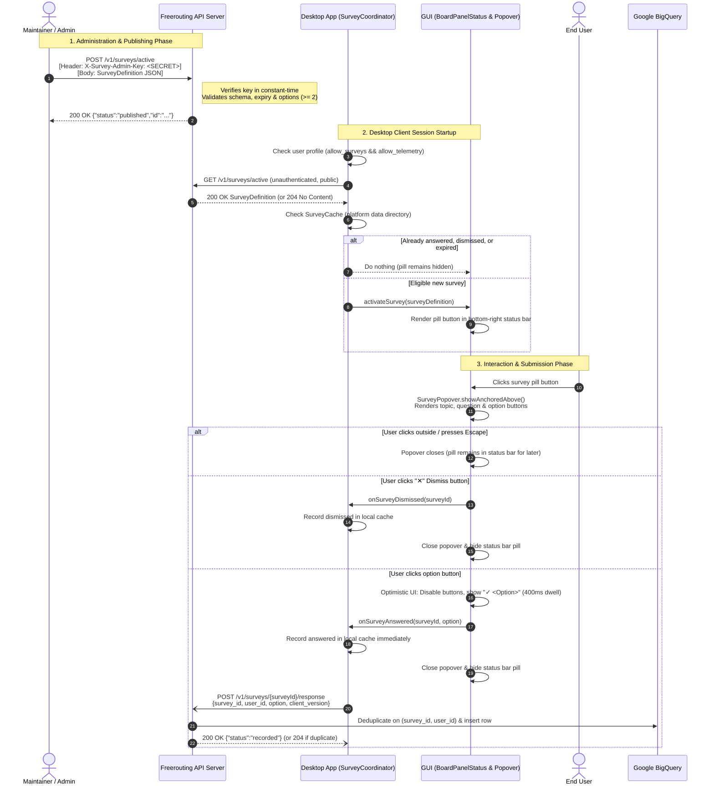

# Freerouting Micro-Survey System

## 1. Overview & Core Philosophy

The **True Zero-Friction Micro-Survey** system (Issue #903) allows Freerouting maintainers to collect targeted, anonymous product feedback directly within the desktop application.

Key design principles:
- **Zero Friction:** Answering a survey requires exactly one click on an option button. There is no submit button, no long form, and no external browser redirect.
- **Non-Intrusive:** The survey appears as a subtle, discrete pill button in the status bar at the bottom-right corner of the window (next to the measurement unit label). It never blocks the routing canvas or modal workflows.
- **Ask-Once Guarantee:** Each survey question is asked at most once per user. Once answered or explicitly dismissed (via the "✕" button), it is recorded in the local cache and will never be presented again.
- **Session-Friendly Closing:** Clicking outside the popover or pressing `Escape` simply closes the menu without permanently dismissing the survey. The trigger pill remains in the status bar so users can re-open it at any point during their session.
- **Privacy-First:** Responses contain only the survey ID, an anonymous installation UUID (`user_id`), the selected option, and client version. No board designs, network IPs, MAC addresses, or personal identifiable information are collected or stored.
- **Explicit Opt-In / Opt-Out:** Controlled by the `allow_surveys` user profile setting. Users can change their preference at any time in **Settings > User Settings**.

---

## 2. End-to-End Workflow Architecture



---

## 3. Security & Threat Model

The micro-survey architecture strictly bifurcates **client endpoints** and **administrative lifecycle endpoints**:

### A. Client Endpoints (Public & Unauthenticated)
- **Endpoints:**
  - `GET /v1/surveys/active`
  - `POST /v1/surveys/{surveyId}/response`
- **Design Rationale:**
  1. *Zero Client Secrets:* Desktop client binaries run on arbitrary user machines. Hardcoding an API key or shared secret into the client binary is insecure, as secrets are easily decompiled or intercepted.
  2. *First-Run Experience:* Fresh installs of Freerouting do not possess user API keys. Excluding surveys from `ApiKeyValidationFilter` and `EnvironmentHostValidationFilter` ensures open-source users can participate effortlessly.
  3. *Ballot Stuffing & Abuse Protection:* Client response submissions are rate-limited and deduplicated server-side in BigQuery based on the composite key `(survey_id, user_id)`. Replayed or spam submissions return `204 No Content` without polluting telemetry data.

### B. Administrative Endpoints (Admin Key Protected)
- **Endpoints:**
  - `POST /v1/surveys/active` (Publish or replace active survey)
  - `DELETE /v1/surveys/active` (Retire active survey)
- **Protection Mechanism:**
  1. *Pre-Shared Admin Secret:* Controlled by the host environment variable `FREEROUTING__SURVEYS__ADMIN_KEY`.
  2. *Fail-Secure Default:* If `FREEROUTING__SURVEYS__ADMIN_KEY` is unset or blank on the server host, all administrative endpoints return `403 Forbidden` (`{"error":"Survey publishing is disabled: admin key not configured on server."}`).
  3. *Timing Attack Resistance:* Verification uses `MessageDigest.isEqual` to compare byte arrays in constant time, preventing side-channel timing analysis.
  4. *Header Support:* Administrators may provide the key using either:
     - `X-Survey-Admin-Key: <ADMIN_KEY>`
     - `Authorization: Bearer <ADMIN_KEY>`

---

## 4. Local Development & UI Testing Guide

Freerouting makes testing micro-surveys seamless and flexible across two development workflows:
1. **Keyless Local Mock (Zero Key & Zero Server Required):** Instant UI testing without network traffic or API servers.
2. **Local API Server with Admin Key:** Testing full publication, inspection, and retirement lifecycle using an admin secret.

---

### Workflow A: Keyless Local Mock (Recommended for UI Development)

You do **not** need an admin API key, nor do you need an API server running.
`SurveyClient` automatically checks the local environment for `FREEROUTING__SURVEYS__ACTIVE_SURVEY` (or system property `-Dfreerouting.surveys.active_survey`).
When present, it bypasses network calls, directly presents the survey in the status bar, and records test submissions locally.

#### Option 1: Automated Helper Script (Easiest)

Run the included cross-platform testing utility from the repository root:

- **Windows (PowerShell):**
  ```powershell
  .\scripts\tests\test_microsurvey.ps1 -Mode LocalMock
  ```
- **Linux / macOS (Bash):**
  ```bash
  ./scripts/tests/test_microsurvey.sh LocalMock
  ```

This automatically sets `FREEROUTING__SURVEYS__IGNORE_CACHE=true`, loads `fixtures/surveys/sample-survey.json`, and launches Freerouting.

#### Option 2: Manual Terminal Configuration

You can provide either a path to a `.json` file or an inline JSON string:

**Windows (PowerShell):**
```powershell
# Set the active survey to a JSON file path (or inline JSON)
$env:FREEROUTING__SURVEYS__ACTIVE_SURVEY = "fixtures/surveys/sample-survey.json"

# Bypass cache so the survey displays repeatedly during UI iteration (no manual cache deletions needed!)
$env:FREEROUTING__SURVEYS__IGNORE_CACHE = "true"

# Launch Freerouting
.\gradlew.bat run
```

**Linux / macOS (Bash):**
```bash
export FREEROUTING__SURVEYS__ACTIVE_SURVEY="fixtures/surveys/sample-survey.json"
export FREEROUTING__SURVEYS__IGNORE_CACHE="true"
./gradlew run
```

---

### Workflow B: Local API Server with Admin Key (Lifecycle Testing)

To test the actual REST API server endpoints, dynamic publishing, and survey retirement with an admin secret:

#### Step 1: Start the Local API Server
Start Freerouting with the API server enabled and an admin key configured:

```powershell
# In Terminal 1: Start Freerouting with API server and admin secret
.\scripts\tests\test_microsurvey.ps1 -Mode StartServer -AdminKey "my-local-secret"
```

Or manually:
```powershell
$env:FREEROUTING__SURVEYS__ADMIN_KEY = "my-local-secret"
.\gradlew.bat run --args="--api.enabled=true"
```

#### Step 2: Publish a Survey via Admin API
In another terminal, publish the sample survey:

```powershell
# Using the test script:
.\scripts\tests\test_microsurvey.ps1 -Mode ApiPublish -AdminKey "my-local-secret"

# Or using curl / Invoke-RestMethod:
Invoke-RestMethod -Uri "http://localhost:37864/v1/surveys/active" -Method POST `
  -Headers @{ "Content-Type" = "application/json"; "X-Survey-Admin-Key" = "my-local-secret" } `
  -Body (Get-Content "fixtures/surveys/sample-survey.json" -Raw)
```

#### Step 3: Inspect the Active Survey
```powershell
.\scripts\tests\test_microsurvey.ps1 -Mode ApiGet
# Or: curl http://localhost:37864/v1/surveys/active
```

#### Step 4: Retire the Active Survey
```powershell
.\scripts\tests\test_microsurvey.ps1 -Mode ApiRetire -AdminKey "my-local-secret"
# Or: curl -X DELETE http://localhost:37864/v1/surveys/active -H "X-Survey-Admin-Key: my-local-secret"
```

---

### Understanding the Cache & Ask-Once Invariant

Freerouting guarantees that a user is **never asked the same question twice**. Once a survey ID is answered or dismissed, it is recorded in the platform-native data directory:

| Operating System | Exact Cache File Location |
|---|---|
| **Windows** | `%APPDATA%\freerouting\data\surveys.json` (e.g. `C:\Users\<User>\AppData\Roaming\freerouting\data\surveys.json`) |
| **Linux / BSD** | `~/.local/share/freerouting/surveys.json` (or `$XDG_DATA_HOME/freerouting/surveys.json`) |
| **macOS** | `~/Library/Application Support/freerouting/data/surveys.json` |

> [!TIP]
> - **During Development:** Set `FREEROUTING__SURVEYS__IGNORE_CACHE=true` (or use `test_microsurvey.ps1 -Mode LocalMock`) to keep surveys appearing across launches without having to clear the cache.
> - **To Clear Cache Manually:** Run `.\scripts\tests\test_microsurvey.ps1 -Mode ClearCache` or delete the platform cache file listed above.

---

## 5. Production Operator Runbook

Maintainers have two methods to publish or retire surveys in production: **Dynamic Admin API** (instant, zero restart) or **Host Environment Variable** (static).

### Method A: Dynamic Admin API (Recommended)

#### 1. Set the Admin Secret on the API Host
Configure the secret in your deployment environment (e.g. systemd, Docker, or Kubernetes):
```bash
export FREEROUTING__SURVEYS__ADMIN_KEY="your-high-entropy-random-secret"
```

#### 2. Publish or Replace an Active Survey
```bash
curl -X POST https://api.freerouting.app/v1/surveys/active \
  -H "Content-Type: application/json" \
  -H "X-Survey-Admin-Key: your-high-entropy-random-secret" \
  -d '{
    "schema_version": 1,
    "id": "survey-2026-q3-autoroute",
    "topic": "Autorouting Quality",
    "question": "How satisfied are you with the routing completion rate on multi-layer boards?",
    "options": [
      "Very Satisfied",
      "Acceptable",
      "Needs Improvement"
    ],
    "min_client_version": "2.5.0",
    "expires_at_utc": "2026-12-31T23:59:59Z"
  }'
```
**Response:**
```json
{"status":"published","id":"survey-2026-q3-autoroute"}
```

#### 3. Retire / Deactivate the Current Survey
```bash
curl -X DELETE https://api.freerouting.app/v1/surveys/active \
  -H "X-Survey-Admin-Key: your-high-entropy-random-secret"
```
**Response:**
```json
{"status":"retired"}
```
After retiring, subsequent requests to `GET /v1/surveys/active` will return `204 No Content`.

---

### Method B: Static Environment Variable (Fallback)

If managing the API via static configuration:
1. Export `FREEROUTING__SURVEYS__ACTIVE_SURVEY` on the API host:
```bash
export FREEROUTING__SURVEYS__ACTIVE_SURVEY='{"schema_version":1,"id":"survey-2026-q3-autoroute","topic":"Autorouting Quality","question":"How satisfied are you with routing completion rate?","options":["High","Medium","Low"],"expires_at_utc":"2026-12-31T23:59:59Z"}'
```
2. To retire, unset the variable or set it to an empty string `""`.

> [!NOTE]
> When set, dynamically published surveys via `POST /v1/surveys/active` take precedence over `FREEROUTING__SURVEYS__ACTIVE_SURVEY`.

---

## 6. Desktop Client Components & Implementation Details

### Domain & Transport Layer (`app.freerouting.surveys`)
- **`SurveyDefinition`:** Data-transfer object representing a survey schema. Validates required fields (`id`, `question`, `options.length >= 2`), minimum client version, and expiration.
- **`SurveyResponsePayload`:** Outgoing payload containing `survey_id`, anonymous `user_id`, `option`, and `client_version`.
- **`SurveyCache`:** Local JSON file stored in the platform data directory (`AppPaths.getDefaultDataDirectory()`).
  - Atomically written via `.tmp` file swap to prevent corruption on abrupt application shutdown.
  - Automatically recovers and quarantines corrupted files (`surveys.json.corrupt.<timestamp>`).
  - Tracks answered survey IDs, dismissed survey IDs, and timestamps.
- **`SurveyClient`:** Headless HTTP transport using standard `java.net.http.HttpClient` with asynchronous `CompletableFuture`. Integrates with `AnalyticsErrorAggregator` to suppress noisy console logs when the user is working offline.
- **`SurveyCoordinator`:** Core orchestrator. Evaluates:
  1. Is `allow_surveys` enabled (inheriting `isTelemetryAllowed()`)?
  2. Was this survey ID already answered or dismissed in `SurveyCache`?
  3. Is this client's version $\ge$ `min_client_version`?
  4. Is `expires_at_utc` in the future?

### GUI Presentation Layer (`app.freerouting.gui.board`, `app.freerouting.gui.surveys`)
- **`BoardPanelStatus`:** Houses `surveyTriggerButton` in the status bar at the bottom-right corner next to the measurement unit label (`um`). The button is hidden by default and becomes visible only when an eligible survey is present.
- **`SurveyPopover`:** A lightweight, non-modal `JPopupMenu`.
  - Opens upwards into the board viewport via `showAnchoredAbove()`, right-aligned to the trigger button.
  - Clicking outside closes the popover while preserving the status bar button.
  - Clicking the "✕" button explicitly dismisses the survey and hides the status bar button.
  - Optimistic feedback: When an option is clicked, the option buttons are disabled, the selected button updates to `"✓ <Selected Option>"`, and the popover closes after a brief 400ms dwell.
- **`ButtonsSurveyRenderer`:** Renders the header row (topic tag + right-aligned "✕" dismiss button), auto-wrapping question text area (preventing glyph truncation), and full-width option buttons.

---

## 7. Privacy & Settings Integration

Surveys respect user privacy at all times:
1. **User Profile Settings (`UserProfileSettings`):**
   - Setting field: `allow_surveys` (Boolean, nullable).
   - If `allow_surveys == null`, it inherits the general telemetry preference (`isTelemetryAllowed()`). If telemetry is disabled, surveys are disabled by default.
2. **Settings Window (`WindowUserSettings`):**
   - Provides a dedicated checkbox: `"Allow occasional anonymous micro-surveys"`.
   - Disabling surveys immediately hides the status bar survey pill and disables all survey polling.
3. **Anonymity:**
   - No personally identifiable information (PII) is captured.
   - The `user_id` is an installation-generated random UUID stored in the platform config directory (`freerouting.json`).

---

## 8. BigQuery Telemetry Schema

Responses are ingested into Google BigQuery under dataset `telemetry`, table `survey_response`:

| Column | Type | Mode | Description |
|---|---|---|---|
| `survey_id` | STRING | REQUIRED | Unique survey identifier (e.g. `survey-2026-q3-autoroute`) |
| `user_id` | STRING | REQUIRED | Anonymous client installation UUID |
| `option` | STRING | REQUIRED | The text of the option chosen by the user |
| `client_version` | STRING | NULLABLE | Freerouting client version (e.g. `2.5.0`) |
| `timestamp` | TIMESTAMP | REQUIRED | Ingestion timestamp recorded by the API server |
